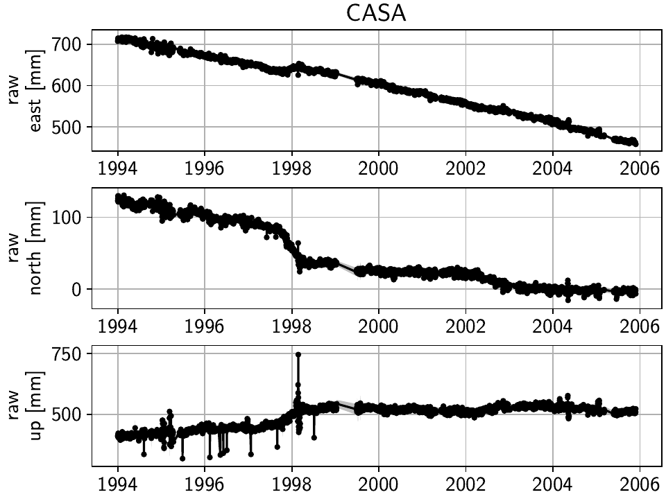
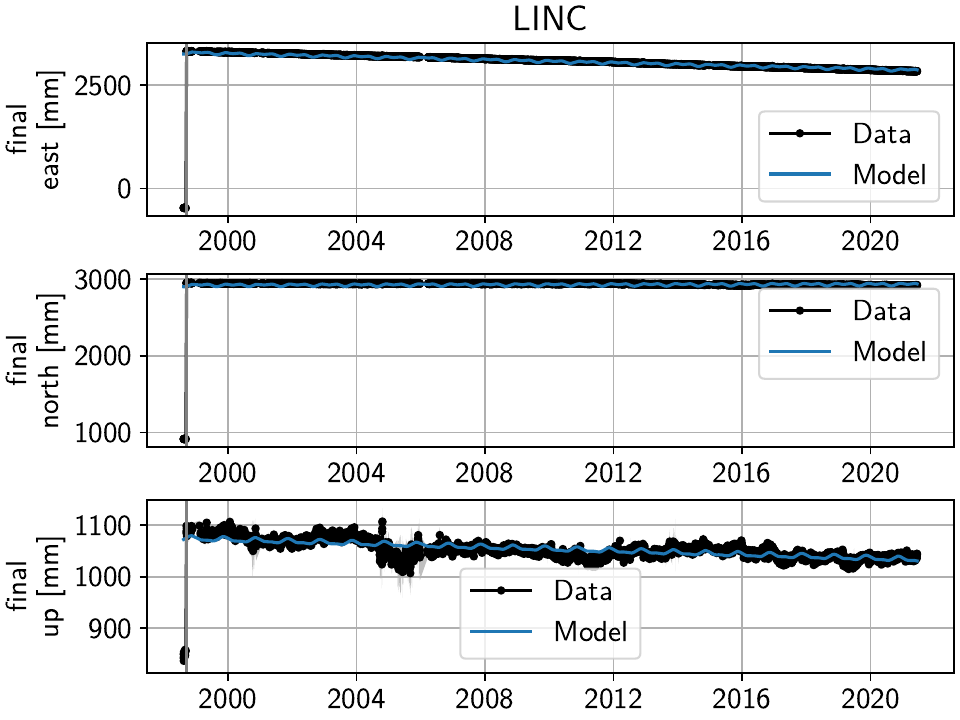
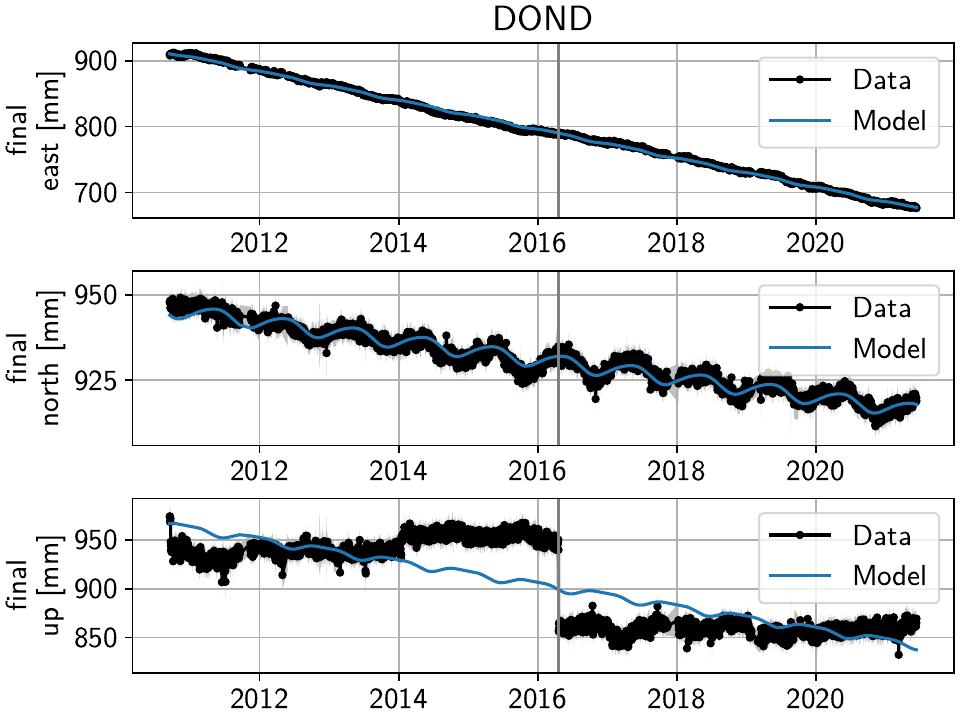
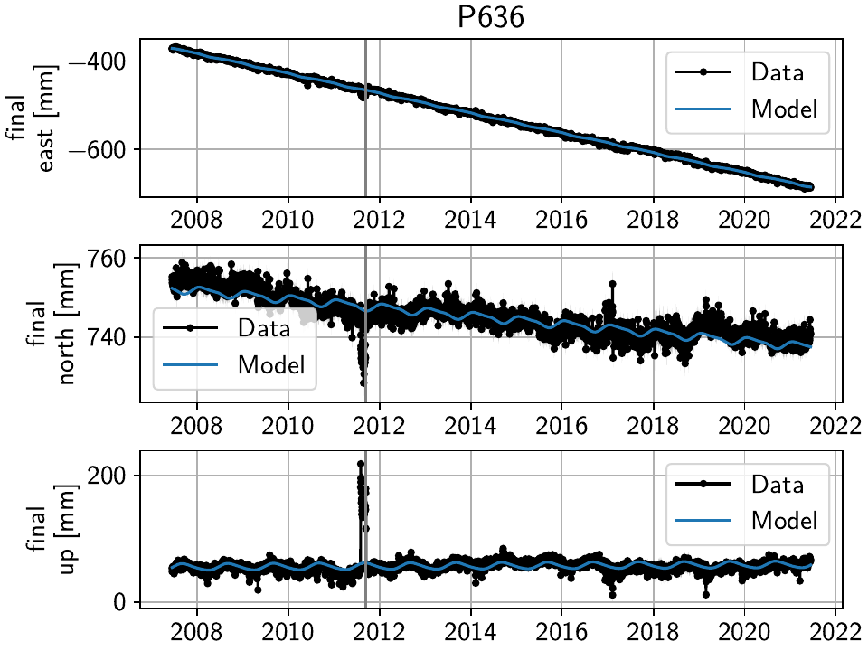
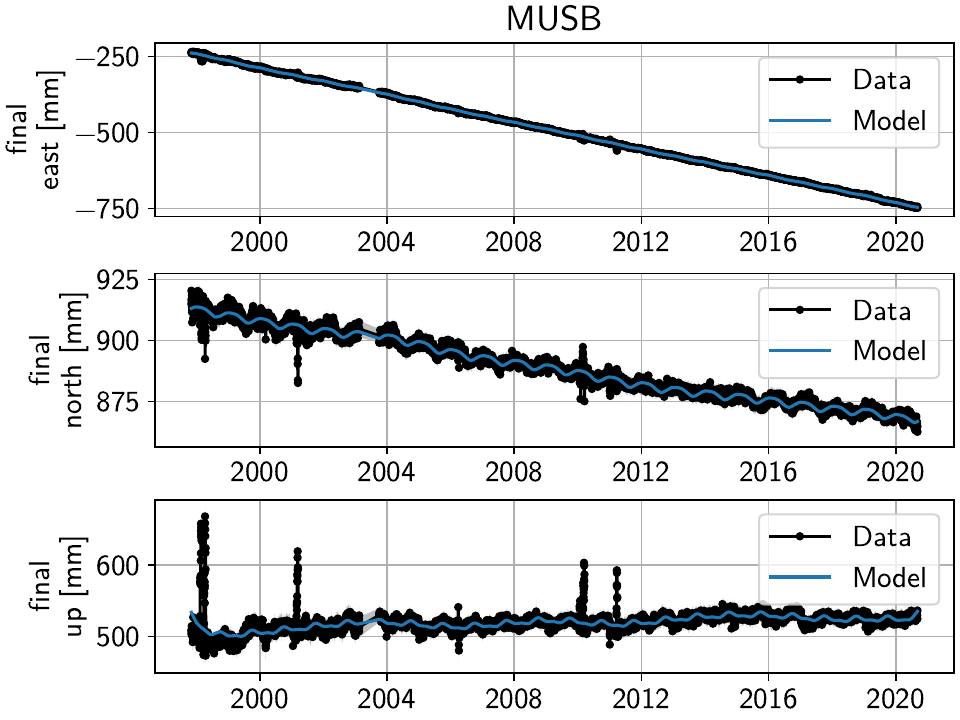
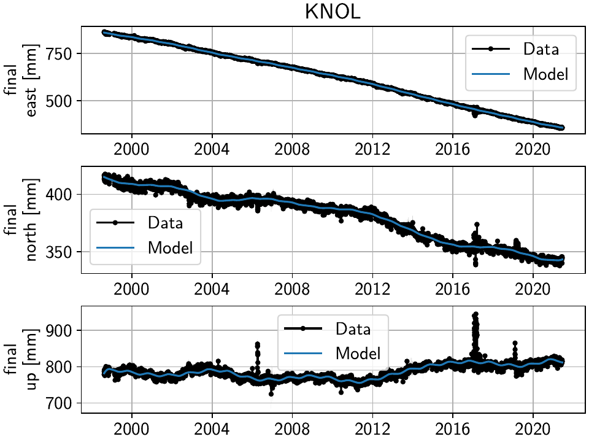
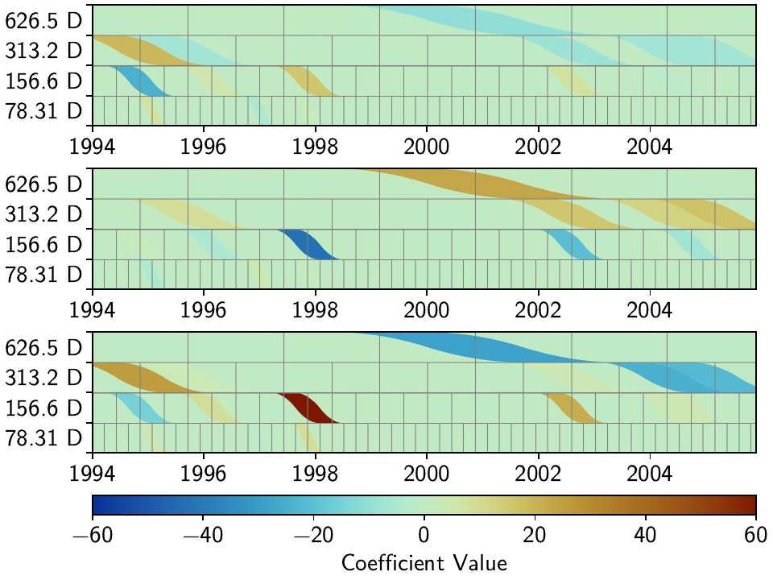
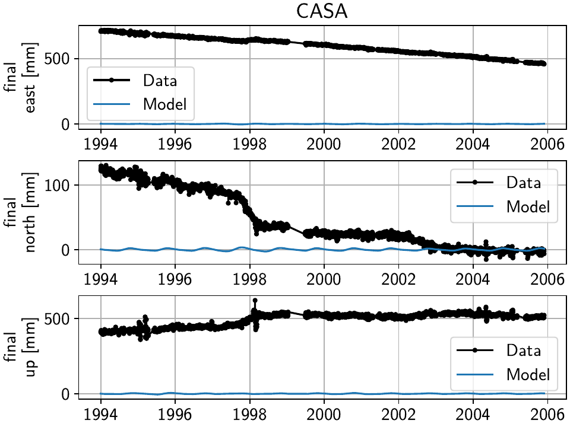

Example 1: Long Valley Caldera Transient Motions
================================================

.. sidebar:: Download full script

   :download:`example_1_longvalleycaldera.py <../../scripts/example_1_longvalleycaldera.py>`

The `Long Valley Caldera <https://en.wikipedia.org/wiki/Long_Valley_Caldera>`_ region in
California is a good example to show the capabilities of DISSTANS of separating different signals
from geodetic timeseries. Most prominently, it exhibits transient motions associated with
magmatic activity, and includes sometimes large seasonal signals due to hydrological loading.
Because of the geophysical interest, it has been monitored with GNSS since the late 1990s.
Additionally, there are extensive catalogues detailing possible steps in the timeseries
that arise due to equipment changes or earthquakes, even though they appear to be incomplete
as we will see later. Today, the data is for example accessible through the
University of Nevada at Reno's `Nevada Geodetic Laboratory <http://geodesy.unr.edu/>`_.

.. contents:: Table of contents
    :local:

.. note::

    While the table of contents might suggest that this process is sequential,
    each of the steps should be seen as an individual step that can be repeated
    at different times. For example, if we first clean the timeseries to the best
    of our abilities and then perform a fit, that fit might not be the best one.
    Using the fit to get a better understanding of our noise, and how to model
    signals, can in turn motivate another cleaning and fitting step.

Preparations
------------

Here are the imports we will need throughout the example:

.. doctest::

    >>> import os
    >>> import numpy as np
    >>> import pandas as pd
    >>> import matplotlib.pyplot as plt
    >>> import cartopy.geodesic as cgeod
    >>> from pathlib import Path
    >>> from scipy.linalg import lstsq
    >>> from matplotlib.lines import Line2D
    >>> import disstans
    >>> from disstans.tools import tvec_to_numpycol, full_cov_mat_to_columns

We will also need two folders, one parent one, and one where the individual timeseries
files will be downloaded into:

.. doctest::

    >>> # change these paths according to your system
    >>> main_dir = Path("proj_dir").resolve()
    >>> data_dir = main_dir / "data/gnss"
    >>> gnss_dir = data_dir / "longvalley"

.. note::

    It is recommended that you use an absolute path for ``main_dir`` since this path will
    be part of the internal database we keep of the downloaded files, and executing this
    example code then in a different folder will break the relative links.
    (In my test system, ``proj_dir`` is a symbolic link.)

To use multiple threads, we use the same code as in
:ref:`Tutorial 3 <tutorials/tutorial_3:Preparations>` (see there for changes you might
need to make on your own machine):

.. doctest::

    >>> os.environ['OMP_NUM_THREADS'] = '1'
    >>> disstans.config.defaults["general"]["num_threads"] = 8

Getting data
............

DISSTANS includes the :func:`~disstans.tools.download_unr_data` function to automatically
download timeseries files from the UNR servers, the
:class:`~disstans.timeseries.UNRTimeseries` class to load the files, and the
:func:`~disstans.tools.parse_unr_steps` function to parse the steps file.
Feel free to check out their documentation for options used or not used here.

To download the timeseries, we first define the region of interest as a circle:

.. doctest::

    >>> center_lon = -118.884167  # [°]
    >>> center_lat = 37.716667  # [°]
    >>> radius = 100  # [km]
    >>> station_bbox = [center_lon, center_lat, radius]

We now download the data into the data directory, only using stations that have a minimum
number of observations::

    >>> stations_df = disstans.tools.download_unr_data(station_bbox, gnss_dir,
    ...                                                min_solutions=600, verbose=2)
    Making sure ...
    Downloading station list ...
    List of stations to download: ...
    ...

In the following, we need the dataframe returned by the download function.
The next time, we can therefore either run the same function again (which updates our local
copy of the data in the process), or if this would take too long each time, we can just
save the dataframe now, and load it the next time we use the data::

    >>> # save
    >>> stations_df.to_pickle(f"{gnss_dir}/downloaded.pkl.gz")

.. doctest::

    >>> # load
    >>> stations_df = pd.read_pickle(f"{gnss_dir}/downloaded.pkl.gz")

Building the network
....................

First off, we instantiate a :class:`~disstans.network.Network` object:

.. doctest::

    >>> net = disstans.Network("LVC")

We now use the ``station_df`` dataframe to loop over the paths of the downloaded files,
get the name and location of the stations, create
:class:`~disstans.timeseries.UNRTimeseries` objects, and if they meet some quality
thresholds (see :attr:`~disstans.timeseries.Timeseries.reliability` and
:attr:`~disstans.timeseries.Timeseries.length`), we create a
:class:`~disstans.station.Station` object, add the timeseries, and then add it to the network:

.. doctest::

    >>> for _, row in stations_df.iterrows():
    ...     # get name and location of station
    ...     name = row["Sta"]
    ...     loc = [row["Lat(deg)"], row["Long(deg)"], row["Hgt(m)"]]
    ...     # make a timeseries object to check availability metric
    ...     tspath = f"{gnss_dir}/{name}.tenv3"
    ...     loaded_ts = disstans.timeseries.UNRTimeseries(tspath)
    ...     # make a station and add the timeseries only if two quality metrics are met
    ...     if (loaded_ts.reliability > 0.5) and (loaded_ts.length > pd.Timedelta(365, "D")):
    ...         net[name] = disstans.Station(name, loc)
    ...         net[name]["raw"] = loaded_ts

We can now use :meth:`~disstans.network.Network.gui` to have a first look at the data
that was downloaded::

    >>> net.gui(station="CASA", gui_kw_args={"wmts_show": True, "wmts_alpha": 0.5})

|1a_ts| |1a_map|

.. |1a_map| image:: ../img/example_1a_map.png
    :width: 49%

Just clicking through the stations, a couple of things are relevant for us
going forward:

- The stations get denser spaced towards the center of the Long Valley Caldera, which will
  help to isolate the smaller-scale transient motions.
- West of the Sierra Nevada mountain range, the stations are less densely spaced, and are
  strongly affected by seasonal signals.
- Only a few stations have been operational since before the year 2000.
- There is significant measurement noise all around, but some stations specifically (e.g.
  P628, P723) also exhibit unphysical behavior in the winter times, possible related to
  snowfall.

Cleaning the timeseries
-----------------------

In this step, we want to make sure that we will not use data with either a high noise floor,
or exhibiting behavior that we do not want to (or are not able) to model properly.
Both conditions would deteriorate our solution process later on, and while in general,
singular bad fits at individual stations can just be ignored afterwards, the fact that
we want to use a spatially-coherent solver, means that extremely bad fits at one station
can affect other stations as well.

Outlier and CME removal
.......................

Outlier removal is done with the :func:`~disstans.processing.clean` function using the raw
timeseries and a reference timeseries, accessed as a one-liner through
:meth:`~disstans.network.Network.call_func_no_return`.
The reference timeseries is created similarly using :func:`~disstans.processing.median` and
:meth:`~disstans.network.Network.call_func_ts_return`.
The residual, which is needed for the Common Mode Error estimation, is quickly computed
at all stations with :meth:`~disstans.network.Network.math`.

.. doctest::

    >>> # compute reference
    >>> net.call_func_ts_return("median", ts_in="raw", ts_out="raw_filt", kernel_size=7)
    >>> # remove outliers
    >>> net.call_func_no_return("clean", ts_in="raw", reference="raw_filt", ts_out="raw_clean")
    >>> # get the residual for each station
    >>> net.math("raw_filt_res", "raw_clean", "-", "raw_filt")
    >>> # remove obsolete timeseries
    >>> net.remove_timeseries("raw_filt")

Now, similar to :ref:`Tutorial 3 <tutorials/tutorial_3:Removing the Common Mode Error>`,
we estimate and remove the Common Mode Error:

.. doctest::

    >>> # calculate common mode
    >>> net.call_netwide_func("decompose", ts_in="raw_filt_res", ts_out="common", method="ica")
    >>> # now remove the common mode, call it the "intermed" timeseries,
    >>> for station in net:
    ...     station.add_timeseries("intermed", station["raw_clean"] - station["common"],
    ...                            override_data_cols=station["raw"].data_cols)
    >>> # remove obsolete timeseries
    >>> net.remove_timeseries("common", "raw_clean")
    >>> # clean again
    >>> net.call_func_ts_return("median", ts_in="intermed",
    ...                         ts_out="intermed_filt", kernel_size=7)
    >>> net.call_func_no_return("clean", ts_in="intermed",
    ...                         reference="intermed_filt", ts_out="final")
    >>> net.remove_timeseries("intermed", "intermed_filt")

Finally, we assume that the cleaned timeseries has the same measurement uncertainties
than the original one, so we copy it over:

.. doctest::

    >>> net.copy_uncertainties(origin_ts="raw", target_ts="final")

First pass: major steps and noisy periods
.........................................

Now that we have a cleaner timeseries to start from, we will try to identify as many
steps in the timeseries as possible, with the least amount of user interaction.
In order to do that, we first have to estimate and remove the dominant signals in the
timeseries: the seasonal (sinusoid) and secular (linear plate motion) components.

This means we have to add models to the ``'final'`` timeseries at all stations.
In the :doc:`Tutorials </tutorials>`, this was done individually for each station using
a loop and explicitly instantiating :class:`~disstans.models.Model` objects, and then
adding them to the stations using :meth:`~disstans.station.Station.add_local_model_dict`.
This was both desired to illustrate the object-based nature of DISSTANS, as well as
necessary since we needed direct access to the model objects anyway to read in
parameters and then evaluate the models to create synthetic timeseries.

Here, the models we're using will change throughout the examples, and we don't need
explicit access to the individual fitted parameters anytime soon, so we can skip all
of the work and instead just define the models using keyword dictionaries, taking
advantage of the :meth:`~disstans.network.Network.add_local_models` that will do all
of the instantiating and assigning for us:

.. doctest::

    >>> models = {"Annual": {"type": "Sinusoid",
    ...                      "kw_args": {"period": 365.25,
    ...                                  "t_reference": "2000-01-01"}},
    ...           "Biannual": {"type": "Sinusoid",
    ...                        "kw_args": {"period": 365.25/2,
    ...                                    "t_reference": "2000-01-01"}},
    ...           "Linear": {"type": "Polynomial",
    ...                      "kw_args": {"order": 1,
    ...                                  "t_reference": "2000-01-01",
    ...                                  "time_unit": "Y"}}}
    >>> net.add_local_models(models=models, ts_description="final")

Now that we have added the models, we can perform the first model fitting
using basic linear least squares (:func:`~disstans.solvers.linear_regression`)
in parallel through the :meth:`~disstans.network.Network.fitevalres` method:

.. doctest::

    >>> net.fitevalres("final", solver="linear_regression",
    ...                use_data_covariance=False, output_description="model_noreg",
    ...                residual_description="resid_noreg")

We ignore the data covariance in this very first step for computation time
considerations. Again, we can use the :meth:`~disstans.network.Network.gui`
method to have a look at the result (both the fit and the residuals).

By removing the major signals modeled, obvious transients and steps become
significantly more obvious - both for the human eye as well as any automated
step detector. In a fully manual framework, we would now click through the stations
one by one and writing down the dates on which to add steps that need to be estimated
and removed before we're able to accurately estimate transients and smaller-magnitude
events.

DISSTANS provides a simple step detector to avoid having to look at all stations and
all timespans, which instead tries to look for potential steps, and sorts them by
probability and station, such that the user can start from the most likely ones,
and then work their way down until all obvious steps (at least in this first stage)
are found. The included :class:`~disstans.processing.StepDetector` class is a simple
and imperfect one, but even more complicated ones (e.g. see [gazeaux13]_ for an
overview of manual and automated methods) fall short of human-in-the-loop techniques.
The class should therefore be viewed as only an aid to the user.

Let's run it on the residual timeseries (see the method documentation for how it
works and keyword descriptions):

.. doctest::

    >>> stepdet = disstans.processing.StepDetector(kernel_size=61, kernel_size_min=21)
    >>> step_table, _ = stepdet.search_network(net, "resid_noreg")

There are two ways of inspecting the outputs now. First, we can of course just
print the results::

    >>> print(step_table)
         station       time  probability           var0       var1    varred
    2803    TILC 2008-07-27   432.592147   16398.517922  13.140219  0.999199
    554     LINC 1998-09-15   407.113500  433129.225394   6.736510  0.999984
    323     DOND 2016-04-20   226.227819     469.133121  11.074441  0.976394
    2828    WATC 2002-06-18   214.896877     414.423305  11.779896  0.971575
    2826    WATC 2002-04-04   194.728898     421.507356  16.675928  0.960437
    ...      ...        ...          ...            ...        ...       ...
    1254    P627 2007-12-17    20.007536       1.051037   0.729199  0.306210
    114     CA99 2008-11-04    20.005889      16.810578  11.663321  0.306192
    1085    P311 2011-05-25    20.002984      15.671794  10.873741  0.306159
    2238    P650 2010-04-13    20.002579       1.763096   1.223317  0.306154
    524     KRAC 2010-03-17    20.001845      26.343070  18.278256  0.306146
    <BLANKLINE>
    [2883 rows x 6 columns]

To get an intuition what those numbers translate to in the timeseries, we can use
the second method: using the :meth:`~disstans.network.Network.gui` with the
``mark_events`` keyword option. If we supply it the entire table we just computed,
we will see that the low probabilities are most likely false detections::

    >>> net.gui(timeseries="final", mark_events=step_table)

So instead, for a first look at the major steps that we will need to model, let's
restrict ourselves to a subset of the table where the variance reduction is more than 90%::

    >>> step_table_above90 = step_table[step_table["varred"] > 0.9]
    >>> print(step_table_above90)
         station       time  probability           var0        var1    varred
    2803    TILC 2008-07-27   432.592147   16398.517922   13.140219  0.999199
    554     LINC 1998-09-15   407.113500  433129.225394    6.736510  0.999984
    323     DOND 2016-04-20   226.227819     469.133121   11.074441  0.976394
    2828    WATC 2002-06-18   214.896877     414.423305   11.779896  0.971575
    2826    WATC 2002-04-04   194.728898     421.507356   16.675928  0.960437
    1367    P628 2017-01-08   168.021602    1902.333674  116.604770  0.938704
    1368    P628 2017-01-09   151.188220    1871.194656  151.145501  0.919225
    1642    P636 2011-09-15   145.406735     645.981933   57.366504  0.911195
    1383    P628 2019-04-28   144.924585    1412.259909  126.411142  0.910490
    >>> net.gui(timeseries="final", mark_events=step_table_above90)

.. doctest::
    :hide:
    :options: +NORMALIZE_WHITESPACE

    >>> step_table_above90 = step_table[step_table["varred"] > 0.9]
    >>> print(step_table_above90)
         station       time  probability           var0        var1    varred
    ... TILC 2008-07-27 ...
    ... LINC 1998-09-15 ...
    ... DOND 2016-04-20 ...
    ... WATC 2002-06-18 ...
    ... WATC 2002-04-04 ...
    ... P628 2017-01-08 ...
    ... P628 2017-01-09 ...
    ... P636 2011-09-15 ...
    ... P628 2019-04-28 ...

The stations have two different behaviors. The first, simpler one, is just that of an
unmodeled step, e.g. at station TILC:

.. image:: ../img/example_1b_TILC.png

Similar behavior can be found for LINC and DOND:

|1b_LINC| |1b_DOND|

.. note::

    In general, the first thing to check with steps like these is to make sure they
    aren't related to a maintenance or earthquake event, which can be inferred from
    publicly available catalogs. In these cases here, they are neither, and so we will
    defer the part where we load those catalogs to improve our understanding of where
    to put modeled steps to the next section.

    Keep in mind that other data providers (e.g. UNAVCO) might have different position
    timeseries for the same stations, and come with different site logs that might
    be more complete.

We can add specific steps to those dates as follows:

.. doctest::

    >>> net["TILC"].add_local_model(ts_description="final",
    ...                             model_description="Unknown",
    ...                             model=disstans.models.Step(["2008-07-26"]))
    >>> net["DOND"].add_local_model(ts_description="final",
    ...                             model_description="Unknown",
    ...                             model=disstans.models.Step(["2016-04-20"]))
    >>> net["LINC"]["final"].cut(t_min="1998-09-13", keep_inside=True)

Note that here, we've just removed the little bit of early data at LINC instead of adding a
step, because we don't expect the early data to significantly improve our model inversion
as a whole.

Slightly different is WATC with a clear offset, but then also returning to its previous value:

.. image:: ../img/example_1b_WATC.png

Where we can add the two steps as follows

.. doctest::

    >>> net["WATC"].add_local_model(ts_description="final",
    ...                             model_description="Unknown",
    ...                             model=disstans.models.Step(["2002-04-04", "2002-06-18"]))

P628 and P636 exhibit a different behavior: Here, we can see that the
identified steps are related to transient motion. At P628 we can guess
that this appears seasonally, so snow cover on the antennas (also given
that the outliers are most strongly present in the Up component) is one
reasonable explanation.

|1b_P628| |1b_P636|

In our framework, we would think of this as noise, since it is not related
to any tectonic process. For P636, the most straightforward way to
avoid this noise affecting our fitting process is to eliminate the single
timespan this appears - towards the end of 2011. This is easily
done with the :meth:`~disstans.timeseries.Timeseries.cut` method:

.. doctest::

    >>> net["P636"]["final"].cut(t_min="2011-08-03", t_max="2011-09-14", keep_inside=False)

For P628, the noise is so strong that it affects the seasonal motion
estimate, and appears both pre-2012 as well as post-2017. We can
either define multiple timespans and mask out the data as we can do with
P636, or discard the entire timeseries (as published studies usually do).
While the former might be more desirable in an ideal world, we do not know
how big the influence still is during the seasons where the noise is less
apparent, so for this example, we will also go with simply discarding
the entire timeseries:

.. doctest::

    >>> del net["P628"]["final"]

This is of course manual work - one way to reduce the number of lines of code would be to
determine a threshold by visual inspection (like the 90% variance reduction from above)
and then add steps to all the stations and times in the table. However, this will lead
to problems if we have cases like P636 and P628, where adding a step would be wrong.

After adding those major steps and removing noisy parts of the data, we are almost ready
to fit the models again. However, by clicking through the stations (and potentially
aided by the GUI's ``rms_on_map`` option), we see that there are sometimes significant
longterm transients that aren't captured by the purely linear and sinusoid models.
To estimate the major trends as well (again to allow for a better step detecting process),
we add some longterm, unregularized spline models:

.. doctest::

    >>> longterm_transient_mdl = \
    ...     {"Longterm": {"type": "SplineSet",
    ...                   "kw_args": {"degree": 2,
    ...                               "t_center_start": net["CASA"]["final"].time.min(),
    ...                               "t_center_end": net["CA99"]["final"].time.max(),
    ...                               "list_num_knots": [5, 9]}}}
    >>> net.add_local_models(models=longterm_transient_mdl, ts_description="final")

Where we know that CASA has the earliest observation, and CA99 (as well as many other stations)
are active today and so will have the latest observation timestamp.
(See :ref:`Tutorial 2 <tutorials/tutorial_2:Spline models for transients>` for an
introduction to splines in DISSTANS.)

Now, let's fit again:

.. doctest::

    >>> net.fitevalres("final", solver="linear_regression",
    ...                use_data_covariance=False, output_description="model_noreg_2",
    ...                residual_description="resid_noreg_2")

Before we open the GUI again to see the fitted models, we want to have a quantitative
understanding of how large the residuals are by looking at their root-mean-square (RMS):

.. doctest::

    >>> resids_df = net.analyze_residuals("resid_noreg_2", rms=True)
    >>> resids_df["total"] = np.linalg.norm(resids_df.values, axis=1)
    >>> resids_df.sort_values("total", inplace=True, ascending=False)

The default output is by component, so we took the vector norm of all components for each
station, and then sort the stations according to that. The first five entries are now::

    >>> resids_df["total"].head()
    Station
    P723    19.298688
    CASA    13.519355
    MUSB    11.264231
    KNOL     9.993418
    JNPR     9.973603
    Name: total, dtype: float64

.. doctest::
    :hide:

    >>> assert all([s in resids_df["total"].iloc[:5].index
    ...             for s in ["P723", "CASA", "MUSB", "KNOL", "JNPR"]])

Let's open the GUI again, looking at these values on the map directly, and inspecting
the timeseries of those top-5 worst residuals, to identify any stations that are still
not being well fit by the models, and where we would need to either remove parts,
or add steps::

    >>> net.gui(timeseries="final", rms_on_map={"ts": "resid_noreg_2"})

P723 is a clear example of big, again probably snow-related events. We can either discard
the entire timeseries, or remove the noisy periods as before.

.. image:: ../img/example_1c_P723.png

MUSB and KNOL show similar behavior as well, but on a much smaller scale:

|1c_MUSB| |1c_KNOL|

We'll remove those periods just as above (of course, one could write a nice loop for that,
especially if it were a larger network):

.. doctest::

    >>> net["P723"]["final"].cut(t_min="2010-12-18", t_max="2011-04-18", keep_inside=False)
    >>> net["P723"]["final"].cut(t_min="2017-01-09", t_max="2017-05-24", keep_inside=False)
    >>> net["P723"]["final"].cut(t_min="2019-02-02", t_max="2019-04-02", keep_inside=False)
    >>> net["P723"]["final"].cut(t_min="2019-12-02", t_max="2020-04-02", keep_inside=False)
    >>> net["MUSB"]["final"].cut(t_min="1998-02-15", t_max="1998-04-19", keep_inside=False)
    >>> net["KNOL"]["final"].cut(t_min="2017-01-22", t_max="2017-03-16", keep_inside=False)

The other two stations show us that we've cleaned the data enough to move forward with the
actual estimation. At CASA, we now see that the most prominent signal is now a fast transient
that contributes to the currently still bad residual, and at JNPR, we see some outliers,
but no strong, coherent periods of noise offsets like before.

|1c_CASA| |1c_JNPR|

.. |1c_CASA| image:: ../img/example_1c_CASA.png
    :width: 49%

.. |1c_JNPR| image:: ../img/example_1c_JNPR.png
    :width: 49%

.. note::

    CASA is at the exact same location as CA99 - on the map, they therefore appear on top
    of each other, and it's impossible to select CASA by clicking on it. We can use
    the GUI's ``station`` keyword though to pre-select a station.

Finally, just like we had the case of LINC earlier where there was a little bit of data and
a gap at the very beginning of our timeseries, we can see with the GUI that a couple of other
stations have these early gaps after noisy data as well. Let's remove them so that they don't
unnecessarily confuse the rest of the model inversion (alternatively, we could include a Step
model to fit the potential offset that is there):

.. doctest::

    >>> net["MINS"]["final"].cut(t_min="1997-06-01", keep_inside=True)
    >>> net["MWTP"]["final"].cut(t_min="1999-01-01", keep_inside=True)
    >>> net["KNOL"]["final"].cut(t_min="1999-01-01", keep_inside=True)
    >>> net["RDOM"]["final"].cut(t_min="1999-09-01", keep_inside=True)
    >>> net["SHRC"]["final"].cut(t_min="2006-03-01", keep_inside=True)

Second pass: minor, catalog-based steps
.......................................

After removing major steps and noisy periods in the previous section, we will now do one
last unregularized fit to the data, which we will use to look for minor steps, this time
aided by UNR's step file.

.. doctest::

    >>> net.fitevalres("final", solver="linear_regression",
    ...                use_data_covariance=False, output_description="model_noreg_3",
    ...                residual_description="resid_noreg_3")

We perform the regular step detection like above with the new residual timeseries:

.. doctest::

    >>> step_table, _ = stepdet.search_network(net, "resid_noreg_3")

And then we use the :func:`~disstans.tools.parse_unr_steps` function to download
(if ``check_update=True``) or load (if already present) the catalog, parsing it into
two separate tables - one for the maintenance events, and one for potential earthquake events:

.. doctest::

    >>> unr_maint_table, _, unr_eq_table, _ = \
    ...     disstans.tools.parse_unr_steps(f"{data_dir}/unr_steps.txt",
    ...                                    verbose=True, check_update=False,
    ...                                    only_stations=net.station_names)
    ...
    Maintenance descriptions:
    ...
    Number of Maintenance Events: ...
    Number of Earthquake-related Events: ...

Then, we use the step detector object's
:meth:`~disstans.processing.StepDetector.search_catalog` method to specifically test
the dates where events where recorded:

.. doctest::

    >>> maint_table, _ = stepdet.search_catalog(net, "resid_noreg_3", unr_maint_table)
    >>> eq_table, _ = stepdet.search_catalog(net, "resid_noreg_3", unr_eq_table)

(Of course, those dates will already have been checked by the general call to
:meth:`~disstans.processing.StepDetector.search_network`, but if the step detector does
not see evidence for a step there given its input parameters, the probability of a
step being present at that date will not be included in the output table.)

The questions we want to answer now are:

#. Are there still large, unmodeled steps that are not included in the maintenance or
   earthquake records?
#. Down to what probability (or variance reduction percentage) should we automatically
   add entries in the records file to our stations? (Those can also differ between
   maintenance and earthquakes.)

To answer the first question, we can merge the dataframes, and drop the rows station-date
pairs that are present in both:

.. doctest::

    >>> # merge the two catalog tables
    >>> maint_or_eq = pd.merge(maint_table[["station", "time"]],
    ...                        eq_table[["station", "time"]], how="outer")
    >>> # merge with step_table
    >>> merged_table = step_table.merge(maint_or_eq, on=["station", "time"], how="left",
    ...                                 indicator="merged")
    >>> # drop rows where the indicators are not only in step_table
    >>> unknown_table = merged_table. \
    ...     drop(merged_table[merged_table["merged"] != "left_only"].index)

The station-time pairs that will be dropped are therefore those in
``merged_table[merged_table["merged"] != "left_only"]``, which are::

    >>> print(merged_table[merged_table["merged"] != "left_only"])
         station       time  probability       var0      var1    varred merged
    3       P469 2019-07-06    89.232324   2.665930  0.594600  0.776963   both
    13      P652 2020-05-15    63.770193   1.314950  0.445210  0.661424   both
    27      P627 2020-05-15    57.036696   2.352315  0.889388  0.621910   both
    42      P726 2019-07-06    51.874552   1.888100  0.776914  0.588521   both
    123     P627 2020-10-13    42.560855  16.570964  7.943382  0.520645   both
    217     P652 2019-07-06    37.581517   1.104752  0.574610  0.479874   both
    596     P651 2020-05-15    30.160953   1.543170  0.906470  0.412592   both
    762     P653 2019-07-06    28.413357   0.996481  0.602353  0.395520   both
    879     P650 2020-05-15    27.262764   0.880887  0.542617  0.384010   both
    1946    P311 2019-07-06    22.124524   0.447579  0.299934  0.329875   both
    2703    P651 2019-07-06    20.063574   0.941452  0.652570  0.306847   both

So only a couple of entries in our ``step_table`` have an easy explanation, leaving the entries
in ``unknown_table`` either as false detections, or steps with unknown causes.

Because there are too many events in all three tables now to look at all of them
individually (already for this relatively small network), we need to start making
some thresholding choices, and add steps wherever the probability of a step is larger
than that. Because we have more confidence in steps recorded in one of the catalogs
than the ones only detected by the automatic step detector, that threshold can be chosen
differently. Here is where "geophysical intuition" now has to come into play, and we
have to accept that there are going to be false negatives and false positives.

To compare the catalogs quantitatively, we can plot how the probabilities of steps
are distributed within them::

    >>> plt.plot(np.arange(unknown_table.shape[0])/unknown_table.shape[0],
    ...          unknown_table["probability"].values, label="Unknown")
    >>> plt.plot(np.arange(maint_table.shape[0]) /
    ...          np.isfinite(maint_table["probability"].values).sum(),
    ...          maint_table["probability"].values, label="Maintenance")
    >>> plt.plot(np.arange(eq_table.shape[0]) /
    ...          np.isfinite(eq_table["probability"].values).sum(),
    ...          eq_table["probability"].values, label="Earthquake")
    >>> plt.ylabel("Probability")
    >>> plt.xlabel("Normalized number of events")
    >>> plt.xticks(ticks=[], labels=[])
    >>> plt.legend()
    >>> plt.show()

.. image:: ../img/example_1d.png

We can see nice L-shaped curves for all three catalogs, but with different
probabilities at their inflection points. As a first guess of our thresholds,
we can e.g. choose 50 for the Unknown catalog, and 15 for the other two.
The reason we choose a probability above the turning point for the Unknown
catalog is that we want to minimize the impact of falsely adding a step where
none is there, but for the other two, where we know something *could* have
happened, we can pick the probability closer or even below the turning point.

To check our guess, we can use the GUI again, marking all earthquake steps
above 10::

    >>> net.gui(timeseries="final", rms_on_map={"ts": "resid_noreg_3"},
    ...         mark_events=eq_table[eq_table["probability"] > 10])

By clicking through the stations, we can see that 15 is a decent threshold.
Some steps that are below 15 should maybe be added, and some above 15 shouldn't be,
but this is probably the best we can do in an automated way. We can proceed similarly
for the maintenance steps, and 15 also works well.

We can now use a loop now to add the model steps automatically:

.. doctest::

    >>> eq_steps_dict = dict(eq_table[eq_table["probability"] > 15]
    ...                      .groupby("station")["time"].unique().apply(list))
    >>> for stat, steptimes in eq_steps_dict.items():
    ...     net[stat].add_local_model_kwargs(
    ...         ts_description="final",
    ...         model_kw_args={"Earthquake": {"type": "Step",
    ...                                       "kw_args": {"steptimes": steptimes}}})
    >>> maint_steps_dict = dict(maint_table[maint_table["probability"] > 15]
    ...                         .groupby("station")["time"].unique().apply(list))
    >>> for stat, steptimes in maint_steps_dict.items():
    ...     net[stat].add_local_model_kwargs(
    ...         ts_description="final",
    ...         model_kw_args={"Maintenance": {"type": "Step",
    ...                                        "kw_args": {"steptimes": steptimes}}})

Finally, checking for the unknown steps, we observe that some of them are actually
just a day or two off from maintenance steps which we will take care of, and most of
them, even above a probability of 60 or 70, are actually false or uncertain detections
we should probably skip. One exception is KRAC, where we have another step-and-reverse
event similar to the previous section. We could again just cut out the affected timespan,
but for purely example reasons, we're instead going to add a model that will estimate
this temporary offset. We craft this particular model with a constant
:class:`~disstans.models.Polynomial` with a set start and end date, and setting it to zero
outside it's active period. (We could also use a :class:`~disstans.models.Step` model with
an end date, or write a new :class:`~disstans.models.Model` class entirely.)

.. doctest::

    >>> net["KRAC"].add_local_model_kwargs(
    ...     ts_description="final",
    ...     model_kw_args={"Offset": {"type": "Polynomial",
    ...                               "kw_args": {"order": 0,
    ...                                           "t_start": "2002-02-17",
    ...                                           "t_reference": "2002-02-17",
    ...                                           "t_end": "2002-03-17",
    ...                                           "zero_before": True,
    ...                                           "zero_after": True}}})

We could loop back now and do a fourth unregularized linear regression solution,
checking again for too many or too few steps, which may be necessary for publication-grade
fitting quality. For the purposes of this example, we will move on, however.

Model parameter estimation
--------------------------

Now we're ready to do a full, spatially-coherent estimation of model parameters.
For that, we first remove the unregularized long-term transient model we added in
the previous section for a better step detection:

.. doctest::

    >>> for stat in net:
    ...     stat.remove_local_models("final", "Longterm")

We now add two two types of models. First, a new Transient model with a larger range of
timescales, that will be used to fit all the non-seasonal transient deformation.
Second, we want to be able to capture variations in the amplitude and phase of the
seasonal signal we're estimating (since they vary significantly with the weather
conditions, and would otherwise just contaminate our Transient model).

For the first model, we already know that we can use the :class:`~disstans.models.SplineSet`
class, just like we did above. For the second model, we use the
:class:`~disstans.models.AmpPhModulatedSinusoid` class, which doesn't estimate a single
pair of amplitude and phase for the entire timespan, but models the time history of
amplitude and phase using a full B-Spline basis function set. We will regularize this
model as well, but keep it at the standard L1-regularization without any L0 sparsity
constraint, because we don't expect the signal to be sparse in the first place, but want
to keep some sort of regularization to not make the fit explode. The number of bases,
as well as the total timespan, is set so that there is exactly one basis per year.

.. doctest::

    >>> new_models = \
    ...     {"Transient": {"type": "SplineSet",
    ...                    "kw_args": {"degree": 2,
    ...                                "t_center_start": net["CASA"]["final"].time.min(),
    ...                                "t_center_end": net["CA99"]["final"].time.max(),
    ...                                "list_num_knots": [int(1+2**n) for n in range(4, 8)]}},
    ...      "AnnualDev": {"type": "AmpPhModulatedSinusoid",
    ...                    "kw_args": {"period": 365.25,
    ...                                "degree": 2,
    ...                                "num_bases": 29,
    ...                                "t_start": "1994-01-01",
    ...                                "t_end": "2022-01-01"}},
    ...      "BiannualDev": {"type": "AmpPhModulatedSinusoid",
    ...                      "kw_args": {"period": 365.25/2,
    ...                                  "degree": 2,
    ...                                  "num_bases": 29,
    ...                                  "t_start": "1994-01-01",
    ...                                  "t_end": "2022-01-01"}}}
    >>> net.add_local_models(new_models, "final")

This time, we specify a reweighting function explicitly for the spatial solution:

.. doctest::

    >>> rw_func = disstans.solvers.InverseReweighting(eps=1e-4, scale=1e-2)

Finally, we can run the estimation. Note that we're doing a couple of things:

- We have a different penalty parameter for every component, based on the fact that
  the Up component is usually much noisier.
- We do not include the seasonal deviation models in either ``spatial_reweight_models``
  (or ``continuous_reweight_models``, not discussed here), which means that this model
  will be L1-regularized.
- We want to see the ``extended_stats`` during the fit, and save them in the ``stats``
  variable.
- We save ourselves the follow-up calls to evaluate the model to get a fit, and to
  calculate the residual timeseries, by specifying ``keep_mdl_res_as`` (because
  ``extended_stats`` already has to calculate those anyway, but wouldn't otherwise
  keep them).

.. doctest::

    >>> stats = net.spatialfit("final",
    ...                        penalty=[10, 10, 1],
    ...                        spatial_reweight_models=["Transient"],
    ...                        spatial_reweight_iters=20,
    ...                        local_reweight_func=rw_func,
    ...                        formal_covariance=True,
    ...                        use_data_covariance=True,
    ...                        verbose=True,
    ...                        extended_stats=True,
    ...                        keep_mdl_res_as=("model_srw", "resid_srw"))
    Calculating scale lengths
    Distance percentiles in km (5-50-95): [7.5, 41.6, 104.2]
    Initial fit
    ...
    Done

We again see from the verbose progress output how the spatial sparsity is
well enforced, and the solver converges.

For a (relatively) quick first fit, we can use ``use_data_covariance=False``, but for a
final result, the data covariance should be taken into account. Using the GUI, we can
again get a first impression of the quality of the fit::

    >>> net.gui(station="CASA",
    ...         timeseries=["final", "resid_srw"],
    ...         rms_on_map={"ts": "resid_srw"},
    ...         scalogram_kw_args={"ts": "final", "model": "Transient", "cmaprange": 60})

|1e_ts| |1e_scalo|

.. |1e_ts| image:: ../img/example_1e_ts.png
    :width: 49%

We can see that compared to the beginning of the example, where we had significant
unfitted transient signal in the timeseries at CASA and elsewhere, our fit now nicely
matches the trajectory (all the while respecting all the spatial signal that we have
taken advantage of). The scalograms also confirm that a sparse solution has been found.

To plot only the transient model fitted to the timeseries, we can also use the GUI
method with the keyword arguments
``sum_models=False, fit_list=["Transient"], gui_kw_args={"plot_sigmas": 0}``,
which makes the transient periods very obvious:

.. image:: ../img/example_1e_transient.png

(We suppressed the plotting of the uncertainty since the formal variance for only a single
model has limited interpretability.)

We can do the same to have a look at the joint seasonal models::

    >>> net.gui(station="CASA", timeseries="final", sum_models=True,
    ...         fit_list=["Annual", "AnnualDev", "Biannual", "BiannualDev"],
    ...         gui_kw_args={"plot_sigmas": 0})

Giving us:

Even though in this plot it is somewhat hard to see, the seasonal signal has an amplitude
that changes slightly based on the observations, just as desired.

To once again remind that there is always a trade-off between the transient spline signal
and the other models, let's have a look at the correlation matrix for the CASA station::

    >>> net["CASA"].models["final"].plot_covariance(fname="example_1e_corr.png",
    ...                                             plot_empty=False, use_corr_coef=True)

.. image:: ../img/example_1e_corr.png

We can also use the :meth:`~disstans.network.Network.wormplot` method
(also see :ref:`Tutorial 3 <tutorials/tutorial_3:Transient visualization with worm plots>`)
to have a closer look at one of the transient periods at the center of the network::

    >>> subset_stations = ["RDOM", "KRAC", "SAWC", "MWTP", "CASA", "CA99", "P639", "HOTK",
    ...                    "P646", "P638", "DDMN", "P634", "KNOL", "MINS", "LINC", "P630",
    ...                    "SHRC", "P631", "TILC", "P642", "BALD", "P648", "WATC", "P632",
    ...                    "P643", "P647", "P648", "PMTN", "P635", "JNPR", "P645"]
    >>> plot_t_start, plot_t_end = "2012-01-01", "2015-01-01"
    >>> net.wormplot(ts_description=("final", "Transient"),
                     fname="example_1f",
                     fname_animation="example_1f.mp4",
                     t_min=plot_t_start, t_max=plot_t_end, scale=1e2,
                     subset_stations=subset_stations,
                     gui_kw_args={"wmts_show": True, "wmts_alpha": 0.5},
                     colorbar_kw_args={"shrink": 0.5})

Which yields the following map:

.. image:: ../img/example_1f.png

And animation:

.. video:: ../_static/example_1f.mp4

This is a relatively long timespan, so we can nicely see individual periods of coherent motion
of the network; the strongest one most notable being the radial outwards motion of the stations
from the center of the caldera. If we only wanted to show individual slow slip events, we could
identify the interesting periods from the timeseries, and then use multiple wormplots with
shorter timespan.

There are two key reasons as to why our wormplot looks as smooth as it does.
Naturally, the right penalty parameter for the regularized models took some trial-and-error not
pictured in this example.
Just as important though is the fact that we added seasonal models that allowed variations of
the amplitude and phase from year to year - if we didn't, every significant seasonal motion not
captured by the simple :class:`~disstans.models.Sinusoid` model would have been fitted by
our transient :class:`~disstans.models.SplineSet` model (given the appropriate regularization
penalty).

Comparison of secular velocities
--------------------------------

Finally, as the last "sanity check" that our models are correctly disentangling secular motion from
other signals, let's compare some of our estimated linear velocity vectors of the network stations
with the published MIDAS velocities in [blewitt16]_ (everything in [m/a]):

+---------+-----------------------------------+-----------------------------------+
|         |           This example            |              MIDAS                |
|         +-----------+-----------+-----------+-----------+-----------+-----------+
| Station |      East |     North |        Up |      East |     North |        Up |
+---------+-----------+-----------+-----------+-----------+-----------+-----------+
|    P308 | -0.022020 | -0.002283 | -0.000174 | -0.022473 | -0.002419 | +0.000957 |
+---------+-----------+-----------+-----------+-----------+-----------+-----------+
|    DOND | -0.019113 | -0.003761 | +0.003988 | -0.022462 | -0.002837 | +0.001112 |
+---------+-----------+-----------+-----------+-----------+-----------+-----------+
|    KRAC | -0.019325 | -0.001209 | +0.005940 | -0.018233 | -0.000377 | +0.005676 |
+---------+-----------+-----------+-----------+-----------+-----------+-----------+
|    CASA | -0.022449 | -0.007270 | -0.001678 | -0.022905 | -0.007212 | +0.003864 |
+---------+-----------+-----------+-----------+-----------+-----------+-----------+
|    CA99 | -0.023492 | -0.004736 | +0.003763 | -0.023294 | -0.006609 | +0.004616 |
+---------+-----------+-----------+-----------+-----------+-----------+-----------+
|    P724 | -0.019636 | -0.002419 | -0.000284 | -0.019328 | -0.003772 | +0.000314 |
+---------+-----------+-----------+-----------+-----------+-----------+-----------+
|    P469 | -0.017844 | -0.006150 | -0.000317 | -0.017806 | -0.006302 | +0.000086 |
+---------+-----------+-----------+-----------+-----------+-----------+-----------+
|    P627 | -0.016661 | -0.006193 | -0.000305 | -0.016974 | -0.005181 | -0.000166 |
+---------+-----------+-----------+-----------+-----------+-----------+-----------+

In general, the two solutions are very similar, and differences might very well be because our
processing is not fully automatic and might therefore provide better (or worse) fits than MIDAS.
Again, a systematic comparison is beyond the scope of this example, but one crucial factor here
is that the approaches to estimate the secular motion are fundamentally different.
As we have seen above in the plot of the transient model fits at CASA, periods of rapid motion
are embedded in periods of different, but slower transient motion. Some periods, even though
they were fitted by our splines, look pretty linear. Naturally, there is a large ambiguity
as to which period of slow and steady motion should be regarded as purely secular (if any at
all). If we imposed, e.g., that the period between 1999 and 2001 should be purely secular,
and the transient therefore should be zero, all we have to do is to increase our fitted linear
model parameters, and remove that same linear trend from our transient estimate.

Final considerations
--------------------

Let's conclude with two remarks:

#. The choice of the hyperparameters (e.g. starting ``penalty``; the type and ``eps``,
   ``scale`` values for :meth:`~disstans.network.Network.spatialfit`; the number and timescales
   of the splines) are of course informed by me debugging and testing my code over and over
   again. Different dataset, and possibly different questions wanted to be solved, will
   likely warrant a systematic exploration of those. The ``statistics`` return variable can be
   helpful to track the performance of different estimation hyperparameters.
#. For the best model fit, additional cleaning (outlier removal) and common mode estimation
   steps might be useful.

References
----------

.. [gazeaux13] Gazeaux, J., Williams, S., King, M., Bos, M., Dach, R., Deo, M., et al. (2013).
   *Detecting offsets in GPS time series: First results from the detection of
   offsets in GPS experiment*.
   Journal of Geophysical Research: Solid Earth, 118(5), 2397–2407.
   doi:`10.1002/jgrb.50152 <https://doi.org/10.1002/jgrb.50152>`_
