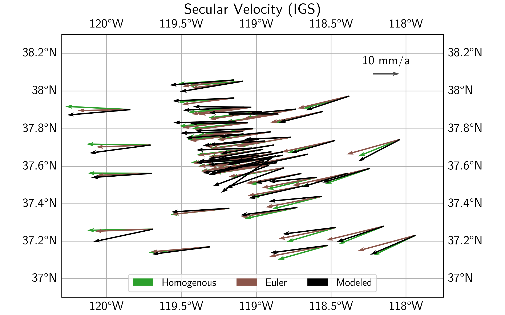
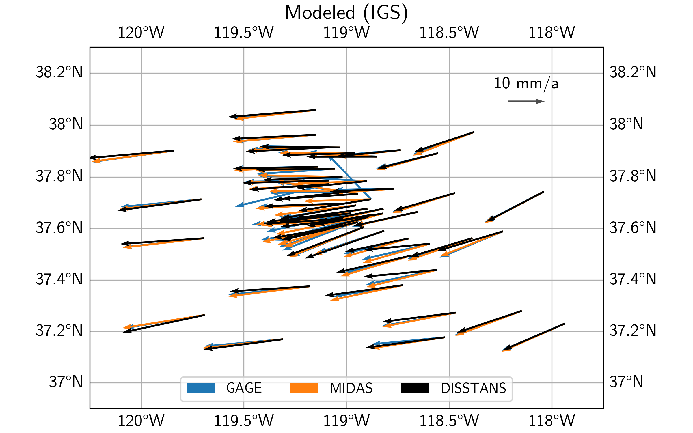
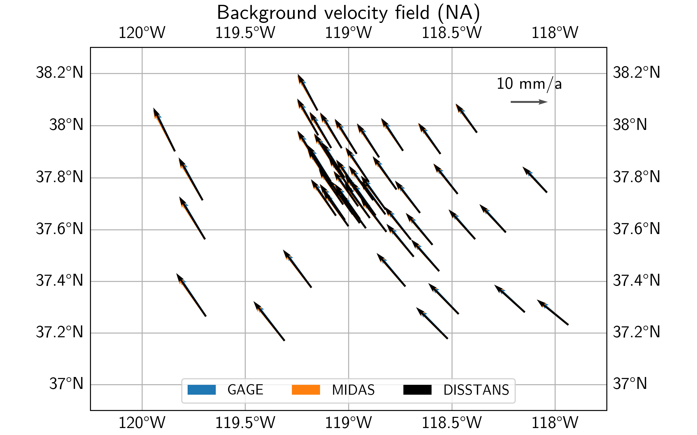
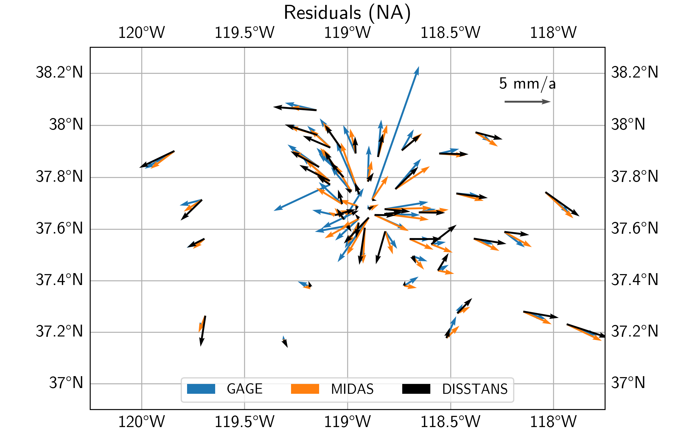

Example 2: Long Valley Caldera Comparisons
==========================================

.. sidebar:: Download full script

   :download:`example_2_lvc_comparison.py <../../scripts/example_2_lvc_comparison.py>`

This example builds on the data from :doc:`Example 1 <example_1>` and compares secular
velocity model results with published data. On the way, it shows how to do coordinate
transformations from the cartesian to the local geodetic reference frame.

.. note::
    The figures and numbers presented in this example no longer exactly match what is
    presented in [koehne23]_. This is because significant code improvements to DISSTANS
    were introduced with version 2, and the effect of the hyperparameters changed.
    Care has been taken to recreate this example to match what is in the published study,
    although small quantitative changes remain. The qualitative interpretations are
    unchanged.

.. contents:: Table of contents
    :local:

Preparations
------------

Here are the imports we will need throughout the example:

.. doctest::

   >>> import os
   >>> import pickle
   >>> import gzip
   >>> import numpy as np
   >>> import pandas as pd
   >>> import matplotlib.pyplot as plt
   >>> import cartopy.crs as ccrs
   >>> from pathlib import Path
   >>> from urllib import request
   >>> from disstans.tools import (R_ecef2enu, strain_rotation_invariants,
   ...                             estimate_euler_pole, rotvec2eulerpole)

We also need to define the same folders as in Example 1 - in our case:

.. doctest::

    >>> main_dir = Path("proj_dir").resolve()
    >>> data_dir = main_dir / "data/gnss"
    >>> gnss_dir = data_dir / "longvalley"
    >>> out_dir_ex1 = main_dir / "out/example_1"

With that, we can load some of the data we used or produced in Example 1:

.. doctest::

    >>> with gzip.open(f"{out_dir_ex1}/example_1_net.pkl.gz", "rb") as f:
    ...     net = pickle.load(f)
    >>> stations_df = pd.read_pickle(f"{gnss_dir}/downloaded.pkl.gz")
    >>> all_poly_df = pd.read_csv(f"{out_dir_ex1}/example_1_secular_velocities.csv", index_col=0)
    >>> poly_stat_names = all_poly_df.index.tolist()

In the next two sections, we will compute "average" background velocity fields
for the secular, linear velocities previously estimated, using two different methods.

Homogenous translation, rotation, and strain
--------------------------------------------

The first method determines the best-fit displacement gradient tensor for the
entire network, which in turn can be decomposed into a rotation and a strain (rate) tensor
(plus a velocity offset term). More information can be found in the
:meth:`~disstans.network.Network.hom_velocity_field` method, which wraps the
:func:`~disstans.tools.get_hom_vel_strain_rot` function for network objects.

Directly from the network object we loaded from Example 1, we can get our desired
results:

.. doctest::

    >>> v_pred_hom, v_O, epsilon, omega = \
    ...     net.hom_velocity_field(ts_description="final", mdl_description="Linear")

We are going to plot the results later, but for now, let's have a look at some scalar
quantities related to the outputs that can give us insight into what is happening
in our study region. 

.. doctest::
    :hide:
    :options: +NORMALIZE_WHITESPACE

    >>> dilatation, strain, shear, rotation = strain_rotation_invariants(epsilon, omega)
    >>> print("Homogenous transation, rotation, and strain field results:\n"
    ...       f"Dilatation rate: {dilatation:.2e} 1/a\n"
    ...       f"Strain rate:     {strain:.2e} 1/a\n"
    ...       f"Shearing rate:   {shear:.2e} 1/a\n"
    ...       f"Rotation rate:   {rotation:.2e} rad/a")
    Homogenous transation, rotation, and strain field results:
    Dilatation rate: 2.83e-04 1/a
    Strain rate:     2.06e-04 1/a
    Shearing rate:   8.93e-05 1/a
    Rotation rate:   2.29e-05 rad/a

So, there is a little bit of everything going on here. We're not going to dwell on
it here, since we're mostly focused on the resulting predicted velocities, but you
can have a look at :func:`~disstans.tools.strain_rotation_invariants` if you're
curious what the quantities mean. For now, let's move on to the other method
included in DISSTANS, which might be a bit more intuitive.

Rotation about an Euler pole
----------------------------

The second method assumes that all observations lie on a rigid body that can move
freely on a sphere, but not deform. All rigid-body motion on a sphere can be
expressed about a rotation around a location on the sphere, and we'll use the
:meth:`~disstans.network.Network.euler_rot_field` method for the calculation,
which wraps the :func:`~disstans.tools.estimate_euler_pole` function for network
objects:

.. doctest::

    >>> v_pred_euler, rotation_vector, rotation_covariance = \
    ...     net.euler_rot_field(ts_description="final", mdl_description="Linear")

The rotation vector returned here is in ECEF (cartesian) coordinates, which is useful
if we want to rotate vectors later, but for now, we can convert it into the more
convenient Euler pole notation using :func:`~disstans.tools.rotvec2eulerpole`:

.. doctest::

    >>> euler_pole, euler_pole_covariance = \
    ...     rotvec2eulerpole(rotation_vector, rotation_covariance)
    >>> # convert to degrees for printing
    >>> euler_pole = np.rad2deg(euler_pole)
    >>> euler_pole_sd = np.rad2deg(np.sqrt(np.diag(euler_pole_covariance)))
    >>> print("Euler pole results (with one s.d.):\n"
    ...       f"Longitude: {euler_pole[0]:.3f} +/- {euler_pole_sd[0]:.3f} °\n"
    ...       f"Latitude:  {euler_pole[1]:.3f} +/- {euler_pole_sd[1]:.3f} °\n"
    ...       f"Rate:      {euler_pole[2]:.2g} +/- {euler_pole_sd[2]:.2g} °/a")
    Euler pole results (with one s.d.):
    Longitude: 56.979 +/- 0.040 °
    Latitude:  -52.711 +/- 0.444 °
    Rate:      0.00071 +/- 5.3e-06 °/a

Comparison of different methods
-------------------------------

Plotting the resulting two velocity fields (see script file) gives us the plot
below. We can clearly see that the Euler pole solution gives a rotation pattern
about some center south of the plot. The solution assuming a Homogenous
motion and deformation shows less of a rotation, and more of an east-west motion
with associated extension.

Loading other different datasets
--------------------------------

We will now compare the DISSTANS-derived secular velocities with other published
datasets. Specifically, we will be using the MIDAS-calculated velocities from UNR
([blewitt16]_ - `MIDAS velocities <http://geodesy.unr.edu/velocities/midas.IGS14.txt>`_)
and from the Geodesy Advancing Geosciences and EarthScope (GAGE) facility ([herring16]_ -
`GAGE velocities <https://data.unavco.org/archive/gnss/products/velocity/pbo.final_igs14.vel>`_).

To load them, we rely on pandas:

.. doctest::

    >>> # MIDAS
    >>> fname_midas = Path(f"{data_dir}/midas.IGS14.txt")
    >>> v_mdl_midas = pd.read_csv(fname_midas,
    ...                           header=0, sep=r"\s+",
    ...                           names=["sta", "label", "t(1)", "t(m)", "delt", "m", "mgood",
    ...                                  "n", "ve50", "vn50", "vu50", "sve", "svn", "svu",
    ...                                  "xe50", "xn50", "xu50", "fe", "fn", "fu",
    ...                                  "sde", "sdn", "sdu", "nstep", "lat", "lon", "alt"])
    >>> v_mdl_midas.set_index("sta", inplace=True, verify_integrity=True)
    >>> v_mdl_midas.sort_index(inplace=True)
    >>> # GAGE
    >>> fname_gage = Path(f"{data_dir}/pbo.final_igs14.vel")
    >>> v_mdl_gage = pd.read_fwf(fname_gage, header=35,
    ...                          widths=[5, 17, 15, 11, 16, 15, 15, 16, 16, 11, 11, 9, 9, 8,
    ...                                  8, 8, 7, 7, 7, 11, 9, 9, 8, 8, 8, 7, 7, 7, 15, 15],
    ...                          names=["Dot#", "Name", "Ref_epoch", "Ref_jday",
    ...                                 "Ref_X", "Ref_Y", "Ref_Z",
    ...                                 "Ref_Nlat", "Ref_Elong", "Ref_Up",
    ...                                 "dX/dt", "dY/dt", "dZ/dt", "SXd", "SYd", "SZd",
    ...                                 "Rxy", "Rxz", "Ryz", "dN/dt", "dE/dt", "dU/dt",
    ...                                 "SNd", "SEd", "SUd", "Rne", "Rnu", "Reu",
    ...                                 "first_epoch", "last_epoch"])
    >>> # manually checked that the last occurrence of repeated station velocities
    >>> # is the median of the reported velocities
    >>> v_mdl_gage.drop_duplicates(subset=["Dot#"], inplace=True, keep="last")
    >>> v_mdl_gage.set_index("Dot#", inplace=True, verify_integrity=True)
    >>> v_mdl_gage.sort_index(inplace=True)

For the comparison, we need a list of all the stations that have solutions in all
three datasets. For the plotting, we also need their latitude and longitudes.

.. doctest::

    >>> # station list
    >>> common_stations = sorted(list(set(poly_stat_names)
    ...                               & set(v_mdl_midas.index.tolist())
    ...                               & set(v_mdl_gage.index.tolist())))
    >>> # locations
    >>> station_lolaal = net.station_locations.loc[
    ...     common_stations, ["Longitude [°]", "Latitude [°]", "Altitude [m]"]].to_numpy()
    >>> lons, lats, alts = station_lolaal[:, 0], station_lolaal[:, 1], station_lolaal[:, 2]

In the next step, we need to bring all datasets into the same format, and order them the
same way:

.. doctest::

    >>> # reduce DataFrame to what we need for the velocities comparison
    >>> v_mdl = {}
    >>> v_mdl["DISSTANS"] = all_poly_df.loc[
    ...     common_stations, ["vel_e", "vel_n", "sig_vel_e", "sig_vel_n"]].copy() / 1000
    >>> v_mdl["DISSTANS"]["corr_vel_en"] = all_poly_df.loc[common_stations, ["corr_vel_en"]].copy()
    >>> # also convert the MIDAS and GAGE velocity dataframes into the same format
    >>> v_mdl["MIDAS"] = pd.DataFrame({"vel_e": v_mdl_midas.loc[common_stations, "ve50"],
    ...                                "vel_n": v_mdl_midas.loc[common_stations, "vn50"],
    ...                                "sig_vel_e": v_mdl_midas.loc[common_stations, "sve"],
    ...                                "sig_vel_n": v_mdl_midas.loc[common_stations, "svn"],
    ...                                "corr_vel_en": np.zeros(len(common_stations))},
    ...                               index=common_stations)
    >>> v_mdl["GAGE"] = pd.DataFrame({"vel_e": v_mdl_gage.loc[common_stations, "dE/dt"],
    ...                               "vel_n": v_mdl_gage.loc[common_stations, "dN/dt"],
    ...                               "sig_vel_e": v_mdl_gage.loc[common_stations, "SEd"],
    ...                               "sig_vel_n": v_mdl_gage.loc[common_stations, "SNd"],
    ...                               "corr_vel_en": v_mdl_gage.loc[common_stations, "Rne"]},
    ...                              index=common_stations)

North American reference frame
------------------------------

Even though removing an average velocity field with either method will remove any large-scale
plate motion from the IGS14-referenced data, for plotting purposes, we want to be able to see
the velocity field relative to stable North America. We could have downloaded the data in that
reference frame in the first place, but for illustration purposes, we didn't, such that we
can rotate the data ourselves using the :func:`~disstans.tools.R_ecef2enu` rotation matrix:

.. doctest::

    >>> # ITRF2014 plate motion model: https://doi.org/10.1093/gji/ggx136
    >>> rot_NA_masperyear = np.array([0.024, -0.694, -0.063])
    >>> rot_NA = rot_NA_masperyear / 1000 * np.pi / 648000  # [rad/a]
    >>> crs_lla = ccrs.Geodetic()
    >>> crs_xyz = ccrs.Geocentric()
    >>> stat_xyz = crs_xyz.transform_points(crs_lla, lons, lats, alts)
    >>> v_NA_xyz = np.cross(rot_NA, stat_xyz)  # [m/a]
    >>> v_NA_enu = pd.DataFrame(
    ...     data=np.stack([(R_ecef2enu(lo, la) @ v_NA_xyz[i, :]) for i, (lo, la)
    ...                    in enumerate(zip(lons, lats))]),
    ...     index=common_stations, columns=["vel_e", "vel_n", "vel_u"])

With this, we can now remove the velocity at every station due to the North American (NA)
plate moving around Earth to get the velocity relative to the NA plate:

.. doctest::

    >>> v_mdl_na = {case: (-v_NA_enu.iloc[:, :2]) + v_mdl[case][["vel_e", "vel_n"]].values
    ...             for case in v_mdl.keys()}

Estimate Euler poles for datasets
---------------------------------

Since an Euler pole captures a more "explainable" signal, while still approximating most
of the velocity field, we will only use this method for the comparison between fields.
Instead of creating timeseries and :class:`~disstans.models.Polynomial` models, and adding
them to our network object from before, we will instead be using the Euler pole function
:func:`~disstans.tools.estimate_euler_pole` directly. For that, we will need the variances
and covariances instead of the standard deviations and correlation coefficients:

.. doctest::

    >>> v_mdl_covs = {case: np.stack(
    ...     [v_mdl[case]["sig_vel_e"].values**2, v_mdl[case]["sig_vel_n"].values**2,
    ...      np.prod(v_mdl[case][["sig_vel_e", "sig_vel_n", "corr_vel_en"]].values, axis=1)
    ...      ], axis=1)
    ...     for case in v_mdl.keys()}

We can now run a loop over the three datasets, calculate the Euler poles, predict the
background velocity at every station, and calculate the residuals:

.. doctest::

    >>> v_pred, v_res = {}, {}
    >>> for case in ["DISSTANS", "MIDAS", "GAGE"]:
    ...     # get solution for all stations
    ...     rotation_vector = estimate_euler_pole(station_lolaal[:, :2],
    ...                                           v_mdl_na[case].values,
    ...                                           v_mdl_covs[case])[0]
    ...     # calculate the surface motion at each station
    ...     v_temp = np.cross(rotation_vector, stat_xyz)
    ...     # rotate the motion into the local ENU frame
    ...     v_pred[case] = pd.DataFrame(
    ...         data=np.stack([(R_ecef2enu(lo, la) @ v_temp[i, :]) for i, (lo, la)
    ...                        in enumerate(zip(lons, lats))])[:, :2],
    ...         index=common_stations, columns=["vel_e", "vel_n"])
    ...     # get residual
    ...     v_res[case] = v_mdl_na[case] - v_pred[case].values

Map view comparison of datasets
-------------------------------

Let's now have a look at the modeled velocities, the background velocity field, as
well as the residual velocities, for all three datasets. For the plotting code, see the
script file.

First off, we can see that qualitatively, the three secular velocity models (DISSTANS,
GAGE, and MIDAS) mostly match each other. Zooming into the caldera region, however, there
are some significant differences.

In terms of the background vleocity field derived from the best-fit Euler poles, we see
that qualitatively, all three estimates mostly match each other again, with some differences
for the DISSTANS background field in the east of the study area.

Finally, looking at the residuals, we can see that the DISSTANS solution has significantly
lower residuals within the caldera region, suggesting that the DISSTANS-derived secular
velocity field is more closely matching that of a rigid body motion on a sphere.
Outside the caldera, DISSTANS' residuals are slightly different, which is likely due to the
slightly different background velocity fields, and our imperfect assumption about the nature
of the background velocity field.

.. note::

    For better plots, feel free to add elements in Cartopy, or use (Py)GMT.
    The script file contains a part about saving our results in a GMT-compatible
    format.

Quantitative comparison of datasets
-----------------------------------

To put into numbers what we gathered by looking at the maps, we will perform a couple of
root-mean-square (RMS) calculations of the residuals of the different models and station
subsets. In order to do that, we first need to define a region close to the caldera center,
which we will call the Long Valley Caldera Region (LVCR):

.. doctest::

    >>> inner_bbox = [-119-12/60, -118-33/60, 37+30/60, 37+50/60]
    >>> inner_shell = ((lons > 360 + inner_bbox[0]) &
    ...                (lons < 360 + inner_bbox[1]) &
    ...                (lats > inner_bbox[2]) &
    ...                (lats < inner_bbox[3]))
    >>> outer_shell = ~inner_shell
    >>> inner_stations = np.array(common_stations)[inner_shell].tolist()
    >>> outer_stations = np.array(common_stations)[outer_shell].tolist()

With that, we can calculate another background velocity field that only considers the
stations outside the LVCR:

.. doctest::

    >>> v_pred_os, v_res_os = {}, {}
    >>> for case in ["DISSTANS", "MIDAS", "GAGE"]:
    ...     rotation_vector = estimate_euler_pole(station_lolaal[outer_shell, :2],
    ...                                           v_mdl_na[case].values[outer_shell, :],
    ...                                           v_mdl_covs[case][outer_shell, :])[0]
    ...     v_temp = np.cross(rotation_vector, stat_xyz)
    ...     v_pred_os[case] = pd.DataFrame(
    ...         data=np.stack([(R_ecef2enu(lo, la) @ v_temp[i, :]) for i, (lo, la)
    ...                        in enumerate(zip(lons, lats))])[:, :2],
    ...         index=common_stations, columns=["vel_e", "vel_n"])
    ...     v_res_os[case] = v_mdl_na[case] - v_pred_os[case].values

This enables us to see how different the results are depending on whether the stations
inside the LVCR are being used to calculate the best-fit Euler poles:

.. doctest::

    >>> rmses_res = pd.DataFrame(np.zeros((3, 3)),
    ...                          columns=list(v_res.keys()), index=["all", "outer", "inner"])
    >>> rmses_res_os, rmses_resdiff = rmses_res.copy(), rmses_res.copy()
    >>> for sub_name, sub_ix in zip(["all", "outer", "inner"],
    ...                             [[True] * outer_shell.size, outer_shell, ~outer_shell]):
    ...     rmses_res.loc[sub_name, :] = \
    ...         [(np.linalg.norm(v_res[case].values[sub_ix, :], axis=1)**2).mean()**0.5
    ...          for case in v_res.keys()]
    ...     rmses_res_os.loc[sub_name, :] = \
    ...         [(np.linalg.norm(v_res_os[case].values[sub_ix, :], axis=1)**2).mean()**0.5
    ...          for case in v_res_os.keys()]
    ...     # compare the residuals between the common and outer stations cases
    ...     # this is the same as comparing the predictions, as the plate velocity cancels out
    ...     rmses_resdiff.loc[sub_name, :] = \
    ...         [(np.linalg.norm(v_res[case].values[sub_ix, :]
    ...                          - v_res_os[case].values[sub_ix, :], axis=1
    ...                          )**2).mean(axis=0)**0.5 for case in v_res_os.keys()]

We can also quantify the differences between the different modeled secular velocity
fields:

.. doctest::

    >>> rmses_predmdls = pd.DataFrame(
    ...     {"D2M": [(np.linalg.norm(vp["DISSTANS"].values - vp["MIDAS"].values,
    ...              axis=1)**2).mean()**0.5 for vp in [v_pred, v_pred_os]],
    ...      "D2G": [(np.linalg.norm(vp["DISSTANS"].values - vp["GAGE"].values,
    ...              axis=1)**2).mean()**0.5 for vp in [v_pred, v_pred_os]],
    ...      "M2G": [(np.linalg.norm(vp["MIDAS"].values - vp["GAGE"].values,
    ...              axis=1)**2).mean()**0.5 for vp in [v_pred, v_pred_os]]},
    ...     index=["common", "outer"])

Finally, let's print out all the statistics we just calculated:

.. doctest::

    >>> print("\nDifference between model predictions\n",
    ...       rmses_predmdls,
    ...       "\n\nResiduals common_stations\n",
    ...       rmses_res,
    ...       "\n\nResiduals outer_stations\n",
    ...       rmses_res_os,
    ...       "\n\nDifference of residuals between station subsets\n",
    ...       rmses_resdiff,
    ...       "\n\nRelative improvement from other models to DISSTANS\n",
    ...       (rmses_res.iloc[:, 1:] - rmses_res.iloc[:, 0].values.reshape(-1, 1)
    ...        ) / rmses_res.iloc[:, 1:].values, "\n", sep="")
    <BLANKLINE>
    Difference between model predictions
                 D2M       D2G       M2G
    common  0.000310  0.000864  0.000678
    outer   0.000362  0.000388  0.000693
    <BLANKLINE>
    Residuals common_stations
           DISSTANS     MIDAS      GAGE
    all    0.002487  0.003065  0.003883
    outer  0.002883  0.002788  0.002789
    inner  0.002015  0.003318  0.004730
    <BLANKLINE>
    Residuals outer_stations
           DISSTANS     MIDAS      GAGE
    all    0.002598  0.003084  0.003989
    outer  0.002901  0.002755  0.002888
    inner  0.002254  0.003381  0.004846
    <BLANKLINE>
    Difference of residuals between station subsets
           DISSTANS     MIDAS      GAGE
    all    0.000990  0.000471  0.000505
    outer  0.001000  0.000472  0.000505
    inner  0.000979  0.000471  0.000505
    <BLANKLINE>
    Relative improvement from other models to DISSTANS
              MIDAS      GAGE
    all    0.188404  0.359450
    outer -0.034228 -0.033855
    inner  0.392870  0.574107
    <BLANKLINE>

There's a lot to unpack here, so let's jump right in:

1. The DISSTANS, MIDAS and GAGE modeled velocity fields are all similar to each other at
   the scale of less than 1 mm/a, at least using the root-mean-square differences.
2. Excluding the stations inside the LVCR from the Euler pole estimation does not
   significantly affect the results for any of the datasets. The differences are below
   the level of 1 mm/a.
3. Across all stations, the DISSTANS solution has the lowest residuals. Looking more closely,
   this is mainly driven by lower residuals inside the LVCR, where the relative
   improvements are 39% and 57% relative to MIDAS and GAGE, respectively. Outside the LVCR,
   DISSTANS' residuals are slightly larger by about 3%.
4. There are large differences between residuals inside and outside the LVCR for
   the DISSTANS (20% to 29%, respectively), MIDAS (33% to 28%) and GAGE (47% to 28%) models,
   DISSTANS' residuals are larger outside than inside, whereas MIDAS and GAGE residuals are
   larger inside. It should be noted, however, that that puts all three models in relative
   equivalence for the region outside the LVCR. This further shows DISSTANS' ability to fit
   the transient signals inside the LVCR without significantly compromising the fit quality
   outside the LVCR.

Keep in mind that this of course does not mean that DISSTANS' solution is "better" than
the MIDAS or GAGE solutions. After all, neither of those models explicitly aim to model
transient episodes, nor do they require significant user interaction. This comparison
does show, however, how the explicit modeling of transients changes the results.

References
----------

.. [herring16] Herring, T. A., Melbourne, T. I., Murray, M. H., Floyd, M. A.,
   Szeliga, W. M., King, R. W., et al. (2016). *Plate Boundary Observatory and related
   networks: GPS data analysis methods and geodetic products*.
   Reviews of Geophysics, 54(4), 759–808. 
   doi:`10.1002/2016RG000529 <https://doi.org/10.1002/2016RG000529>`_

