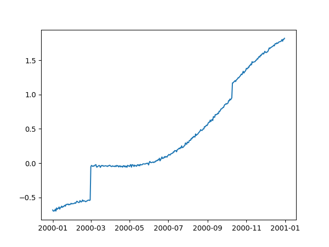
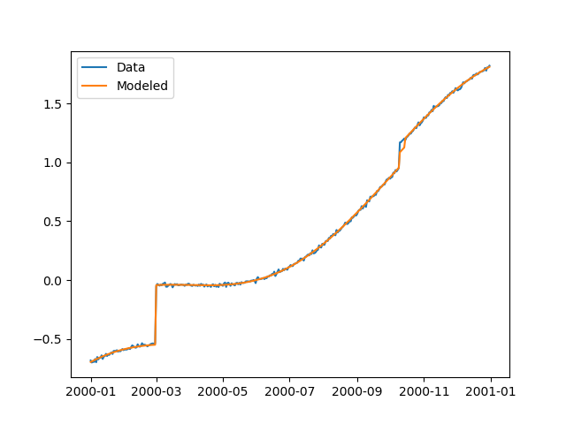
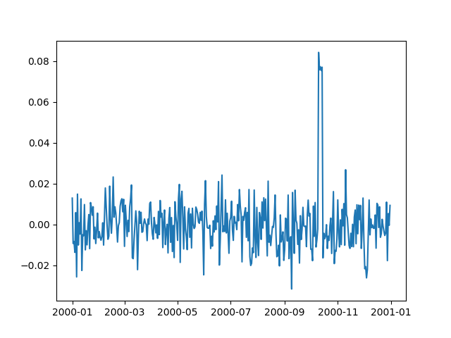

Tutorial
========

Creating a synthetic network
----------------------------

A single station, basic models
..............................

Let's create an empty synthetic network ``'SynthLand'`` and add station ``"01"``
located in Los Angeles using :class:`~geonat.station.Station` and
:class:`~geonat.network.network`:

.. testcode:: tut1

    from geonat import Network, Station
    net = Network(name="SynthLand")
    synth_stat = Station(name="01", location=(34.05, -118.25, 93))
    net["01"] = synth_stat

.. note::
    Note that the stations internal name :attr:`~geonat.station.Station.name` does not
    have to match the network's name of that station in
    :class:`~geonat.network.Network.stations`.

    ``net["01"] = synth_stat`` is equivalent to ``net.add_station("01", synth_stat)``.

Now, let's create a dictionary of :class:`~geonat.models.Model` objects which we would
like to use to create our synthetic timeseries. We'll start with a linear trend, an annual
sinusoid and some steps.

.. testcode:: tut1

    import numpy as np
    from geonat.models import Polynomial, Sinusoidal, Step
    mdl_secular = Polynomial(order=1, time_unit="D", t_reference="2000-01-01")
    mdl_secular.read_parameters(np.array([-1, 5e-3]))

We can also give the parameters directly to the constructor:

.. testcode:: tut1

    mdl_annual = Sinusoidal(period=365.25, time_unit="D", t_reference="2000-01-01",
                            parameters=np.array([0.3, 0]))
    mdl_steps = Step(steptimes=["2000-03-01", "2000-10-10", "2000-10-15"],
                     parameters=np.array([0.5, 0.2, -0.01]))

Let's combine the models in a dictionary for easy access later.

.. testcode:: tut1

    collection = {"Secular": mdl_secular,
                  "Annual": mdl_annual,
                  "Steps": mdl_steps}

Next, we need the time span to evaluate our models over. We can use Pandas'
:func:`~pandas.date_range` for this very nicely.

.. testcode:: tut1

    import pandas as pd
    timevector = pd.date_range(start="2000-01-01", end="2000-12-31", freq="1D")

Now, we can evaluate the models, and sum them all up. :meth:`~geonat.models.Model.evaluate`
returns a dictionary and the modeled output can be found in the ``'fit'`` key:

.. testcode:: tut1

    sum_models = np.zeros((timevector.size, 1))
    for model_description, model in collection.items():
        eval = model.evaluate(timevector)
        sum_models += eval["fit"]

A :class:`~geonat.timeseries.Timeseries` can now be created using the data we just
made up, and we can add it to our station:

.. testcode:: tut1

    from geonat import Timeseries
    synth_ts = Timeseries.from_array(timevector=timevector,
                                     data=sum_models,
                                     src="synthetic",
                                     data_unit="m",
                                     data_cols=["total"])
    net["01"]["Data"] = synth_ts

.. note::

    ``net["01"]["Data"] = synth_ts`` is equivalent to
    ``net["01"].add_timeseries("Data", synth_ts)``.

The ``data_unit``, ``data_cols`` and timeseries name are obviously a bit arbitrary
for synthetic data.

But oh no - we forgot to add noise! We can either

- go back to the beginning, change the ``sum_models`` NumPy array, recreate ``synth_ts``,
  and then replace the the timeseries saved in the station (replacing is just adding a new
  timeseries with an existing name),
- add the noise to the timeseries directly and replace the timeseries saved in the station, or
- just overwrite the timeseries' data.

They are all equivalent, but because the first doesn't show any new code, and the second
is literally just doing ``synth_ts = synth_ts + noise`` (where ``noise`` is a NumPy array
of the same shape as the timeseries), we're going to use the third way for the sake of
the tutorial:

.. testcode:: tut1

    np.random.seed(1)  # make this example reproducible
    noise = np.random.randn(*net["01"]["Data"].shape)*0.01
    net["01"]["Data"].data += noise

Finally, let's have a look at the timeseries we created. GeoNAT provides a straightforward
interface to plot timeseries with Matplotlib::

    import matplotlib.pyplot as plt
    plt.plot(net["01"]["Data"].data)
    plt.show()

This should give us an output like this:

We've successfully created a synthetic timeseries for a single station. Now, let's see
if a linear regression solver can estimate the model parameters we originally put
in. To this end, we must first associate our models with the timeseries at the station.

.. testcode:: tut1

    for model_description, model in collection.items():
        net["01"].add_local_model("Data", model_description, model)

For the fitting, we use the network's methods. ``net.fit(...)`` calls the solver to
fit the models to the timeseries and saves the parameters, and ``net.evaluate(...)``
then produces a ``'Modeled'`` timeseries that we can then compare to the original
timeseries and calculate some statistics later. See :mod:`~geonat.solvers` for a list
of included solvers.

.. testcode:: tut1

    from geonat import defaults
    defaults["general"]["num_threads"] = 0  # now we're computing in serial
    net.fit(ts_description="Data", solver="linear_regression")
    net.evaluate(ts_description="Data", output_description="Modeled")

.. note::

    Note that in this process, the parameters we set in the beginning will be
    overwritten. If we want to keep them, we can either create the models again
    without giving them parameters, or create a copy of the model collection.

    Also, because GeoNAT is designed for many stations, by default fitting tries to use
    multiple cores, but because we only have a single station, initializing all the
    multiprocessing would actually be slower than to do it in serial. So, before
    fitting, we make sure to change GeoNAT's settings to not use parallelization.

At this point, we first want to have a look at the fit to see if everything worked
before actually looking at the parameters themselves or residuals. The ``evaluate``
function already created a new timeseries object on the way, which we can now plot::

    plt.plot(net["01"]["Data"].data, label="Data")
    plt.plot(net["01"]["Modeled"].data, label="Modeled")
    plt.legend()
    plt.show()

As we can see, the model matches the data pretty well, but we can see some trade-off
happening between two of our added steps:

Lastly, let's calculate the residual and some statistics on it. Timeseries objects
can directly be used in (basic) mathematical operations, with the output being a new
Timeseries object that can be added to the station.

.. testcode:: tut1

    mystation = net["01"]
    mystation["Residual"] = mystation["Data"] - mystation["Modeled"]
    stats_dict = mystation.analyze_residuals(ts_description="Data",
                                             mean=True, std=True)

Which will yield the following output:

.. testoutput:: tut1

    01: Data      Mean  Standard Deviation
    total     0.374921            0.732139

And we can plot it like before::

    plt.plot(net["01"]["Residual"].data)
    plt.show()

.. note::

    This is very simple plotting. The :class:`~geonat.network.Network` class provides
    some better plotting tools to use with larger stations which we will explore later.

A single station, advanced models
.................................

Loading a saved network
-----------------------

Load a Network object from a JSON file like this::

    from geonat import Network
    net = Network.from_json(path="net_config.json")
