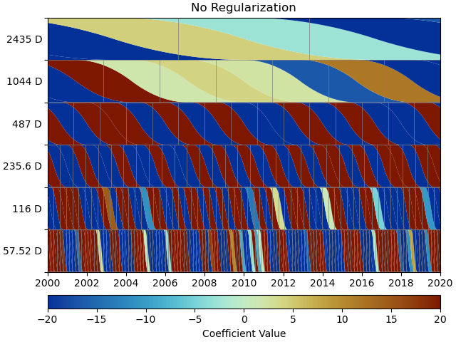
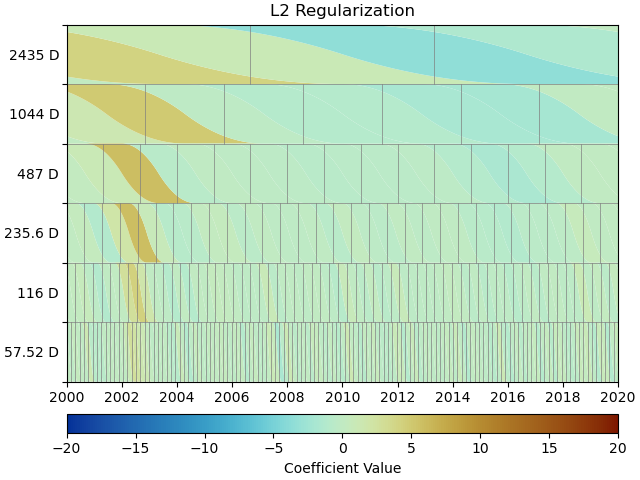

Tutorial
========

1. The first synthetic station
------------------------------

Building a Model collection
...........................

Let's create an empty synthetic station ``"TUT"`` located in Los Angeles using
:class:`~geonat.station.Station`:

.. doctest:: tut1

    >>> from geonat import Station
    >>> synth_stat = Station(name="TUT", location=(34.05, -118.25, 93))

Now, let's create a dictionary of :class:`~geonat.models.Model` objects which we would
like to use to create our synthetic timeseries. We'll start with a linear trend, an annual
sinusoid and some steps.

.. doctest:: tut1

    >>> import numpy as np
    >>> from geonat.models import Polynomial, Sinusoidal, Step
    >>> mdl_secular = Polynomial(order=1, time_unit="D", t_reference="2000-01-01")
    >>> mdl_secular.read_parameters(np.array([-1, 5e-3]))

We can also give the parameters directly to the constructor:

.. doctest:: tut1

    >>> mdl_annual = Sinusoidal(period=365.25, time_unit="D", t_reference="2000-01-01",
    ...                         parameters=np.array([0.3, 0]))
    >>> mdl_steps = Step(steptimes=["2000-03-01", "2000-10-10", "2000-10-15"],
    ...                  parameters=np.array([0.5, 0.2, -0.01]))

Let's combine the models in a dictionary for easy access later.

.. doctest:: tut1

    >>> collection = {"Secular": mdl_secular,
    ...               "Annual": mdl_annual,
    ...               "Steps": mdl_steps}

Next, we need the time span to evaluate our models over. We can use Pandas'
:func:`~pandas.date_range` for this very nicely.

.. doctest:: tut1

    >>> import pandas as pd
    >>> timevector = pd.date_range(start="2000-01-01", end="2000-12-31", freq="1D")

Now, we can evaluate the models, and sum them all up. :meth:`~geonat.models.Model.evaluate`
returns a dictionary and the modeled output can be found in the ``'fit'`` key:

.. doctest:: tut1

    >>> sum_models = np.zeros((timevector.size, 1))
    >>> for model_description, model in collection.items():
    ...     eval = model.evaluate(timevector)
    ...     sum_models += eval["fit"]

Creating Timeseries objects
...........................

A :class:`~geonat.timeseries.Timeseries` can now be created using the data we just
made up, and we can add it to our station:

.. doctest:: tut1

    >>> from geonat import Timeseries
    >>> synth_ts = Timeseries.from_array(timevector=timevector,
    ...                                  data=sum_models,
    ...                                  src="synthetic",
    ...                                  data_unit="m",
    ...                                  data_cols=["total"])
    >>> synth_stat["Data"] = synth_ts

.. note::

    ``synth_stat["Data"] = synth_ts`` is equivalent to
    ``synth_stat.add_timeseries("Data", synth_ts)``.

The ``data_unit``, ``data_cols`` and timeseries name are obviously a bit arbitrary
for synthetic data.

But oh no - we forgot to add noise! We can either

- go back to the beginning, change the ``sum_models`` NumPy array, recreate ``synth_ts``,
  and then replace the the timeseries saved in the station (replacing is just adding a new
  timeseries with an existing name),
- add the noise to the timeseries directly and replace the timeseries saved in the station, or
- just overwrite the timeseries' data.

They are all equivalent, but because the first doesn't show any new code, and the second
is literally just doing ``synth_ts = synth_ts + noise`` (where ``noise`` is a NumPy array
of the same shape as the timeseries), we're going to use the third way for the sake of
the tutorial:

.. doctest:: tut1

    >>> np.random.seed(1)  # make this example reproducible
    >>> noise = np.random.randn(*synth_stat["Data"].shape)*0.01
    >>> synth_stat["Data"].data += noise

Finally, let's have a look at the timeseries we created. GeoNAT provides a straightforward
interface to plot timeseries with Matplotlib::

    >>> import matplotlib.pyplot as plt
    >>> plt.plot(synth_stat["Data"].data)
    >>> plt.savefig("tutorial_1a.png")
    >>> plt.close()

This should give us an output like this:

.. image:: img/tutorial_1a.png

Fitting the models
..................

We've successfully created a synthetic timeseries for a single station. Now, let's see
if a linear regression solver can estimate the model parameters we originally put
in. To this end, we must first associate our models with the timeseries at the station.

.. doctest:: tut1

    >>> for model_description, model in collection.items():
    ...     synth_stat.add_local_model("Data", model_description, model)

For the fitting, we first import a solver function from the :mod:`~geonat.solvers` module,
and then call it to give us a dictionary of the fitted parameters. We will start with
basic, linear, non-regularized least-squares:

.. doctest:: tut1

    >>> from geonat.solvers import linear_regression  # noqa: E402
    >>> fitted_params = linear_regression(ts=synth_stat["Data"],
    ...                                   models=synth_stat.models["Data"])

.. note::

    Note that in this process, the parameters we set in the beginning will be
    overwritten. If we want to keep them, we can either create the models again
    without giving them parameters, or create a (deep) copy of the model collection.

With the solver finished, we want to do multiple things for all models:

1. Give the models their best-fit parameters as returned by the solver using the
   :meth:`~geonat.model.Model.read_parameters` method.
2. Calculate the clean trajectory for that model given the best-fit parameters using the
   :meth:`~geonat.model.Model.evaluate` method.
3. Add the evaluated trajectory to the station as a "fit" using the
   :meth:`~geonat.station.Station.add_fit` method.

We can do this by looping over the items in ``fitted_params``:

.. doctest:: tut1

    >>> for model_description, (params, covs) in fitted_params.items():
    ...     # save the parameters into the model
    ...     synth_stat.models["Data"][model_description].read_parameters(params, covs)
    ...     # evaluate the model given our timevector
    ...     modeled = synth_stat.models["Data"][model_description].evaluate(timevector)
    ...     # add this fit to the station and return the timeseries object
    ...     fit_ts = synth_stat.add_fit(ts_description="Data",
    ...                                 model_description=model_description,
    ...                                 fit=modeled)

Lastly, we want to sum all the modeled timeseries. This can be done by looping
over the ``Station.fits`` dictionary:

.. doctest:: tut1

    >>> for i, model_ts in enumerate(synth_stat.fits["Data"].values()):
    ...     if i == 0:
    ...         model_aggregate = model_ts
    ...     else:
    ...         model_aggregate += model_ts
    >>> synth_stat.add_timeseries(ts_description="Modeled", timeseries=model_aggregate,
    ...                           override_src="model", override_data_cols=synth_ts.data_cols)

.. note::

    It should be pointed out here that this is a lot of code that doesn't need to be
    repeated by the user every time, but is intended to illustrate what is happening
    under the hood. For ease of use, the :class:`~geonat.network.Network` class
    can do all of these things with its two methods :meth:`~geonat.network.Network.fit`
    and :meth:`~geonat.network.Network.evaluate`.

Plotting the fit and residuals
..............................

At this point, we first want to have a look at the fit to see if everything worked
before actually looking at the parameters themselves or residuals. The ``evaluate``
function already created a new timeseries object on the way, which we can now plot::

    >>> plt.plot(synth_stat["Data"].data, label="Data")
    >>> plt.plot(synth_stat["Modeled"].data, label="Modeled")
    >>> plt.legend()
    >>> plt.savefig("tutorial_1b.png")
    >>> plt.close()

As we can see, the model matches the data pretty well, but we can see some trade-off
happening between two of our added steps:

.. image:: img/tutorial_1b.png

Lastly, let's calculate the residual and some statistics on it. Timeseries objects
can directly be used in (basic) mathematical operations, with the output being a new
Timeseries object that can be added to the station.

.. doctest:: tut1

    >>> synth_stat["Residual"] = synth_stat["Data"] - synth_stat["Modeled"]
    >>> stats_dict = synth_stat.analyze_residuals(ts_description="Residual",
    ...                                           mean=True, std=True, verbose=True)
    TUT: Residual      Mean  Standard Deviation
    total-total   -0.000016            0.013432

And we can plot it like before::

    >>> plt.plot(synth_stat["Residual"].data)
    >>> plt.savefig("tutorial_1c.png")
    >>> plt.close()

.. image:: img/tutorial_1c.png

.. note::

    This is very simple plotting. The :class:`~geonat.network.Network` class provides
    some better plotting tools to use with larger networks or stations with more
    timeseries which we will explore later. This is again just intended to show how
    the data is accessible.

2. Advanced Models and Fitting
------------------------------

.. note::

    This tutorial is recreates the basics of the synthetic timeseries example
    as described in Bryan Riel's [riel14]_ paper on detecting geodetic transients.

For this tutorial, we'll be building on and expanding the workflow from the first one.
This time though, we'll first focus a bit more on making the synthetic data, before
creating the station itself.

Creating more complex synthetic data
....................................

Let's start with creating the timestamps for our synthetic data:

.. doctest:: tut2

    >>> import pandas as pd  # noqa: E402
    >>> t_start_str = "2000-01-01"
    >>> t_end_str = "2020-01-01"
    >>> timevector = pd.date_range(start=t_start_str, end=t_end_str, freq="1D")

Next up is the model collection we're going to use to simulate our data.
This time, we'll be using a Polynomial, Sinusoids and some Arctangents.
If you have any question about this, please refer to the previous tutorial.

.. doctest:: tut2

    >>> from geonat.models import Arctangent, Polynomial, Sinusoidal  # noqa: E402
    >>> mdl_secular = Polynomial(order=1, t_reference=t_start_str)
    >>> mdl_annual = Sinusoidal(period=365.25, t_reference=t_start_str)
    >>> mdl_semiannual = Sinusoidal(period=365.25/2, t_reference=t_start_str)
    >>> mdl_transient_1 = Arctangent(tau=100, t_reference="2002-07-01")
    >>> mdl_transient_2 = Arctangent(tau=50, t_reference="2010-01-01")
    >>> mdl_transient_3 = Arctangent(tau=300, t_reference="2016-01-01")
    >>> mdl_coll_synth = {"Secular": mdl_secular,
    ...                   "Annual": mdl_annual,
    ...                   "Semi-Annual": mdl_semiannual,
    ...                   "Transient_1": mdl_transient_1,
    ...                   "Transient_2": mdl_transient_2,
    ...                   "Transient_3": mdl_transient_3}

Now, if we give these model objects to our station and perform fitting, their parameters
will be overwritten (it's one of those Python caveats). So, let's take this time here
to create a "deep" copy that we will then use for fitting. (Because fitting Arctangents
is hard, we'll omit them here, and try to approximate them with other models later.)

.. doctest:: tut2

    >>> from copy import deepcopy  # noqa: E402
    >>> mdl_coll = deepcopy({"Secular": mdl_secular,
    ...                      "Annual": mdl_annual,
    ...                      "Semi-Annual": mdl_semiannual})

Now that we have a copy for safekeeping, we can add the "true" parameters to the models:

.. doctest:: tut2

    >>> import numpy as np  # noqa: E402
    >>> mdl_secular.read_parameters(np.array([-20, 200/(20*365.25)]))
    >>> mdl_annual.read_parameters(np.array([-5, 0]))
    >>> mdl_semiannual.read_parameters(np.array([0, 5]))
    >>> mdl_transient_1.read_parameters(np.array([40]))
    >>> mdl_transient_2.read_parameters(np.array([-4]))
    >>> mdl_transient_3.read_parameters(np.array([-20]))

We can evaluate them just like before:

.. doctest:: tut2

    >>> sum_seas_sec = mdl_secular.evaluate(timevector)["fit"] \
    ...                + mdl_annual.evaluate(timevector)["fit"] \
    ...                + mdl_semiannual.evaluate(timevector)["fit"]
    >>> sum_transient = mdl_transient_1.evaluate(timevector)["fit"] \
    ...                 + mdl_transient_2.evaluate(timevector)["fit"] \
    ...                 + mdl_transient_3.evaluate(timevector)["fit"]
    >>> sum_all_models = sum_seas_sec + sum_transient

Our noise this time has two components: white and colored. For the white noise,
we can just use NumPy's default functions, but for the colored noise, we have to use
GeoNAT's :func:`~geonat.tools.create_powerlaw_noise` function:

.. doctest:: tut2

    >>> from geonat.tools import create_powerlaw_noise  # noqa: E402
    >>> rng = np.random.default_rng(0)
    >>> white_noise = rng.normal(scale=2, size=timevector.size)
    >>> colored_noise = create_powerlaw_noise(size=timevector.size,
    ...                                       exponent=1.5, seed=0) * 2
    >>> sum_noise = (white_noise + colored_noise).reshape(-1, 1)

Our synthetic data is then just the sum of the ground truth ``sum_all_models``
and the total noise ``sum_noise``:

.. doctest:: tut2

    >>> synth_data = sum_all_models + sum_noise

Let's have a look what we fabricated::

    >>> import matplotlib.pyplot as plt  # noqa: E402
    >>> from pandas.plotting import register_matplotlib_converters  # noqa: E402
    >>> register_matplotlib_converters()  # improve how time data looks
    >>> plt.plot(timevector, sum_seas_sec, c='C1', label="Seasonal + Secular")
    >>> plt.plot(timevector, sum_transient, c='k', label="Transient")
    >>> plt.plot(timevector, sum_noise, c='0.5', lw=0.3, label="Noise")
    >>> plt.plot(timevector, synth_data, c='C0', ls='none', marker='.',
    ...          markersize=2, alpha=0.5, label="Synthetic Data")
    >>> plt.xlabel("Time")
    >>> plt.ylim(-50, 250)
    >>> plt.ylabel("Displacement [mm]")
    >>> plt.legend(loc="upper left")
    >>> plt.savefig("tutorial_2a.png")

.. image:: img/tutorial_2a.png

This looks close to the example in [riel14]_. We can see that there are some significant
transients alongside a strong secular signal, and seasonal signals plus the colored
noise make it look a bit more realistic.

Spline models for transients
............................

How do we model the transients though? For this, we will use an over-complete set
of basis functions, built by a collection of integrated B-Splines. For more on that,
see the class documentations for :class:`~geonat.models.BSpline` and
:class:`~geonat.models.ISpline`. There is a simple :class:`~geonat.models.SplineSet`
constructor class that takes care of that for us, which e'll directly add to our
model collection from before:

.. doctest:: tut2

    >>> from geonat.models import ISpline, SplineSet  # noqa: E402
    >>> mdl_coll["Transient"] = SplineSet(degree=2,
    ...                                   t_center_start=t_start_str,
    ...                                   t_center_end=t_end_str,
    ...                                   list_num_knots=[4, 8, 16, 32, 32, 64],
    ...                                   splineclass=ISpline)

It creates sets of integrated B-Splines of degree 2, with the timespan
covered to be that of our synthetic timeseries, and then divided into 4, 8, etc.
subintervals. The ``splineclass`` parameter only makes it clear that we want a set of
:class:`~geonat.models.ISpline`, but we could have omitted it, as it's the default
behavior.

Building a Network
..................

Now, we're ready to build our synthetic network and add our generated data.
Again, we start by creating a :class:`~geonat.station.Station` object, but this time,
we'll also assign it to a :class:`~geonat.network.Network` object:

.. doctest:: tut2

    >>> from geonat import Network, Station, Timeseries  # noqa: E402
    >>> net_name = "TutorialLand"
    >>> stat_name = "TUT"
    >>> caltech_lla = (34.1375, -118.125, 263)
    >>> net = Network(name=net_name)
    >>> stat = Station(name=stat_name,
    ...                location=caltech_lla)
    >>> net[stat_name] = stat

.. note::
    Note that the stations internal name :attr:`~geonat.station.Station.name` does not
    have to match the network's name of that station in
    :class:`~geonat.network.Network.stations`, but it avoids confusion.

    ``net[stat_name] = synth_stat`` is equivalent to
    ``net.add_station(stat_name, synth_stat)``.

Add the generated timeseries (including models), as well as the ground truth
to the station:

.. doctest:: tut2

    >>> ts = Timeseries.from_array(timevector=timevector,
    ...                            data=synth_data,
    ...                            src="synthetic",
    ...                            data_unit="mm",
    ...                            data_cols=["Total"])
    >>> truth = Timeseries.from_array(timevector=timevector,
    ...                               data=sum_all_models,
    ...                               src="synthetic",
    ...                               data_unit="mm",
    ...                               data_cols=["Total"])
    >>> stat["Displacement"] = ts
    >>> stat["Truth"] = truth
    >>> stat.add_local_model_dict(ts_description="Displacement",
    ...                           model_dict=mdl_coll)

Fitting an entire network
.........................

At this point, we're ready to do the fitting. We start by setting GeoNAT to not use
multiprocessing (which is the default, but slower if we only have a single station),
and then proceed to fit our synthetic data with the simple linear non-regularized
least-squares we used in the previous tutorial:

.. doctest:: tut2

    >>> from geonat import defaults
    >>> defaults["general"]["num_threads"] = 0
    >>> net.fit(ts_description="Displacement", solver="linear_regression")
    >>> net.evaluate(ts_description="Displacement", output_description="Fit_noreg")

Note that we saved a lot of lines and hassle compared to the previous fitting
by using the :class:`~geonat.network.Network` methods. Let's calculate the
residuals and print some statistics:

.. doctest:: tut2

    >>> stat["Res_noreg"] = stat["Displacement"] - stat["Fit_noreg"]
    >>> _ = stat.analyze_residuals(ts_description="Res_noreg",
    ...                            mean=True, std=True, verbose=True)
    TUT: Res_noreg     Mean  Standard Deviation
    Total-Total    -0.00001            4.131451

Advanced plotting
.................

What do our fit and residuals look like compared to the data and noise, respectively? ::

    >>> fig, ax = plt.subplots(nrows=2, sharex=True)
    >>> ax[0].plot(stat["Displacement"].data, label="Synthetic")
    >>> ax[0].plot(stat["Fit_noreg"].data, label="Fit")
    >>> ax[0].set_ylim(-50, 250)
    >>> ax[0].set_ylabel("Displacement [mm]")
    >>> ax[0].legend(loc="upper left")
    >>> ax[0].set_title("No Regularization")
    >>> ax[1].plot(stat["Displacement"].time, sum_noise, c='0.3', ls='none',
    ...            marker='.', markersize=0.5, label="Noise")
    >>> ax[1].plot(stat["Res_noreg"].data, c="C1", label="Residual")
    >>> ax[1].set_ylim(-15, 15)
    >>> ax[1].set_ylabel("Error [mm]")
    >>> ax[1].legend(loc="lower left")
    >>> fig.savefig("tutorial_2b.png")

.. image:: img/tutorial_2b.png

We can use a scalogram to visualize the coefficient values of our spline collection,
and see that without regularization, the set is quite heavily populated::

    >>> fig, ax = stat.models["Displacement"]["Transient"].make_scalogram(t_left=t_start_str,
    ...                                                                   t_right=t_end_str,
    ...                                                                   cmaprange=30)
    >>> ax[0].set_title("No Regularization")
    >>> fig.savefig("tutorial_2c.png")

Repeat with L2 regularization
.............................

Now, we can do the exact same thing as above, but choose a ridge regression (L2-regularized)
solver:

.. doctest:: tut2

    >>> net.fit(ts_description="Displacement", solver="ridge_regression", penalty=10)
    >>> net.evaluate(ts_description="Displacement", output_description="Fit_L2")
    >>> stat["Res_L2"] = stat["Fit_L2"] - stat["Truth"]
    >>> _ = stat.analyze_residuals(ts_description="Res_L2",
    ...                            mean=True, std=True, verbose=True)
    TUT: Res_L2     Mean  Standard Deviation
    Total-Total  0.08191            3.817761

::

    >>> fig, ax = plt.subplots(nrows=2, sharex=True)
    >>> ax[0].plot(stat["Displacement"].data, label="Synthetic")
    >>> ax[0].plot(stat["Fit_L2"].data, label="Fit")
    >>> ax[0].set_ylabel("Displacement [mm]")
    >>> ax[0].legend(loc="upper left")
    >>> ax[0].set_title("L2 Regularization")
    >>> ax[1].plot(stat["Displacement"].time, sum_noise, c='0.3', ls='none',
    ...            marker='.', markersize=0.5, label="Noise")
    >>> ax[1].plot(stat["Res_L2"].data, c="C1", label="Residual")
    >>> ax[1].set_ylim(-15, 15)
    >>> ax[1].set_ylabel("Error [mm]")
    >>> ax[1].legend(loc="lower left")
    >>> fig.savefig("tutorial_2d.png")

.. image:: img/tutorial_2d.png

::

    >>> fig, ax = stat.models["Displacement"]["Transient"].make_scalogram(t_left=t_start_str,
    ...                                                                   t_right=t_end_str,
    ...                                                                   cmaprange=30)
    >>> ax[0].set_title("L2 Regularization")
    >>> fig.savefig("tutorial_2e.png")

We can see that L2 regularization has still not really improved our results. A better
penalty parameter might help, but determining a better one is outside the scope of this
tutorial.

Repeat with L1 regularization
.............................

Aaaand once more because it was so much fun, the same with a lasso regression
(L1-regularized) solver:

.. doctest:: tut2

    >>> net.fit(ts_description="Displacement", solver="lasso_regression", penalty=10)
    >>> net.evaluate(ts_description="Displacement", output_description="Fit_L1")
    >>> stat["Res_L1"] = stat["Fit_L1"] - stat["Truth"]
    >>> _ = stat.analyze_residuals(ts_description="Res_L1",
    ...                            mean=True, std=True, verbose=True)
    TUT: Res_L1     Mean  Standard Deviation
    Total-Total  0.08194            1.490117

::

    >>> fig, ax = plt.subplots(nrows=2, sharex=True)
    >>> ax[0].plot(stat["Displacement"].data, label="Synthetic")
    >>> ax[0].plot(stat["Fit_L1"].data, label="Fit")
    >>> ax[0].set_ylabel("Displacement [mm]")
    >>> ax[0].legend(loc="upper left")
    >>> ax[0].set_title("L1 Regularization")
    >>> ax[1].plot(stat["Displacement"].time, sum_noise, c='0.3', ls='none',
    ...            marker='.', markersize=0.5, label="Noise")
    >>> ax[1].plot(stat["Res_L1"].data, c="C1", label="Residual")
    >>> ax[1].set_ylim(-15, 15)
    >>> ax[1].set_ylabel("Error [mm]")
    >>> ax[1].legend(loc="lower left")
    >>> fig.savefig("tutorial_2f.png")

.. image:: img/tutorial_2f.png

::

    >>> fig, ax = stat.models["Displacement"]["Transient"].make_scalogram(t_left=t_start_str,
    ...                                                                   t_right=t_end_str,
    ...                                                                   cmaprange=30)
    >>> ax[0].set_title("L1 Regularization")
    >>> fig.savefig("tutorial_2g.png")

.. image:: img/tutorial_2g.png

This looks much better - the scalogram now shows us that we only select splines around
where we put the Arctangent models, and is close to zero otherwise. Also notice how
the variance of the residual has considerably decreased (in fact, to the level of
the noise we used).

Comparing specific parameters
.............................

Lastly, let's just print some differences between the ground truth and our L1-fitted
model:

.. doctest:: tut2

    >>> reldiff_sec = (mdl_coll_synth["Secular"].parameters
    ...                / stat.models["Displacement"]["Secular"].parameters).ravel() - 1
    >>> reldiff_ann_amp = mdl_coll_synth["Annual"].amplitude \
    ...                   / stat.models["Displacement"]["Annual"].amplitude - 1
    >>> reldiff_sem_amp = mdl_coll_synth["Semi-Annual"].amplitude \
    ...                   / stat.models["Displacement"]["Semi-Annual"].amplitude - 1
    >>> absdiff_ann_ph = mdl_coll_synth["Annual"].phase \
    ...                   - stat.models["Displacement"]["Annual"].phase
    >>> absdiff_sem_ph = mdl_coll_synth["Semi-Annual"].phase \
    ...                   - stat.models["Displacement"]["Semi-Annual"].phase
    >>> print(f"Percent Error Constant:              {reldiff_sec[0]: %}\n"
    ...       f"Percent Error Linear:                {reldiff_sec[1]: %}\n"
    ...       f"Percent Error Annual Amplitude:      {reldiff_ann_amp: %}\n"
    ...       f"Percent Error Semi-Annual Amplitude: {reldiff_sem_amp: %}\n"
    ...       f"Absolute Error Annual Phase:         {absdiff_ann_ph: f} rad\n"
    ...       f"Absolute Error Semi-Annual Phase:    {absdiff_sem_ph: f} rad")
    Percent Error Constant:              -56.696315%
    Percent Error Linear:                -2.253222%
    Percent Error Annual Amplitude:       0.613159%
    Percent Error Semi-Annual Amplitude: -0.230307%
    Absolute Error Annual Phase:          0.002536 rad
    Absolute Error Semi-Annual Phase:    -0.015828 rad

Apart from the trade-off between the constant and linear trend, which can be expected,
we got pretty close to our ground truth.

3. Saving and Loading a network
-------------------------------

Load a Network object from a JSON file like this::

    >>> from geonat import Network
    >>> net = Network.from_json(path="net_config.json")

References
----------

.. [riel14] Riel, B., Simons, M., Agram, P., & Zhan, Z. (2014),
   *Detecting transient signals in geodetic time series using sparse estimation techniques*,
   Journal of Geophysical Research: Solid Earth, 119(6), 5140–5160,
   doi:`10.1002/2014JB011077 <https://doi.org/10.1002/2014JB011077>`_
