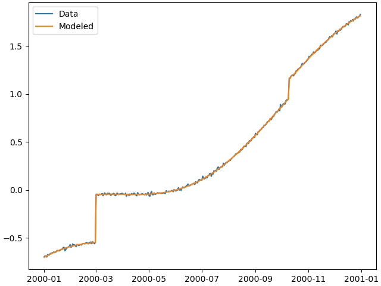
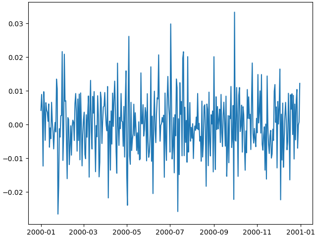
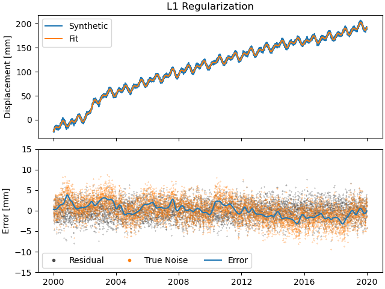
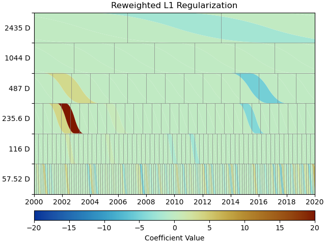
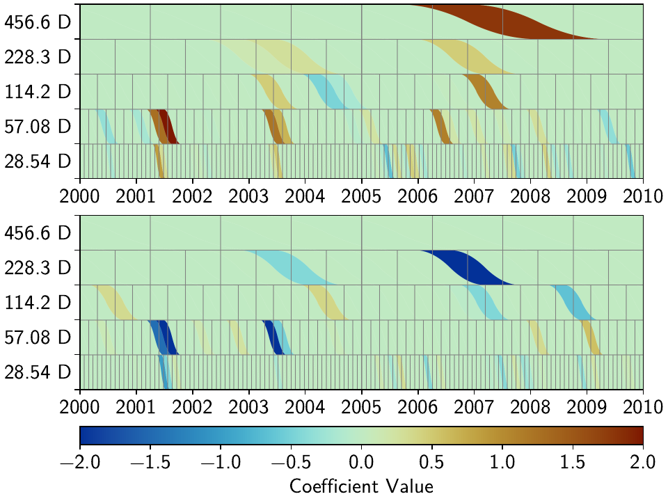
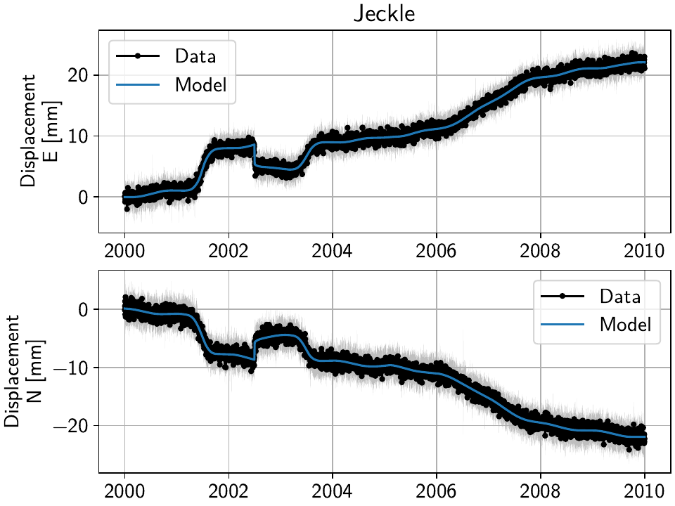
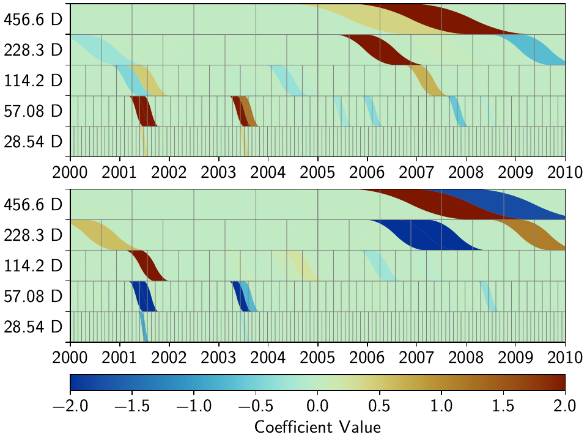

Tutorial
========

1. The first synthetic station
------------------------------

Building a Model collection
...........................

Let's create an empty synthetic station ``"TUT"`` located in Los Angeles using
:class:`~geonat.station.Station`:

.. doctest:: tut1

    >>> from geonat import Station
    >>> synth_stat = Station(name="TUT", location=(34.05, -118.25, 93))

Now, let's create a dictionary of :class:`~geonat.models.Model` objects which we would
like to use to create our synthetic timeseries. We'll start with a linear trend, an annual
sinusoid and some steps.

.. doctest:: tut1

    >>> import numpy as np
    >>> from geonat.models import Polynomial, Sinusoidal, Step
    >>> mdl_secular = Polynomial(order=1, time_unit="D", t_reference="2000-01-01")
    >>> mdl_secular.read_parameters(np.array([-1, 5e-3]))

We can also give the parameters directly to the constructor:

.. doctest:: tut1

    >>> mdl_annual = Sinusoidal(period=365.25, time_unit="D", t_reference="2000-01-01",
    ...                         parameters=np.array([0.3, 0]))
    >>> mdl_steps = Step(steptimes=["2000-03-01", "2000-10-10", "2000-10-15"],
    ...                  parameters=np.array([0.5, 0.2, -0.01]))

Let's combine the models in a dictionary for easy access later.

.. doctest:: tut1

    >>> collection = {"Secular": mdl_secular,
    ...               "Annual": mdl_annual,
    ...               "Steps": mdl_steps}

Next, we need the time span to evaluate our models over. We can use Pandas'
:func:`~pandas.date_range` for this very nicely.

.. doctest:: tut1

    >>> import pandas as pd
    >>> timevector = pd.date_range(start="2000-01-01", end="2000-12-31", freq="1D")

Now, we can evaluate the models, and sum them all up. :meth:`~geonat.models.Model.evaluate`
returns a dictionary and the modeled output can be found in the ``'fit'`` key:

.. doctest:: tut1

    >>> sum_models = np.zeros((timevector.size, 1))
    >>> for model_description, model in collection.items():
    ...     eval = model.evaluate(timevector)
    ...     sum_models += eval["fit"]

Creating Timeseries objects
...........................

A :class:`~geonat.timeseries.Timeseries` can now be created using the data we just
made up, and we can add it to our station:

.. doctest:: tut1

    >>> from geonat import Timeseries
    >>> synth_ts = Timeseries.from_array(timevector=timevector,
    ...                                  data=sum_models,
    ...                                  src="synthetic",
    ...                                  data_unit="m",
    ...                                  data_cols=["total"])
    >>> synth_stat["Data"] = synth_ts

.. note::

    ``synth_stat["Data"] = synth_ts`` is equivalent to
    ``synth_stat.add_timeseries("Data", synth_ts)``.

The ``data_unit``, ``data_cols`` and timeseries name are obviously a bit arbitrary
for synthetic data.

But oh no - we forgot to add noise! We can either

- go back to the beginning, change the ``sum_models`` NumPy array, recreate ``synth_ts``,
  and then replace the the timeseries saved in the station (replacing is just adding a new
  timeseries with an existing name),
- add the noise to the timeseries directly and replace the timeseries saved in the station, or
- just overwrite the timeseries' data.

They are all equivalent, but because the first doesn't show any new code, and the second
is literally just doing ``synth_ts = synth_ts + noise`` (where ``noise`` is a NumPy array
of the same shape as the timeseries), we're going to use the third way for the sake of
the tutorial:

.. doctest:: tut1

    >>> np.random.seed(1)  # make this example reproducible
    >>> noise = np.random.randn(*synth_stat["Data"].shape)*0.01
    >>> synth_stat["Data"].data += noise

Finally, let's have a look at the timeseries we created. GeoNAT provides a straightforward
interface to plot timeseries with Matplotlib::

    >>> import matplotlib.pyplot as plt
    >>> plt.plot(synth_stat["Data"].data)
    >>> plt.savefig("tutorial_1a.png")
    >>> plt.close()

This should give us an output like this:

Fitting the models
..................

We've successfully created a synthetic timeseries for a single station. Now, let's see
if a linear regression solver can estimate the model parameters we originally put
in. To this end, we must first associate our models with the timeseries at the station.

.. doctest:: tut1

    >>> for model_description, model in collection.items():
    ...     synth_stat.add_local_model("Data", model_description, model)

For the fitting, we first import a solver function from the :mod:`~geonat.solvers`
module, and then call it to give us a :class:`~geonat.solvers.Solution` object of
the fitted parameters.
We will start with basic, linear, non-regularized least-squares:

.. doctest:: tut1

    >>> from geonat.solvers import linear_regression
    >>> result = linear_regression(ts=synth_stat["Data"],
    ...                                   models=synth_stat.models["Data"])

.. note::

    Note that in this process, the parameters we set in the beginning will be
    overwritten. If we want to keep them, we can either create the models again
    without giving them parameters, or create a (deep) copy of the model collection.

With the solver finished, we want to do multiple things for all models:

1. Give the models their best-fit parameters as returned by the solver using the
   :meth:`~geonat.models.Model.read_parameters` method.
2. Calculate the clean trajectory for that model given the best-fit parameters using the
   :meth:`~geonat.models.Model.evaluate` method.
3. Add the evaluated trajectory to the station as a "fit" using the
   :meth:`~geonat.station.Station.add_fit` method.

We can do this by looping over the items in ``result``:

.. doctest:: tut1

    >>> for model_description, sol in result.items():
    ...     # save the parameters into the model
    ...     synth_stat.models["Data"][model_description].read_parameters(sol.parameters,
    ...                                                                  sol.variances)
    ...     # evaluate the model given our timevector
    ...     modeled = synth_stat.models["Data"][model_description].evaluate(timevector)
    ...     # add this fit to the station and return the timeseries object
    ...     fit_ts = synth_stat.add_fit(ts_description="Data",
    ...                                 model_description=model_description,
    ...                                 fit=modeled)

Lastly, we want to sum all the modeled timeseries. This can be done by looping
over the ``Station.fits`` dictionary:

.. doctest:: tut1

    >>> for i, model_ts in enumerate(synth_stat.fits["Data"].values()):
    ...     if i == 0:
    ...         model_aggregate = model_ts
    ...     else:
    ...         model_aggregate += model_ts
    >>> synth_stat.add_timeseries(ts_description="Modeled", timeseries=model_aggregate,
    ...                           override_src="model", override_data_cols=synth_ts.data_cols)

.. note::

    It should be pointed out here that this is a lot of code that doesn't need to be
    repeated by the user every time, but is intended to illustrate what is happening
    under the hood. For ease of use, the :class:`~geonat.network.Network` class
    can do all of these things with its two methods :meth:`~geonat.network.Network.fit`
    and :meth:`~geonat.network.Network.evaluate`.

Plotting the fit and residuals
..............................

At this point, we first want to have a look at the fit to see if everything worked
before actually looking at the parameters themselves or residuals. The ``evaluate``
function already created a new timeseries object on the way, which we can now plot::

    >>> plt.plot(synth_stat["Data"].data, label="Data")
    >>> plt.plot(synth_stat["Modeled"].data, label="Modeled")
    >>> plt.legend()
    >>> plt.savefig("tutorial_1b.png")
    >>> plt.close()

As we can see, the model matches the data pretty well:

Lastly, let's calculate the residual and some statistics on it. Timeseries objects
can directly be used in (basic) mathematical operations, with the output being a new
Timeseries object that can be added to the station.

.. doctest:: tut1

    >>> synth_stat["Residual"] = synth_stat["Data"] - synth_stat["Modeled"]
    >>> stats_dict = synth_stat.analyze_residuals(ts_description="Residual",
    ...                                           mean=True, std=True, verbose=True)
    TUT: Residual          Mean  Standard Deviation
    total-total   -6.785812e-15            0.009595

And we can plot it like before::

    >>> plt.plot(synth_stat["Residual"].data)
    >>> plt.savefig("tutorial_1c.png")
    >>> plt.close()

.. note::

    This is very simple plotting. The :class:`~geonat.network.Network` class provides
    some better plotting tools to use with larger networks or stations with more
    timeseries which we will explore later. This is again just intended to show how
    the data is accessible.

2. Advanced Models and Fitting
------------------------------

.. note::

    This tutorial is recreates the basics of the synthetic timeseries example
    as described in Bryan Riel's [riel14]_ paper on detecting geodetic transients.

For this tutorial, we'll be building on and expanding the workflow from the first one.
This time though, we'll first focus a bit more on making the synthetic data, before
creating the station itself.

Creating more complex synthetic data
....................................

Let's start with creating the timestamps for our synthetic data:

.. doctest:: tut2

    >>> import pandas as pd
    >>> t_start_str = "2000-01-01"
    >>> t_end_str = "2020-01-01"
    >>> timevector = pd.date_range(start=t_start_str, end=t_end_str, freq="1D")

Next up is the model collection we're going to use to simulate our data.
This time, we'll be using a Polynomial, Sinusoids and some Arctangents.
If you have any question about this, please refer to the previous tutorial.

.. doctest:: tut2

    >>> from geonat.models import Arctangent, Polynomial, Sinusoidal
    >>> mdl_secular = Polynomial(order=1, t_reference=t_start_str)
    >>> mdl_annual = Sinusoidal(period=365.25, t_reference=t_start_str)
    >>> mdl_semiannual = Sinusoidal(period=365.25/2, t_reference=t_start_str)
    >>> mdl_transient_1 = Arctangent(tau=100, t_reference="2002-07-01")
    >>> mdl_transient_2 = Arctangent(tau=50, t_reference="2010-01-01")
    >>> mdl_transient_3 = Arctangent(tau=300, t_reference="2016-01-01")
    >>> mdl_coll_synth = {"Secular": mdl_secular,
    ...                   "Annual": mdl_annual,
    ...                   "Semi-Annual": mdl_semiannual,
    ...                   "Transient_1": mdl_transient_1,
    ...                   "Transient_2": mdl_transient_2,
    ...                   "Transient_3": mdl_transient_3}

Now, if we give these model objects to our station and perform fitting, their parameters
will be overwritten (it's one of those Python caveats). So, let's take this time here
to create a "deep" copy that we will then use for fitting. (Because fitting Arctangents
is hard, we'll omit them here, and try to approximate them with other models later.)

.. doctest:: tut2

    >>> from copy import deepcopy
    >>> mdl_coll = deepcopy({"Secular": mdl_secular,
    ...                      "Annual": mdl_annual,
    ...                      "Semi-Annual": mdl_semiannual})

Now that we have a copy for safekeeping, we can add the "true" parameters to the models:

.. doctest:: tut2

    >>> import numpy as np
    >>> mdl_secular.read_parameters(np.array([-20, 200/(20*365.25)]))
    >>> mdl_annual.read_parameters(np.array([-5, 0]))
    >>> mdl_semiannual.read_parameters(np.array([0, 5]))
    >>> mdl_transient_1.read_parameters(np.array([40]))
    >>> mdl_transient_2.read_parameters(np.array([-4]))
    >>> mdl_transient_3.read_parameters(np.array([-20]))

We can evaluate them just like before:

.. doctest:: tut2

    >>> sum_seas_sec = mdl_secular.evaluate(timevector)["fit"] \
    ...                + mdl_annual.evaluate(timevector)["fit"] \
    ...                + mdl_semiannual.evaluate(timevector)["fit"]
    >>> sum_transient = mdl_transient_1.evaluate(timevector)["fit"] \
    ...                 + mdl_transient_2.evaluate(timevector)["fit"] \
    ...                 + mdl_transient_3.evaluate(timevector)["fit"]
    >>> sum_all_models = sum_seas_sec + sum_transient

Our noise this time has two components: white and colored. For the white noise,
we can just use NumPy's default functions, but for the colored noise, we have to use
GeoNAT's :func:`~geonat.tools.create_powerlaw_noise` function:

.. doctest:: tut2

    >>> from geonat.tools import create_powerlaw_noise
    >>> rng = np.random.default_rng(0)
    >>> white_noise = rng.normal(scale=2, size=(timevector.size, 1))
    >>> colored_noise = create_powerlaw_noise(size=(timevector.size, 1),
    ...                                       exponent=1.5, seed=0) * 2
    >>> sum_noise = white_noise + colored_noise

Our synthetic data is then just the sum of the ground truth ``sum_all_models``
and the total noise ``sum_noise``:

.. doctest:: tut2

    >>> synth_data = sum_all_models + sum_noise

Let's have a look what we fabricated::

    >>> import matplotlib.pyplot as plt
    >>> from pandas.plotting import register_matplotlib_converters
    >>> register_matplotlib_converters()  # improve how time data looks
    >>> plt.plot(timevector, sum_seas_sec, c='C1', label="Seasonal + Secular")
    >>> plt.plot(timevector, sum_transient, c='k', label="Transient")
    >>> plt.plot(timevector, sum_noise, c='0.5', lw=0.3, label="Noise")
    >>> plt.plot(timevector, synth_data, c='C0', ls='none', marker='.',
    ...          markersize=2, alpha=0.5, label="Synthetic Data")
    >>> plt.xlabel("Time")
    >>> plt.ylim(-50, 250)
    >>> plt.ylabel("Displacement [mm]")
    >>> plt.legend(loc="upper left")
    >>> plt.savefig("tutorial_2a.png")

.. image:: img/tutorial_2a.png

This looks close to the example in [riel14]_. We can see that there are some significant
transients alongside a strong secular signal, and seasonal signals plus the colored
noise make it look a bit more realistic.

Spline models for transients
............................

How do we model the transients though? For this, we will use an over-complete set
of basis functions, built by a collection of integrated B-Splines. For more on that,
see the class documentations for :class:`~geonat.models.BSpline` and
:class:`~geonat.models.ISpline`. There is a simple :class:`~geonat.models.SplineSet`
constructor class that takes care of that for us, which we'll directly add to our
model collection from before:

.. doctest:: tut2

    >>> from geonat.models import ISpline, SplineSet
    >>> mdl_coll["Transient"] = SplineSet(degree=2,
    ...                                   t_center_start=t_start_str,
    ...                                   t_center_end=t_end_str,
    ...                                   list_num_knots=[4, 8, 16, 32, 64, 128],
    ...                                   splineclass=ISpline)

It creates sets of integrated B-Splines of degree 2, with the timespan
covered to be that of our synthetic timeseries, and then divided into 4, 8, etc.
subintervals. The ``splineclass`` parameter only makes it clear that we want a set of
:class:`~geonat.models.ISpline`, but we could have omitted it, as it's the default
behavior.

Building a Network
..................

Now, we're ready to build our synthetic network and add our generated data.
Again, we start by creating a :class:`~geonat.station.Station` object, but this time,
we'll also assign it to a :class:`~geonat.network.Network` object:

.. doctest:: tut2

    >>> from geonat import Network, Station, Timeseries
    >>> net_name = "TutorialLand"
    >>> stat_name = "TUT"
    >>> caltech_lla = (34.1375, -118.125, 263)
    >>> net = Network(name=net_name)
    >>> stat = Station(name=stat_name,
    ...                location=caltech_lla)
    >>> net[stat_name] = stat

.. note::
    Note that the stations internal name :attr:`~geonat.station.Station.name` does not
    have to match the network's name of that station in
    :class:`~geonat.network.Network.stations`, but it avoids confusion.

    ``net[stat_name] = synth_stat`` is equivalent to
    ``net.add_station(stat_name, synth_stat)``.

Add the generated timeseries (including models), as well as the ground truth
to the station:

.. doctest:: tut2

    >>> ts = Timeseries.from_array(timevector=timevector,
    ...                            data=synth_data,
    ...                            src="synthetic",
    ...                            data_unit="mm",
    ...                            data_cols=["Total"])
    >>> truth = Timeseries.from_array(timevector=timevector,
    ...                               data=sum_all_models,
    ...                               src="synthetic",
    ...                               data_unit="mm",
    ...                               data_cols=["Total"])
    >>> stat["Displacement"] = ts
    >>> stat["Truth"] = truth
    >>> stat.add_local_model_dict(ts_description="Displacement",
    ...                           model_dict=mdl_coll)

Fitting an entire network
.........................

At this point, we're ready to do the fitting using the simple linear non-regularized
least-squares we used in the previous tutorial:

.. doctest:: tut2

    >>> net.fit(ts_description="Displacement", solver="linear_regression")
    >>> net.evaluate(ts_description="Displacement", output_description="Fit_noreg")

We saved a lot of lines and hassle compared to the previous fitting by using the
:class:`~geonat.network.Network` methods. Let's calculate the residuals and errors,
and print some statistics:

.. doctest:: tut2

    >>> stat["Res_noreg"] = stat["Displacement"] - stat["Fit_noreg"]
    >>> stat["Err_noreg"] = stat["Fit_noreg"] - stat["Truth"]
    >>> _ = stat.analyze_residuals(ts_description="Res_noreg",
    ...                            mean=True, std=True, verbose=True)
    TUT: Res_noreg          Mean  Standard Deviation
    Total-Total     8.302148e-09            2.046006

Advanced plotting
.................

What do our fit, residuals (between the observations and our fit) and errors
(between the fit and the true displacement signal) look like compared to the
data and noise? ::

    >>> from matplotlib.lines import Line2D
    >>> fig, ax = plt.subplots(nrows=2, sharex=True)
    >>> ax[0].plot(stat["Displacement"].data, label="Synthetic")
    >>> ax[0].plot(stat["Fit_noreg"].data, label="Fit")
    >>> ax[0].set_ylim(-50, 250)
    >>> ax[0].set_ylabel("Displacement [mm]")
    >>> ax[0].legend(loc="upper left")
    >>> ax[0].set_title("No Regularization")
    >>> ax[1].plot(stat["Res_noreg"].data, c='0.3', ls='none',
    ...         marker='.', markersize=0.5)
    >>> ax[1].plot(stat["Err_noreg"].time, sum_noise, c='C1', ls='none',
    ...         marker='.', markersize=0.5)
    >>> ax[1].plot(stat["Err_noreg"].data, c="C0")
    >>> ax[1].set_ylim(-15, 15)
    >>> ax[1].set_ylabel("Error [mm]")
    >>> custom_lines = [Line2D([0], [0], c="0.3", marker=".", linestyle='none'),
    ...                 Line2D([0], [0], c="C1", marker=".", linestyle='none'),
    ...                 Line2D([0], [0], c="C0")]
    >>> ax[1].legend(custom_lines, ["Residual", "True Noise", "Error"],
    ...             loc="lower left", ncol=3)
    >>> fig.savefig("tutorial_2b.png")

.. image:: img/tutorial_2b.png

.. note::

    As expected with any regular least-squares minimization, the residuals look like a
    zero-mean Gaussian distribution. The true noise, plotted for comparison, contains
    colored noise, and therefore is not Gaussian. Because our solver has no way of
    knowing what is true noise and small transient signals, it assumes that all the
    transient it sees are part of the displacement signal to fit. Therefore, our
    error tracks the noise. This behaviour will not change significantly throughout
    this second tutorial, but will be addressed in the third tutorial.

We can use a scalogram (see :meth:`~geonat.models.SplineSet.make_scalogram`) to visualize
the coefficient values of our spline collection, and quickly understand that without
regularization, the set is quite heavily populated in order to minimize the residuals::

    >>> fig, ax = stat.models["Displacement"]["Transient"].make_scalogram(t_left=t_start_str,
    ...                                                                   t_right=t_end_str,
    ...                                                                   cmaprange=20)
    >>> ax[0].set_title("No Regularization")
    >>> fig.savefig("tutorial_2c.png")

.. image:: img/tutorial_2c.png

Repeat with L2 regularization
.............................

Now, we can do the exact same thing as above, but choose a ridge regression (L2-regularized)
solver:

.. doctest:: tut2

    >>> net.fit(ts_description="Displacement", solver="ridge_regression", penalty=10)
    >>> net.evaluate(ts_description="Displacement", output_description="Fit_L2")
    >>> stat["Res_L2"] = stat["Displacement"] - stat["Fit_L2"]
    >>> stat["Err_L2"] = stat["Fit_L2"] - stat["Truth"]
    >>> _ = stat.analyze_residuals(ts_description="Res_L2",
    ...                            mean=True, std=True, verbose=True)
    TUT: Res_L2          Mean  Standard Deviation
    Total-Total  1.495277e-09            2.087589

::

    >>> fig, ax = plt.subplots(nrows=2, sharex=True)
    >>> ax[0].plot(stat["Displacement"].data, label="Synthetic")
    >>> ax[0].plot(stat["Fit_L2"].data, label="Fit")
    >>> ax[0].set_ylabel("Displacement [mm]")
    >>> ax[0].legend(loc="upper left")
    >>> ax[0].set_title("L2 Regularization")
    >>> ax[1].plot(stat["Res_L2"].data, c='0.3', ls='none',
    ...         marker='.', markersize=0.5)
    >>> ax[1].plot(stat["Err_L2"].time, sum_noise, c='C1', ls='none',
    ...         marker='.', markersize=0.5)
    >>> ax[1].plot(stat["Err_L2"].data, c="C0")
    >>> ax[1].set_ylim(-15, 15)
    >>> ax[1].set_ylabel("Error [mm]")
    >>> custom_lines = [Line2D([0], [0], c="0.3", marker=".", linestyle='none'),
    ...                 Line2D([0], [0], c="C1", marker=".", linestyle='none'),
    ...                 Line2D([0], [0], c="C0")]
    >>> ax[1].legend(custom_lines, ["Residual", "True Noise", "Error"],
    ...             loc="lower left", ncol=3)
    >>> fig.savefig("tutorial_2d.png")

.. image:: img/tutorial_2d.png

::

    >>> fig, ax = stat.models["Displacement"]["Transient"].make_scalogram(t_left=t_start_str,
    ...                                                                   t_right=t_end_str,
    ...                                                                   cmaprange=20)
    >>> ax[0].set_title("L2 Regularization")
    >>> fig.savefig("tutorial_2e.png")

.. image:: img/tutorial_2e.png

We can see that L2 regularization has significantly reduced the magnitude of the splines
used in the fitting, and the fit overall (see the residual statistics) appears to be
better. However, most splines are actually non-zero. This might produced the best fit,
but our physical knowledge of the processes happening tell us that our station is not
always moving - there are discrete processes. A higher penalty parameter might make
those parameters even smaller, but they will not become significantly sparser.

Repeat with L1 regularization
.............................

Using L1-regularized lasso regression, we finally hope to get rid of all the small,
basically-zero splines in the transient dictionary:

.. doctest:: tut2

    >>> net.fit(ts_description="Displacement", solver="lasso_regression", penalty=10)
    >>> net.evaluate(ts_description="Displacement", output_description="Fit_L1")
    >>> stat["Res_L1"] = stat["Displacement"] - stat["Fit_L1"]
    >>> stat["Err_L1"] = stat["Fit_L1"] - stat["Truth"]
    >>> _ = stat.analyze_residuals(ts_description="Res_L1",
    ...                            mean=True, std=True, verbose=True)
    TUT: Res_L1      Mean  Standard Deviation
    Total-Total  0.000003            2.121952

::

    >>> fig, ax = plt.subplots(nrows=2, sharex=True)
    >>> ax[0].plot(stat["Displacement"].data, label="Synthetic")
    >>> ax[0].plot(stat["Fit_L1"].data, label="Fit")
    >>> ax[0].set_ylabel("Displacement [mm]")
    >>> ax[0].legend(loc="upper left")
    >>> ax[0].set_title("L1 Regularization")
    >>> ax[1].plot(stat["Res_L1"].data, c='0.3', ls='none',
    ...         marker='.', markersize=0.5)
    >>> ax[1].plot(stat["Err_L1"].time, sum_noise, c='C1', ls='none',
    ...         marker='.', markersize=0.5)
    >>> ax[1].plot(stat["Err_L1"].data, c="C0")
    >>> ax[1].set_ylim(-15, 15)
    >>> ax[1].set_ylabel("Error [mm]")
    >>> custom_lines = [Line2D([0], [0], c="0.3", marker=".", linestyle='none'),
    ...                 Line2D([0], [0], c="C1", marker=".", linestyle='none'),
    ...                 Line2D([0], [0], c="C0")]
    >>> ax[1].legend(custom_lines, ["Residual", "True Noise", "Error"],
    ...             loc="lower left", ncol=3)
    >>> fig.savefig("tutorial_2f.png")

::

    >>> fig, ax = stat.models["Displacement"]["Transient"].make_scalogram(t_left=t_start_str,
    ...                                                                   t_right=t_end_str,
    ...                                                                   cmaprange=20)
    >>> ax[0].set_title("L1 Regularization")
    >>> fig.savefig("tutorial_2g.png")

.. image:: img/tutorial_2g.png

This looks much better - the scalogram now shows us that we only select splines around
where we put the Arctangent models, and is close to zero otherwise.

Adding reweighting iterations
.............................

Okay, one last thing about fitting, I promise. L1 regularization aims to penalize the sum of
the absolute values of our model parameters. However, that's also not actually what we want.
In fact, transient signals in the real world have no constraint to be as small as possible.
However, the *number* of transients should be the one that is minimized. That is what is
mathematically referred to as L0 regularization, but is sadly not an easy problem to solve
rigorously.

However, by modifying an additional weight of each regularized parameter, that drives small
values even closer to zero, but leaves significant values unperturbed, one can approximate
such an L0 regularization by iteratively solving the L1-regularized problem. That is exactly
what the option ``reweight_max_iters`` does. You can find more information about it in
the notes of :func:`~geonat.solvers.lasso_regression`. Let's try it:

.. doctest:: tut2

    >>> net.fit(ts_description="Displacement", solver="lasso_regression",
    ...         penalty=10, reweight_max_iters=10)
    >>> net.evaluate(ts_description="Displacement", output_description="Fit_L1R")
    >>> stat["Res_L1R"] = stat["Displacement"] - stat["Fit_L1R"]
    >>> stat["Err_L1R"] = stat["Fit_L1R"] - stat["Truth"]
    >>> _ = stat.analyze_residuals(ts_description="Res_L1R",
    ...                            mean=True, std=True, verbose=True)
    TUT: Res_L1R      Mean  Standard Deviation
    Total-Total  -0.000001            2.119665

::

    >>> fig, ax = plt.subplots(nrows=2, sharex=True)
    >>> ax[0].plot(stat["Displacement"].data, label="Synthetic")
    >>> ax[0].plot(stat["Fit_L1R"].data, label="Fit")
    >>> ax[0].set_ylabel("Displacement [mm]")
    >>> ax[0].legend(loc="upper left")
    >>> ax[0].set_title("Reweighted L1 Regularization")
    >>> ax[1].plot(stat["Res_L1R"].data, c='0.3', ls='none',
    ...         marker='.', markersize=0.5)
    >>> ax[1].plot(stat["Err_L1R"].time, sum_noise, c='C1', ls='none',
    ...         marker='.', markersize=0.5)
    >>> ax[1].plot(stat["Err_L1R"].data, c="C0")
    >>> ax[1].set_ylim(-15, 15)
    >>> ax[1].set_ylabel("Error [mm]")
    >>> custom_lines = [Line2D([0], [0], c="0.3", marker=".", linestyle='none'),
    ...                 Line2D([0], [0], c="C1", marker=".", linestyle='none'),
    ...                 Line2D([0], [0], c="C0")]
    >>> ax[1].legend(custom_lines, ["Residual", "True Noise", "Error"],
    ...             loc="lower left", ncol=3)
    >>> fig.savefig("tutorial_2h.png")

.. image:: img/tutorial_2h.png

::

    >>> fig, ax = stat.models["Displacement"]["Transient"].make_scalogram(t_left=t_start_str,
    ...                                                                   t_right=t_end_str,
    ...                                                                   cmaprange=20)
    >>> ax[0].set_title("Reweighted L1 Regularization")
    >>> fig.savefig("tutorial_2i.png")

As you can see, the significant components of the splines have now been emphasized when
compared to the previous scalogram, and all the values that were small but not really
zero in the previous case are now *really* close to zero.

Comparing specific parameters
.............................

Before we finish up, let's just print some differences between the ground truth and our
L1R-fitted model:

.. doctest:: tut2

    >>> reldiff_sec = (mdl_coll_synth["Secular"].parameters
    ...                / stat.models["Displacement"]["Secular"].parameters).ravel() - 1
    >>> reldiff_ann_amp = mdl_coll_synth["Annual"].amplitude \
    ...                   / stat.models["Displacement"]["Annual"].amplitude - 1
    >>> reldiff_sem_amp = mdl_coll_synth["Semi-Annual"].amplitude \
    ...                   / stat.models["Displacement"]["Semi-Annual"].amplitude - 1
    >>> absdiff_ann_ph = mdl_coll_synth["Annual"].phase \
    ...                   - stat.models["Displacement"]["Annual"].phase
    >>> absdiff_sem_ph = mdl_coll_synth["Semi-Annual"].phase \
    ...                   - stat.models["Displacement"]["Semi-Annual"].phase
    >>> print(f"Percent Error Constant:              {reldiff_sec[0]: %}\n"
    ...       f"Percent Error Linear:                {reldiff_sec[1]: %}\n"
    ...       f"Percent Error Annual Amplitude:      {reldiff_ann_amp: %}\n"
    ...       f"Percent Error Semi-Annual Amplitude: {reldiff_sem_amp: %}\n"
    ...       f"Absolute Error Annual Phase:         {absdiff_ann_ph: f} rad\n"
    ...       f"Absolute Error Semi-Annual Phase:    {absdiff_sem_ph: f} rad")
    Percent Error Constant:              -34.870393%
    Percent Error Linear:                 14.251579%
    Percent Error Annual Amplitude:      -1.046252%
    Percent Error Semi-Annual Amplitude: -0.037603%
    Absolute Error Annual Phase:          0.019479 rad
    Absolute Error Semi-Annual Phase:    -0.017371 rad

Apart from the trade-off between the polynomial trend and long-term splines, which can be
expected in this synthetic example, we got pretty close to our ground truth. Let's finish
up by calculating an average velocity of the station using
:meth:`~geonat.station.Station.get_trend` around the time when it's rapidly moving
(around the middle of 2002). We don't want a normal trend through the data, since that
is also influenced by the secular velocity, the noise, etc., so we choose to only fit our
transient model:

.. doctest:: tut2

    >>> trend, _ = stat.get_trend("Displacement", model_list=["Transient"],
    ...                           t_start="2002-06-01", t_end="2002-08-01")
    >>> print(f"Transient Velocity: {trend[0]:f} {ts.data_unit}/D")
    Transient Velocity: 0.120261 mm/D

We can use average velocities like these when we want to create velocity maps for
certain episodes.

3. Incorporating Spatial Coherence
----------------------------------

One of the main goals of GeoNAT that should make it stand out from other timeseries analysis
software/routines is its ability to use spatial coherence as an additional source of
information and constrain. In general, signals like earthquakes, slip events, or seasonal
signals are spatially correlated, as the process have the same sources but affect multiple
stations. By using this knowledge in combination with the enforcement of sparsity, we can
make sure that the models that affect each station have the same character.

On the flipside, signals that only affect a single station are usually noise (like antenna
maintenance), which we would like to isolate. By making it harder for a station to fit a model
when no station around it sees the same signal, its residuals will become very large around
the time in question, and it is easier to therefore detect processes that need to be looked at
(or fitted specifically for that station).

In this tutorial, we will therefore create a synthetic network of 16 stations, seeing two
data components (East and North) each, that are affected by both regional processes (slow slip
events, an earthquake, and seasonal variations) as well as local ones (a maintenance step
and some loca colored noise).
We will assess the incorporation of spatial coherence on a station-by-station basis (misfit
at the station with the singular maintenance step) as well as over the entire network
(by looking at the parameter correlation matrix between stations). The fitting and
evaluating will be done in parallel to achieve a significant speed-up.

.. note::
    By default, GeoNAT does not use parallelization because of the intricacies
    between Python, NumPy/SciPy, and the low-level math libraries like BLAS/LAPACK
    (which can differ from machine to machine). For more information, including how
    to properly set up parallelization, see :func:`~geonat.tools.parallelize`.

Preparations
............

We need to prepare two things: parallelization (which can differ from the machine used to
test this tutorial to yours, see the ntoe above) and a random number seed to make the data
and figures reproducible.
In this case here, setting the environment variable ``'OMP_NUM_THREADS'``
in the script does the trick, and we can set the number of threads manually:

.. doctest:: tut3

    >>> import os
    >>> os.environ['OMP_NUM_THREADS'] = '1'
    >>> import geonat
    >>> geonat.defaults["general"]["num_threads"] = 10

And we can create a random number generator just like in the previous example:

.. doctest:: tut3

    >>> import numpy as np
    >>> rng = np.random.default_rng(0)

Dreaming up a network
.....................

The network we're dreaming of is a collection of 16 stations situated on the beautiful
`Null Island <https://en.wikipedia.org/wiki/Null_Island>`_. There is no reason the
stations shouldn't be named after fake kitten names created by a neural network of
`AI Weirdness <https://aiweirdness.com/post/162396324452/neural-networks-kittens>`_.
So, let's create the locations on a line-like grid with some random variations,
instantiate a :class:`~geonat.network.Network` object, and add the corresponding
:class:`~geonat.station.Station` objects:

.. doctest:: tut3

    >>> from geonat import Network, Station
    >>> net_name = "NullIsland"
    >>> station_names = ["Jeckle", "Cylon", "Marper", "Timble",
    ...                  "Macnaw", "Colzyy", "Mrror", "Mankith",
    ...                  "Lingo", "Marvish", "Corko", "Kogon",
    ...                  "Malool", "Aarla", "Tygrar", "Jozga"]
    >>> nlon, nlat = 16, 1
    >>> num_stations = nlon * nlat
    >>> lons, lats = np.meshgrid(np.linspace(0, 1, num=nlon),
    ...                          np.linspace(-0.1, 0.1, num=nlat))
    >>> net = Network(name=net_name)
    >>> for (istat, stat_name), lon, lat in zip(enumerate(station_names),
    ...                                         lons.ravel(), lats.ravel()):
    ...     temp_loc = [lat + rng.normal()*0.02 + int(istat % 2 == 0)*0.1,
    ...                 lon + rng.normal()*0.01, 0]
    ...     net[stat_name] = Station(name=stat_name,
    ...                              location=temp_loc)

Fantasizing data
................

Just as above, we first need a vector of time stamps:

.. doctest:: tut3

    >>> import pandas as pd
    >>> t_start_str = "2000-01-01"
    >>> t_end_str = "2010-01-01"
    >>> timevector = pd.date_range(start=t_start_str, end=t_end_str, freq="1D")

Remember that we wanted signals that are coherent in space. To do this, it is easiest
if we define a function that takes the location of a station as input, and returns
model parameters (for both the East and North components). That way, every station gets
the same signals, but we can vary the amplitudes to simulate decreasing distance to
the signal source by making the amplitude drop off with increasing longitude.
The model parameters are then used in the next step when the model objects are created.

.. doctest:: tut3

    >>> def generate_common_truth(loc, rng):
    ...     lon, lat = loc[1], loc[0]
    ...     p_sec = np.array([[0, 0], [1, -1]])
    ...     p_seas = rng.uniform(-0.1, 0.1, size=(2, 2))
    ...     p_sse1 = np.array([[8, -8]])*np.exp(-(4 * lon**2))
    ...     p_sse2 = np.array([[6, -6]])*np.exp(-(4 * lon**2))
    ...     p_sse3 = np.array([[10, -10]])*np.exp(-(4 * lon**2))
    ...     p_eq = np.array([[-5, 5]])
    ...     return p_sec, p_seas, p_eq, p_sse1, p_sse2, p_sse3

Now, we have to do the (slightly grueling) work of creating synthetic data, creating
model and timeseries objects, assigning the parameters to them, and then add them
to the station objects of the network - basically what we did in the previous tutorial,
but for *every station*. The following code is a bit much, but should still be
understandable when comparing side-by-side with the previous, single-station
example.

.. doctest:: tut3

    >>> from copy import deepcopy
    >>> from geonat import Timeseries
    >>> from geonat.models import Arctangent, Polynomial, Sinusoidal, Step, SplineSet
    >>> from geonat.tools import create_powerlaw_noise
    >>> mdl_coll, mdl_coll_synth = {}, {}  # containers for the model objects
    >>> synth_coll = {}  # dictionary of synthetic data & noise for each stations
    >>> for station in net:
    ...     # think of some model parameters
    ...     p_sec, p_seas, p_eq, p_sse1, p_sse2, p_sse3 = \
    ...         generate_common_truth(station.location, rng)
    ...     # create model objects
    ...     mdl_sec = Polynomial(order=1, time_unit="Y", t_reference=t_start_str)
    ...     mdl_seas = Sinusoidal(period=1, time_unit="Y", t_reference=t_start_str)
    ...     mdl_eq = Step(["2002-07-01"])
    ...     # Arctangent is for the truth, SplineSet are for how we will estimate them
    ...     mdl_sse1 = Arctangent(tau=40, t_reference="2001-07-01")
    ...     mdl_sse2 = Arctangent(tau=40, t_reference="2003-07-01")
    ...     mdl_sse3 = Arctangent(tau=400, t_reference="2007-01-01")
    ...     # we could align the Arctangents with the spline center times
    ...     # (e.g. 2001-07-24, 2003-06-09, 2007-07-02) but that would never happen in
    ...     # real life so it would just unrealistically embellish our results
    ...     mdl_trans = SplineSet(degree=2,
    ...                         t_center_start=t_start_str,
    ...                         t_center_end=t_end_str,
    ...                         list_num_knots=[int(1+2**n) for n in range(3, 8)])
    ...     # collect the models in the dictionary
    ...     mdl_coll_synth[station.name] = {"Secular": mdl_sec,
    ...                                     "Seasonal": mdl_seas,
    ...                                     "Earthquake": mdl_eq}
    ...     mdl_coll[station.name] = deepcopy(mdl_coll_synth[station.name])
    ...     mdl_coll_synth[station.name].update({"SSE1": mdl_sse1,
    ...                                         "SSE2": mdl_sse2,
    ...                                         "SSE3": mdl_sse3})
    ...     mdl_coll[station.name].update({"Transient": mdl_trans})
    ...     # only the model objects that will not be associated with the station
    ...     # get their model parameters input
    ...     mdl_sec.read_parameters(p_sec)
    ...     mdl_seas.read_parameters(p_seas)
    ...     mdl_eq.read_parameters(p_eq)
    ...     mdl_sse1.read_parameters(p_sse1)
    ...     mdl_sse2.read_parameters(p_sse2)
    ...     mdl_sse3.read_parameters(p_sse3)
    ...     # now, evaluate the models
    ...     # noise will be white + colored
    ...     gen_data = \
    ...         {"seas+sec+step": (mdl_sec.evaluate(timevector)["fit"] +
    ...                         mdl_seas.evaluate(timevector)["fit"] +
    ...                         mdl_eq.evaluate(timevector)["fit"]),
    ...         "trans": (mdl_sse1.evaluate(timevector)["fit"] +
    ...                 mdl_sse2.evaluate(timevector)["fit"] +
    ...                 mdl_sse3.evaluate(timevector)["fit"]),
    ...         "noise": rng.normal(size=(timevector.size, 2))*0.5}
    ...     # for one station, we'll add a significant colored noise process
    ...     # but only after the first third, where there are no strong, short-term signals
    ...     if station.name == "Cylon":
    ...         gen_data["noise"][timevector.size//3:, :] += \
    ...             create_powerlaw_noise(size=(2 * timevector.size // 3, 2),
    ...                                 exponent=1.5, seed=rng)*0.4
    ...     # for one special station, we add the maintenance step
    ...     # repeating all steps above
    ...     if station.name == "Corko":
    ...         # time and amplitude
    ...         mdl_maint = Step(["2005-01-01"])
    ...         p_maint = np.array([[-5, 0]])
    ...         # add to station and synthetic data
    ...         mdl_coll_synth[station.name].update({"Maintenance": mdl_maint})
    ...         mdl_maint.read_parameters(p_maint)
    ...         gen_data["seas+sec+step"] += mdl_maint.evaluate(timevector)["fit"]
    ...     # now we sum the components up...
    ...     gen_data["truth"] = gen_data["seas+sec+step"] + gen_data["trans"]
    ...     gen_data["data"] = gen_data["truth"] + gen_data["noise"]
    ...     synth_coll[station.name] = gen_data
    ...     # ... and assign them to the station as timeseries objects
    ...     station["Truth"] = \
    ...         Timeseries.from_array(timevector=timevector,
    ...                             data=gen_data["truth"],
    ...                             src="synthetic",
    ...                             data_unit="mm",
    ...                             data_cols=["E", "N"])
    ...     station["Displacement"] = \
    ...         Timeseries.from_array(timevector=timevector,
    ...                             data=gen_data["data"],
    ...                             src="synthetic",
    ...                             data_unit="mm",
    ...                             data_cols=["E", "N"])
    ...     # finally, we give the station the models to fit
    ...     station.add_local_model_dict(ts_description="Displacement",
    ...                                 model_dict=mdl_coll[station.name])

Let's have a look at the summary of the first station to see what we added:

.. doctest:: tut3

    >>> print(net["Jeckle"])
    Station Jeckle at [0.0025146044218678637, -0.0013210486329130189, 0] with timeseries
    Truth
     - Source: synthetic
     - Units: mm
     - Shape: (3654, 2)
     - Data: ['E', 'N']
    Displacement
     - Source: synthetic
     - Units: mm
     - Shape: (3654, 2)
     - Data: ['E', 'N']
     - Models: ['Secular', 'Seasonal', 'Earthquake', 'Transient']

One can also have a look at an interactive map and inspect the data and models
of the stations using :meth:`~geonat.network.Network.gui`::

    >>> net.gui()

Which will present the following map:

.. image:: img/tutorial_3a_map.png

Then, selecting the first station called "Jeckle" will produce the following plot
of all timeseries associated with that station, ``'Truth'`` and the noisy
``'Displacement'``, in both East and North components:

.. image:: img/tutorial_3b_ts_Jeckle.png

For this station, the signal is obviously much larger than the noise, but if you
select stations further east, you'll see how the noise becomes the more dominant
part. How well we can recover the original signal can therefore be tested by looking
at all stations from west to east.

The figures above can either be saved from the interactive window, or by running
:meth:`~geonat.network.Network.gui` in a non-interactive mode::

    >>> net.gui(station="Jeckle", save=True, save_map=True)

Fitting the data using reweighted L1 regularization
...................................................

We'll basically do the same processing as at the end of the previous tutorial, but make
use of yet another high-level function to reduce the amount of lines we have to write:
:meth:`~geonat.network.Network.fitevalres`, which combines the two functions
:meth:`~geonat.network.Network.fit` and :meth:`~geonat.network.Network.evaluate` and
also calculates the residual using :meth:`~geonat.network.Network.math`.
We'll start with a single, non-iterative L1-regularized solution:

.. doctest:: tut3

    >>> import cvxpy as cp
    >>> net.fitevalres(ts_description="Displacement", solver="lasso_regression",
    ...                penalty=10, output_description="Fit_L1", residual_description="Res_L1")

We'll also calculate the true errors that we only know because we created the data ourselves
(we'll use them later):

.. doctest:: tut3

    >>> net.math("Err_L1", "Fit_L1", "-", "Truth")

For this solution and the future ones which will be exploting the spatial structure,
we want to continuously compare the fitted timeseries as well as the scalograms of
the Transient model. So let's decide on some potentially interesting stations, and
use the :meth:`~geonat.network.Network.gui` function to save some plots::

    >>> figure_stations = ["Jeckle", "Cylon", "Marvish", "Corko", "Tygrar", "Jozga"]
    >>> for s in figure_stations:
    ...     net.gui(station=s, save="base",
    ...             timeseries=["Displacement", "Res_L1"],
    ...             scalogram_kw_args={"ts": "Displacement", "model": "Transient",
    ...                                "cmaprange": 2})

Now, let's have a look at the two most western stations, "Jeckle" and "Cylon":

|3c_scalo_Jeckle_base| |3c_ts_Jeckle_base|

|3c_scalo_Cylon_base| |3c_ts_Cylon_base|

.. |3c_scalo_Jeckle_base| image:: img/tutorial_3c_scalo_Jeckle_base.png
    :width: 49%

.. |3c_ts_Jeckle_base| image:: img/tutorial_3c_ts_Jeckle_base.png
    :width: 49%

.. |3c_ts_Cylon_base| image:: img/tutorial_3c_ts_Cylon_base.png
    :width: 49%

While in all cases the models fit the data well, one can observe two things.

First, for the time that we added colored noise to "Cylon", just as in the previous
tutorial, the transients created by the noise are fit by our spline dictionary.

Second, especially for the time without the colored noise, we can see that apart from a couple
splines that are the closest in time and period to the true slow slip events (SSEs)
arctangents, most splines that are non-zero in one station are (close to) zero at the other,
even though we know that both stations experience the same signal (only with a slightly
varying amplitude).

To make this assessment a bit more quantitative, let's get some key numbers that define
the sparsity of the model dictionary across the network.
We want to set a threshold below which we consider a parameter "basically zero".
Then, for each solution we produce, we want to know how many parameters across the entire
network are non-zero, and how many unique non-zero parameters there are (i.e., if a spline
is used at multiple stations, we'll only count it once). For this, we set the ``eps`` variable,
and count the number of total, non-zero, and unique non-zero parameters:

.. doctest:: tut3

    >>> eps = 1e-4  # this is from the default in lasso_regression
    >>> num_total = sum([s.models["Displacement"]["Transient"].parameters.size for s in net])
    >>> num_uniques = \
    ...     np.sum(np.any(np.stack([np.abs(s.models["Displacement"]["Transient"].parameters)
    ...                             > eps for s in net]), axis=0), axis=0)
    >>> num_nonzero = sum([(s.models["Displacement"]["Transient"].parameters.ravel() > eps).sum()
    ...                    for s in net])
    >>> print(f"Number of reweighted non-zero parameters: {num_nonzero}/{num_total}")
    Number of reweighted non-zero parameters: 487/8736
    >>> print("Number of unique reweighted non-zero parameters per component: "
    ...       + str(num_uniques.tolist()))
    Number of unique reweighted non-zero parameters per component: [109, 116]

Let's keep track of these numbers: All 16 stations (and both components) combined are
fit by 487 splines (out of the total possible 8736). Of a total of 546 possible splines
at any given station (including both components), 109 in the East and 116 in the North
component are non-zero at least at one station. That is not terribly sparse for three
slow-slip events (SSEs) (keep in mind that the earthquake and the seasonal signal shouldn't
be fit by the splines).

This effectively means that wherever there is not a strong enough signal, the solver will
follow the noise realization at that station to fit the data best given the L1 penalty,
and therefore choose slightly different splines each time.
If we could somehow let the solver know that this is noise, and that the underlying
signal should be coherent in space, it wouldn't overfit the data where there is no signal,
and we would have a better understanding of both the true signal and the noise.

(*Something else that we will have a look at later, but for now just need to save the data,
is the spatial correlation between the fitted transients - more details about that later,
but for now, let's just save the data:*)

.. doctest:: tut3

    >>> cor_base = \
    ...     np.corrcoef(np.stack([s.fits["Displacement"]["Transient"].data.values[:, 1]
    ...                           for s in net]))

Using L1 iteration at each station independently (=locally) does not solve the problem,
either, but let's still have a look at the same two stations when we add that:

.. doctest:: tut3

    >>> net.fitevalres(ts_description="Displacement", solver="lasso_regression",
    ...                penalty=10, reweight_max_iters=5,
    ...                output_description="Fit_L1R5", residual_description="Res_L1R5")
    >>> net.math("Err_L1R5", "Fit_L1R5", "-", "Truth")
    >>> # get spatial correlation matrix for later
    >>> cor_localiters = \
    ...     np.corrcoef(np.stack([s.fits["Displacement"]["Transient"].data.values[:, 1]
    ...                           for s in net]))
    >>> num_total = sum([s.models["Displacement"]["Transient"].parameters.size for s in net])
    >>> num_uniques = \
    ...     np.sum(np.any(np.stack([np.abs(s.models["Displacement"]["Transient"].parameters)
    ...                             > eps for s in net]), axis=0), axis=0)
    >>> num_nonzero = sum([(s.models["Displacement"]["Transient"].parameters.ravel() > eps).sum()
    ...                    for s in net])
    >>> print(f"Number of reweighted non-zero parameters: {num_nonzero}/{num_total}")
    Number of reweighted non-zero parameters: 260/8736
    >>> print("Number of unique reweighted non-zero parameters per component: "
    ...       + str(num_uniques.tolist()))
    Number of unique reweighted non-zero parameters per component: [92, 90]

Which gives the following figures (see the plotting code above):

|3c_scalo_Jeckle_local| |3c_ts_Jeckle_local|

|3c_scalo_Cylon_local| |3c_ts_Cylon_local|

.. |3c_scalo_Jeckle_local| image:: img/tutorial_3c_scalo_Jeckle_local.png
    :width: 49%

.. |3c_ts_Jeckle_local| image:: img/tutorial_3c_ts_Jeckle_local.png
    :width: 49%

.. |3c_scalo_Cylon_local| image:: img/tutorial_3c_scalo_Cylon_local.png
    :width: 49%

.. |3c_ts_Cylon_local| image:: img/tutorial_3c_ts_Cylon_local.png
    :width: 49%

While the total number of non-zero splines decreased by almost half, the number of
*unique* non-zero splines barely decreased.

Unless we want to create one giant least-squares L1-regularized problem that combines
all stations, and giving the spline parameters a distance-dependent covariance matrix
between the stations (which is computationally still unfeasible for any real regional
network), we need to think of a better way.

Fitting the data using a spatially-aware L1 reweighting
.......................................................

[riel14]_ solves the problem by alternating between a station-specific solution, and a step
where the parameter weights of each L1-regularized problems are gathered, compared, and
updated based on a weighting scheme. In GeoNAT, this is handled by the
:class:`~geonat.solvers.SpatialSolver` class, where more information about its algorithm
can be found. In this tutorial, we just want to show how it is used and how it can improve
the quality of the fit.

First, we create a solver object for our network (``net``) and the timeseries we're looking
at (``'Displacement'``) that will be used for the next couple of solution calls:

.. doctest:: tut3

    >>> from geonat.solvers import SpatialSolver
    >>> spatsol = SpatialSolver(net, "Displacement")

Now, we use the :meth:`~geonat.solvers.SpatialSolver.solve` method, which takes some
important arguments, and passes the rest onto the general :meth:`~geonat.network.Network.fit`
method. Just like the latter, we give it an (initial) ``penalty`` parameter, and our
``cvxpy_kw_args`` solver settings. Additionally, we can now specify the models which we
want to combine spatially (``spatial_reweight_models``), and how many spatial iterations
we want (``spatial_reweight_iters``). We can also specify the ``verbose`` option so that
we get some interesting statistics along the way (plus some progress bars that aren't shown
here). Let's start by running only one spatial iteration, and evaluating its solution:

.. doctest:: tut3

    >>> spatsol.solve(penalty=10,
    ...               spatial_reweight_models=["Transient"],
    ...               spatial_reweight_iters=1,
    ...               verbose=True)
    Calculating scale lengths
    Performing initial solve
    Number of reweighted non-zero parameters: 487/8736
    Number of unique reweighted non-zero parameters per component: [109, 116]
    Updating weights
    Stacking model Transient
    Weight percentiles (5-50-95): [5.55083872402302, 9999.784407914369, 9999.994803787344]
    Solving after 1 reweightings
    Number of reweighted non-zero parameters: 219/8736
    Number of unique reweighted non-zero parameters per component: [51, 55]
    RMS difference of 'Transient' parameters = 5.345396682386844 (575 changed)
    Done
    >>> # residual
    >>> net.evaluate("Displacement", output_description="Fit_L1R1S1")
    >>> net.math("Res_L1R1S1", "Displacement", "-", "Fit_L1R1S1")
    >>> net.math("Err_L1R1S1", "Fit_L1R1S1", "-", "Truth")
    >>> # get spatial correlation matrix for later
    >>> cor_localiters = \
    ...     np.corrcoef(np.stack([s.fits["Displacement"]["Transient"].data.values[:, 1]
    ...                           for s in net]))

The two key numbers we want to check first are the same two we looked at above,
which are automatically output by the ``verbose`` option::

    ...
    Number of reweighted non-zero parameters: 487/8736
    Number of unique reweighted non-zero parameters per component: [109, 116]
    ...
    Solving after 1 reweightings
    Number of reweighted non-zero parameters: 219/8736
    Number of unique reweighted non-zero parameters per component: [51, 55]
    ...

The numbers before the first reweighting are exactly the same from before we iterated
at all - which makes sense since the initial solve is before any reweighting can be
done, and we did not specify any local L1 reweighting iterations.
The next two numbers are new however, and they show the effect of our spatial
combination scheme: not only did the total number of non-zero parameters drop
significantly (as before), but *also* the number of *unique* non-zero parameters.

Let's see how this manifests itself in the same stations we looked at above:

|3c_scalo_Jeckle_spatial1| |3c_ts_Jeckle_spatial1|

|3c_scalo_Cylon_spatial1| |3c_ts_Cylon_spatial1|

.. |3c_scalo_Jeckle_spatial1| image:: img/tutorial_3c_scalo_Jeckle_spatial1.png
    :width: 49%

.. |3c_ts_Cylon_spatial1| image:: img/tutorial_3c_ts_Cylon_spatial1.png
    :width: 49%

As we can see, the fit to the data is almost as good, and the splines used to get
to that fit are basically the same between the two stations. Let's see when and
if the spatial iterations converge by doing the same thing, but with 20 reweighting
steps:

.. doctest:: tut3

    >>> spatsol.solve(penalty=10,
    ...               spatial_reweight_models=["Transient"],
    ...               spatial_reweight_iters=20,
    ...               verbose=True)
    Calculating scale lengths
    ...
    Done
    >>> # residual
    >>> net.evaluate("Displacement", output_description="Fit_L1R1S20")
    >>> net.math("Res_L1R1S20", "Displacement", "-", "Fit_L1R1S20")
    >>> net.math("Err_L1R1S20", "Fit_L1R1S20", "-", "Truth")
    >>> # get spatial correlation matrix for later
    >>> cor_spatialiters20 = \
    ...     np.corrcoef(np.stack([s.fits["Displacement"]["Transient"].data.values[:, 1]
    ...                           for s in net]))

Let's first have a look at the scalograms and timeseries of the stations
we looked at before:

|3c_scalo_Jeckle_spatial20| |3c_ts_Jeckle_spatial20|

|3c_scalo_Cylon_spatial20| |3c_ts_Cylon_spatial20|

.. |3c_scalo_Jeckle_spatial20| image:: img/tutorial_3c_scalo_Jeckle_spatial20.png
    :width: 49%

.. |3c_ts_Jeckle_spatial20| image:: img/tutorial_3c_ts_Jeckle_spatial20.png
    :width: 49%

.. |3c_scalo_Cylon_spatial20| image:: img/tutorial_3c_scalo_Cylon_spatial20.png
    :width: 49%

.. |3c_ts_Cylon_spatial20| image:: img/tutorial_3c_ts_Cylon_spatial20.png
    :width: 49%

We can now see that this effect is much stronger now: only a handfull of splines
are used by the two stations. Unavoidably, the fit has become a bit worse: for the
"Jeckle" station, for example, we can see that some left-over signal can be found
in the residual North timeseries around the first SSE.
This can probably be tuned by changing the L1 ``penalty``, or by choosing a different
``local_reweight_func`` or ``local_reweight_eps``, or many other configuration settings
that are present in :meth:`~geonat.solvers.SpatialSolver.solve`.
Another way that could potentially mitigate the problem would be to use more splines
that will then better match the onset times of the transients we generated. However,
we won't spend time on it here since the effects of the tuning will depend a lot on the
data you have.
More importantly though, since in the real world you don't know the true signal
and noise, even if you would fit more signal, you could not be sure that you didn't
fit a noise process.

What is important to point out, however, is that the residuals at "Cylon" do not look
Gaussian anymore for the timespan we added colored noise. Our goal was to suppress
fitting noise processes as signals. Let's plot the residuals, true noise, and our errors,
to see if that was successful by comparing this solution with the one that only
had local reweighting iterations::

    >>> import matplotlib.pyplot as plt
    >>> from matplotlib.lines import Line2D
    >>> stat = net["Cylon"]
    >>> for title, case, res_ts, err_ts in \
    ...     zip(["5 Local Reweightings", "1 Local, 20 Spatial Reweighting"],
    ...         ["local", "spatial20"],
    ...         ["Res_L1R5", "Res_L1R1S20"],
    ...         ["Err_L1R5", "Err_L1R1S20"]):
    ...     fig, ax = plt.subplots(nrows=2, sharex=True)
    ...     ax[0].set_title(title)
    ...     ax[0].plot(stat[res_ts].data.iloc[:, 0], c='0.3',
    ...                ls='none', marker='.', markersize=0.5)
    ...     ax[0].plot(stat[res_ts].time, synth_coll["Cylon"]["noise"][:, 0], c='C1',
    ...                ls='none', marker='.', markersize=0.5)
    ...     ax[0].plot(stat[err_ts].data.iloc[:, 0], c="C0")
    ...     ax[0].set_ylim(-3, 3)
    ...     ax[0].set_ylabel("East [mm]")
    ...     ax[1].plot(stat[res_ts].data.iloc[:, 1], c='0.3',
    ...                ls='none', marker='.', markersize=0.5)
    ...     ax[1].plot(stat[res_ts].time, synth_coll["Cylon"]["noise"][:, 1], c='C1',
    ...                ls='none', marker='.', markersize=0.5)
    ...     ax[1].plot(stat[err_ts].data.iloc[:, 1], c="C0")
    ...     ax[1].set_ylim(-3, 3)
    ...     ax[1].set_ylabel("North [mm]")
    ...     custom_lines = [Line2D([0], [0], c="0.3", marker=".", linestyle='none'),
    ...                     Line2D([0], [0], c="C1", marker=".", linestyle='none'),
    ...                     Line2D([0], [0], c="C0")]
    ...     ax[0].legend(custom_lines, ["Residual", "Noise", "Error"],
    ...                  loc="upper right", ncol=3)
    ...     ax[1].legend(custom_lines, ["Residual", "Noise", "Error"],
    ...                  loc="upper right", ncol=3)
    ...     fig.savefig(f"tutorial_3_Cylon_{case}.png")
    ...     plt.close(fig)

Which produces the following plots:

|3e_Cylon_local| |3e_Cylon_spatial20|

.. |3e_Cylon_local| image:: img/tutorial_3e_Cylon_local.png
    :width: 49%

.. |3e_Cylon_spatial20| image:: img/tutorial_3e_Cylon_spatial20.png
    :width: 49%

Indeed, especially in the East component, we can see that the spatial reweighting
hindered the solver to fit for many small-scale noise transients. We can see this
in the fact that our residual now more closely tracks the true noise, and the
true error oscillates less and stays closer to zero.

Quantitatively, we can also see this when we compute the root-mean-squared error
(which is approximately the standard deviation) for the error time series. We can
calculate it easily using :meth:`~geonat.network.Network.analyze_residuals`
for both error timeseries ``'Err_L1R5'`` and ``'Err_L1R1S20'``:

.. doctest:: tut3
    :options: +NORMALIZE_WHITESPACE

    >>> for err_ts in ["Err_L1R5", "Err_L1R1S20"]:
    ...     print(f"Errors for {err_ts}:")
    ...     stats = net.analyze_residuals(err_ts, mean=True, std=True)
    ...     print(stats)
    ...     print(stats.mean())
    Errors for Err_L1R5:
    Metrics         Mean           Standard Deviation          
    Components       E-E       N-N                E-E       N-N
    Station                                                    
    Jeckle     -0.000200  0.000494           0.062443  0.061227
    Cylon      -0.016182  0.025591           0.250054  0.207852
    Marper     -0.003182 -0.009733           0.060332  0.058624
    Timble      0.001106  0.009690           0.054426  0.058427
    Macnaw      0.008790 -0.014117           0.057011  0.061482
    Colzyy      0.005435 -0.018124           0.068177  0.052304
    Mrror       0.003479 -0.005825           0.056402  0.051948
    Mankith     0.009189 -0.001277           0.050755  0.038273
    Lingo      -0.001301 -0.004670           0.047842  0.062219
    Marvish    -0.009958  0.003254           0.059595  0.038648
    Corko      -0.000704  0.005722           0.208430  0.048698
    Kogon       0.006928 -0.020021           0.041478  0.042750
    Malool     -0.004549  0.008714           0.042146  0.038067
    Aarla      -0.004867 -0.004562           0.035968  0.040609
    Tygrar     -0.005991  0.003705           0.045077  0.044155
    Jozga       0.006699  0.007384           0.048439  0.046790
    Metrics             Components
    Mean                E-E          -0.000332
                        N-N          -0.000861
    Standard Deviation  E-E           0.074286
                        N-N           0.059505
    dtype: float64
    Errors for Err_L1R1S20:
    Metrics         Mean           Standard Deviation          
    Components       E-E       N-N                E-E       N-N
    Station                                                    
    Jeckle     -0.000582  0.000449           0.082461  0.091268
    Cylon      -0.016312  0.026175           0.188466  0.171800
    Marper     -0.002934 -0.009574           0.167132  0.107760
    Timble      0.000982  0.010208           0.107338  0.073546
    Macnaw      0.008784 -0.014086           0.080227  0.073480
    Colzyy      0.005562 -0.017969           0.086982  0.077568
    Mrror       0.003681 -0.005766           0.089514  0.055904
    Mankith     0.009410 -0.001128           0.048917  0.048386
    Lingo      -0.001887 -0.004225           0.041922  0.068938
    Marvish    -0.010079  0.003599           0.045511  0.059510
    Corko      -0.001341  0.005905           0.668775  0.048063
    Kogon       0.006860 -0.019865           0.031648  0.047739
    Malool     -0.004588  0.009119           0.030997  0.025860
    Aarla      -0.004836 -0.004241           0.027131  0.027196
    Tygrar     -0.005961  0.003503           0.031654  0.023165
    Jozga       0.006635  0.007344           0.022432  0.026984
    Metrics             Components
    Mean                E-E          -0.000413
                        N-N          -0.000659
    Standard Deviation  E-E           0.109444
                        N-N           0.064198
    dtype: float64

If you look at the lines for "Cylon", the standard deviation reduced from
``0.250054`` and ``0.207852`` to ``0.188466`` and ``0.171800``, respectively.

.. warning::

    Before you get too excited, be aware though that this is an idealized synthetic
    example. In real data, you might see much stronger colored noise, at more stations,
    that might be correlated in time and space. Some of it can be taken care of by
    removing the common mode error, and some of it with the spatial reweighting presented
    here, but don't expect it to solve all issues with colored and/or station-individual
    noise. This will also all be sensitive to the penalty parameter, the reweighting
    function, and much more.

Finding unmodeled jumps
.......................

When looking at the errors that we just printed out, we are painfully reminded that
we added an unmodeled maintenance step to the station "Corko". Lets's use the
:meth:`~geonat.network.Network.gui` function to plot the scalograms and timeseries
fits for the station for the two cases we just used.

For 5 local iterations, we get:

|3c_scalo_Corko_local| |3c_ts_Corko_local|

.. |3c_scalo_Corko_local| image:: img/tutorial_3c_scalo_Corko_local.png
    :width: 49%

.. |3c_ts_Corko_local| image:: img/tutorial_3c_ts_Corko_local.png
    :width: 49%

And for the 20 spatial iterations, we get:

|3c_scalo_Corko_spatial20| |3c_ts_Corko_spatial20|

.. |3c_scalo_Corko_spatial20| image:: img/tutorial_3c_scalo_Corko_spatial20.png
    :width: 49%

.. |3c_ts_Corko_spatial20| image:: img/tutorial_3c_ts_Corko_spatial20.png
    :width: 49%

Not surprisingly, if we only care about the locally best solution, the solver
will fit the smallest spline as close to the unmodeled jump with a high amplitude.
The result is an overall good fit, with some larger residuals around the time of
the jump (since even the smalles spline is not as short as a day).

If we enforce spatial coherence, the other stations "forbid" the use of the spline
closest to the maintenance jump, such that "Corko" can't use it, resulting in large
residuals ong before and after the jump. All other modeled signals are contorted
to try to minimize the rest of the residual: for example, the seasonal signal is
much larger, and the splines that are associated with the second SSE are fit to a
much larger amplitude to "prepare" for the maintenance.

Let's look at the residuals more quantitatively, similar to above:

.. doctest:: tut3
    :options: +NORMALIZE_WHITESPACE

    >>> for res_ts in ["Res_L1R5", "Res_L1R1S20"]:
    ...     print(f"Residuals for {res_ts}:")
    ...     stats = net.analyze_residuals(res_ts, mean=True, std=True)
    ...     print(stats)
    ...     print(stats.mean())
    Residuals for Res_L1R5:
    Metrics         Mean               Standard Deviation          
    Components       E-E           N-N                E-E       N-N
    Station                                                        
    Jeckle      0.000024 -9.203281e-06           0.499426  0.498628
    Cylon       0.000009 -9.961599e-08           0.514262  0.518785
    Marper      0.000015  2.505249e-05           0.503055  0.496507
    Timble     -0.000015 -2.238746e-05           0.503540  0.498986
    Macnaw      0.000022  7.723674e-06           0.507880  0.503955
    Colzyy      0.000017 -8.273431e-06           0.500166  0.497473
    Mrror      -0.000025 -1.938517e-05           0.501352  0.485720
    Mankith     0.000002 -1.201104e-05           0.489404  0.500714
    Lingo       0.000034  1.651993e-05           0.498799  0.498063
    Marvish     0.000044  4.136232e-05           0.498841  0.498464
    Corko      -0.000005 -6.488717e-06           0.539102  0.499429
    Kogon       0.000010 -3.019612e-05           0.496689  0.499705
    Malool     -0.000029 -3.658081e-05           0.495641  0.501503
    Aarla      -0.000012 -1.339954e-05           0.500813  0.493346
    Tygrar      0.000021  1.301170e-05           0.501654  0.495371
    Jozga      -0.000005  1.535437e-05           0.496569  0.512358
    Metrics             Components
    Mean                E-E           0.000007
                        N-N          -0.000002
    Standard Deviation  E-E           0.502950
                        N-N           0.499938
    dtype: float64
    Residuals for Res_L1R1S20:
    Metrics         Mean           Standard Deviation          
    Components       E-E       N-N                E-E       N-N
    Station                                                    
    Jeckle      0.000406  0.000035           0.506540  0.507173
    Cylon       0.000139 -0.000585           0.557747  0.548994
    Marper     -0.000233 -0.000133           0.527659  0.506880
    Timble      0.000109 -0.000541           0.512579  0.504280
    Macnaw      0.000028 -0.000024           0.514279  0.510660
    Colzyy     -0.000109 -0.000164           0.508790  0.502160
    Mrror      -0.000228 -0.000078           0.509972  0.488083
    Mankith    -0.000218 -0.000161           0.490728  0.502415
    Lingo       0.000621 -0.000429           0.500529  0.501425
    Marvish     0.000164 -0.000304           0.502124  0.501122
    Corko       0.000632 -0.000190           0.837312  0.502048
    Kogon       0.000078 -0.000186           0.498005  0.502321
    Malool      0.000011 -0.000441           0.497032  0.503341
    Aarla      -0.000043 -0.000334           0.502765  0.495420
    Tygrar     -0.000008  0.000215           0.503812  0.497434
    Jozga       0.000059  0.000056           0.499929  0.513976
    Metrics             Components
    Mean                E-E           0.000088
                        N-N          -0.000204
    Standard Deviation  E-E           0.529363
                        N-N           0.505483
    dtype: float64

While in the first case, the residual in the North component at ``0.539102``
was only a little bit higher than the average noise level of 0.5,
in the second case, it is significantly larger at ``0.837312``, making it
clearly stand out.

In fact, we can use :meth:`~geonat.network.Network.gui` to visualize this
(using the ``rms_on_map`` option)::

    >>> net.gui(station="Corko", save=True, save_map=True,
    ...         timeseries=["Displacement", "Res_L1R1S20"],
    ...         rms_on_map={"ts": "Res_L1R1S20", "comps": [0], "c_max": 1})

Which gives:

.. image:: img/tutorial_3c_map_Corko_spatial20.png

The station definitely stands out. Once a user sees this, they can check out the
timeseries of that station and/or consult a maintenance dictionary and/or
check an earthquake catalog to see if there is a step signal that should be modeled.
Then, a step model can be added to the station, and the entire network can be fit again,
producing an even better fit to the data.

Statistics of spatial reweighting
.................................

Let's have a look at the statistics saved by ourselves as well as those saved
by :class:`~geonat.solvers.SpatialSolver` into its attribute
:attr:`~geonat.solvers.SpatialSolver.last_statistics`.
The first three variables contain the key numbers we used before to show how
the spatial reweighting not only reduces the total number of splines used, but
also the number of *unique* splines used across the network.
The second three capture the extent to which the parameters change between
the iterations.

Let's make two figures that show how they evolve and converge::

    >>> num_total, arr_uniques, list_nonzeros, dict_rms_diff, dict_num_changed = \
    ...     spatsol.last_statistics
    >>> # first figure is for num_total, arr_uniques, list_nonzeros
    >>> fig, ax1 = plt.subplots()
    >>> ax2 = ax1.twinx()
    >>> ax1.plot(list_nonzeros, c="k", marker=".")
    >>> ax1.set_ylim([0, 500])
    >>> ax1.set_yticks(range(0, 600, 100))
    >>> ax2.plot(arr_uniques[:, 0], c="C0", marker=".")
    >>> ax2.plot(arr_uniques[:, 1], c="C1", marker=".")
    >>> ax2.set_ylim([0, 150])
    >>> ax2.set_yticks(range(0, 180, 30))
    >>> ax1.set_xticks([0, 1, 5, 10, 15, 20])
    >>> ax1.set_xlabel("Iteration")
    >>> ax1.set_ylabel("Total number of non-zero parameters")
    >>> ax2.set_ylabel("Unique number of non-zero parameters")
    >>> custom_lines = [Line2D([0], [0], c="k", marker="."),
    ...                 Line2D([0], [0], c="C0", marker="."),
    ...                 Line2D([0], [0], c="C1", marker=".")]
    >>> ax1.legend(custom_lines, ["Total", "Unique East", "Unique North"])
    >>> ax1.set_title(f"Number of available parameters: {num_total}")
    >>> fig.savefig("tutorial_3f_numparams.png")
    >>> plt.close(fig)
    >>> # second figure is for dict_rms_diff, dict_num_changed
    >>> fig, ax1 = plt.subplots()
    >>> ax2 = ax1.twinx()
    >>> ax1.plot(range(1, 21), dict_rms_diff["Transient"], c="C0", marker=".")
    >>> ax1.set_yscale("log")
    >>> ax1.set_ylim([1e-4, 10])
    >>> ax2.plot(range(1, 21), dict_num_changed["Transient"], c="C1", marker=".")
    >>> ax2.set_yscale("symlog", linthreshy=10)
    >>> ax2.set_ylim([0, 1000])
    >>> ax2.set_yticks([0, 2, 4, 6, 8, 10, 100, 1000])
    >>> ax2.set_yticklabels([0, 2, 4, 6, 8, 10, 100, 1000])
    >>> ax1.set_xticks([0, 1, 5, 10, 15, 20])
    >>> ax1.set_xlabel("Iteration")
    >>> ax1.set_ylabel("RMS difference of parameters")
    >>> ax2.set_ylabel("Number of changed parameters")
    >>> custom_lines = [Line2D([0], [0], c="C0", marker="."),
    ...                 Line2D([0], [0], c="C1", marker=".")]
    >>> ax1.legend(custom_lines, ["RMS Difference", "Changed Parameters"])
    >>> fig.savefig("tutorial_3f_diffs.png")
    >>> plt.close(fig)

The first figure shows that at around 10 iterations, both the total number of
parameters as well as the unique ones in both components have converged.

.. image:: img/tutorial_3f_numparams.png

The second figure shows that around the same time, the RMS difference of fitted
parameters falls below 10:sup:`-2`, and around less than 10 parameters change
between each iteration. Towards 20 iterations, no parameters actually change between
being close-to-zero or non-zero, they just change theit value slightly.
This shows that the spatial reweighting scheme employed by GeoNAT converges nicely
and fulfills the goal of reducing the number of unique splines used by the entire network.

.. image:: img/tutorial_3f_diffs.png

Now, let's pick up on the correlation matrices saved throughout this tutorial
without explaining you why:
``cor_base, cor_localiters, cor_spatialiters1, cor_spatialiters20``.
What are they? For the North component (the one without the unmodeled maintenance step),
we computed the correlation coefficients (between -1 and 1) of the modeled signal (timeseries)
from only the transient :class:`~geonat.models.SplineSet` model between station.
This means that the more similar the fitted transients are in shape (amplitude does not
influence the correlation coefficient), i.e. in timing and phases of the transients,
the higher the coefficients will be.

We can use these matrices now to plot the (symmetric) correlation matrices for the two
main cases we considered above, and also to compute an "average" spatial correlation.
If we successfully fitted the our synthetic transients, which we know are the same
everywhere, we should see that the average correlation increases when using the
spatial reweighting. Here's some example code::

    >>> for title, case, cormat in \
    ...     zip(["5 Local Reweightings", "1 Local, 20 Spatial Reweighting"],
    ...         ["local", "spatial20"], [cor_localiters, cor_spatialiters20]):
    ...     # average spatial correlation of transient timeseries
    ...     avgcor = np.mean(np.ma.masked_equal(np.triu(cormat, 1), 0))
    ...     print(f"\nAverage spatial correlation = {avgcor}\n")
    ...     # spatial correlation visualization
    ...     plt.figure()
    ...     plt.title(title)
    ...     plt.imshow(cormat, vmin=-1, vmax=1, interpolation="none")
    ...     plt.yticks(ticks=range(num_stations),
    ...                labels=list(net.stations.keys()))
    ...     plt.xticks([])
    ...     plt.tight_layout()
    ...     plt.savefig(f"tutorial_3d_corr_{case}.png")
    ...     plt.close()

In fact, our average spatial correlation increased from ``0.7637932582720506``
to ``0.973943632431346``. We can see this visually in the plots we just saved:

|3d_corr_local| |3d_corr_spatial20|

.. |3d_corr_local| image:: img/tutorial_3d_corr_local.png
    :width: 49%

.. |3d_corr_spatial20| image:: img/tutorial_3d_corr_spatial20.png
    :width: 49%

We can see that especially in the far-east stations, where the signal has fallen close
to or below the noise level, the spatial reweighting has greatly increased the spatial
correlation. (Keep in mind that this is just for the transient model: the overall
timeseries will obviously correlate much less because of the different SSEs, maintenance
steps, etc.)

This did not come with a meaningfully different residuals. As we printed out above
when we we're looking for the unmodeled maintenance step, we saw that
the residuals in the North component only changed from ``0.499938`` to ``0.505483``.
Also, keep in mind that something we're fitting less now is the non-spatially-coherent
colored noise; by principle, our *residuals* will be slightly larger, in the hopes
that our *errors* are smaller.

References
----------

.. [riel14] Riel, B., Simons, M., Agram, P., & Zhan, Z. (2014),
   *Detecting transient signals in geodetic time series using sparse estimation techniques*,
   Journal of Geophysical Research: Solid Earth, 119(6), 51405160,
   doi:`10.1002/2014JB011077 <https://doi.org/10.1002/2014JB011077>`_
