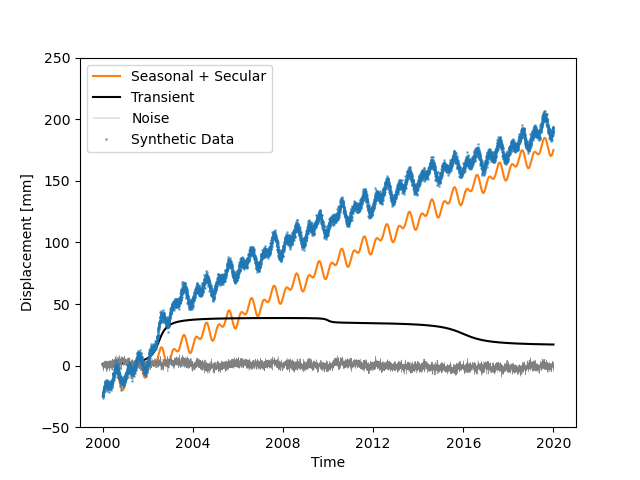
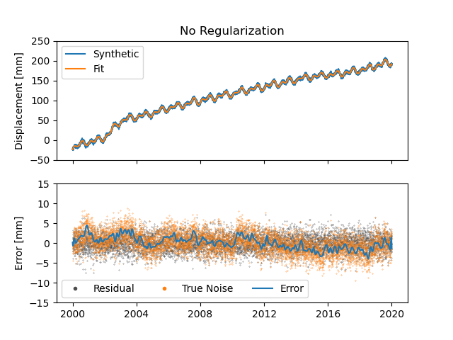
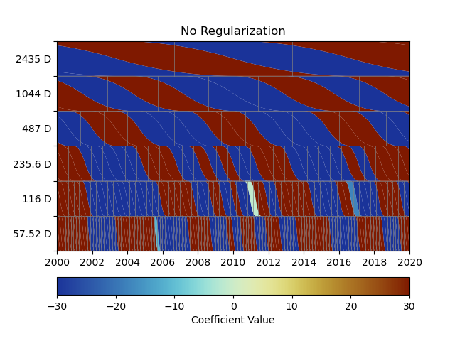
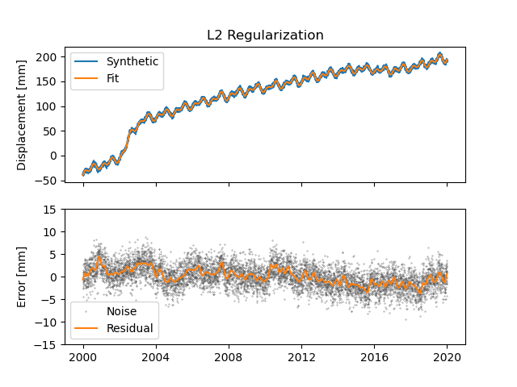
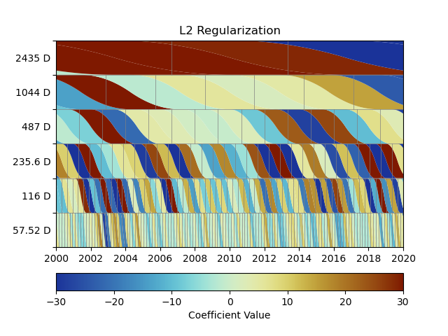
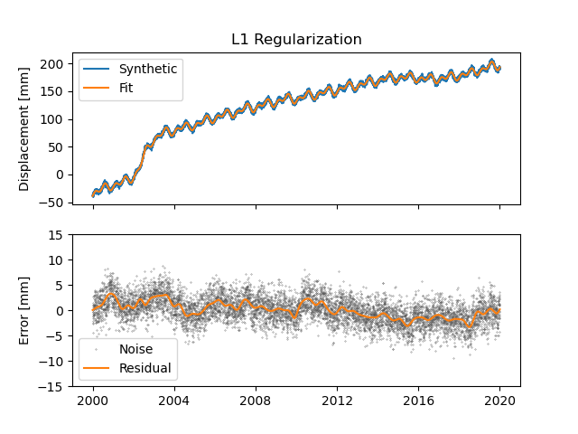
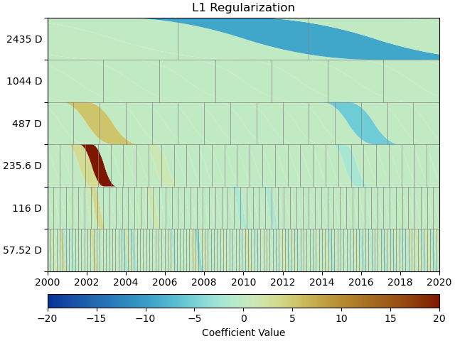
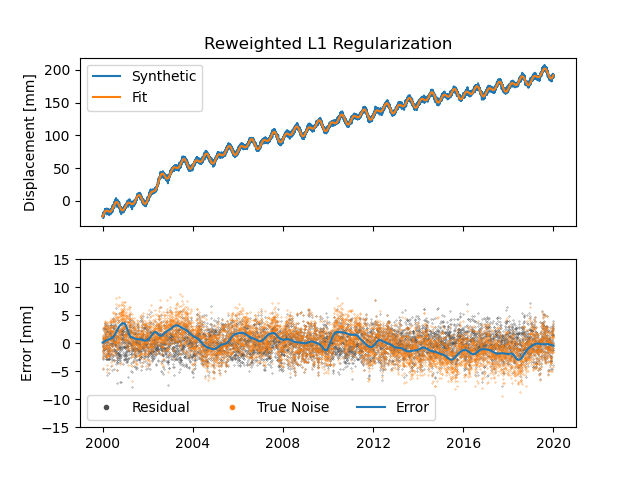
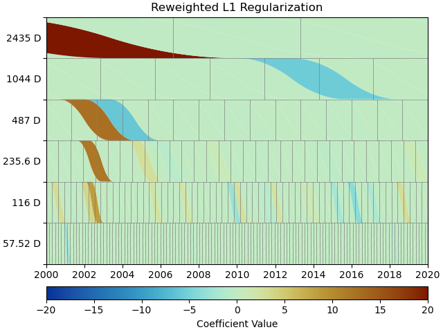

Tutorial 2: Advanced Models and Fitting
=======================================

.. note::

    This tutorial recreates the basics of the synthetic timeseries example
    as described in Bryan Riel's [riel14]_ paper on detecting geodetic transients.

For this tutorial, we'll be building on and expanding the workflow from the first one.
This time though, we'll first focus a bit more on making the synthetic data, before
creating the station itself.

Creating more complex synthetic data
------------------------------------

Let's start with creating the timestamps for our synthetic data:

.. doctest::

    >>> import pandas as pd
    >>> t_start_str = "2000-01-01"
    >>> t_end_str = "2020-01-01"
    >>> timevector = pd.date_range(start=t_start_str, end=t_end_str, freq="1D")

Next up is the model collection we're going to use to simulate our data.
This time, we'll be using a Polynomial, Sinusoids and some Arctangents.
If you have any question about this, please refer to the previous tutorial.

.. doctest::

    >>> from disstans.models import Arctangent, Polynomial, Sinusoidal
    >>> mdl_secular = Polynomial(order=1, t_reference=t_start_str)
    >>> mdl_annual = Sinusoidal(period=365.25, t_reference=t_start_str)
    >>> mdl_semiannual = Sinusoidal(period=365.25/2, t_reference=t_start_str)
    >>> mdl_transient_1 = Arctangent(tau=100, t_reference="2002-07-01")
    >>> mdl_transient_2 = Arctangent(tau=50, t_reference="2010-01-01")
    >>> mdl_transient_3 = Arctangent(tau=300, t_reference="2016-01-01")
    >>> mdl_coll_synth = {"Secular": mdl_secular,
    ...                   "Annual": mdl_annual,
    ...                   "Semi-Annual": mdl_semiannual,
    ...                   "Transient_1": mdl_transient_1,
    ...                   "Transient_2": mdl_transient_2,
    ...                   "Transient_3": mdl_transient_3}

Now, if we give these model objects to our station and perform fitting, their parameters
will be overwritten (it's one of those Python caveats). So, let's take this time here
to create a "deep" copy that we will then use for fitting. (Because fitting Arctangents
is hard, we'll omit them here, and try to approximate them with other models later.)

.. doctest::

    >>> from copy import deepcopy
    >>> mdl_coll = deepcopy({"Secular": mdl_secular,
    ...                      "Annual": mdl_annual,
    ...                      "Semi-Annual": mdl_semiannual})

Now that we have a copy for safekeeping, we can add the "true" parameters to the models:

.. doctest::

    >>> import numpy as np
    >>> mdl_secular.read_parameters(np.array([-20, 200/(20*365.25)]))
    >>> mdl_annual.read_parameters(np.array([-5, 0]))
    >>> mdl_semiannual.read_parameters(np.array([0, 5]))
    >>> mdl_transient_1.read_parameters(np.array([40]))
    >>> mdl_transient_2.read_parameters(np.array([-4]))
    >>> mdl_transient_3.read_parameters(np.array([-20]))

We can evaluate them just like before:

.. doctest::

    >>> sum_seas_sec = mdl_secular.evaluate(timevector)["fit"] \
    ...                + mdl_annual.evaluate(timevector)["fit"] \
    ...                + mdl_semiannual.evaluate(timevector)["fit"]
    >>> sum_transient = mdl_transient_1.evaluate(timevector)["fit"] \
    ...                 + mdl_transient_2.evaluate(timevector)["fit"] \
    ...                 + mdl_transient_3.evaluate(timevector)["fit"]
    >>> sum_all_models = sum_seas_sec + sum_transient

Our noise this time has two components: white and colored. For the white noise,
we can just use NumPy's default functions, but for the colored noise, we have to use
disstans's :func:`~disstans.tools.create_powerlaw_noise` function:

.. doctest::

    >>> from disstans.tools import create_powerlaw_noise
    >>> rng = np.random.default_rng(0)
    >>> white_noise = rng.normal(scale=2, size=(timevector.size, 1))
    >>> colored_noise = create_powerlaw_noise(size=(timevector.size, 1),
    ...                                       exponent=1.5, seed=0) * 2
    >>> sum_noise = white_noise + colored_noise

Our synthetic data is then just the sum of the ground truth ``sum_all_models``
and the total noise ``sum_noise``:

.. doctest::

    >>> synth_data = sum_all_models + sum_noise

Let's have a look what we fabricated::

    >>> import matplotlib.pyplot as plt
    >>> from pandas.plotting import register_matplotlib_converters
    >>> register_matplotlib_converters()  # improve how time data looks
    >>> plt.plot(timevector, sum_seas_sec, c='C1', label="Seasonal + Secular")
    >>> plt.plot(timevector, sum_transient, c='k', label="Transient")
    >>> plt.plot(timevector, sum_noise, c='0.5', lw=0.3, label="Noise")
    >>> plt.plot(timevector, synth_data, c='C0', ls='none', marker='.',
    ...          markersize=2, alpha=0.5, label="Synthetic Data")
    >>> plt.xlabel("Time")
    >>> plt.ylim(-50, 250)
    >>> plt.ylabel("Displacement [mm]")
    >>> plt.legend(loc="upper left")
    >>> plt.savefig("tutorial_2a.png")

This looks close to the example in [riel14]_. We can see that there are some significant
transients alongside a strong secular signal, and seasonal signals plus the colored
noise make it look a bit more realistic.

Spline models for transients
----------------------------

How do we model the transients though? For this, we will use an over-complete set
of basis functions, built by a collection of integrated B-Splines. For more on that,
see the class documentations for :class:`~disstans.models.BSpline` and
:class:`~disstans.models.ISpline`. There is a simple :class:`~disstans.models.SplineSet`
constructor class that takes care of that for us, which we'll directly add to our
model collection from before:

.. doctest::

    >>> from disstans.models import ISpline, SplineSet
    >>> mdl_coll["Transient"] = SplineSet(degree=2,
    ...                                   t_center_start=t_start_str,
    ...                                   t_center_end=t_end_str,
    ...                                   list_num_knots=[4, 8, 16, 32, 64, 128],
    ...                                   splineclass=ISpline)

It creates sets of integrated B-Splines of degree 2, with the timespan
covered to be that of our synthetic timeseries, and then divided into 4, 8, etc.
subintervals. The ``splineclass`` parameter only makes it clear that we want a set of
:class:`~disstans.models.ISpline`, but we could have omitted it, as it's the default
behavior.

Building a Network
------------------

Now, we're ready to build our synthetic network and add our generated data.
Again, we start by creating a :class:`~disstans.station.Station` object, but this time,
we'll also assign it to a :class:`~disstans.network.Network` object:

.. doctest::

    >>> from disstans import Network, Station, Timeseries
    >>> net_name = "TutorialLand"
    >>> stat_name = "TUT"
    >>> caltech_lla = (34.1375, -118.125, 263)
    >>> net = Network(name=net_name)
    >>> stat = Station(name=stat_name,
    ...                location=caltech_lla)
    >>> net[stat_name] = stat

.. note::
    Note that the stations internal name :attr:`~disstans.station.Station.name` does not
    have to match the network's name of that station in
    :class:`~disstans.network.Network.stations`, but it avoids confusion.

    ``net[stat_name] = synth_stat`` is equivalent to
    ``net.add_station(stat_name, synth_stat)``.

Add the generated timeseries (including models), as well as the ground truth
to the station:

.. doctest::

    >>> ts = Timeseries.from_array(timevector=timevector,
    ...                            data=synth_data,
    ...                            src="synthetic",
    ...                            data_unit="mm",
    ...                            data_cols=["Total"])
    >>> truth = Timeseries.from_array(timevector=timevector,
    ...                               data=sum_all_models,
    ...                               src="synthetic",
    ...                               data_unit="mm",
    ...                               data_cols=["Total"])
    >>> stat["Displacement"] = ts
    >>> stat["Truth"] = truth
    >>> stat.add_local_model_dict(ts_description="Displacement",
    ...                           model_dict=mdl_coll)

Fitting an entire network
-------------------------

At this point, we're ready to do the fitting using the simple linear non-regularized
least-squares we used in the previous tutorial:

.. doctest::

    >>> net.fit(ts_description="Displacement", solver="linear_regression")
    >>> net.evaluate(ts_description="Displacement", output_description="Fit_noreg")

We saved a lot of lines and hassle compared to the previous fitting by using the
:class:`~disstans.network.Network` methods. Let's calculate the residuals and errors,
and print some statistics:

.. doctest::

    >>> stat["Res_noreg"] = stat["Displacement"] - stat["Fit_noreg"]
    >>> stat["Err_noreg"] = stat["Fit_noreg"] - stat["Truth"]
    >>> _ = stat.analyze_residuals(ts_description="Res_noreg",
    ...                            mean=True, std=True, verbose=True)
    TUT: Res_noreg                          Mean  Standard Deviation
    Total-Displacement_Model_Total  1.622931e-08            2.046006

Advanced plotting
-----------------

What do our fit, residuals (between the observations and our fit) and errors
(between the fit and the true displacement signal) look like compared to the
data and noise? ::

    >>> from matplotlib.lines import Line2D
    >>> fig, ax = plt.subplots(nrows=2, sharex=True)
    >>> ax[0].plot(stat["Displacement"].data, label="Synthetic")
    >>> ax[0].plot(stat["Fit_noreg"].data, label="Fit")
    >>> ax[0].set_ylim(-50, 250)
    >>> ax[0].set_ylabel("Displacement [mm]")
    >>> ax[0].legend(loc="upper left")
    >>> ax[0].set_title("No Regularization")
    >>> ax[1].plot(stat["Res_noreg"].data, c='0.3', ls='none',
    ...         marker='.', markersize=0.5)
    >>> ax[1].plot(stat["Err_noreg"].time, sum_noise, c='C1', ls='none',
    ...         marker='.', markersize=0.5)
    >>> ax[1].plot(stat["Err_noreg"].data, c="C0")
    >>> ax[1].set_ylim(-15, 15)
    >>> ax[1].set_ylabel("Error [mm]")
    >>> custom_lines = [Line2D([0], [0], c="0.3", marker=".", linestyle='none'),
    ...                 Line2D([0], [0], c="C1", marker=".", linestyle='none'),
    ...                 Line2D([0], [0], c="C0")]
    >>> ax[1].legend(custom_lines, ["Residual", "True Noise", "Error"],
    ...             loc="lower left", ncol=3)
    >>> fig.savefig("tutorial_2b.png")

.. note::

    As expected with any regular least-squares minimization, the residuals look like a
    zero-mean Gaussian distribution. The true noise, plotted for comparison, contains
    colored noise, and therefore is not Gaussian. Because our solver has no way of
    knowing what is true noise and small transient signals, it assumes that all the
    transient it sees are part of the displacement signal to fit. Therefore, our
    error tracks the noise. This behaviour will not change significantly throughout
    this second tutorial, but will be addressed in the third tutorial.

We can use a scalogram (see :meth:`~disstans.models.SplineSet.make_scalogram`) to visualize
the coefficient values of our spline collection, and quickly understand that without
regularization, the set is quite heavily populated in order to minimize the residuals::

    >>> fig, ax = stat.models["Displacement"]["Transient"].make_scalogram(t_left=t_start_str,
    ...                                                                   t_right=t_end_str,
    ...                                                                   cmaprange=20)
    >>> ax[0].set_title("No Regularization")
    >>> fig.savefig("tutorial_2c.png")

Repeat with L2 regularization
-----------------------------

Now, we can do the exact same thing as above, but choose a ridge regression (L2-regularized)
solver:

.. doctest::

    >>> net.fit(ts_description="Displacement", solver="ridge_regression", penalty=10)
    >>> net.evaluate(ts_description="Displacement", output_description="Fit_L2")
    >>> stat["Res_L2"] = stat["Displacement"] - stat["Fit_L2"]
    >>> stat["Err_L2"] = stat["Fit_L2"] - stat["Truth"]
    >>> _ = stat.analyze_residuals(ts_description="Res_L2",
    ...                            mean=True, std=True, verbose=True)
    TUT: Res_L2                             Mean  Standard Deviation
    Total-Displacement_Model_Total  1.503516e-09            2.087589

::

    >>> fig, ax = plt.subplots(nrows=2, sharex=True)
    >>> ax[0].plot(stat["Displacement"].data, label="Synthetic")
    >>> ax[0].plot(stat["Fit_L2"].data, label="Fit")
    >>> ax[0].set_ylabel("Displacement [mm]")
    >>> ax[0].legend(loc="upper left")
    >>> ax[0].set_title("L2 Regularization")
    >>> ax[1].plot(stat["Res_L2"].data, c='0.3', ls='none',
    ...         marker='.', markersize=0.5)
    >>> ax[1].plot(stat["Err_L2"].time, sum_noise, c='C1', ls='none',
    ...         marker='.', markersize=0.5)
    >>> ax[1].plot(stat["Err_L2"].data, c="C0")
    >>> ax[1].set_ylim(-15, 15)
    >>> ax[1].set_ylabel("Error [mm]")
    >>> custom_lines = [Line2D([0], [0], c="0.3", marker=".", linestyle='none'),
    ...                 Line2D([0], [0], c="C1", marker=".", linestyle='none'),
    ...                 Line2D([0], [0], c="C0")]
    >>> ax[1].legend(custom_lines, ["Residual", "True Noise", "Error"],
    ...             loc="lower left", ncol=3)
    >>> fig.savefig("tutorial_2d.png")

::

    >>> fig, ax = stat.models["Displacement"]["Transient"].make_scalogram(t_left=t_start_str,
    ...                                                                   t_right=t_end_str,
    ...                                                                   cmaprange=20)
    >>> ax[0].set_title("L2 Regularization")
    >>> fig.savefig("tutorial_2e.png")

We can see that L2 regularization has significantly reduced the magnitude of the splines
used in the fitting, and the fit overall (see the residual statistics) appears to be
better. However, most splines are actually non-zero. This might produced the best fit,
but our physical knowledge of the processes happening tell us that our station is not
always moving - there are discrete processes. A higher penalty parameter might make
those parameters even smaller, but they will not become significantly sparser.

Repeat with L1 regularization
-----------------------------

Using L1-regularized lasso regression, we finally hope to get rid of all the small,
basically-zero splines in the transient dictionary:

.. doctest::

    >>> net.fit(ts_description="Displacement", solver="lasso_regression", penalty=10)
    >>> net.evaluate(ts_description="Displacement", output_description="Fit_L1")
    >>> stat["Res_L1"] = stat["Displacement"] - stat["Fit_L1"]
    >>> stat["Err_L1"] = stat["Fit_L1"] - stat["Truth"]
    >>> _ = stat.analyze_residuals(ts_description="Res_L1",
    ...                            mean=True, std=True, verbose=True)
    TUT: Res_L1                         Mean  Standard Deviation
    Total-Displacement_Model_Total  0.000003            2.121952

::

    >>> fig, ax = plt.subplots(nrows=2, sharex=True)
    >>> ax[0].plot(stat["Displacement"].data, label="Synthetic")
    >>> ax[0].plot(stat["Fit_L1"].data, label="Fit")
    >>> ax[0].set_ylabel("Displacement [mm]")
    >>> ax[0].legend(loc="upper left")
    >>> ax[0].set_title("L1 Regularization")
    >>> ax[1].plot(stat["Res_L1"].data, c='0.3', ls='none',
    ...         marker='.', markersize=0.5)
    >>> ax[1].plot(stat["Err_L1"].time, sum_noise, c='C1', ls='none',
    ...         marker='.', markersize=0.5)
    >>> ax[1].plot(stat["Err_L1"].data, c="C0")
    >>> ax[1].set_ylim(-15, 15)
    >>> ax[1].set_ylabel("Error [mm]")
    >>> custom_lines = [Line2D([0], [0], c="0.3", marker=".", linestyle='none'),
    ...                 Line2D([0], [0], c="C1", marker=".", linestyle='none'),
    ...                 Line2D([0], [0], c="C0")]
    >>> ax[1].legend(custom_lines, ["Residual", "True Noise", "Error"],
    ...             loc="lower left", ncol=3)
    >>> fig.savefig("tutorial_2f.png")

::

    >>> fig, ax = stat.models["Displacement"]["Transient"].make_scalogram(t_left=t_start_str,
    ...                                                                   t_right=t_end_str,
    ...                                                                   cmaprange=20)
    >>> ax[0].set_title("L1 Regularization")
    >>> fig.savefig("tutorial_2g.png")

This looks much better - the scalogram now shows us that we only select splines around
where we put the Arctangent models, and is close to zero otherwise.

Adding reweighting iterations
-----------------------------

Okay, one last thing about fitting, I promise. L1 regularization aims to penalize the sum of
the absolute values of our model parameters. However, that's also not actually what we want.
In fact, transient signals in the real world have no constraint to be as small as possible.
However, the *number* of transients should be the one that is minimized. That is what is
mathematically referred to as L0 regularization, but is sadly not an easy problem to solve
rigorously.

However, by modifying an additional weight of each regularized parameter, that drives small
values even closer to zero, but leaves significant values unperturbed, one can approximate
such an L0 regularization by iteratively solving the L1-regularized problem. That is exactly
what the option ``reweight_max_iters`` does. You can find more information about it in
the notes of :func:`~disstans.solvers.lasso_regression`. Let's try it:

.. doctest::

    >>> net.fit(ts_description="Displacement", solver="lasso_regression",
    ...         penalty=10, reweight_max_iters=10)
    >>> net.evaluate(ts_description="Displacement", output_description="Fit_L1R")
    >>> stat["Res_L1R"] = stat["Displacement"] - stat["Fit_L1R"]
    >>> stat["Err_L1R"] = stat["Fit_L1R"] - stat["Truth"]
    >>> _ = stat.analyze_residuals(ts_description="Res_L1R",
    ...                            mean=True, std=True, verbose=True)
    TUT: Res_L1R                            Mean  Standard Deviation
    Total-Displacement_Model_Total  9.511043e-08            2.117921

::

    >>> fig, ax = plt.subplots(nrows=2, sharex=True)
    >>> ax[0].plot(stat["Displacement"].data, label="Synthetic")
    >>> ax[0].plot(stat["Fit_L1R"].data, label="Fit")
    >>> ax[0].set_ylabel("Displacement [mm]")
    >>> ax[0].legend(loc="upper left")
    >>> ax[0].set_title("Reweighted L1 Regularization")
    >>> ax[1].plot(stat["Res_L1R"].data, c='0.3', ls='none',
    ...         marker='.', markersize=0.5)
    >>> ax[1].plot(stat["Err_L1R"].time, sum_noise, c='C1', ls='none',
    ...         marker='.', markersize=0.5)
    >>> ax[1].plot(stat["Err_L1R"].data, c="C0")
    >>> ax[1].set_ylim(-15, 15)
    >>> ax[1].set_ylabel("Error [mm]")
    >>> custom_lines = [Line2D([0], [0], c="0.3", marker=".", linestyle='none'),
    ...                 Line2D([0], [0], c="C1", marker=".", linestyle='none'),
    ...                 Line2D([0], [0], c="C0")]
    >>> ax[1].legend(custom_lines, ["Residual", "True Noise", "Error"],
    ...             loc="lower left", ncol=3)
    >>> fig.savefig("tutorial_2h.png")

::

    >>> fig, ax = stat.models["Displacement"]["Transient"].make_scalogram(t_left=t_start_str,
    ...                                                                   t_right=t_end_str,
    ...                                                                   cmaprange=20)
    >>> ax[0].set_title("Reweighted L1 Regularization")
    >>> fig.savefig("tutorial_2i.png")

As you can see, the significant components of the splines have now been emphasized when
compared to the previous scalogram, and all the values that were small but not really
zero in the previous case are now *really* close to zero.

Comparing specific parameters
-----------------------------

Before we finish up, let's just print some differences between the ground truth and our
L1R-fitted model:

.. doctest::

    >>> reldiff_sec = (mdl_coll_synth["Secular"].parameters
    ...                / stat.models["Displacement"]["Secular"].parameters).ravel() - 1
    >>> reldiff_ann_amp = mdl_coll_synth["Annual"].amplitude \
    ...                   / stat.models["Displacement"]["Annual"].amplitude - 1
    >>> reldiff_sem_amp = mdl_coll_synth["Semi-Annual"].amplitude \
    ...                   / stat.models["Displacement"]["Semi-Annual"].amplitude - 1
    >>> absdiff_ann_ph = mdl_coll_synth["Annual"].phase \
    ...                   - stat.models["Displacement"]["Annual"].phase
    >>> absdiff_sem_ph = mdl_coll_synth["Semi-Annual"].phase \
    ...                   - stat.models["Displacement"]["Semi-Annual"].phase
    >>> print(f"Percent Error Constant:              {reldiff_sec[0]: %}\n"
    ...       f"Percent Error Linear:                {reldiff_sec[1]: %}\n"
    ...       f"Percent Error Annual Amplitude:      {reldiff_ann_amp: %}\n"
    ...       f"Percent Error Semi-Annual Amplitude: {reldiff_sem_amp: %}\n"
    ...       f"Absolute Error Annual Phase:         {absdiff_ann_ph: f} rad\n"
    ...       f"Absolute Error Semi-Annual Phase:    {absdiff_sem_ph: f} rad")
    Percent Error Constant:              -44.023921%
    Percent Error Linear:                 20.780108%
    Percent Error Annual Amplitude:      -0.233888%
    Percent Error Semi-Annual Amplitude:  0.061881%
    Absolute Error Annual Phase:          0.016006 rad
    Absolute Error Semi-Annual Phase:    -0.017135 rad

Apart from the trade-off between the polynomial trend and long-term splines, which can be
expected in this synthetic example, we got pretty close to our ground truth. Let's finish
up by calculating an average velocity of the station using
:meth:`~disstans.station.Station.get_trend` around the time when it's rapidly moving
(around the middle of 2002). We don't want a normal trend through the data, since that
is also influenced by the secular velocity, the noise, etc., so we choose to only fit our
transient model:

.. doctest::

    >>> trend, _ = stat.get_trend("Displacement", fit_list=["Transient"],
    ...                           t_start="2002-06-01", t_end="2002-08-01")
    >>> print(f"Transient Velocity: {trend[0]:f} {ts.data_unit}/D")
    Transient Velocity: 0.121516 mm/D

We can use average velocities like these when we want to create velocity maps for
certain episodes.
