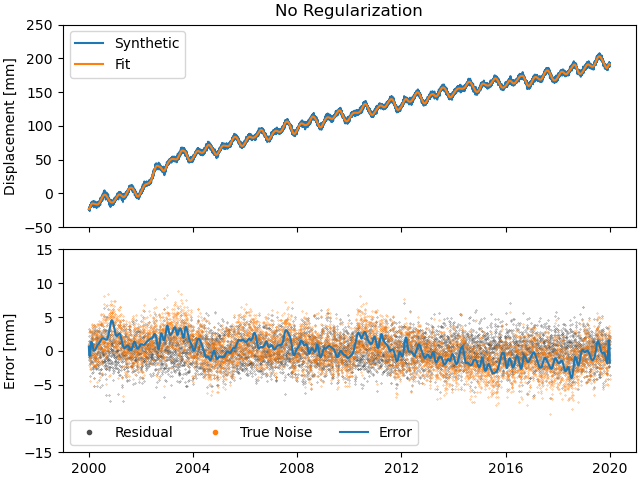
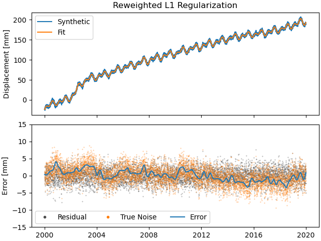

Tutorial 2: Advanced Models and Fitting
=======================================

.. sidebar:: Download full script

   :download:`tutorial_2_detect_transients.py <../../scripts/tutorial_2_detect_transients.py>`

This tutorial recreates the basics of the synthetic timeseries example as described in
Bryan Riel's [riel14]_ paper on detecting geodetic transients.
To do this, we'll be building on the workflow from the first example.
This time though, we'll first focus a bit more on making the synthetic data, before
creating the station itself.

.. contents:: Table of contents
    :local:

Creating more complex synthetic data
------------------------------------

Let's start with creating the timestamps for our synthetic data:

.. doctest::

    >>> import pandas as pd
    >>> t_start_str = "2000-01-01"
    >>> t_end_str = "2020-01-01"
    >>> timevector = pd.date_range(start=t_start_str, end=t_end_str, freq="1D")

Next up is the model collection we're going to use to simulate our data.
This time, we'll be using a Polynomial, Sinusoids and some Arctangents.
If you have any question about this, please refer to the previous tutorial.

.. doctest::

    >>> from disstans.models import Arctangent, Polynomial, Sinusoid
    >>> mdl_secular = Polynomial(order=1, t_reference=t_start_str)
    >>> mdl_annual = Sinusoid(period=365.25, t_reference=t_start_str)
    >>> mdl_semiannual = Sinusoid(period=365.25/2, t_reference=t_start_str)
    >>> mdl_transient_1 = Arctangent(tau=100, t_reference="2002-07-01")
    >>> mdl_transient_2 = Arctangent(tau=50, t_reference="2010-01-01")
    >>> mdl_transient_3 = Arctangent(tau=300, t_reference="2016-01-01")
    >>> mdl_coll_synth = {"Secular": mdl_secular,
    ...                   "Annual": mdl_annual,
    ...                   "Semi-Annual": mdl_semiannual,
    ...                   "Transient_1": mdl_transient_1,
    ...                   "Transient_2": mdl_transient_2,
    ...                   "Transient_3": mdl_transient_3}

Now, if we give these model objects to our station and perform fitting, their parameters
will be overwritten (it's one of those Python caveats). So, let's take this time here
to create a "deep" copy that we will then use for fitting. (Because fitting Arctangents
is hard, we'll omit them here, and try to approximate them with other models later.)

.. doctest::

    >>> from copy import deepcopy
    >>> mdl_coll = deepcopy({"Secular": mdl_secular,
    ...                      "Annual": mdl_annual,
    ...                      "Semi-Annual": mdl_semiannual})

Now that we have a copy for safekeeping, we can add the "true" parameters to the models:

.. doctest::

    >>> import numpy as np
    >>> mdl_secular.read_parameters(np.array([-20, 200/(20*365.25)]))
    >>> mdl_annual.read_parameters(np.array([-5, 0]))
    >>> mdl_semiannual.read_parameters(np.array([0, 5]))
    >>> mdl_transient_1.read_parameters(np.array([40]))
    >>> mdl_transient_2.read_parameters(np.array([-4]))
    >>> mdl_transient_3.read_parameters(np.array([-20]))

We can evaluate them just like before:

.. doctest::

    >>> sum_seas_sec = mdl_secular.evaluate(timevector)["fit"] \
    ...                + mdl_annual.evaluate(timevector)["fit"] \
    ...                + mdl_semiannual.evaluate(timevector)["fit"]
    >>> sum_transient = mdl_transient_1.evaluate(timevector)["fit"] \
    ...                 + mdl_transient_2.evaluate(timevector)["fit"] \
    ...                 + mdl_transient_3.evaluate(timevector)["fit"]
    >>> sum_all_models = sum_seas_sec + sum_transient

Our noise this time has two components: white and colored. For the white noise,
we can just use NumPy's default functions, but for the colored noise, we have to use
DISSTANS's :func:`~disstans.tools.create_powerlaw_noise` function:

.. doctest::

    >>> from disstans.tools import create_powerlaw_noise
    >>> rng = np.random.default_rng(0)
    >>> white_noise = rng.normal(scale=2, size=(timevector.size, 1))
    >>> colored_noise = create_powerlaw_noise(size=(timevector.size, 1),
    ...                                       exponent=1.5, seed=0) * 2
    >>> sum_noise = white_noise + colored_noise

Our synthetic data is then just the sum of the ground truth ``sum_all_models``
and the total noise ``sum_noise``:

.. doctest::

    >>> synth_data = sum_all_models + sum_noise

Let's have a look what we fabricated::

    >>> import matplotlib.pyplot as plt
    >>> from pandas.plotting import register_matplotlib_converters
    >>> register_matplotlib_converters()  # improve how time data looks
    >>> plt.figure()
    >>> plt.plot(timevector, sum_seas_sec, c='C1', label="Seasonal + Secular")
    >>> plt.plot(timevector, sum_transient, c='k', label="Transient")
    >>> plt.plot(timevector, sum_noise, c='0.5', lw=0.3, label="Noise")
    >>> plt.plot(timevector, synth_data, c='C0', ls='none', marker='.',
    ...          markersize=2, alpha=0.5, label="Synthetic Data")
    >>> plt.xlabel("Time")
    >>> plt.ylim(-50, 250)
    >>> plt.ylabel("Displacement [mm]")
    >>> plt.legend(loc="upper left")
    >>> plt.savefig("tutorial_2a.png")

.. image:: ../img/tutorial_2a.png

This looks close to the example in [riel14]_. We can see that there are some significant
transients alongside a strong secular signal, and seasonal signals plus the colored
noise make it look a bit more realistic.

Spline models for transients
----------------------------

How do we model the transients though? For this, we will use an over-complete set
of basis functions, built by a collection of integrated B-Splines. For more on that,
see the class documentations for :class:`~disstans.models.BSpline` and
:class:`~disstans.models.ISpline`. There is a simple :class:`~disstans.models.SplineSet`
constructor class that takes care of that for us, which we'll directly add to our
model collection from before:

.. doctest::

    >>> from disstans.models import ISpline, SplineSet
    >>> mdl_coll["Transient"] = SplineSet(degree=2,
    ...                                   t_center_start=t_start_str,
    ...                                   t_center_end=t_end_str,
    ...                                   list_num_knots=[4, 8, 16, 32, 64, 128],
    ...                                   splineclass=ISpline)

It creates sets of integrated B-Splines of degree 2, with the timespan
covered to be that of our synthetic timeseries, and then divided into 4, 8, etc.
subintervals. The ``splineclass`` parameter only makes it clear that we want a set of
:class:`~disstans.models.ISpline`, but we could have omitted it, as it's the default
behavior.

Building a Network
------------------

Now, we're ready to build our synthetic network and add our generated data.
Again, we start by creating a :class:`~disstans.station.Station` object, but this time,
we'll also assign it to a :class:`~disstans.network.Network` object:

.. doctest::

    >>> from disstans import Network, Station, Timeseries
    >>> net_name = "TutorialLand"
    >>> stat_name = "TUT"
    >>> caltech_lla = (34.1375, -118.125, 263.0)
    >>> net = Network(name=net_name)
    >>> stat = Station(name=stat_name,
    ...                location=caltech_lla)
    >>> net[stat_name] = stat

.. note::
    Note that the stations internal name :attr:`~disstans.station.Station.name` does not
    have to match the network's name of that station in
    :class:`~disstans.network.Network.stations`, but it avoids confusion.

    ``net[stat_name] = synth_stat`` is equivalent to
    ``net.add_station(stat_name, synth_stat)``.

Add the generated timeseries (including models), as well as the ground truth
to the station:

.. doctest::

    >>> ts = Timeseries.from_array(timevector=timevector,
    ...                            data=synth_data,
    ...                            src="synthetic",
    ...                            data_unit="mm",
    ...                            data_cols=["Total"])
    >>> truth = Timeseries.from_array(timevector=timevector,
    ...                               data=sum_all_models,
    ...                               src="synthetic",
    ...                               data_unit="mm",
    ...                               data_cols=["Total"])
    >>> stat["Displacement"] = ts
    >>> stat["Truth"] = truth
    >>> stat.add_local_model_dict(ts_description="Displacement",
    ...                           model_dict=mdl_coll)

Fitting an entire network
-------------------------

At this point, we're ready to do the fitting using the simple linear non-regularized
least-squares we used in the previous tutorial:

.. doctest::

    >>> net.fit(ts_description="Displacement", solver="linear_regression")
    >>> net.evaluate(ts_description="Displacement", output_description="Fit_noreg")
    >>> stat["Res_noreg"] = stat["Displacement"] - stat["Fit_noreg"]
    >>> stat["Err_noreg"] = stat["Fit_noreg"] - stat["Truth"]

We saved a lot of lines and hassle compared to the previous fitting by using the
:class:`~disstans.network.Network` methods. We already calculated the residuals and
errors, so let's print some statistics:

.. doctest::

    >>> _ = stat.analyze_residuals(ts_description="Res_noreg",
    ...                            mean=True, std=True, verbose=True)
    TUT: Res_noreg                          Mean  Standard Deviation
    Total-Displacement_Model_Total -2.193765e-08            2.046182

Advanced plotting
-----------------

What do our fit, residuals (between the observations and our fit) and errors
(between the fit and the true displacement signal) look like compared to the
data and noise? ::

    >>> from matplotlib.lines import Line2D
    >>> fig, ax = plt.subplots(nrows=2, sharex=True)
    >>> ax[0].plot(stat["Displacement"].data, label="Synthetic")
    >>> ax[0].plot(stat["Fit_noreg"].data, label="Fit")
    >>> ax[0].set_ylim(-50, 250)
    >>> ax[0].set_ylabel("Displacement [mm]")
    >>> ax[0].legend(loc="upper left")
    >>> ax[0].set_title("No Regularization")
    >>> ax[1].plot(stat["Res_noreg"].data, c='0.3', ls='none',
    ...         marker='.', markersize=0.5)
    >>> ax[1].plot(stat["Err_noreg"].time, sum_noise, c='C1', ls='none',
    ...         marker='.', markersize=0.5)
    >>> ax[1].plot(stat["Err_noreg"].data, c="C0")
    >>> ax[1].set_ylim(-15, 15)
    >>> ax[1].set_ylabel("Error [mm]")
    >>> custom_lines = [Line2D([0], [0], c="0.3", marker=".", linestyle='none'),
    ...                 Line2D([0], [0], c="C1", marker=".", linestyle='none'),
    ...                 Line2D([0], [0], c="C0")]
    >>> ax[1].legend(custom_lines, ["Residual", "True Noise", "Error"],
    ...             loc="lower left", ncol=3)
    >>> fig.savefig("tutorial_2b.png")

.. note::

    As expected with any regular least-squares minimization, the residuals look like a
    zero-mean Gaussian distribution. The true noise, plotted for comparison, contains
    colored noise, and therefore is not Gaussian. Because our solver has no way of
    knowing what is true noise and small transient signals, it assumes that all the
    transient it sees are part of the displacement signal to fit. Therefore, our
    error tracks the noise. This behaviour will not change significantly throughout
    this second tutorial, but will be addressed in the third tutorial.

We can use a scalogram (see :meth:`~disstans.models.BaseSplineSet.make_scalogram`) to visualize
the coefficient values of our spline collection, and quickly understand that without
regularization, the set is quite heavily populated in order to minimize the residuals::

    >>> fig, ax = stat.models["Displacement"]["Transient"].make_scalogram(t_left=t_start_str,
    ...                                                                   t_right=t_end_str,
    ...                                                                   cmaprange=20)
    >>> ax[0].set_title("No Regularization")
    >>> fig.savefig("tutorial_2c.png")

.. image:: ../img/tutorial_2c.png

Repeat with L2 regularization
-----------------------------

Now, we can do the exact same thing as above, but choose a ridge regression (L2-regularized)
solver:

.. doctest::

    >>> net.fit(ts_description="Displacement", solver="ridge_regression", penalty=10)
    >>> net.evaluate(ts_description="Displacement", output_description="Fit_L2")
    >>> stat["Res_L2"] = stat["Displacement"] - stat["Fit_L2"]
    >>> stat["Err_L2"] = stat["Fit_L2"] - stat["Truth"]

Giving us the statistics:

.. doctest::

    >>> _ = stat.analyze_residuals(ts_description="Res_L2",
    ...                            mean=True, std=True, verbose=True)
    TUT: Res_L2                             Mean  Standard Deviation
    Total-Displacement_Model_Total -5.627180e-09            2.088274

::

    >>> fig, ax = plt.subplots(nrows=2, sharex=True)
    >>> ax[0].plot(stat["Displacement"].data, label="Synthetic")
    >>> ax[0].plot(stat["Fit_L2"].data, label="Fit")
    >>> ax[0].set_ylabel("Displacement [mm]")
    >>> ax[0].legend(loc="upper left")
    >>> ax[0].set_title("L2 Regularization")
    >>> ax[1].plot(stat["Res_L2"].data, c='0.3', ls='none',
    ...         marker='.', markersize=0.5)
    >>> ax[1].plot(stat["Err_L2"].time, sum_noise, c='C1', ls='none',
    ...         marker='.', markersize=0.5)
    >>> ax[1].plot(stat["Err_L2"].data, c="C0")
    >>> ax[1].set_ylim(-15, 15)
    >>> ax[1].set_ylabel("Error [mm]")
    >>> custom_lines = [Line2D([0], [0], c="0.3", marker=".", linestyle='none'),
    ...                 Line2D([0], [0], c="C1", marker=".", linestyle='none'),
    ...                 Line2D([0], [0], c="C0")]
    >>> ax[1].legend(custom_lines, ["Residual", "True Noise", "Error"],
    ...             loc="lower left", ncol=3)
    >>> fig.savefig("tutorial_2d.png")

.. image:: ../img/tutorial_2d.png

::

    >>> fig, ax = stat.models["Displacement"]["Transient"].make_scalogram(t_left=t_start_str,
    ...                                                                   t_right=t_end_str,
    ...                                                                   cmaprange=20)
    >>> ax[0].set_title("L2 Regularization")
    >>> fig.savefig("tutorial_2e.png")

.. image:: ../img/tutorial_2e.png

We can see that L2 regularization has significantly reduced the magnitude of the splines
used in the fitting, and the fit overall (see the residual statistics) appears to be
better. However, most splines are actually non-zero. This might produced the best fit,
but our physical knowledge of the processes happening tell us that our station is not
always moving - there are discrete processes. A higher penalty parameter might make
those parameters even smaller, but they will not become significantly sparser.

Let's save the parameter values of the transient spline model such that we can compare
them later to cases with different regularizations:

.. doctest::

    >>> params_transient_L2 = stat.models["Displacement"]["Transient"].parameters.ravel().copy()

Repeat with L1 regularization
-----------------------------

Using L1-regularized lasso regression, we finally hope to get rid of all the small,
basically-zero splines in the transient dictionary:

.. doctest::

    >>> net.fit(ts_description="Displacement", solver="lasso_regression", penalty=10)
    >>> net.evaluate(ts_description="Displacement", output_description="Fit_L1")
    >>> stat["Res_L1"] = stat["Displacement"] - stat["Fit_L1"]
    >>> stat["Err_L1"] = stat["Fit_L1"] - stat["Truth"]

Giving us the statistics:

.. doctest::

    >>> _ = stat.analyze_residuals(ts_description="Res_L1",
    ...                            mean=True, std=True, verbose=True)
    TUT: Res_L1                             Mean  Standard Deviation
    Total-Displacement_Model_Total  2.171535e-10             2.07782

::

    >>> fig, ax = plt.subplots(nrows=2, sharex=True)
    >>> ax[0].plot(stat["Displacement"].data, label="Synthetic")
    >>> ax[0].plot(stat["Fit_L1"].data, label="Fit")
    >>> ax[0].set_ylabel("Displacement [mm]")
    >>> ax[0].legend(loc="upper left")
    >>> ax[0].set_title("L1 Regularization")
    >>> ax[1].plot(stat["Res_L1"].data, c='0.3', ls='none',
    ...         marker='.', markersize=0.5)
    >>> ax[1].plot(stat["Err_L1"].time, sum_noise, c='C1', ls='none',
    ...         marker='.', markersize=0.5)
    >>> ax[1].plot(stat["Err_L1"].data, c="C0")
    >>> ax[1].set_ylim(-15, 15)
    >>> ax[1].set_ylabel("Error [mm]")
    >>> custom_lines = [Line2D([0], [0], c="0.3", marker=".", linestyle='none'),
    ...                 Line2D([0], [0], c="C1", marker=".", linestyle='none'),
    ...                 Line2D([0], [0], c="C0")]
    >>> ax[1].legend(custom_lines, ["Residual", "True Noise", "Error"],
    ...             loc="lower left", ncol=3)
    >>> fig.savefig("tutorial_2f.png")

.. image:: ../img/tutorial_2f.png

::

    >>> fig, ax = stat.models["Displacement"]["Transient"].make_scalogram(t_left=t_start_str,
    ...                                                                   t_right=t_end_str,
    ...                                                                   cmaprange=20)
    >>> ax[0].set_title("L1 Regularization")
    >>> fig.savefig("tutorial_2g.png")

.. image:: ../img/tutorial_2g.png

This looks much better - the scalogram now shows us that we only select splines around
where we put the Arctangent models, and is close to zero otherwise. We again sae the
transient model parameters for later.

.. doctest::

    >>> params_transient_L1 = stat.models["Displacement"]["Transient"].parameters.ravel().copy()

Repeat with L0 regularization
-----------------------------

Okay, one last thing about fitting, I promise. L1 regularization aims to penalize the sum of
the absolute values of our model parameters. However, that's also not actually what we want.
In fact, transient signals in the real world have no constraint to be as small as possible.
However, the *number* of transients should be the one that is minimized. That is what is
mathematically referred to as L0 regularization, but is sadly not an easy problem to solve
rigorously.

However, by modifying an additional weight of each regularized parameter, that drives small
values even closer to zero, but leaves significant values unperturbed, one can approximate
such an L0 regularization by iteratively solving the L1-regularized problem. That is exactly
what the option ``reweight_max_iters`` does. You can find more information about it in
the notes of :func:`~disstans.solvers.lasso_regression`.

The solver requires the definition of a reweighting function - i.e., a function that
helps the solver distinguish between significant and insignificant parameters.
A reweighting function takes in parameter values, and outputs a weight to add in the
regularization process. Small parameters (insignificant) will get a very high weight
(penalty), whereas large parameters will get a weight close to zero. For more information,
refer to :class:`~disstans.solvers.ReweightingFunction`. Let's define one:

.. doctest::

    >>> from disstans.solvers import InverseReweighting
    >>> rw_func = InverseReweighting(1e-4, scale=1)

With this, we can now run the L1 solver iteratively to approximate the L0 solution:

.. doctest::

    >>> net.fit(ts_description="Displacement", solver="lasso_regression",
    ...         penalty=10, reweight_max_iters=20, reweight_func=rw_func)
    >>> net.evaluate(ts_description="Displacement", output_description="Fit_L0")
    >>> stat["Res_L0"] = stat["Displacement"] - stat["Fit_L0"]
    >>> stat["Err_L0"] = stat["Fit_L0"] - stat["Truth"]

Giving us the statistics:

.. doctest::

    >>> _ = stat.analyze_residuals(ts_description="Res_L0",
    ...                            mean=True, std=True, verbose=True)
    TUT: Res_L0                             Mean  Standard Deviation
    Total-Displacement_Model_Total  4.663455e-13            2.071561

::

    >>> fig, ax = plt.subplots(nrows=2, sharex=True)
    >>> ax[0].plot(stat["Displacement"].data, label="Synthetic")
    >>> ax[0].plot(stat["Fit_L0"].data, label="Fit")
    >>> ax[0].set_ylabel("Displacement [mm]")
    >>> ax[0].legend(loc="upper left")
    >>> ax[0].set_title("Reweighted L1 Regularization")
    >>> ax[1].plot(stat["Res_L0"].data, c='0.3', ls='none',
    ...         marker='.', markersize=0.5)
    >>> ax[1].plot(stat["Err_L0"].time, sum_noise, c='C1', ls='none',
    ...         marker='.', markersize=0.5)
    >>> ax[1].plot(stat["Err_L0"].data, c="C0")
    >>> ax[1].set_ylim(-15, 15)
    >>> ax[1].set_ylabel("Error [mm]")
    >>> custom_lines = [Line2D([0], [0], c="0.3", marker=".", linestyle='none'),
    ...                 Line2D([0], [0], c="C1", marker=".", linestyle='none'),
    ...                 Line2D([0], [0], c="C0")]
    >>> ax[1].legend(custom_lines, ["Residual", "True Noise", "Error"],
    ...             loc="lower left", ncol=3)
    >>> fig.savefig("tutorial_2h.png")

::

    >>> fig, ax = stat.models["Displacement"]["Transient"].make_scalogram(t_left=t_start_str,
    ...                                                                   t_right=t_end_str,
    ...                                                                   cmaprange=20)
    >>> ax[0].set_title("Reweighted L1 Regularization")
    >>> fig.savefig("tutorial_2i.png")

.. image:: ../img/tutorial_2i.png

As you can see, the significant components of the splines have now been emphasized when
compared to the previous scalogram, and all the values that were small but not really
zero in the previous case are now *really* close to zero.
This did not come at a significant increase in residual variance.

We can quantify this by plotting a histogram of the magnitudes of the transient parameters
for the three different regularization schemes. One last time, we save the parameter
values:

.. doctest::

    >>> params_transient_L0 = stat.models["Displacement"]["Transient"].parameters.ravel().copy()
    >>> ZERO = 1e-4
    >>> print("Number of nonzero spline parameters:\n"
    ...       f"L2: {(np.abs(params_transient_L2) > ZERO).sum()}\n"
    ...       f"L1: {(np.abs(params_transient_L1) > ZERO).sum()}\n"
    ...       f"L0: {(np.abs(params_transient_L0) > ZERO).sum()}")
    Number of nonzero spline parameters:
    L2: 264
    L1: 76
    L0: 67

As we can see, the L0-regularized solver gives a more sparse solution than both the L1- and
L2-regularized solvers. A histogram can show this to use more visually::

    >>> plt.figure()
    >>> bins = np.linspace(-14.5, 1.5, 17)
    >>> stacked_params = \
    >>>     np.stack([params_transient_L2, params_transient_L1, params_transient_L0], axis=1)
    >>> plt.hist(np.log10(np.abs(stacked_params)), bins=bins, label=["L2", "L1", "L0"])
    >>> plt.xlabel(r"$\log_{10}$ Parameter Magnitude [-]")
    >>> plt.ylabel("Count [-]")
    >>> plt.legend()
    >>> plt.savefig(f"{outdir}/tutorial_2j.png")

.. image:: ../img/tutorial_2j.png

Comparing specific parameters
-----------------------------

Before we finish up, let's just print some differences between the ground truth and our
L0-fitted model:

.. doctest::

    >>> reldiff_sec = (mdl_coll_synth["Secular"].parameters
    ...                / stat.models["Displacement"]["Secular"].parameters).ravel() - 1
    >>> reldiff_ann_amp = (mdl_coll_synth["Annual"].amplitude
    ...                    / stat.models["Displacement"]["Annual"].amplitude)[0] - 1
    >>> reldiff_sem_amp = (mdl_coll_synth["Semi-Annual"].amplitude
    ...                    / stat.models["Displacement"]["Semi-Annual"].amplitude)[0] - 1
    >>> absdiff_ann_ph = np.rad2deg(mdl_coll_synth["Annual"].phase
    ...                             - stat.models["Displacement"]["Annual"].phase)[0]
    >>> if absdiff_ann_ph > 180:
    ...     absdiff_ann_ph -= 360
    >>> absdiff_sem_ph = np.rad2deg(mdl_coll_synth["Semi-Annual"].phase
    ...                             - stat.models["Displacement"]["Semi-Annual"].phase)[0]
    >>> if absdiff_sem_ph > 180:
    ...     absdiff_sem_ph -= 360
    >>> print(f"Percent Error Constant:              {reldiff_sec[0]: .3%}\n"
    ...       f"Percent Error Linear:                {reldiff_sec[1]: .3%}\n"
    ...       f"Percent Error Annual Amplitude:      {reldiff_ann_amp: .3%}\n"
    ...       f"Percent Error Semi-Annual Amplitude: {reldiff_sem_amp: .3%}\n"
    ...       f"Absolute Error Annual Phase:         {absdiff_ann_ph: .3f}°\n"
    ...       f"Absolute Error Semi-Annual Phase:    {absdiff_sem_ph: .3f}°")
    Percent Error Constant:               7.264%
    Percent Error Linear:                -1.378%
    Percent Error Annual Amplitude:       2.308%
    Percent Error Semi-Annual Amplitude: -0.407%
    Absolute Error Annual Phase:         -1.836°
    Absolute Error Semi-Annual Phase:    -1.284°

As we can see, we got pretty close to our ground truth. Let's finish up by calculating
an average velocity of the station using :meth:`~disstans.station.Station.get_trend` around
the time when it's rapidly moving (around the middle of 2002). We don't want a normal trend
through the data, since that is also influenced by the secular velocity, the noise, etc.,
so we choose to only fit our transient model:

.. doctest::

    >>> trend, _ = stat.get_trend("Displacement", fit_list=["Transient"],
    ...                           t_start="2002-06-01", t_end="2002-08-01")
    >>> print(f"Transient Velocity: {trend[0]:f} {ts.data_unit}/D")
    Transient Velocity: 0.105952 mm/D

We can use average velocities like these when we want to create velocity maps for
certain episodes.
