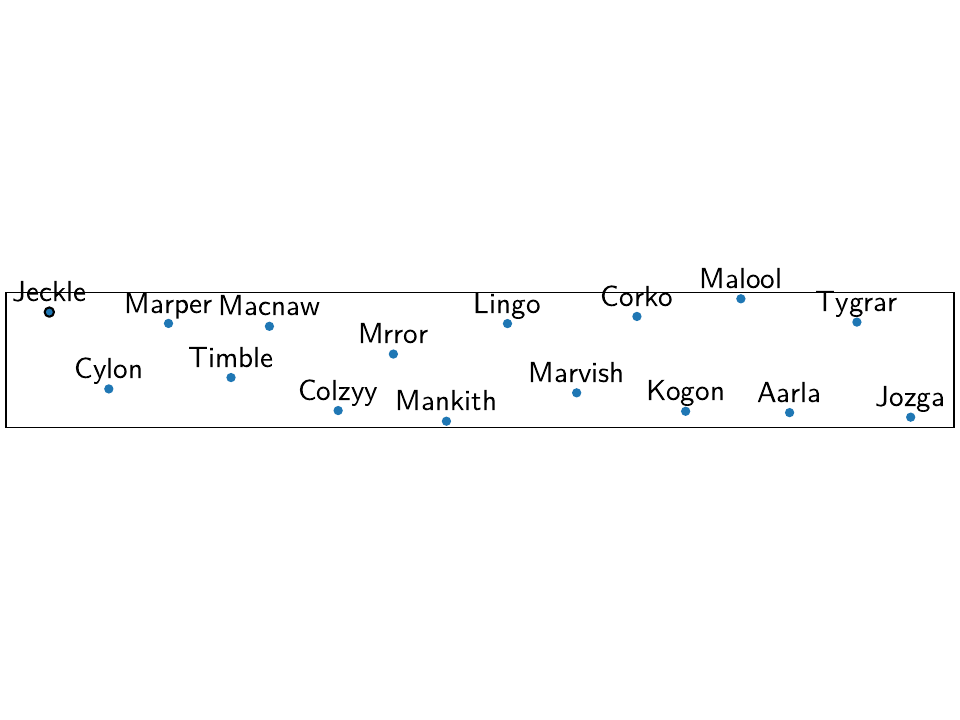
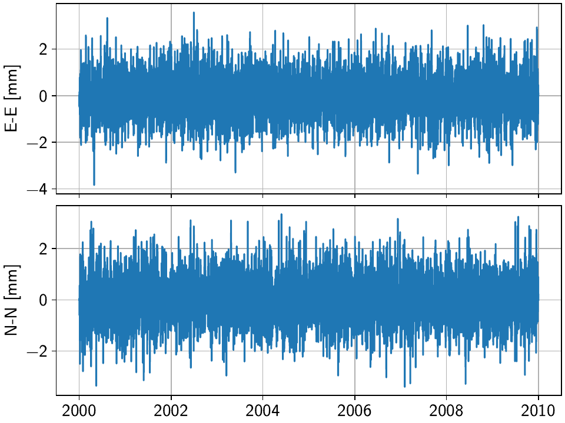
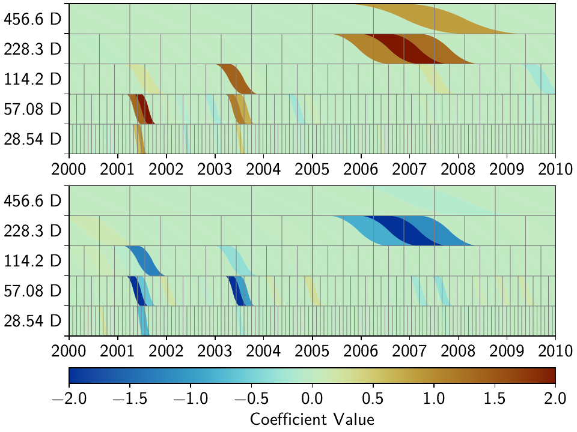
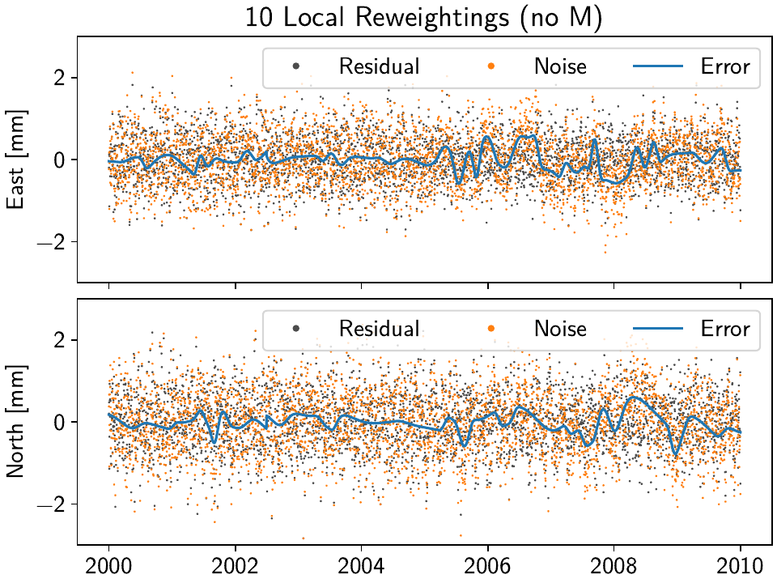
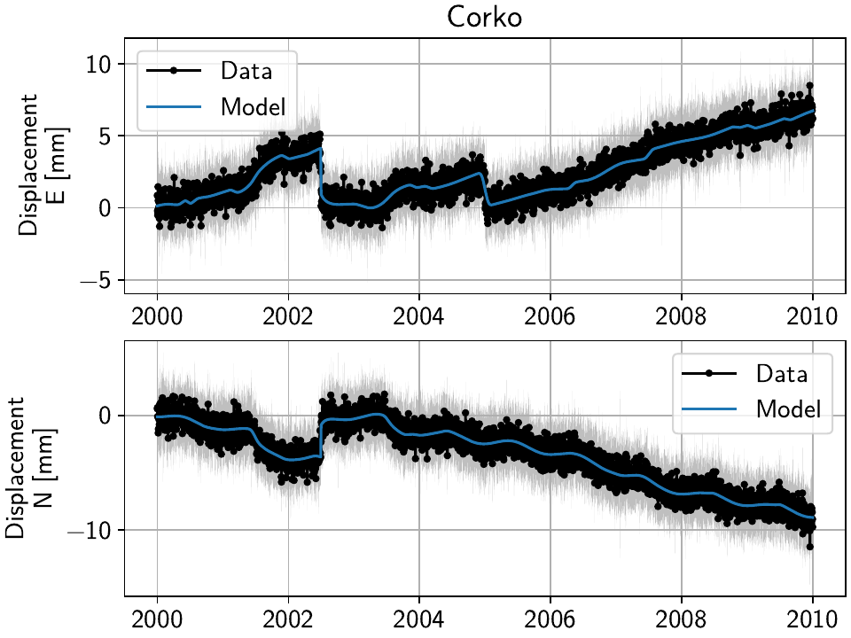
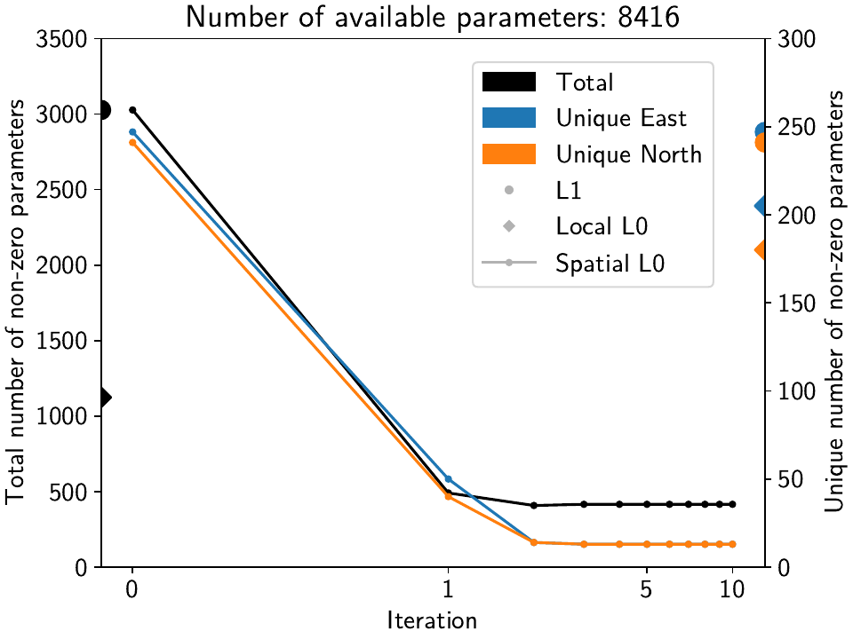

Tutorial 3: Incorporating Spatial Coherence
===========================================

One of the main goals of GeoNAT that should make it stand out from other timeseries analysis
software/routines is its ability to use spatial coherence as an additional source of
information and constrain. In general, signals like earthquakes, slip events, or seasonal
signals are spatially correlated, as the process have the same sources but affect multiple
stations. By using this knowledge in combination with the enforcement of sparsity, we can
make sure that the models that affect each station have the same character.

On the flipside, signals that only affect a single station are usually noise (like antenna
maintenance), which we would like to isolate. By making it harder for a station to fit a model
when no station around it sees the same signal, its residuals will become very large around
the time in question, and it is easier to therefore detect processes that need to be looked at
(or fitted specifically for that station).

In this tutorial, we will therefore create a synthetic network of 16 stations, seeing two
data components (East and North) each, that are affected by both regional processes (slow slip
events, an earthquake, and seasonal variations) as well as local ones (a maintenance step
and some local colored noise). Common Mode noise is added and estimated as well.
We will assess the incorporation of spatial coherence on a station-by-station basis (misfit
at the station with the singular maintenance step) as well as over the entire network
(by looking at the parameter correlation matrix between stations). The fitting and
evaluating will be done in parallel to achieve a significant speed-up.

.. note::
    By default, GeoNAT does not use parallelization because of the intricacies
    between Python, NumPy/SciPy, and the low-level math libraries like BLAS/LAPACK
    (which can differ from machine to machine). For more information, including how
    to properly set up parallelization, see :func:`~geonat.tools.parallelize`.

Preparations
------------

We need to prepare two things: parallelization (which can differ from the machine used to
test this tutorial to yours, see the note above) and a random number seed to make the data
and figures reproducible.
In this case here, setting the environment variable ``'OMP_NUM_THREADS'``
in the script does the trick, and we can set the number of threads manually:

.. doctest::

    >>> import os
    >>> os.environ['OMP_NUM_THREADS'] = '1'
    >>> import geonat
    >>> geonat.defaults["general"]["num_threads"] = 10

And we can create a random number generator just like in the previous example:

.. doctest::

    >>> import numpy as np
    >>> rng = np.random.default_rng(0)

Dreaming up a network
---------------------

The network we're dreaming of is a collection of 16 stations situated on the beautiful
`Null Island <https://en.wikipedia.org/wiki/Null_Island>`_. There is no reason the
stations shouldn't be named after fake kitten names created by a neural network of
`AI Weirdness <https://aiweirdness.com/post/162396324452/neural-networks-kittens>`_.
So, let's create the locations on a line-like grid with some random variations,
instantiate a :class:`~geonat.network.Network` object, and add the corresponding
:class:`~geonat.station.Station` objects:

.. doctest::

    >>> from geonat import Network, Station
    >>> net_name = "NullIsland"
    >>> station_names = ["Jeckle", "Cylon", "Marper", "Timble",
    ...                  "Macnaw", "Colzyy", "Mrror", "Mankith",
    ...                  "Lingo", "Marvish", "Corko", "Kogon",
    ...                  "Malool", "Aarla", "Tygrar", "Jozga"]
    >>> nlon, nlat = 16, 1
    >>> num_stations = nlon * nlat
    >>> lons, lats = np.meshgrid(np.linspace(0, 1, num=nlon),
    ...                          np.linspace(-0.1, 0.1, num=nlat))
    >>> net = Network(name=net_name)
    >>> for (istat, stat_name), lon, lat in zip(enumerate(station_names),
    ...                                         lons.ravel(), lats.ravel()):
    ...     temp_loc = [lat + rng.normal()*0.02 + int(istat % 2 == 0)*0.1,
    ...                 lon + rng.normal()*0.01, 0]
    ...     net[stat_name] = Station(name=stat_name,
    ...                              location=temp_loc)

Fantasizing data
----------------

Just as above, we first need a vector of time stamps:

.. doctest::

    >>> import pandas as pd
    >>> t_start_str = "2000-01-01"
    >>> t_end_str = "2010-01-01"
    >>> timevector = pd.date_range(start=t_start_str, end=t_end_str, freq="1D")

Remember that we wanted signals that are coherent in space. To do this, it is easiest
if we define a function that takes the location of a station as input, and returns
model parameters (for both the East and North components). That way, every station gets
the same signals, but we can vary the amplitudes to simulate decreasing distance to
the signal source by making the amplitude drop off with increasing longitude.
The model parameters are then used in the next step when the model objects are created.

The function will also need the common mode noise that should be added to each station,
and the variances and other distrbution parameters when generating the noise. Let's
define those first:

.. doctest::

    >>> # create CME
    >>> cme_noise = rng.normal(size=(timevector.size, 2)) * 0.2
    >>> # define noise covariance matrix
    >>> from scipy.stats import invgamma, laplace
    >>> var_e, var_n, cov_en = 0.354, 0.538, 0.015
    >>> invgamma_e_alpha, invgamma_e_scale = 2.569, 0.274
    >>> invgamma_n_alpha, invgamma_n_scale = 3.054, 0.536
    >>> laplace_en_scale = 0.031
    >>> noise_cov = np.array([[var_e, cov_en], [cov_en, var_n]])

Here, we have defined (1) a covariance matrix from which to generate normally-distributed
noise for the observations, (2) :math:`\alpha` and scale parameters for an
inverse-gamma-distributed sampling of observation variances, and (3) a laplacian-distributed
sampling of observation covariances. With these variables, and the common mode error,
we can create the actual function introduced above:

.. doctest::

    >>> def generate_parameters_noise(loc, rng):
    ...     lon, lat = loc[1], loc[0]
    ...     p_sec = np.array([[0, 0], [1, -1]])
    ...     p_seas = rng.uniform(-0.1, 0.1, size=(2, 2))
    ...     p_sse1 = np.array([[8, -8]])*np.exp(-(4 * lon**2))  # from the left
    ...     p_sse2 = np.array([[6, -6]])*np.exp(-(4 * lon**2))  # from the left
    ...     p_sse3 = np.array([[10, -10]])*np.exp(-(4 * lon**2))  # from the left
    ...     p_eq = np.array([[-5, 5]])
    ...     meas_noise = rng.multivariate_normal(mean=(0, 0), cov=noise_cov,
    ...                                          size=timevector.size) * 0.5
    ...     noisevec = meas_noise + cme_noise
    ...     estim_var_cov = np.stack([invgamma.rvs(invgamma_e_alpha, loc=var_e,
    ...                                            scale=invgamma_e_scale,
    ...                                            size=timevector.size, random_state=rng),
    ...                               invgamma.rvs(invgamma_n_alpha, loc=var_n,
    ...                                            scale=invgamma_n_scale,
    ...                                            size=timevector.size, random_state=rng),
    ...                               laplace.rvs(loc=cov_en, scale=laplace_en_scale,
    ...                                           size=timevector.size, random_state=rng)], axis=1)
    ...     return p_sec, p_seas, p_eq, p_sse1, p_sse2, p_sse3, noisevec, estim_var_cov

Now, we have to do the (slightly grueling) work of creating synthetic data, creating
model and timeseries objects, assigning the parameters to them, and then add them
to the station objects of the network - basically what we did in the previous tutorial,
but for *every station*. The following code is a bit much, but should still be
understandable when comparing side-by-side with the previous, single-station
example. The one important difference is that we do not yet add the model dictionary
to the station, since we will not be estimating models on the ``'Raw'`` timeseries,
but rather a cleaner timeseries after we remove the CME.

.. doctest::

    >>> from copy import deepcopy
    >>> from geonat import Timeseries
    >>> from geonat.models import Arctangent, Polynomial, Sinusoidal, Step, \
    ...     SplineSet, Logarithmic
    >>> from geonat.tools import create_powerlaw_noise
    >>> mdl_coll, mdl_coll_synth = {}, {}  # containers for the model objects
    >>> synth_coll = {}  # dictionary of synthetic data & noise for each stations
    >>> for station in net:
    ...     # think of some model parameters
    ...     p_sec, p_seas, p_eq, p_sse1, p_sse2, p_sse3, noisevec, estim_var_cov = \
    ...         generate_parameters_noise(station.location, rng)
    ...     # create model objects
    ...     mdl_sec = Polynomial(order=1, time_unit="Y", t_reference=t_start_str)
    ...     mdl_seas = Sinusoidal(period=1, time_unit="Y", t_reference=t_start_str)
    ...     mdl_eq = Step(["2002-07-01"])
    ...     mdl_post = Logarithmic(tau=20, t_reference="2002-07-01")
    ...     # Arctangent is for the truth, SplineSet are for how we will estimate them
    ...     mdl_sse1 = Arctangent(tau=40, t_reference="2001-07-01")
    ...     mdl_sse2 = Arctangent(tau=40, t_reference="2003-07-01")
    ...     mdl_sse3 = Arctangent(tau=400, t_reference="2007-01-01")
    ...     # we could align the Arctangents with the spline center times
    ...     # (e.g. 2001-07-24, 2003-06-09, 2007-07-02) but that would never happen in
    ...     # real life so it would just unrealistically embellish our results
    ...     mdl_trans = SplineSet(degree=2,
    ...                           t_center_start=t_start_str,
    ...                           t_center_end=t_end_str,
    ...                           list_num_knots=[int(1+2**n) for n in range(3, 8)])
    ...     # collect the models in the dictionary
    ...     mdl_coll_synth[station.name] = {"Secular": mdl_sec,
    ...                                     "Seasonal": mdl_seas,
    ...                                     "Earthquake": mdl_eq,
    ...                                     "Postseismic": mdl_post}
    ...     mdl_coll[station.name] = deepcopy(mdl_coll_synth[station.name])
    ...     mdl_coll_synth[station.name].update({"SSE1": mdl_sse1,
    ...                                          "SSE2": mdl_sse2,
    ...                                          "SSE3": mdl_sse3})
    ...     mdl_coll[station.name].update({"Transient": mdl_trans})
    ...     # only the model objects that will not be associated with the station
    ...     # get their model parameters read in
    ...     mdl_sec.read_parameters(p_sec)
    ...     mdl_seas.read_parameters(p_seas)
    ...     mdl_eq.read_parameters(p_eq)
    ...     mdl_post.read_parameters(p_eq/5)
    ...     mdl_sse1.read_parameters(p_sse1)
    ...     mdl_sse2.read_parameters(p_sse2)
    ...     mdl_sse3.read_parameters(p_sse3)
    ...     # now, evaluate the models
    ...     # noise will be white + colored
    ...     gen_data = \
    ...         {"seas+sec+eq": (mdl_sec.evaluate(timevector)["fit"] +
    ...                          mdl_seas.evaluate(timevector)["fit"] +
    ...                          mdl_eq.evaluate(timevector)["fit"] +
    ...                          mdl_post.evaluate(timevector)["fit"]),
    ...          "trans": (mdl_sse1.evaluate(timevector)["fit"] +
    ...                    mdl_sse2.evaluate(timevector)["fit"] +
    ...                    mdl_sse3.evaluate(timevector)["fit"]),
    ...          "noise": noisevec}
    ...     # for one station, we'll add a significant colored noise process
    ...     # but only after the first third, where there are no strong, short-term signals
    ...     if station.name == "Cylon":
    ...         gen_data["noise"][timevector.size//3:, :] += \
    ...             create_powerlaw_noise(size=(2 * timevector.size // 3, 2),
    ...                                   exponent=1.5, seed=rng)*0.4
    ...     # for one special station, we add the maintenance step
    ...     # repeating all steps above
    ...     if station.name == "Corko":
    ...         # time and amplitude
    ...         mdl_maint = Step(["2005-01-01"])
    ...         p_maint = np.array([[-5, 0]])
    ...         # add to station and synthetic data
    ...         mdl_coll_synth[station.name].update({"Maintenance": mdl_maint})
    ...         mdl_maint.read_parameters(p_maint)
    ...         gen_data["seas+sec+eq"] += mdl_maint.evaluate(timevector)["fit"]
    ...     # now we sum the components up...
    ...     gen_data["truth"] = gen_data["seas+sec+eq"] + gen_data["trans"]
    ...     gen_data["data"] = gen_data["truth"] + gen_data["noise"]
    ...     synth_coll[station.name] = gen_data
    ...     # ... and assign them to the station as timeseries objects
    ...     station["Truth"] = \
    ...         Timeseries.from_array(timevector=timevector,
    ...                               data=gen_data["truth"],
    ...                               src="synthetic",
    ...                               data_unit="mm",
    ...                               data_cols=["E", "N"])
    ...     station["Raw"] = \
    ...         Timeseries.from_array(timevector=timevector,
    ...                               data=gen_data["data"],
    ...                               var=estim_var_cov[:, :2],
    ...                               cov=estim_var_cov[:, 2],
    ...                               src="synthetic",
    ...                               data_unit="mm",
    ...                               data_cols=["E", "N"])

Let's have a look at the summary of the first station to see what we added:

.. doctest::

    >>> print(net["Jeckle"])
    Station Jeckle at [0.0025146044218678637, -0.0013210486329130189, 0] with timeseries
    Truth
     - Source: synthetic
     - Units: mm
     - Shape: (3654, 2)
     - Data: ['E', 'N']
    Raw
     - Source: synthetic
     - Units: mm
     - Shape: (3654, 2)
     - Data: ['E', 'N']
     - Variances: ['E_var', 'N_var']
     - Covariances: ['E_N_cov']

One can also have a look at an interactive map and inspect the data and models
of the stations using :meth:`~geonat.network.Network.gui`::

    >>> net.gui()

Which will present the following map:

Then, selecting the first station called "Jeckle" will produce the following plot
of all timeseries associated with that station, ``'Truth'`` and the noisy
``'Raw'``, in both East and North components:

.. image:: ../img/tutorial_3a_ts_Jeckle.png

For this station, the signal is obviously much larger than the noise, but if you
select stations further east, you'll see how the noise becomes the more dominant
part. How well we can recover the original signal can therefore be tested by looking
at all stations from west to east.

The figures above can either be saved from the interactive window, or by running
:meth:`~geonat.network.Network.gui` in a non-interactive mode::

    >>> net.gui(station="Jeckle", save=True, save_map=True)

Removing the Common Mode Error
------------------------------

To remove the common mode error that we added, we first need a high-pass filtered
version of our ``'Raw'`` timeseries. We can do this effectively and step-sensitive
by calculating the running median of the timeseries, and then removing this
smoothed timeseries from the original one.

Then, we find the common mode, usually done using Principal or Independent Component
Analysis. Lastly, we remove it from the original timeseries, which then yields the cleaner
timeseries we want to use going forward.
In code, the first three steps will look like this:

.. doctest::

    >>> # running median will be saved in "Filtered" timeseries
    >>> net.call_func_ts_return("median", ts_in="Raw", ts_out="Filtered", kernel_size=7)
    >>> # high-pass filtered timeseries will be in "Residual"
    >>> net.math("Residual", "Raw", "-", "Filtered")
    >>> # estimate the common mode
    >>> net.call_netwide_func("common_mode", ts_in="Residual", ts_out="CME", method="ica")

To have a closer look at the estimated common mode, one can also use the
:meth:`~geonat.network.Network.graphical_cme` method, which will show plots of the temporal
and spatial components of the estimated CME. If everything goes well, the temporal component
should look like normally-distributed noise, and the spatial component should look like
a homogenous motion of the stations across the network, like this:

|3b_cme_temporal| |3b_cme_spatial|

.. |3b_cme_spatial| image:: ../img/tutorial_3b_cme_spatial.png
    :width: 49%

Everything that's now left to do is to subtract the newly-created ``'CME'`` timeseries
from the ``'Raw'`` timeseries, call it the ``'Displacement'`` timeseries, copy over
the uncertainties from the original timeseries (assuming they are independent of the CME
estimation process). In the same loop, we can also now add the model dictionaries we
defined above. Lastly, we can remove the now-obsolete intermediate timeseries.

.. doctest::

    >>> for station in net:
    ...     # calculate the clean timeseries
    ...     station.add_timeseries("Displacement", station["Raw"] - station["CME"],
    ...                            override_data_cols=station["Raw"].data_cols)
    ...     # copy over the uncertainties
    ...     station["Displacement"].add_uncertainties(timeseries=station["Raw"])
    ...     # give the station the models to fit
    ...     station.add_local_model_dict(ts_description="Displacement",
    ...                                  model_dict=mdl_coll[station.name])
    >>> # remove unnecessary intermediate results
    >>> net.remove_timeseries("Filtered", "CME", "Residual")

To inspect the result, we can again have a look at the network with
:meth:`~geonat.network.Network.gui`, or print the summary of a station:

.. doctest::

    >>> print(net["Jeckle"])
    Station Jeckle at [0.0025146044218678637, -0.0013210486329130189, 0] with timeseries
    Truth
     - Source: synthetic
     - Units: mm
     - Shape: (3654, 2)
     - Data: ['E', 'N']
    Raw
     - Source: synthetic
     - Units: mm
     - Shape: (3654, 2)
     - Data: ['E', 'N']
     - Variances: ['E_var', 'N_var']
     - Covariances: ['E_N_cov']
    Displacement
     - Source: synthetic-common_mode
     - Units: mm
     - Shape: (3654, 2)
     - Data: ['E', 'N']
     - Variances: ['E_var', 'N_var']
     - Covariances: ['E_N_cov']
     - Models: ['Secular', 'Seasonal', 'Earthquake', 'Postseismic', 'Transient']

Fitting the data using reweighted L1 regularization
---------------------------------------------------

We'll basically do the same processing as at the end of the previous tutorial, but make
use of yet another high-level function to reduce the amount of lines we have to write:
:meth:`~geonat.network.Network.fitevalres`, which combines the two functions
:meth:`~geonat.network.Network.fit` and :meth:`~geonat.network.Network.evaluate` and
also calculates the residual using :meth:`~geonat.network.Network.math`.
We'll start with a single, non-iterative L1-regularized solution:

.. doctest::

    >>> net.fitevalres(ts_description="Displacement", solver="lasso_regression",
    ...                penalty=10, output_description="Fit_L1", residual_description="Res_L1")

We'll also calculate the true errors that we only know because we created the data ourselves,
and save the transient fitted model as a new timeseries (we'll use them later):

.. doctest::

    >>> for stat in net:
    ...     stat["Trans_L1"] = stat.fits["Displacement"]["Transient"].copy(only_data=True)
    >>> net.math("Err_L1", "Fit_L1", "-", "Truth")

For this solution and the future ones which will be exploting the spatial structure,
we want to continuously compare the fitted timeseries as well as the scalograms of
the Transient model. So let's decide on some potentially interesting stations, and
use the :meth:`~geonat.network.Network.gui` function to save some plots::

    >>> figure_stations = ["Jeckle", "Cylon", "Marvish", "Mankith", "Corko", "Tygrar", "Jozga"]
    >>> for s in figure_stations:
    ...     net.gui(station=s, save="base",
    ...             timeseries=["Displacement", "Res_L1"],
    ...             scalogram_kw_args={"ts": "Displacement", "model": "Transient",
    ...                                "cmaprange": 2})

Now, let's have a look at the two most western stations, "Jeckle" and "Cylon":

|3c_scalo_Jeckle_base| |3c_ts_Jeckle_base|

|3c_scalo_Cylon_base| |3c_ts_Cylon_base|

.. |3c_ts_Jeckle_base| image:: ../img/tutorial_3c_ts_Jeckle_base.png
    :width: 49%

.. |3c_scalo_Cylon_base| image:: ../img/tutorial_3c_scalo_Cylon_base.png
    :width: 49%

While in all cases the models fit the data well, one can observe two things.

First, for the time that we added colored noise to "Cylon", just as in the previous
tutorial, the transients created by the noise are fit by our spline dictionary.

Second, especially for the time without the colored noise, we can see that apart from a couple
splines that are the closest in time and period to the true slow slip events (SSEs)
arctangents, most splines that are non-zero in one station are (close to) zero at the other,
even though we know that both stations experience the same signal (only with a slightly
varying amplitude).

To make this assessment a bit more quantitative, let's get some key numbers that define
the sparsity of the model dictionary across the network.
We want to set a threshold below which we consider a parameter "basically zero".
Then, for each solution we produce, we want to know how many parameters across the entire
network are non-zero, and how many unique non-zero parameters there are (i.e., if a spline
is used at multiple stations, we'll only count it once). For this, we set the ``ZERO`` variable,
and count the number of total, non-zero, and unique non-zero parameters:

.. doctest::

    >>> ZERO = 1e-4  # this is from the default in SpatialSolver
    >>> num_total = sum([s.models["Displacement"]["Transient"].parameters.size for s in net])
    >>> num_uniques = \
    ...     np.sum(np.any(np.stack([np.abs(s.models["Displacement"]["Transient"].parameters)
    ...                             > ZERO for s in net]), axis=0), axis=0)
    >>> num_nonzero = sum([(s.models["Displacement"]["Transient"].parameters.ravel() > ZERO).sum()
    ...                    for s in net])
    >>> print(f"Number of reweighted non-zero parameters: {num_nonzero}/{num_total}")
    Number of reweighted non-zero parameters: 480/8416
    >>> print("Number of unique reweighted non-zero parameters per component: "
    ...       + str(num_uniques.tolist()))
    Number of unique reweighted non-zero parameters per component: [115, 102]

Let's keep track of these numbers: All 16 stations (and both components) combined are
fit by 480 splines (out of the total possible 8416). Of a total of 526 possible splines
at any given station (including both components), 115 in the East and 102 in the North
component are non-zero at least at one station. That is not terribly sparse for three
slow-slip events (SSEs), since the coseismic, postseismic, and seasonal signal should not
be fitted by the splines.

This effectively means that wherever there is not a strong enough signal, the solver will
follow the noise realization at that station to fit the data best given the L1 penalty,
and therefore choose slightly different splines each time.
If we could somehow let the solver know that this is noise, and that the underlying
signal should be coherent in space, it wouldn't overfit the data where there is no signal,
and we would have a better understanding of both the true signal and the noise.

(*Something else that we will have a look at later, but for now just need to save the data,
is the spatial correlation between the fitted transients - more details about that later,
but for now, let's just save the data:*)

.. doctest::

    >>> cor_base = np.corrcoef(np.stack([s.fits["Displacement"]["Transient"].data.values[:, 1]
    ...                                  for s in net]))

Using L1 iteration at each station independently (=locally) does not solve the problem,
either, but let's still have a look at the same two stations when we add that:

.. doctest::

    >>> net.fitevalres(ts_description="Displacement", solver="lasso_regression",
    ...                penalty=10, reweight_max_iters=5,
    ...                output_description="Fit_L1R5", residual_description="Res_L1R5")
    >>> for stat in net:
    ...     stat["Trans_L1R5"] = stat.fits["Displacement"]["Transient"].copy(only_data=True)
    >>> net.math("Err_L1R5", "Fit_L1R5", "-", "Truth")
    >>> # get spatial correlation matrix for later
    >>> cor_localiters = np.corrcoef(np.stack([s.fits["Displacement"]["Transient"].data.values[:, 1]
    ...                                        for s in net]))
    >>> num_total = sum([s.models["Displacement"]["Transient"].parameters.size for s in net])
    >>> num_uniques = \
    ...     np.sum(np.any(np.stack([np.abs(s.models["Displacement"]["Transient"].parameters)
    ...                             > ZERO for s in net]), axis=0), axis=0)
    >>> num_nonzero = sum([(s.models["Displacement"]["Transient"].parameters.ravel() > ZERO).sum()
    ...                    for s in net])
    >>> print(f"Number of reweighted non-zero parameters: {num_nonzero}/{num_total}")
    Number of reweighted non-zero parameters: 243/8416
    >>> print("Number of unique reweighted non-zero parameters per component: "
    ...       + str(num_uniques.tolist()))
    Number of unique reweighted non-zero parameters per component: [86, 72]

Which gives the following figures (see the plotting code above):

|3c_scalo_Jeckle_local| |3c_ts_Jeckle_local|

|3c_scalo_Cylon_local| |3c_ts_Cylon_local|

.. |3c_scalo_Cylon_local| image:: ../img/tutorial_3c_scalo_Cylon_local.png
    :width: 49%

.. |3c_ts_Cylon_local| image:: ../img/tutorial_3c_ts_Cylon_local.png
    :width: 49%

We can see that the total number of non-zero splines decreased by around half, the number
of *unique* non-zero splines decreased by far less. Furthermore, we still
see that different splines are used throughout the stations for the same signal.

Unless we want to create one giant least-squares L1-regularized problem that combines
all stations, and giving the spline parameters a distance-dependent covariance matrix
between the stations (which is computationally still unfeasible for any real regional
network), we need to think of a better way to reduce the number of unique splines.

Fitting the data using a spatially-aware L1 reweighting
-------------------------------------------------------

[riel14]_ solves the problem by alternating between a station-specific solution, and a step
where the parameter weights of each L1-regularized problems are gathered, compared, and
updated based on a weighting scheme. In GeoNAT, this is handled by the
:class:`~geonat.solvers.SpatialSolver` class, where more information about its algorithm
can be found. In this tutorial, we just want to show how it is used and how it can improve
the quality of the fit.

First, we create a solver object for our network (``net``) and the timeseries we're looking
at (``'Displacement'``) that will be used for the next couple of solution calls:

.. doctest::

    >>> from geonat.solvers import SpatialSolver
    >>> spatsol = SpatialSolver(net, "Displacement")

Now, we use the :meth:`~geonat.solvers.SpatialSolver.solve` method, which takes some
important arguments, and passes the rest onto the general :meth:`~geonat.network.Network.fit`
method. Just like the latter, we give it an (initial) ``penalty`` parameter, and our
``cvxpy_kw_args`` solver settings. Additionally, we can now specify the models which we
want to combine spatially (``spatial_reweight_models``), and how many spatial iterations
we want (``spatial_reweight_iters``). We can also specify the ``verbose`` option so that
we get some interesting statistics along the way (plus some progress bars that aren't shown
here). Let's start by running only one spatial iteration, and evaluating its solution:

.. doctest::

    >>> spatsol.solve(penalty=10,
    ...               spatial_reweight_models=["Transient"],
    ...               spatial_reweight_iters=1,
    ...               formal_covariance=True,
    ...               verbose=True)
    Calculating scale lengths
    Initial fit
    Number of reweighted non-zero parameters: 480/8416
    Number of unique reweighted non-zero parameters per component: [115, 102]
    Updating weights
    Stacking model Transient
    Weight percentiles (5-50-95): [29.2007317, 9999.8402817, 9999.995094]
    Fit after 1 reweightings
    Number of reweighted non-zero parameters: 216/8416
    Number of unique reweighted non-zero parameters per component: [48, 46]
    RMS difference of 'Transient' parameters = 5.867862896 (552 changed)
    Done
    >>> net.evaluate("Displacement", output_description="Fit_L1R1S1")
    >>> for stat in net:
    ...     stat["Trans_L1R1S1"] = stat.fits["Displacement"]["Transient"].copy(only_data=True)
    >>> net.math("Res_L1R1S1", "Displacement", "-", "Fit_L1R1S1")
    >>> net.math("Err_L1R1S1", "Fit_L1R1S1", "-", "Truth")
    >>> # get spatial correlation matrix for later
    >>> cor_spatialiters1 = \
    ...     np.corrcoef(np.stack([s.fits["Displacement"]["Transient"].data.values[:, 1]
    ...                           for s in net]))

The two key numbers we want to check first are the same two we looked at above,
which are automatically output by the ``verbose`` option::

    ...
    Initial fit
    Number of reweighted non-zero parameters: 480/8416
    Number of unique reweighted non-zero parameters per component: [115, 102]
    ...
    Fit after 1 reweightings
    Number of reweighted non-zero parameters: 216/8416
    Number of unique reweighted non-zero parameters per component: [48, 46]
    ...

The numbers before the first reweighting are exactly the same from before we iterated
at all - which makes sense since the initial solve is before any reweighting can be
done, and we did not specify any local L1 reweighting iterations.
The next two numbers are new however, and they show the effect of our spatial
combination scheme: not only did the total number of non-zero parameters drop
significantly (as before), but the number of *unique* non-zero parameters dropped
significantly as well.

Let's see how this manifests itself in the same stations we looked at above:

|3c_scalo_Jeckle_spatial1| |3c_ts_Jeckle_spatial1|

|3c_scalo_Cylon_spatial1| |3c_ts_Cylon_spatial1|

.. |3c_scalo_Jeckle_spatial1| image:: ../img/tutorial_3c_scalo_Jeckle_spatial1.png
    :width: 49%

.. |3c_ts_Jeckle_spatial1| image:: ../img/tutorial_3c_ts_Jeckle_spatial1.png
    :width: 49%

.. |3c_scalo_Cylon_spatial1| image:: ../img/tutorial_3c_scalo_Cylon_spatial1.png
    :width: 49%

.. |3c_ts_Cylon_spatial1| image:: ../img/tutorial_3c_ts_Cylon_spatial1.png
    :width: 49%

As we can see, the fit to the data is almost as good, and the splines used to get
to that fit are basically the same between the two stations. Let's see when and
if the spatial iterations converge by doing the same thing, but with 20 reweighting
steps:

.. doctest::

    >>> spatsol.solve(penalty=10,
    ...               spatial_reweight_models=["Transient"],
    ...               spatial_reweight_iters=20,
    ...               formal_covariance=True,
    ...               verbose=True)
    Calculating scale lengths
    ...
    Done
    >>> net.evaluate("Displacement", output_description="Fit_L1R1S20")
    >>> for stat in net:
    ...     stat["Trans_L1R1S20"] = stat.fits["Displacement"]["Transient"].copy(only_data=True)
    >>> net.math("Res_L1R1S20", "Displacement", "-", "Fit_L1R1S20")
    >>> net.math("Err_L1R1S20", "Fit_L1R1S20", "-", "Truth")
    >>> # get spatial correlation matrix for later
    >>> cor_spatialiters20 = \
    ...     np.corrcoef(np.stack([s.fits["Displacement"]["Transient"].data.values[:, 1]
    ...                           for s in net]))

Let's first have a look at the scalograms and timeseries of the stations
we looked at before:

|3c_scalo_Jeckle_spatial20| |3c_ts_Jeckle_spatial20|

|3c_scalo_Cylon_spatial20| |3c_ts_Cylon_spatial20|

.. |3c_scalo_Jeckle_spatial20| image:: ../img/tutorial_3c_scalo_Jeckle_spatial20.png
    :width: 49%

.. |3c_ts_Jeckle_spatial20| image:: ../img/tutorial_3c_ts_Jeckle_spatial20.png
    :width: 49%

.. |3c_scalo_Cylon_spatial20| image:: ../img/tutorial_3c_scalo_Cylon_spatial20.png
    :width: 49%

.. |3c_ts_Cylon_spatial20| image:: ../img/tutorial_3c_ts_Cylon_spatial20.png
    :width: 49%

We can now see that this effect is much stronger now: only a handful of splines
are used by the two stations. Unavoidably, the fit has become a bit worse: for the
"Jeckle" station, for example, we can see that some left-over signal can be found
in the residual North timeseries around the first SSE.
This can probably be tuned by changing the L1 ``penalty``, or by choosing a different
``local_reweight_func``, or many other configuration settings that are present in
:meth:`~geonat.solvers.SpatialSolver.solve`.
Another way that could potentially mitigate the problem would be to use more splines
that will then better match the onset times of the transients we generated. However,
we won't spend time on it here since the effects of the tuning will depend a lot on the
data you have.
More importantly though, since in the real world you don't know the true signal
and noise, even if you would fit more signal, you could not be sure that you didn't
fit a noise process.

What is important to point out, however, is that the residuals at "Cylon" do not look as
Gaussian anymore for the timespan we added colored noise. Our goal was to suppress
fitting noise processes as signals. Let's plot the residuals, true noise, and our errors,
to see if that was successful by comparing this solution with the one that only
had local reweighting iterations::

    >>> import matplotlib.pyplot as plt
    >>> from matplotlib.lines import Line2D
    >>> stat = net["Cylon"]
    >>> for title, case, res_ts, err_ts in \
    ...     zip(["5 Local Reweightings", "1 Local, 20 Spatial Reweighting"],
    ...         ["local", "spatial20"],
    ...         ["Res_L1R5", "Res_L1R1S20"],
    ...         ["Err_L1R5", "Err_L1R1S20"]):
    ...     fig, ax = plt.subplots(nrows=2, sharex=True)
    ...     ax[0].set_title(title)
    ...     ax[0].plot(stat[res_ts].data.iloc[:, 0], c='0.3',
    ...                ls='none', marker='.', markersize=0.5)
    ...     ax[0].plot(stat[res_ts].time, synth_coll["Cylon"]["noise"][:, 0], c='C1',
    ...                ls='none', marker='.', markersize=0.5)
    ...     ax[0].plot(stat[err_ts].data.iloc[:, 0], c="C0")
    ...     ax[0].set_ylim(-3, 3)
    ...     ax[0].set_ylabel("East [mm]")
    ...     ax[1].plot(stat[res_ts].data.iloc[:, 1], c='0.3',
    ...                ls='none', marker='.', markersize=0.5)
    ...     ax[1].plot(stat[res_ts].time, synth_coll["Cylon"]["noise"][:, 1], c='C1',
    ...                ls='none', marker='.', markersize=0.5)
    ...     ax[1].plot(stat[err_ts].data.iloc[:, 1], c="C0")
    ...     ax[1].set_ylim(-3, 3)
    ...     ax[1].set_ylabel("North [mm]")
    ...     custom_lines = [Line2D([0], [0], c="0.3", marker=".", linestyle='none'),
    ...                     Line2D([0], [0], c="C1", marker=".", linestyle='none'),
    ...                     Line2D([0], [0], c="C0")]
    ...     ax[0].legend(custom_lines, ["Residual", "Noise", "Error"],
    ...                  loc="upper right", ncol=3)
    ...     ax[1].legend(custom_lines, ["Residual", "Noise", "Error"],
    ...                  loc="upper right", ncol=3)
    ...     fig.savefig(f"tutorial_3d_Cylon_{case}.png")
    ...     plt.close(fig)

Which produces the following plots:

|3d_Cylon_local| |3d_Cylon_spatial20|

.. |3d_Cylon_spatial20| image:: ../img/tutorial_3d_Cylon_spatial20.png
    :width: 49%

Indeed, we can see that the spatial reweighting hindered the solver to fit for many
small-scale noise transients. We can see this in the fact that our residual now more
closely tracks the true noise, and the true error oscillates less and stays closer to zero.

Quantitatively, we can also see this when we compute the root-mean-squared error
for the error time series. We can calculate it easily using
:meth:`~geonat.network.Network.analyze_residuals`
for both error timeseries ``'Err_L1R5'`` and ``'Err_L1R1S20'``:

.. doctest::
    :options: +NORMALIZE_WHITESPACE

    >>> for err_ts in ["Err_L1R5", "Err_L1R1S20"]:
    ...     print(f"\nErrors for {err_ts}:")
    ...     stats = net.analyze_residuals(err_ts, mean=True, rms=True)
    ...     print(stats)
    ...     print(stats.mean())
    <BLANKLINE>
    Errors for Err_L1R5:
    Metrics                      Mean                                           RMS                       
    Components Displacement_Model_E-E Displacement_Model_N-N Displacement_Model_E-E Displacement_Model_N-N
    Station                                                                                               
    Jeckle                  -0.000419               0.004276               0.051671               0.052860
    Cylon                   -0.014228              -0.069455               0.236574               0.234167
    Marper                   0.000090               0.009656               0.054688               0.066559
    Timble                  -0.003406              -0.009334               0.051991               0.056480
    Macnaw                   0.013660               0.002161               0.049895               0.059900
    Colzyy                  -0.008162              -0.009456               0.055317               0.049139
    Mrror                    0.005766               0.002203               0.039287               0.051551
    Mankith                 -0.002974               0.015512               0.033198               0.045708
    Lingo                    0.001447              -0.013287               0.049481               0.047579
    Marvish                  0.003766              -0.002676               0.036636               0.038895
    Corko                   -0.008496              -0.001993               0.156964               0.039665
    Kogon                   -0.006134               0.000849               0.042909               0.033994
    Malool                  -0.000222               0.006196               0.024945               0.037281
    Aarla                    0.002159              -0.001884               0.028283               0.037532
    Tygrar                   0.019776              -0.007437               0.040040               0.032706
    Jozga                   -0.006292               0.002840               0.030650               0.034295
    Metrics  Components            
    Mean     Displacement_Model_E-E   -0.000229
             Displacement_Model_N-N   -0.004489
    RMS      Displacement_Model_E-E    0.061408
             Displacement_Model_N-N    0.057394
    dtype: float64
    <BLANKLINE>
    Errors for Err_L1R1S20:
    Metrics                      Mean                                           RMS                       
    Components Displacement_Model_E-E Displacement_Model_N-N Displacement_Model_E-E Displacement_Model_N-N
    Station                                                                                               
    Jeckle                  -0.000603               0.004310               0.074261               0.089493
    Cylon                   -0.014122              -0.069685               0.207266               0.222614
    Marper                   0.000354               0.009706               0.076109               0.083413
    Timble                  -0.003060              -0.008974               0.069288               0.075120
    Macnaw                   0.013533               0.002567               0.066525               0.070245
    Colzyy                  -0.008294              -0.009594               0.060502               0.059799
    Mrror                    0.005581               0.002369               0.052769               0.049664
    Mankith                 -0.003092               0.015610               0.046768               0.051902
    Lingo                    0.001431              -0.012418               0.070340               0.116142
    Marvish                  0.003723              -0.002539               0.049711               0.077394
    Corko                   -0.007965               0.000391               0.964100               0.068229
    Kogon                   -0.005963               0.000649               0.050347               0.042423
    Malool                   0.000086               0.006696               0.044707               0.045154
    Aarla                    0.002088              -0.001602               0.037883               0.050733
    Tygrar                   0.019685              -0.007423               0.031079               0.037552
    Jozga                   -0.006362               0.002919               0.022684               0.028852
    Metrics  Components            
    Mean     Displacement_Model_E-E   -0.000186
             Displacement_Model_N-N   -0.004189
    RMS      Displacement_Model_E-E    0.120271
             Displacement_Model_N-N    0.073046
    dtype: float64

If you look at the lines for "Cylon", the standard deviation reduced from
``0.236574`` and ``0.234167`` to ``0.207266`` and ``0.222614``, respectively.

.. warning::

    Before you get too excited, be aware though that this is an idealized synthetic
    example. In real data, you might see much stronger colored noise, at more stations,
    that might be correlated in time and space. Some of it can be taken care of by
    removing the common mode error, and some of it with the spatial reweighting presented
    here, but don't expect it to solve all issues with colored and/or station-individual
    noise. This will also all be sensitive to the penalty parameter, the reweighting
    function, and much more.

Finding unmodeled jumps
-----------------------

When looking at the errors that we just printed out, we are painfully reminded that
we added an unmodeled maintenance step to the station "Corko". Lets's use the
:meth:`~geonat.network.Network.gui` function to plot the scalograms and timeseries
fits for the station for the two cases we just used.

For 5 local iterations, we get:

|3c_scalo_Corko_local| |3c_ts_Corko_local|

.. |3c_scalo_Corko_local| image:: ../img/tutorial_3c_scalo_Corko_local.png
    :width: 49%

And for the 20 spatial iterations, we get:

|3c_scalo_Corko_spatial20| |3c_ts_Corko_spatial20|

.. |3c_scalo_Corko_spatial20| image:: ../img/tutorial_3c_scalo_Corko_spatial20.png
    :width: 49%

.. |3c_ts_Corko_spatial20| image:: ../img/tutorial_3c_ts_Corko_spatial20.png
    :width: 49%

Not surprisingly, if we only care about the locally best solution, the solver
will fit the smallest spline as close to the unmodeled jump with a high amplitude.
The result is an overall good fit, with some larger residuals around the time of
the jump (since even the smallest spline is not as short as a day).

If we enforce spatial coherence, the other stations "forbid" the use of the spline
closest to the maintenance jump, such that "Corko" can't use it, resulting in large
residuals before and after the jump. All other modeled signals are contorted
to try to minimize the rest of the residual: for example, the splines that are
associated with the SSEs are fit to a much larger amplitude to compensate for the
maintenance step.

Let's look at the residuals more quantitatively, similar to above:

.. doctest::
    :options: +NORMALIZE_WHITESPACE

    >>> for res_ts in ["Res_L1R5", "Res_L1R1S20"]:
    ...     print(f"\nResiduals for {res_ts}:")
    ...     stats = net.analyze_residuals(res_ts, mean=True, rms=True)
    ...     print(stats)
    ...     print(stats.mean())
    <BLANKLINE>
    Residuals for Res_L1R5:
    Metrics                      Mean                                           RMS                       
    Components E-Displacement_Model_E N-Displacement_Model_N E-Displacement_Model_E N-Displacement_Model_N
    Station                                                                                               
    Jeckle                   0.000217              -0.000406               0.299326               0.365428
    Cylon                    0.000888              -0.000722               0.336985               0.392841
    Marper                  -0.001353               0.000735               0.298187               0.372748
    Timble                   0.000195               0.000298               0.305253               0.367437
    Macnaw                  -0.002215               0.000072               0.302128               0.373000
    Colzyy                   0.000524              -0.000496               0.299192               0.366715
    Mrror                    0.000439              -0.001248               0.298842               0.366128
    Mankith                 -0.000727               0.000515               0.297009               0.361576
    Lingo                   -0.000670               0.000531               0.305571               0.369482
    Marvish                  0.000656               0.001027               0.294560               0.365664
    Corko                   -0.001105              -0.000343               0.330492               0.363457
    Kogon                   -0.002307              -0.000045               0.297508               0.369853
    Malool                   0.001667              -0.000952               0.297290               0.364235
    Aarla                   -0.000689              -0.000590               0.294162               0.368612
    Tygrar                  -0.001552              -0.001614               0.302507               0.363075
    Jozga                    0.001387              -0.002295               0.297752               0.370264
    Metrics  Components            
    Mean     E-Displacement_Model_E   -0.000290
             N-Displacement_Model_N   -0.000346
    RMS      E-Displacement_Model_E    0.303548
             N-Displacement_Model_N    0.368782
    dtype: float64
    <BLANKLINE>
    Residuals for Res_L1R1S20:
    Metrics                      Mean                                           RMS                       
    Components E-Displacement_Model_E N-Displacement_Model_N E-Displacement_Model_E N-Displacement_Model_N
    Station                                                                                               
    Jeckle                   0.000401              -0.000440               0.305737               0.373605
    Cylon                    0.000782              -0.000492               0.367720               0.423246
    Marper                  -0.001617               0.000685               0.306087               0.378808
    Timble                  -0.000151              -0.000062               0.310387               0.372219
    Macnaw                  -0.002088              -0.000334               0.306180               0.375493
    Colzyy                   0.000655              -0.000358               0.302303               0.370089
    Mrror                    0.000625              -0.001414               0.303279               0.366867
    Mankith                 -0.000609               0.000418               0.298799               0.363577
    Lingo                   -0.000655              -0.000338               0.310232               0.383017
    Marvish                  0.000698               0.000891               0.297081               0.371303
    Corko                   -0.001635              -0.002726               1.014667               0.368751
    Kogon                   -0.002477               0.000154               0.300482               0.372760
    Malool                   0.001360              -0.001451               0.298818               0.367367
    Aarla                   -0.000618              -0.000872               0.296498               0.371617
    Tygrar                  -0.001461              -0.001629               0.303384               0.364730
    Jozga                    0.001457              -0.002374               0.298983               0.371413
    Metrics  Components            
    Mean     E-Displacement_Model_E   -0.000333
             N-Displacement_Model_N   -0.000646
    RMS      E-Displacement_Model_E    0.351290
             N-Displacement_Model_N    0.374679
    dtype: float64

While in the first case, the residual in the North component at ``0.330492``,
in the second case, it is significantly larger at ``1.014667``, making it
clearly stand out.

In fact, we can use :meth:`~geonat.network.Network.gui` to visualize this
(using the ``rms_on_map`` option)::

    >>> net.gui(station="Corko", save=True, save_map=True,
    ...         timeseries=["Displacement", "Res_L1R1S20"],
    ...         rms_on_map={"ts": "Res_L1R1S20", "comps": [0], "c_max": 1})

Which gives:

.. image:: ../img/tutorial_3c_map_Corko_spatial20.png

The station definitely stands out. Once a user sees this, they can check out the
timeseries of that station and/or consult a maintenance dictionary and/or
check an earthquake catalog to see if there is a step signal that should be modeled.
Then, a step model can be added to the station, and the entire network can be fit again,
producing an even better fit to the data.

The :class:`~geonat.processing.StepDetector` class is a simple method to check for these
large unmodeled jumps in the residuals (see its documentation for more details).
If we use it to find steps in the two residual timeseries, we can skip the manual labor
of clicking through all the stations and looking for jumps, and focus on those that are
identified by the algorithm:

.. doctest::

    >>> from geonat.processing import StepDetector
    >>> stepdet = StepDetector(kernel_size=31)
    >>> for res_ts in ["Res_L1R5", "Res_L1R1S20"]:
    ...     print(f"\nPossible steps for {res_ts}:")
    ...     print(stepdet.search_network(net, res_ts)[0])
    <BLANKLINE>
    Possible steps for Res_L1R5:
      station       time  probability      var0      var1
    0   Corko 2005-01-01    91.875255  1.545948  0.073274
    <BLANKLINE>
    Possible steps for Res_L1R1S20:
      station       time  probability      var0      var1
    0   Corko 2002-07-01   115.882824  2.467034  0.053901
    1   Corko 2005-01-01    95.743064  1.607549  0.067256

In this case, both residual timeseries contain a strong enough jump for the detector to
isolate the missing maintenance step on 2005-01-01. Furthermore, we also see in numbers
what we mentioned before: that other models far away from the actual maintenance step
are modified to reduce the overall misfit. Here, the earthquake step that we are modeling
on 2002-07-01 is changed in amplitude so that there is still a significant residual
on that day.

Statistics of spatial reweighting
---------------------------------

Let's have a look at the statistics saved by ourselves as well as those saved
by :class:`~geonat.solvers.SpatialSolver` into its attribute
:attr:`~geonat.solvers.SpatialSolver.last_statistics`.
The first three variables contain the key numbers we used before to show how
the spatial reweighting not only reduces the total number of splines used, but
also the number of *unique* splines used across the network.
The second three capture the extent to which the parameters change between
the iterations.

Let's make two figures that show how they evolve and converge::

    >>> num_total, arr_uniques, list_nonzeros, dict_rms_diff, dict_num_changed = \
    ...     spatsol.last_statistics
    >>> # first figure is for num_total, arr_uniques, list_nonzeros
    >>> fig, ax1 = plt.subplots()
    >>> ax2 = ax1.twinx()
    >>> ax1.plot(list_nonzeros, c="k", marker=".")
    >>> ax1.set_ylim([0, 500])
    >>> ax1.set_yticks(range(0, 600, 100))
    >>> ax2.plot(arr_uniques[:, 0], c="C0", marker=".")
    >>> ax2.plot(arr_uniques[:, 1], c="C1", marker=".")
    >>> ax2.set_ylim([0, 150])
    >>> ax2.set_yticks(range(0, 180, 30))
    >>> ax1.set_xticks([0, 1, 5, 10, 15, 20])
    >>> ax1.set_xlabel("Iteration")
    >>> ax1.set_ylabel("Total number of non-zero parameters")
    >>> ax2.set_ylabel("Unique number of non-zero parameters")
    >>> custom_lines = [Line2D([0], [0], c="k", marker="."),
    ...                 Line2D([0], [0], c="C0", marker="."),
    ...                 Line2D([0], [0], c="C1", marker=".")]
    >>> ax1.legend(custom_lines, ["Total", "Unique East", "Unique North"])
    >>> ax1.set_title(f"Number of available parameters: {num_total}")
    >>> fig.savefig("tutorial_3e_numparams.png")
    >>> plt.close(fig)
    >>> # second figure is for dict_rms_diff, dict_num_changed
    >>> fig, ax1 = plt.subplots()
    >>> ax2 = ax1.twinx()
    >>> ax1.plot(range(1, 21), dict_rms_diff["Transient"], c="C0", marker=".")
    >>> ax1.set_yscale("log")
    >>> ax1.set_ylim([1e-4, 10])
    >>> ax2.plot(range(1, 21), dict_num_changed["Transient"], c="C1", marker=".")
    >>> ax2.set_yscale("symlog", linthresh=10)
    >>> ax2.set_ylim([0, 1000])
    >>> ax2.set_yticks([0, 2, 4, 6, 8, 10, 100, 1000])
    >>> ax2.set_yticklabels([0, 2, 4, 6, 8, 10, 100, 1000])
    >>> ax1.set_xticks([0, 1, 5, 10, 15, 20])
    >>> ax1.set_xlabel("Iteration")
    >>> ax1.set_ylabel("RMS difference of parameters")
    >>> ax2.set_ylabel("Number of changed parameters")
    >>> custom_lines = [Line2D([0], [0], c="C0", marker="."),
    ...                 Line2D([0], [0], c="C1", marker=".")]
    >>> ax1.legend(custom_lines, ["RMS Difference", "Changed Parameters"])
    >>> fig.savefig("tutorial_3e_diffs.png")
    >>> plt.close(fig)

The first figure shows that at around 10 iterations, both the total number of
parameters as well as the unique ones in both components have converged.

The second figure shows that around the same time, the RMS difference of fitted
parameters falls below 10 :sup:`-2`, and around less than 10 parameters change
between each iteration. Towards 20 iterations, no parameters actually change between
being close-to-zero or non-zero, they just change their value slightly.
This shows that the spatial reweighting scheme employed by GeoNAT converges nicely
and fulfills the goal of reducing the number of unique splines used by the entire network.

.. image:: ../img/tutorial_3e_diffs.png

Now, let's pick up on the correlation matrices saved throughout this tutorial
without explaining you why:
``cor_base, cor_localiters, cor_spatialiters1, cor_spatialiters20``.
What are they? For the North component (the one without the unmodeled maintenance step),
we computed the correlation coefficients (between -1 and 1) of the modeled signal (timeseries)
from only the transient :class:`~geonat.models.SplineSet` model between station.
This means that the more similar the fitted transients are in shape (amplitude does not
influence the correlation coefficient), i.e. in timing and phases of the transients,
the higher the coefficients will be.

We can use these matrices now to plot the (symmetric) correlation matrices for the two
main cases we considered above, and also to compute an "average" spatial correlation.
If we successfully fitted the our synthetic transients, which we know are the same
everywhere, we should see that the average correlation increases when using the
spatial reweighting. Here's some example code::

    >>> for title, case, cormat in \
    ...     zip(["5 Local Reweightings", "1 Local, 20 Spatial Reweighting"],
    ...         ["local", "spatial20"], [cor_localiters, cor_spatialiters20]):
    ...     # average spatial correlation of transient timeseries
    ...     avgcor = np.mean(np.ma.masked_equal(np.triu(cormat, 1), 0))
    ...     print(f"\nAverage spatial correlation = {avgcor}\n")
    ...     # spatial correlation visualization
    ...     plt.figure()
    ...     plt.title(title)
    ...     plt.imshow(cormat, vmin=-1, vmax=1, interpolation="none")
    ...     plt.yticks(ticks=range(num_stations),
    ...                labels=list(net.stations.keys()))
    ...     plt.xticks([])
    ...     plt.tight_layout()
    ...     plt.savefig(f"tutorial_3f_corr_{case}.png")
    ...     plt.close()

In fact, our average spatial correlation increased from ``0.867657903563245``
to ``0.9629705453051701``. We can see this visually in the plots we just saved:

|3f_corr_local| |3f_corr_spatial20|

.. |3f_corr_local| image:: ../img/tutorial_3f_corr_local.png
    :width: 49%

.. |3f_corr_spatial20| image:: ../img/tutorial_3f_corr_spatial20.png
    :width: 49%

We can see that especially in the far-east stations, where the signal has fallen close
to or below the noise level, the spatial reweighting has greatly increased the spatial
correlation. (Keep in mind that this is just for the transient model: the overall
timeseries will obviously correlate much less because of the different SSEs, maintenance
steps, etc.)

This did not come with a meaningfully different residuals. As we printed out above
when we we're looking for the unmodeled maintenance step, we saw that
the residuals in the North component only changed from ``0.368782`` to ``0.374679``.
Also, keep in mind that something we're fitting less now is the non-spatially-coherent
colored noise; by principle, our *residuals* will be slightly larger, in the hopes
that our *errors* are smaller.

Model parameter covariances
---------------------------

While a more detailed exploration of the parameter covariances is left to the next tutorial,
let's have a quick look at the covariance and correlation matrices at station "Jeckle".
The following code will produce the annotated covariance plot using the
:meth:`~geonat.models.ModelCollection.plot_covariance` method::

    >>> net["Jeckle"].models["Displacement"].plot_covariance(
    ...     fname="tutorial_3g_Jeckle_cov_sparse.png")

Which yields the following figure:

.. image:: ../img/tutorial_3g_Jeckle_cov_sparse.png

The first impression is that of extreme sparsity: very few rows and columns actually have
colors diverging from zero. If the user doesn't provide the ``fname`` keyword, the function
will show the interactive plot window, where one can zoom in. However, using the
``plot_empty`` keyword allows for a more compact representation, where the empty parameters
are omitted, yielding the following plot::

    >>> net["Jeckle"].models["Displacement"].plot_covariance(
    ...     fname="tutorial_3g_Jeckle_cov_dense.png", plot_empty=False)

.. image:: ../img/tutorial_3g_Jeckle_cov_dense.png

Transient visualization with worm plots
---------------------------------------

The reason we saved the transient model fits as separate timeseries
(e.g. ``'Trans_L1R1S20'``) is because we will make use of the
:meth:`~geonat.network.Network.wormplot` method to show the motion of the different
stations across the network. Compared to a static map of instantaneous (or time-integrated)
velocity arrows, a wormplot is able to show no only the total accumulated displacement
over a timespan, but also its evolution, and highlighting periods of fast motion.

For each transient timeseries that we saved, we can produce a wormplot like this::

    >>> for case, trans_ts in \
    ...     zip(["local", "spatial20"], ["Trans_L1R5", "Trans_L1R1S20"]):
    ...     net.wormplot(ts_description=trans_ts,
                         fname=f"tutorial_3h_worm_{case}.png",
                         scale=1e3, annotate_stations=False)

Which yields the following two maps:

|3h_worm_local| |3h_worm_spatial20|

.. |3h_worm_local| image:: ../img/tutorial_3h_worm_local.png
    :width: 49%

.. |3h_worm_spatial20| image:: ../img/tutorial_3h_worm_spatial20.png
    :width: 49%

We can see that in general, the transients that were estimated through the spatial
L0 estimation process, show a more homogenous direction of the motion to the southeast,
which we know to be the true direction of motion. This is also visible in the far east
of the network, where the signal is close or below the noise floor.

One very visible outlier is the station "Corko": it contains the unmodeled maintenance
step that has can only be fit by the splines. In a second iteration of analyzing this synthetic
network, one would of course model the step at "Corko" for a better fit.

References
----------

.. [riel14] Riel, B., Simons, M., Agram, P., & Zhan, Z. (2014),
   *Detecting transient signals in geodetic time series using sparse estimation techniques*,
   Journal of Geophysical Research: Solid Earth, 119(6), 51405160,
   doi:`10.1002/2014JB011077 <https://doi.org/10.1002/2014JB011077>`_
