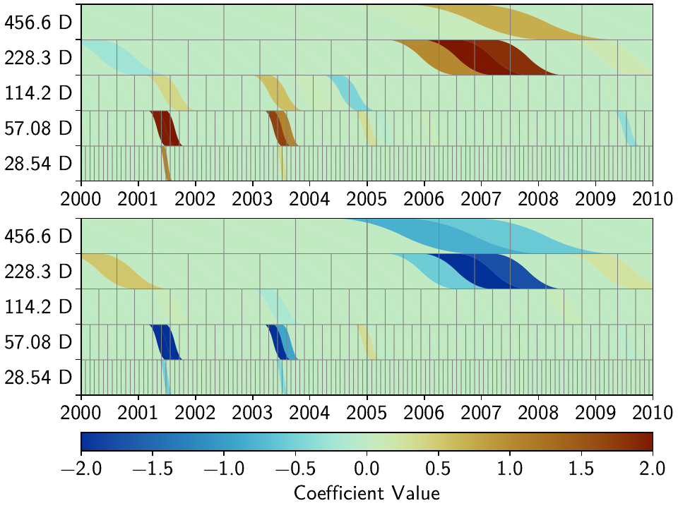
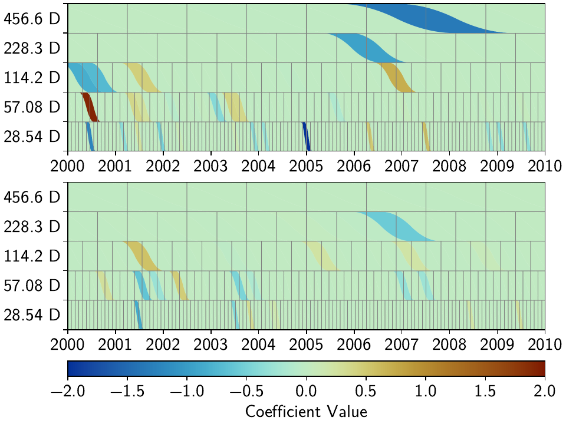
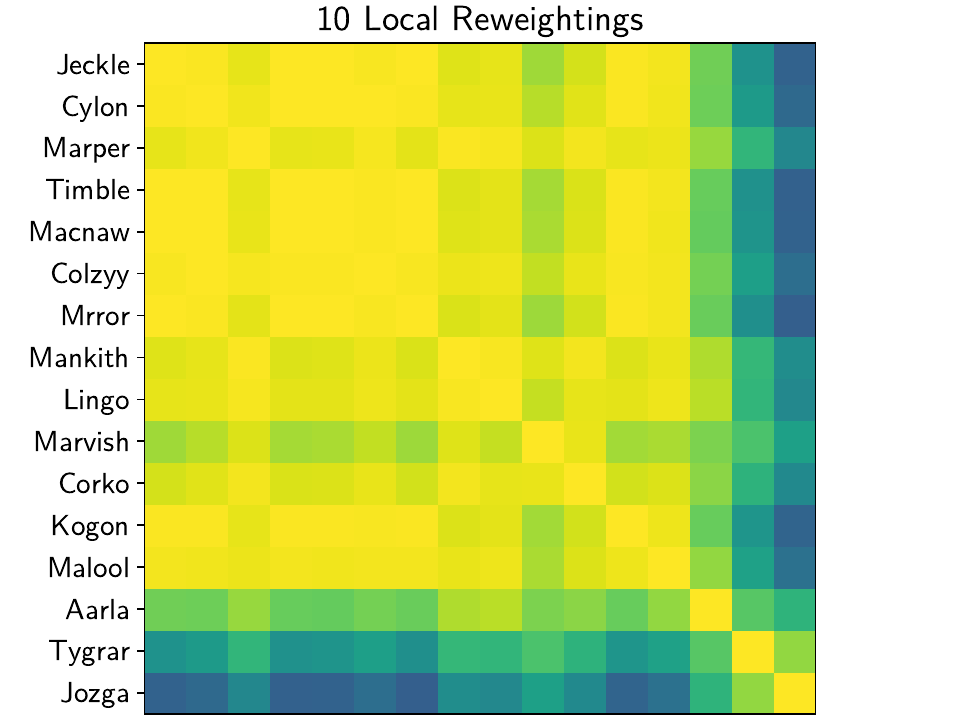
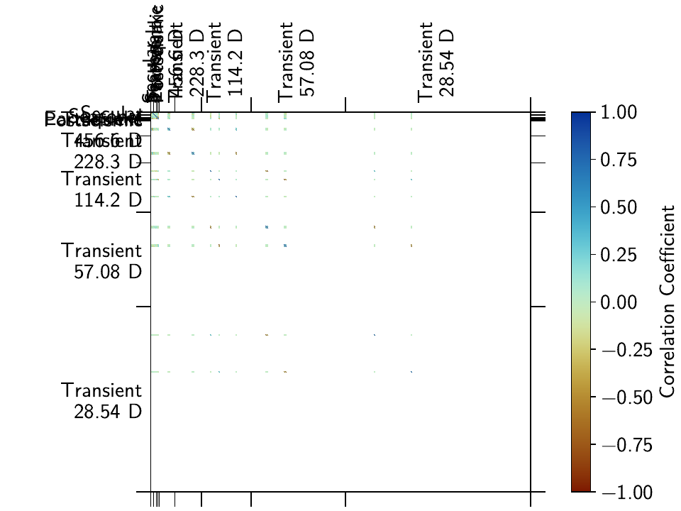
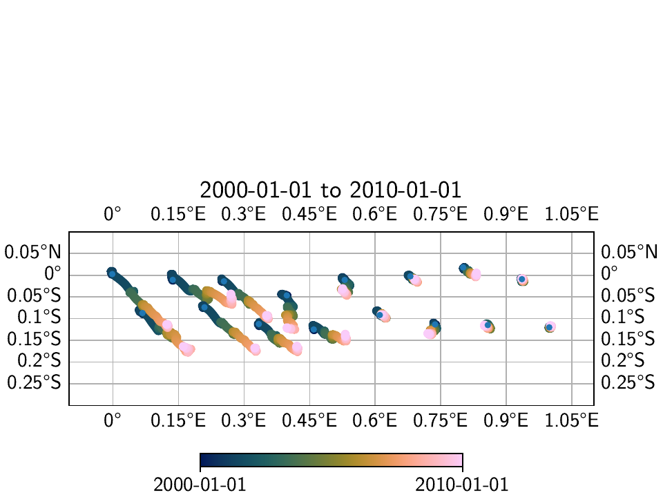

Tutorial 3: Incorporating Spatial Coherence
===========================================

.. sidebar:: Download full script

   :download:`tutorial_3_spatial_sparsity.py <../../scripts/tutorial_3_spatial_sparsity.py>`

One of the main goals of DISSTANS that should make it stand out from other timeseries analysis
software/routines is its ability to use spatial coherence as an additional source of
information and constrain. In general, signals like earthquakes, slip events, or seasonal
signals are spatially correlated, as the process have the same sources but affect multiple
stations. By using this knowledge in combination with the enforcement of sparsity, we can
make sure that the models that affect each station have the same character.

On the flipside, signals that only affect a single station are usually noise (like antenna
maintenance), which we would like to isolate. By making it harder for a station to fit a model
when no station around it sees the same signal, its residuals will become very large around
the time in question, and it is easier to therefore detect processes that need to be looked at
(or fitted specifically for that station).

In this tutorial, we will therefore create a synthetic network of 16 stations, seeing two
data components (East and North) each, that are affected by both regional processes (slow slip
events, an earthquake, and seasonal variations) as well as local ones (a maintenance step
and some local flicker noise). Common mode noise is added and estimated as well.
We will assess the incorporation of spatial coherence on a station-by-station basis (misfit
at the station with the singular maintenance step) as well as over the entire network
(by looking at the parameter correlation matrix between stations). The fitting and
evaluating will be done in parallel to achieve a significant speed-up.

.. note::
    By default, DISSTANS does not use parallelization because of the intricacies
    between Python, NumPy/SciPy, and the low-level math libraries like BLAS/LAPACK
    (which can differ from machine to machine). For more information, including how
    to properly set up parallelization, see :func:`~disstans.tools.parallelize`.

.. note::
    The figures and numbers presented in this example no longer exactly match what is
    presented in [koehne23]_. This is because significant code improvements to DISSTANS
    were introduced with version 2, and the effect of the hyperparameters changed.
    Care has been taken to recreate this example to match what is in the published study,
    although small quantitative changes remain. The qualitative interpretations are
    unchanged.

.. contents:: Table of contents
    :local:

Preparations
------------

We need to prepare two things: parallelization (which can differ from the machine used to
test this tutorial to yours, see the note above) and a random number seed to make the data
and figures reproducible.
In this case here, setting the environment variable ``'OMP_NUM_THREADS'``
in the script does the trick, and we can set the number of threads manually:

.. doctest::

    >>> import os
    >>> os.environ['OMP_NUM_THREADS'] = '1'
    >>> import disstans
    >>> disstans.defaults["general"]["num_threads"] = 16

And we can create a random number generator just like in the previous example:

.. doctest::

    >>> import numpy as np
    >>> rng = np.random.default_rng(0)

Dreaming up a network
---------------------

The network we're dreaming of is a collection of 16 stations situated on the beautiful
`Null Island <https://en.wikipedia.org/wiki/Null_Island>`_. There is no reason the
stations shouldn't be named after fake kitten names created by a neural network of
`AI Weirdness <https://aiweirdness.com/post/162396324452/neural-networks-kittens>`_.
So, let's create the locations on a line-like grid with some random variations,
instantiate a :class:`~disstans.network.Network` object, and add the corresponding
:class:`~disstans.station.Station` objects:

.. doctest::

    >>> from disstans import Network, Station
    >>> net_name = "NullIsland"
    >>> station_names = ["Jeckle", "Cylon", "Marper", "Timble",
    ...                  "Macnaw", "Colzyy", "Mrror", "Mankith",
    ...                  "Lingo", "Marvish", "Corko", "Kogon",
    ...                  "Malool", "Aarla", "Tygrar", "Jozga"]
    >>> nlon, nlat = 16, 1
    >>> num_stations = nlon * nlat
    >>> lons, lats = np.meshgrid(np.linspace(0, 1, num=nlon),
    ...                          np.linspace(-0.1, 0.1, num=nlat))
    >>> net = Network(name=net_name)
    >>> for (istat, stat_name), lon, lat in zip(enumerate(station_names),
    ...                                         lons.ravel(), lats.ravel()):
    ...     temp_loc = [lat + rng.normal()*0.02 + int(istat % 2 == 0)*0.1,
    ...                 lon + rng.normal()*0.01, 0]
    ...     net[stat_name] = Station(name=stat_name,
    ...                              location=temp_loc)

Fantasizing data
----------------

Just as above, we first need a vector of time stamps:

.. doctest::

    >>> import pandas as pd
    >>> t_start_str = "2000-01-01"
    >>> t_end_str = "2010-01-01"
    >>> timevector = pd.date_range(start=t_start_str, end=t_end_str, freq="1D")

Remember that we wanted signals that are coherent in space. To do this, it is easiest
if we define a function that takes the location of a station as input, and returns
model parameters (for both the East and North components). That way, every station gets
the same signals, but we can vary the amplitudes to simulate decreasing distance to
the signal source by making the amplitude drop off with increasing longitude.
The model parameters are then used in the next step when the model objects are created.

The function will also need the common mode noise that should be added to each station,
and the variances and other distrbution parameters when generating the noise. Let's
define those first:

.. doctest::

    >>> # create CME
    >>> cme_noise = rng.normal(size=(timevector.size, 2)) * 0.2
    >>> # define noise covariance matrix
    >>> from scipy.stats import invgamma, laplace
    >>> var_e, var_n, cov_en = 0.354, 0.538, 0.015
    >>> invgamma_e_alpha, invgamma_e_scale = 2.569, 0.274
    >>> invgamma_n_alpha, invgamma_n_scale = 3.054, 0.536
    >>> laplace_en_scale = 0.031
    >>> noise_cov = np.array([[var_e, cov_en], [cov_en, var_n]])

Here, we have defined (1) a covariance matrix from which to generate normally-distributed
noise for the observations, (2) :math:`\alpha` and scale parameters for an
inverse-gamma-distributed sampling of observation variances, and (3) a laplacian-distributed
sampling of observation covariances. (These particular values were derived from simple histogram
fitting of real data from the Long Valley Caldera region.) With these variables, and the common
mode error, we can create the actual function introduced above:

.. doctest::

    >>> def generate_parameters_noise(loc, rng):
    ...     lon = loc[1]
    ...     p_sec = np.array([[0, 0], [1, -1]])
    ...     p_seas = rng.uniform(-0.3, 0.3, size=(2, 2))
    ...     p_sse1 = np.array([[6, -6]])*np.exp(-(3 * lon**2))  # from the west
    ...     p_sse2 = np.array([[4, -4]])*np.exp(-(3 * lon**2))  # from the west
    ...     p_sse3 = np.array([[8, -8]])*np.exp(-(3 * lon**2))  # from the west
    ...     p_eq = np.array([[-3, 3]])
    ...     meas_noise = rng.multivariate_normal(mean=(0, 0), cov=noise_cov,
    ...                                          size=timevector.size)
    ...     noisevec = meas_noise + cme_noise
    ...     estim_var_cov = np.stack([invgamma.rvs(invgamma_e_alpha, loc=var_e,
    ...                                            scale=invgamma_e_scale,
    ...                                            size=timevector.size, random_state=rng),
    ...                               invgamma.rvs(invgamma_n_alpha, loc=var_n,
    ...                                            scale=invgamma_n_scale,
    ...                                            size=timevector.size, random_state=rng),
    ...                               laplace.rvs(loc=cov_en, scale=laplace_en_scale,
    ...                                           size=timevector.size, random_state=rng)], axis=1)
    ...     return p_sec, p_seas, p_eq, p_sse1, p_sse2, p_sse3, noisevec, estim_var_cov

Now, we have to do the (slightly grueling) work of creating synthetic data, creating
model and timeseries objects, assigning the parameters to them, and then add them
to the station objects of the network - basically what we did in the previous tutorial,
but for *every station*. The following code is a bit much, but should still be
understandable when comparing side-by-side with the previous, single-station
example. The one important difference is that we do not yet add the model dictionary
to the station, since we will not be estimating models on the ``'Raw'`` timeseries,
but rather a cleaner timeseries after we remove the CME.

.. doctest::

    >>> from copy import deepcopy
    >>> from disstans import Timeseries
    >>> from disstans.models import HyperbolicTangent, Polynomial, Sinusoid, Step, \
    ...     SplineSet, Logarithmic
    >>> from disstans.tools import create_powerlaw_noise
    >>> mdl_coll, mdl_coll_synth = {}, {}  # containers for the model objects
    >>> synth_coll = {}  # dictionary of synthetic data & noise for each stations
    >>> for station in net:
    ...     # think of some model parameters
    ...     p_sec, p_seas, p_eq, p_sse1, p_sse2, p_sse3, noisevec, estim_var_cov = \
    ...         generate_parameters_noise(station.location, rng)
    ...     # create model objects
    ...     mdl_sec = Polynomial(order=1, time_unit="Y", t_reference=t_start_str)
    ...     mdl_seas = Sinusoid(period=1, time_unit="Y", t_reference=t_start_str)
    ...     mdl_eq = Step(["2002-07-01"])
    ...     mdl_post = Logarithmic(tau=20, t_reference="2002-07-01")
    ...     # HyperbolicTangent (no long tails!) is for the truth, SplineSet are for how
    ...     # we will estimate them.
    ...     # We could align the HyperbolicTangents with the spline center times but that would
    ...     # never happen in real life so it would just unrealistically embellish our results
    ...     mdl_sse1 = HyperbolicTangent(tau=50, t_reference="2001-07-01")
    ...     mdl_sse2 = HyperbolicTangent(tau=50, t_reference="2003-07-01")
    ...     mdl_sse3 = HyperbolicTangent(tau=300, t_reference="2007-01-01")
    ...     mdl_trans = SplineSet(degree=2,
    ...                           t_center_start=t_start_str,
    ...                           t_center_end=t_end_str,
    ...                           list_num_knots=[int(1+2**n) for n in range(3, 8)])
    ...     # collect the models in the dictionary
    ...     mdl_coll_synth[station.name] = {"Secular": mdl_sec,
    ...                                     "Seasonal": mdl_seas,
    ...                                     "Earthquake": mdl_eq,
    ...                                     "Postseismic": mdl_post}
    ...     mdl_coll[station.name] = deepcopy(mdl_coll_synth[station.name])
    ...     mdl_coll_synth[station.name].update({"SSE1": mdl_sse1,
    ...                                          "SSE2": mdl_sse2,
    ...                                          "SSE3": mdl_sse3})
    ...     mdl_coll[station.name].update({"Transient": mdl_trans})
    ...     # only the model objects that will not be associated with the station
    ...     # get their model parameters read in
    ...     mdl_sec.read_parameters(p_sec)
    ...     mdl_seas.read_parameters(p_seas)
    ...     mdl_eq.read_parameters(p_eq)
    ...     mdl_post.read_parameters(p_eq/5)
    ...     mdl_sse1.read_parameters(p_sse1)
    ...     mdl_sse2.read_parameters(p_sse2)
    ...     mdl_sse3.read_parameters(p_sse3)
    ...     # now, evaluate the models
    ...     # noise will be white + colored
    ...     gen_data = \
    ...         {"sec": mdl_sec.evaluate(timevector)["fit"],
    ...          "trans": (mdl_sse1.evaluate(timevector)["fit"] +
    ...                    mdl_sse2.evaluate(timevector)["fit"] +
    ...                    mdl_sse3.evaluate(timevector)["fit"]),
    ...          "noise": noisevec}
    ...     gen_data["seas+sec+eq"] = (gen_data["sec"] +
    ...                                mdl_seas.evaluate(timevector)["fit"] +
    ...                                mdl_eq.evaluate(timevector)["fit"] +
    ...                                mdl_post.evaluate(timevector)["fit"])
    ...     # for one station, we'll add a colored noise process such that the resulting
    ...     # noise variance is the same as before
    ...     # but: only in the second half, where there are no strong, short-term signals
    ...     if station.name == "Cylon":
    ...         gen_data["noise"][timevector.size//2:, :] = \
    ...             (gen_data["noise"][timevector.size//2:, :] +
    ...              create_powerlaw_noise(size=(timevector.size // 2, 2),
    ...                                    exponent=1, seed=rng
    ...                                    ) * np.sqrt(np.array([[var_e, var_n]]))
    ...              ) / np.sqrt(2)
    ...     # for one special station, we add the maintenance step
    ...     # repeating all steps above
    ...     if station.name == "Corko":
    ...         # time and amplitude
    ...         p_maint = np.array([[-2, 0]])
    ...         mdl_maint = Step(["2005-01-01"])
    ...         mdl_maint.read_parameters(p_maint)
    ...         # add to station and synthetic data
    ...         mdl_coll_synth[station.name].update({"Maintenance": mdl_maint})
    ...         gen_data["seas+sec+eq"] += mdl_maint.evaluate(timevector)["fit"]
    ...     # now we sum the components up...
    ...     gen_data["truth"] = gen_data["seas+sec+eq"] + gen_data["trans"]
    ...     gen_data["data"] = gen_data["truth"] + gen_data["noise"]
    ...     synth_coll[station.name] = gen_data
    ...     # ... and assign them to the station as timeseries objects
    ...     station["Truth"] = \
    ...         Timeseries.from_array(timevector=timevector,
    ...                               data=gen_data["truth"],
    ...                               src="synthetic",
    ...                               data_unit="mm",
    ...                               data_cols=["E", "N"])
    ...     station["Raw"] = \
    ...         Timeseries.from_array(timevector=timevector,
    ...                               data=gen_data["data"],
    ...                               var=estim_var_cov[:, :2],
    ...                               cov=estim_var_cov[:, 2],
    ...                               src="synthetic",
    ...                               data_unit="mm",
    ...                               data_cols=["E", "N"])

Of course, this code could be much shorter if we didn't want to keep all the
intermediate results and temporary objects.
Let's have a look at the summary of the first station to see what we added:

.. doctest::

    >>> print(net["Jeckle"])
    Station Jeckle at [0.0025146044218678637, -0.0013210486329130189, 0] with timeseries
    Truth
     - Source: synthetic
     - Units: mm
     - Shape: (3654, 2)
     - Offset Removed: False
     - Data: ['E', 'N']
    Raw
     - Source: synthetic
     - Units: mm
     - Shape: (3654, 2)
     - Offset Removed: False
     - Data: ['E', 'N']
     - Variances: ['E_var', 'N_var']
     - Covariances: ['E_N_cov']

One can also have a look at an interactive map and inspect the data and models
of the stations using :meth:`~disstans.network.Network.gui`::

    >>> net.gui()

Which will present the following map:

.. image:: ../img/tutorial_3a_map.png

Then, selecting the first station called "Jeckle" will produce the following plot
of all timeseries associated with that station, ``'Truth'`` and the noisy
``'Raw'``, in both East and North components:

For this station, the signal is obviously much larger than the noise, but if you
select stations further east, you'll see how the noise becomes the more dominant
part. How well we can recover the original signal can therefore be tested by looking
at all stations from west to east.

The figures above can either be saved from the interactive window, or by running
:meth:`~disstans.network.Network.gui` in a non-interactive mode::

    >>> net.gui(station="Jeckle", save=True, save_map=True)

Removing the Common Mode Error
------------------------------

To remove the common mode error that we added, we first need a high-pass filtered
version of our ``'Raw'`` timeseries. We can do this effectively and step-insensitive
by calculating the running median of the timeseries, and then removing this
smoothed timeseries from the original one.

Then, we find the common mode, usually done using Principal or Independent Component
Analysis. Lastly, we remove it from the original timeseries, which then yields the cleaner
timeseries we want to use going forward.
In code, the first three steps will look like this:

.. doctest::

    >>> # running median will be saved in "Filtered" timeseries
    >>> net.call_func_ts_return("median", ts_in="Raw", ts_out="Filtered", kernel_size=7)
    >>> # high-pass filtered timeseries will be in "Residual"
    >>> net.math("Residual", "Raw", "-", "Filtered")
    >>> # estimate the common mode
    >>> net.call_netwide_func("decompose", ts_in="Residual", ts_out="CME", method="ica", rng=rng)

To have a closer look at the estimated common mode, one can also use the
:meth:`~disstans.network.Network.graphical_cme` method, which will show plots of the temporal
and spatial components of the estimated CME. If everything goes well, the temporal component
should look like normally-distributed noise, and the spatial component should look like
a homogenous motion of the stations across the network, like this:

|3b_cme_temporal| |3b_cme_spatial|

.. |3b_cme_temporal| image:: ../img/tutorial_3b_cme_temporal.png
    :width: 49%

.. |3b_cme_spatial| image:: ../img/tutorial_3b_cme_spatial.png
    :width: 49%

Everything that's now left to do is to subtract the newly-created ``'CME'`` timeseries
from the ``'Raw'`` timeseries, call it the ``'Displacement'`` timeseries, copy over
the uncertainties from the original timeseries (assuming they are independent of the CME
estimation process). In the same loop, we can also now add the model dictionaries we
defined above. Lastly, we can remove the now-obsolete intermediate timeseries.

.. doctest::

    >>> for station in net:
    ...     # calculate the clean timeseries
    ...     station.add_timeseries("Displacement", station["Raw"] - station["CME"],
    ...                            override_data_cols=station["Raw"].data_cols)
    ...     # copy over the uncertainties
    ...     station["Displacement"].add_uncertainties(timeseries=station["Raw"])
    ...     # give the station the models to fit
    ...     station.add_local_model_dict(ts_description="Displacement",
    ...                                  model_dict=mdl_coll[station.name])
    >>> # remove unnecessary intermediate results
    >>> net.remove_timeseries("Filtered", "CME", "Residual")

To inspect the result, we can again have a look at the network with
:meth:`~disstans.network.Network.gui`, or print the summary of a station:

.. doctest::

    >>> print(net["Jeckle"])
    Station Jeckle at [0.0025146044218678637, -0.0013210486329130189, 0] with timeseries
    Truth
     - Source: synthetic
     - Units: mm
     - Shape: (3654, 2)
     - Offset Removed: False
     - Data: ['E', 'N']
    Raw
     - Source: synthetic
     - Units: mm
     - Shape: (3654, 2)
     - Offset Removed: False
     - Data: ['E', 'N']
     - Variances: ['E_var', 'N_var']
     - Covariances: ['E_N_cov']
    Displacement
     - Source: synthetic-decompose
     - Units: mm
     - Shape: (3654, 2)
     - Offset Removed: False
     - Data: ['E', 'N']
     - Variances: ['E_var', 'N_var']
     - Covariances: ['E_N_cov']
     - Models: ['Secular', 'Seasonal', 'Earthquake', 'Postseismic', 'Transient']

Fitting the data using reweighted L1 regularization
---------------------------------------------------

We'll basically do the same processing as at the end of the previous tutorial, but make
use of yet another high-level function to reduce the amount of lines we have to write:
:meth:`~disstans.network.Network.fitevalres`, which combines the two functions
:meth:`~disstans.network.Network.fit` and :meth:`~disstans.network.Network.evaluate` and
also calculates the residual using :meth:`~disstans.network.Network.math`.
We'll start with a single, non-iterative L1-regularized solution:

.. doctest::

    >>> net.fitevalres(ts_description="Displacement", solver="lasso_regression",
    ...                penalty=10, output_description="Fit_L1", residual_description="Res_L1")

We'll also calculate the true errors that we only know because we created the data ourselves,
and save the transient fitted model as a new timeseries (we'll use them later):

.. doctest::

    >>> for stat in net:
    ...     stat["Trans_L1"] = stat.fits["Displacement"]["Transient"].copy(only_data=True)
    >>> net.math("Err_L1", "Fit_L1", "-", "Truth")

For this solution and the future ones which will be exploting the spatial structure,
we want to continuously compare the fitted timeseries as well as the scalograms of
the Transient model. So let's decide on some potentially interesting stations, and
use the :meth:`~disstans.network.Network.gui` function to save some plots::

    >>> figure_stations = ["Jeckle", "Cylon", "Marvish", "Mankith", "Corko", "Tygrar", "Jozga"]
    >>> for s in figure_stations:
    ...     net.gui(station=s, save="base",
    ...             timeseries=["Displacement", "Res_L1"],
    ...             scalogram_kw_args={"ts": "Displacement", "model": "Transient",
    ...                                "cmaprange": 2})

Now, let's have a look at the two most western stations, Jeckle and Cylon:

|3c_scalo_Jeckle_base| |3c_ts_Jeckle_base|

|3c_scalo_Cylon_base| |3c_ts_Cylon_base|

.. |3c_scalo_Jeckle_base| image:: ../img/tutorial_3c_scalo_Jeckle_base.png
    :width: 49%

.. |3c_ts_Jeckle_base| image:: ../img/tutorial_3c_ts_Jeckle_base.png
    :width: 49%

.. |3c_scalo_Cylon_base| image:: ../img/tutorial_3c_scalo_Cylon_base.png
    :width: 49%

.. |3c_ts_Cylon_base| image:: ../img/tutorial_3c_ts_Cylon_base.png
    :width: 49%

While in all cases the models fit the data well, one can observe two things.

First, for the time that we added colored noise to Cylon, just as in the previous
tutorial, the transients created by the noise are fit by our spline dictionary.

Second, especially for the time without the colored noise, we can see that apart from a couple
splines that are the closest in time and period to the true slow slip events (SSEs)
hyperbolic tangents, most splines that are non-zero in one station are (close to) zero at the other,
even though we know that both stations experience the same signal (only with a slightly
varying amplitude).

To make this assessment a bit more quantitative, let's get some key numbers that define
the sparsity of the model dictionary across the network.
We want to set a threshold below which we consider a parameter "basically zero".
Then, for each solution we produce, we want to know how many parameters across the entire
network are non-zero, and how many unique non-zero parameters there are (i.e., if a spline
is used at multiple stations, we'll only count it once). For this, we set the ``ZERO`` variable,
and count the number of total, non-zero, and unique non-zero parameters:

.. doctest::

    >>> ZERO = 1e-6
    >>> num_total = sum([s.models["Displacement"]["Transient"].parameters.size for s in net])
    >>> num_uniques_base = \
    ...     np.sum(np.any(np.stack([np.abs(s.models["Displacement"]["Transient"].parameters)
    ...                             > ZERO for s in net]), axis=0), axis=0)
    >>> num_nonzero_base = sum([(np.abs(s.models["Displacement"]["Transient"].parameters.ravel())
    ...                          > ZERO).sum() for s in net])

.. doctest::
    :hide:

    >>> assert 3000 < num_nonzero_base < 3200
    >>> assert all([230 < num < 270 for num in num_uniques_base])

Giving us (the exact numbers might differ slightly)::

    >>> print(f"Number of reweighted non-zero parameters: {num_nonzero_base}/{num_total}")
    Number of reweighted non-zero parameters: 3062/8416
    >>> print("Number of unique reweighted non-zero parameters per component: "
    ...       + str(num_uniques_base.tolist()))
    Number of unique reweighted non-zero parameters per component: [247, 242]

Let's keep track of these numbers: All 16 stations (and both components) combined are
fit by 3062 splines (out of the total possible 8416). Of a total of 263 possible splines
at any given station and for each component, 247 in the East and 242 in the North
component are non-zero at least at one station. That is not terribly sparse for three
slow-slip events (SSEs), since the coseismic, postseismic, and seasonal signal should not
be fitted by the splines (or noise, for that matter).

This effectively means that wherever there is not a strong enough signal, the solver will
follow the noise realization at that station to fit the data best given the L1 penalty,
and therefore choose slightly different splines each time.
If we could somehow let the solver know that this is noise, and that the underlying
signal should be coherent in space, it wouldn't overfit the data where there is no signal,
and we would have a better understanding of both the true signal and the noise.

(*Something else that we will have a look at later, but for now just need to save the data,
is the spatial correlation between the fitted transients - more details about that later,
but for now, let's just save the data:*)

.. doctest::

    >>> cor_base = np.corrcoef(np.stack([s.fits["Displacement"]["Transient"].data.values[:, 1]
    ...                                  for s in net]))

Our next step is to try iterating over the L1 solution, approximating the L0-regularized
solution. We do this locally for now, i.e. each station is treated independently.
For the reweighting, we need to specify a :class:`~disstans.solvers.ReweightingFunction`,
that tells the solver what parameters are significant and which ones aren't. The choice of
the reweighting function and its hyperparameters is crucial for good results, much like the
choice of the penalty parameter for simple L2-regularized least squares. At this stage, there
is no perfect way to know the best choice before looking at the result, so some
trial-and-error is required. An empirically derived, decent starting point for such a
search would put the ``penalty`` of a similar order of magnitude to the expected noise
variance of the data. Then, looking at a histogram of the parameter magnitudes computed
without any reweighting can give a good intuition about what values should be considered
significant or not.

Using the local L0 regularization does not significantly improve our situation, as we can
see in the results:

.. doctest::

    >>> rw_func = disstans.solvers.InverseReweighting(eps=1e-7, scale=1e-4)
    >>> net.fitevalres(ts_description="Displacement", solver="lasso_regression",
    ...                penalty=10, reweight_max_iters=10, reweight_func=rw_func,
    ...                output_description="Fit_L1R10", residual_description="Res_L1R10")
    >>> for stat in net:
    ...     stat["Trans_L1R10"] = stat.fits["Displacement"]["Transient"].copy(only_data=True)
    >>> net.math("Err_L1R10", "Fit_L1R10", "-", "Truth")
    >>> # get spatial correlation matrix for later
    >>> cor_localiters = np.corrcoef(np.stack([s.fits["Displacement"]["Transient"].data.values[:, 1]
    ...                                        for s in net]))
    >>> # get number of (unique) non-zero parameters
    >>> num_uniques_local = \
    ...     np.sum(np.any(np.stack([np.abs(s.models["Displacement"]["Transient"].parameters)
    ...                             > ZERO for s in net]), axis=0), axis=0)
    >>> num_nonzero_local = sum([(np.abs(s.models["Displacement"]["Transient"].parameters.ravel())
    ...                           > ZERO).sum() for s in net])

.. doctest::
    :hide:

    >>> assert 1000 < num_nonzero_local < 1500
    >>> assert all([150 < num < 230 for num in num_uniques_local])

Giving approximately::

    >>> print(f"Number of reweighted non-zero parameters: {num_nonzero_local}/{num_total}")
    Number of reweighted non-zero parameters: 1123/8416
    >>> print("Number of unique reweighted non-zero parameters per component: "
    ...       + str(num_uniques_local.tolist()))
    Number of unique reweighted non-zero parameters per component: [205, 180]

Which gives the following figures (see the plotting code above):

|3c_scalo_Jeckle_local| |3c_ts_Jeckle_local|

|3c_scalo_Cylon_local| |3c_ts_Cylon_local|

.. |3c_scalo_Jeckle_local| image:: ../img/tutorial_3c_scalo_Jeckle_local.png
    :width: 49%

.. |3c_ts_Jeckle_local| image:: ../img/tutorial_3c_ts_Jeckle_local.png
    :width: 49%

.. |3c_scalo_Cylon_local| image:: ../img/tutorial_3c_scalo_Cylon_local.png
    :width: 49%

.. |3c_ts_Cylon_local| image:: ../img/tutorial_3c_ts_Cylon_local.png
    :width: 49%

We can see that while the total number of non-zero splines decreased by more than half,
the number of *unique* non-zero splines decreased by far less. Furthermore, we still
see that different splines are used throughout the stations for the same domminant signals.
From the scalograms, we can also see the effect of driving the penalties for each parameter
either to zero or infinity: the splines that still are used in the fitting process now
have much larger amplitudes compared to before.

Unless we want to create one giant least-squares L1-regularized problem that combines
all stations, and giving the spline parameters a distance-dependent covariance matrix
between the stations (which is computationally still unfeasible for any real regional
network), we need to think of a better way to reduce the number of unique splines.

Fitting the data using a spatially-aware L1 reweighting
-------------------------------------------------------

[riel14]_ solves the problem by alternating between a station-specific solution, and a step
where the parameter weights of each L1-regularized problems are gathered, compared, and
updated based on a weighting scheme. In DISSTANS, this is handled by the
:meth:`~disstans.network.Network.spatialfit` method, where more information about its algorithm
can be found. In this tutorial, we just want to show how it is used and how it can improve
the quality of the fit.

:meth:`~disstans.network.Network.spatialfit` takes some important arguments, but at its core
it's essentially a wrapper for :meth:`~disstans.network.Network.fit`. Just like the latter,
we give it an (initial) ``penalty`` parameter. Additionally, we can now specify the models
which we want to combine spatially (``spatial_l0_models``), how many spatial iterations
we want (``spatial_reweight_iters``), and what reweighting function we want to use
(``reweight_func``, from above).

We can also specify the ``verbose`` option so that we get some interesting statistics along
the way (plus some progress bars that aren't shown here). Let's start by defining the
reweighting function, running only one spatial iteration, and evaluating its solution:

.. doctest::

    >>> stats = net.spatialfit("Displacement",
    ...                        penalty=10,
    ...                        spatial_l0_models=["Transient"],
    ...                        spatial_reweight_iters=1,
    ...                        reweight_func=rw_func,
    ...                        formal_covariance=True,
    ...                        zero_threshold=ZERO,
    ...                        verbose=True)
    Calculating scale lengths
    Distance percentiles in km (5-50-95): [12.6, 38.3, 89.7]
    Initial fit
    ...
    Fit after 1 reweightings
    ...
    Done
    >>> net.evaluate("Displacement", output_description="Fit_L1R1S1")
    >>> for stat in net:
    ...     stat["Trans_L1R1S1"] = stat.fits["Displacement"]["Transient"].copy(only_data=True)
    >>> net.math("Res_L1R1S1", "Displacement", "-", "Fit_L1R1S1")
    >>> net.math("Err_L1R1S1", "Fit_L1R1S1", "-", "Truth")
    >>> # get spatial correlation matrix for later
    >>> cor_spatialiters1 = \
    ...     np.corrcoef(np.stack([s.fits["Displacement"]["Transient"].data.values[:, 1]
    ...                           for s in net]))

Where the solver will give us (approximately) the following statistics::

    Calculating scale lengths
    Distance percentiles in km (5-50-95): [12.6, 38.3, 89.7]
    Initial fit
    Number of reweighted non-zero parameters: 3062/8416
    Number of unique reweighted non-zero parameters per component: [247, 242]
    Updating weights
    Stacking model Transient
    Weight percentiles (5-50-95): [0.00059886575167, 127.17369146, 892.46704072]
    Fit after 1 reweightings
    Number of reweighted non-zero parameters: 496/8416
    Number of unique reweighted non-zero parameters per component: [47, 41]
    RMS difference of 'Transient' parameters = 8.553420029 (2814 changed)
    Done

The numbers before the first reweighting are exactly the same from before we iterated
at all - which makes sense since the initial solve is before any reweighting can be
done, and we did not specify any local L1 reweighting iterations.
The next two numbers are new however, and they show the effect of our spatial
combination scheme: not only did the total number of non-zero parameters drop
significantly (as before), but the number of *unique* non-zero parameters dropped
significantly as well.

Let's see how this manifests itself in the same stations we looked at above:

|3c_scalo_Jeckle_spatial1| |3c_ts_Jeckle_spatial1|

|3c_scalo_Cylon_spatial1| |3c_ts_Cylon_spatial1|

.. |3c_ts_Jeckle_spatial1| image:: ../img/tutorial_3c_ts_Jeckle_spatial1.png
    :width: 49%

.. |3c_scalo_Cylon_spatial1| image:: ../img/tutorial_3c_scalo_Cylon_spatial1.png
    :width: 49%

.. |3c_ts_Cylon_spatial1| image:: ../img/tutorial_3c_ts_Cylon_spatial1.png
    :width: 49%

As we can see, the fit to the data is almost as good, and the splines used to get
to that fit are basically the same between the two stations. Let's see when and
if the spatial iterations converge by doing the same thing, but with 10 reweighting
steps:

.. doctest::

    >>> stats = net.spatialfit("Displacement",
    ...                        penalty=10,
    ...                        spatial_l0_models=["Transient"],
    ...                        spatial_reweight_iters=10,
    ...                        reweight_func=rw_func,
    ...                        formal_covariance=True,
    ...                        zero_threshold=ZERO,
    ...                        verbose=True)
    Calculating scale lengths
    Distance percentiles in km (5-50-95): [12.6, 38.3, 89.7]
    Initial fit
    ...
    Fit after 10 reweightings
    ...
    Done
    >>> net.evaluate("Displacement", output_description="Fit_L1R1S10")
    >>> for stat in net:
    ...     stat["Trans_L1R1S10"] = stat.fits["Displacement"]["Transient"].copy(only_data=True)
    >>> net.math("Res_L1R1S10", "Displacement", "-", "Fit_L1R1S10")
    >>> net.math("Err_L1R1S10", "Fit_L1R1S10", "-", "Truth")
    >>> # get spatial correlation matrix for later
    >>> cor_spatialiters10 = \
    ...     np.corrcoef(np.stack([s.fits["Displacement"]["Transient"].data.values[:, 1]
    ...                           for s in net]))

Let's first have a look at the scalograms and timeseries of the stations
we looked at before:

|3c_scalo_Jeckle_spatial10| |3c_ts_Jeckle_spatial10|

|3c_scalo_Cylon_spatial10| |3c_ts_Cylon_spatial10|

.. |3c_scalo_Jeckle_spatial10| image:: ../img/tutorial_3c_scalo_Jeckle_spatial10.png
    :width: 49%

.. |3c_ts_Jeckle_spatial10| image:: ../img/tutorial_3c_ts_Jeckle_spatial10.png
    :width: 49%

.. |3c_scalo_Cylon_spatial10| image:: ../img/tutorial_3c_scalo_Cylon_spatial10.png
    :width: 49%

.. |3c_ts_Cylon_spatial10| image:: ../img/tutorial_3c_ts_Cylon_spatial10.png
    :width: 49%

We can now see that this effect is much stronger now: only a handful of splines
are used by the two stations. Depending on the penalty and reweighting parameters,
the fit could have become a bit worse: either by not fitting a signal completely
(leaving a visible residual behind) or by overfitting (fitting noise as signal).
This can be tuned by changing the L1 ``penalty``, or by choosing a different
``reweight_func``, or many other configuration settings that are present in
:meth:`~disstans.network.Network.spatialfit`.
Another way that could potentially mitigate misfits would be to use more splines
that will then better match the onset times of the transients we generated. However,
we won't spend time on it here since the effects of the tuning will depend a lot on the
data you have.
More importantly though, since in the real world you don't know the true signal
and noise, even if you would fit more signal, you could not be sure that you didn't
fit a noise process.

What is important to point out, however, is that the residuals at Cylon do not look as
Gaussian anymore for the timespan we added colored noise. Our goal was to suppress
fitting noise processes as signals. Let's plot the residuals, true noise, and our errors,
to see if that was successful by comparing this solution with the one that only
had local reweighting iterations::

    >>> import matplotlib.pyplot as plt
    >>> from matplotlib.lines import Line2D
    >>> stat = net["Cylon"]
    >>> for title, case, res_ts, err_ts in \
    ...     zip(["10 Local Reweightings", "1 Local, 10 Spatial Reweighting"],
    ...         ["local", "spatial10"],
    ...         ["Res_L1R10", "Res_L1R1S10"],
    ...         ["Err_L1R10", "Err_L1R1S10"]):
    ...     fig, ax = plt.subplots(nrows=2, sharex=True)
    ...     ax[0].set_title(title)
    ...     ax[0].plot(stat[res_ts].data.iloc[:, 0], c='0.3',
    ...                ls='none', marker='.', markersize=0.5)
    ...     ax[0].plot(stat[res_ts].time, synth_coll["Cylon"]["noise"][:, 0], c='C1',
    ...                ls='none', marker='.', markersize=0.5)
    ...     ax[0].plot(stat[err_ts].data.iloc[:, 0], c="C0")
    ...     ax[0].set_ylim(-3, 3)
    ...     ax[0].set_ylabel("East [mm]")
    ...     ax[1].plot(stat[res_ts].data.iloc[:, 1], c='0.3',
    ...                ls='none', marker='.', markersize=0.5)
    ...     ax[1].plot(stat[res_ts].time, synth_coll["Cylon"]["noise"][:, 1], c='C1',
    ...                ls='none', marker='.', markersize=0.5)
    ...     ax[1].plot(stat[err_ts].data.iloc[:, 1], c="C0")
    ...     ax[1].set_ylim(-3, 3)
    ...     ax[1].set_ylabel("North [mm]")
    ...     custom_lines = [Line2D([0], [0], c="0.3", marker=".", linestyle='none'),
    ...                     Line2D([0], [0], c="C1", marker=".", linestyle='none'),
    ...                     Line2D([0], [0], c="C0")]
    ...     ax[0].legend(custom_lines, ["Residual", "Noise", "Error"],
    ...                  loc="upper right", ncol=3)
    ...     ax[1].legend(custom_lines, ["Residual", "Noise", "Error"],
    ...                  loc="upper right", ncol=3)
    ...     fig.savefig(f"tutorial_3d_Cylon_{case}.png")
    ...     plt.close(fig)

Which produces the following plots:

|3d_Cylon_local| |3d_Cylon_spatial10|

.. |3d_Cylon_local| image:: ../img/tutorial_3d_Cylon_local.png
    :width: 49%

Indeed, we can see that the spatial reweighting hindered the solver to fit for some
small-scale noise transients. We can see this in the fact that our residual now more
closely tracks the true noise, and the true error oscillates less and stays closer to zero.
For the longer-scale noise, it is too strong for the solver to ignore (at least with the
current regularization penalties and other hyperparameters). In general, the degree of
success of this method can vary significantly between datasets and hyperparameters.

Quantitatively, we can also see this small improvement when we compute the root-mean-squared
error for the error time series. We can calculate it easily using
:meth:`~disstans.network.Network.analyze_residuals`
for both error timeseries ``'Err_L1R10'`` and ``'Err_L1R1S10'``:

.. doctest::

    >>> stats_dict = {}
    >>> for err_ts in ["Err_L1R10", "Err_L1R1S10"]:
    ...     stats_dict[err_ts] = net.analyze_residuals(err_ts, mean=True, rms=True)

.. doctest::
    :hide:

    >>> assert all([(stats_dict["Err_L1R1S10"].loc["Cylon", ("RMS", comp)]
    ...              < stats_dict["Err_L1R10"].loc["Cylon", ("RMS", comp)] * 0.9)
    ...             for comp in ["Displacement_Model_E-E", "Displacement_Model_N-N"]])

Giving us (again, approximately)::

    >>> for err_ts, stat in stats_dict.items():
    ...     print(f"\nErrors for {err_ts}:")
    ...     print(stat)
    <BLANKLINE>
    Errors for Err_L1R10:
    Metrics                      Mean                                           RMS
    Components Displacement_Model_E-E Displacement_Model_N-N Displacement_Model_E-E Displacement_Model_N-N
    Station
    Jeckle                   0.001717               0.011739               0.086412               0.112535
    Cylon                   -0.014426              -0.023066               0.224658               0.221669
    Marper                  -0.007761               0.012923               0.088403               0.114834
    Timble                  -0.019154              -0.020992               0.080029               0.100177
    Macnaw                  -0.005531               0.029832               0.100310               0.094463
    Colzyy                  -0.014500              -0.015374               0.084248               0.110791
    Mrror                    0.004534               0.003598               0.102111               0.074685
    Mankith                 -0.028667               0.029660               0.072861               0.107669
    Lingo                    0.001428              -0.018158               0.097689               0.114889
    Marvish                  0.005776              -0.007322               0.086081               0.086113
    Corko                   -0.001758              -0.010560               0.103091               0.072695
    Kogon                   -0.009227              -0.009288               0.094518               0.102268
    Malool                  -0.008001               0.009324               0.082624               0.119223
    Aarla                   -0.008683               0.008970               0.082358               0.092859
    Tygrar                   0.025494              -0.010358               0.077535               0.094588
    Jozga                   -0.001899              -0.013257               0.078236               0.083391
    <BLANKLINE>
    Errors for Err_L1R1S10:
    Metrics                      Mean                                           RMS
    Components Displacement_Model_E-E Displacement_Model_N-N Displacement_Model_E-E Displacement_Model_N-N
    Station
    Jeckle                   0.001523               0.011596               0.043255               0.064558
    Cylon                   -0.013879              -0.022360               0.133340               0.150636
    Marper                  -0.007989               0.013279               0.058074               0.060193
    Timble                  -0.018874              -0.020772               0.048825               0.059827
    Macnaw                  -0.005681               0.029725               0.061490               0.064505
    Colzyy                  -0.014252              -0.015264               0.049975               0.056185
    Mrror                    0.004750               0.003418               0.055196               0.054606
    Mankith                 -0.028838               0.029637               0.053583               0.073222
    Lingo                    0.001145              -0.018927               0.048167               0.065160
    Marvish                  0.005620              -0.007561               0.050421               0.055360
    Corko                   -0.001863              -0.010913               0.302084               0.059539
    Kogon                   -0.009064              -0.009094               0.053720               0.059153
    Malool                  -0.007920               0.009471               0.045286               0.064222
    Aarla                   -0.008528               0.008913               0.057129               0.064225
    Tygrar                   0.025216              -0.010223               0.048189               0.056404
    Jozga                   -0.001792              -0.013118               0.042668               0.059018

If you look at the lines for Cylon, the RMS reduced significantly from ``0.224658`` and
``0.221669`` to ``0.133340`` and ``0.150636``, for the East and North components, respectively.

.. warning::

    Before you get too excited, be aware though that this is an idealized synthetic
    example. In real data, you might see much stronger colored noise, at more stations,
    that might be correlated in time and space. Some of it can be taken care of by
    removing the common mode error, and some of it with the spatial reweighting presented
    here, but don't expect it to solve all issues with colored and/or station-individual
    noise. This will also all be sensitive to the penalty parameter, the reweighting
    function, and much more, which all could potentially make the spatially-aware fit
    worse than the local-L0 counterpart.
    A more rigorous exploration for the case of different normally-distributed noise
    levels is presented in :doc:`Tutorial 5 <tutorial_5>`.

Finding unmodeled jumps
-----------------------

When looking at the errors that we just printed out, we are painfully reminded that
we added an unmodeled maintenance step to the station Corko. Lets's use the
:meth:`~disstans.network.Network.gui` function to plot the scalograms and timeseries
fits for the station for the two cases we just used.

For 10 local iterations, we get:

|3c_scalo_Corko_local| |3c_ts_Corko_local|

.. |3c_ts_Corko_local| image:: ../img/tutorial_3c_ts_Corko_local.png
    :width: 49%

And for the 10 spatial iterations, we get:

|3c_scalo_Corko_spatial10| |3c_ts_Corko_spatial10|

Not surprisingly, if we only care about the locally best solution, the solver
will fit the smallest spline as close to the unmodeled jump with a high amplitude.
The result is an overall good fit, with some larger residuals around the time of
the jump (since even the smallest spline is not as short as a day).

If we enforce spatial coherence, the resulting behavior will depend on the strength
of th regularization and reweighting. If it isn't too strong, then we get a similar
behavior to the one that we talked about: the smallest spline will be used to fit the
unmodeled jump.

If, however, the reweighting is strong enough such that the other
stations "forbid" the use of the spline closest to the maintenance jump, then Corko
can't use it, resulting in large residuals before and after the jump. All other modeled
signals are contorted to try to minimize the rest of the residual. In this case, one
could examine the RMS of the residuals, and immediately see a strong outlier for Corko.
This can be accomplished with the :meth:`~disstans.network.Network.analyze_residuals`
method, and the ``rms_on_map`` option for :meth:`~disstans.network.Network.gui`.
Once a user recognizes that a station has a significantly larger residual RMS than
most other stations this, they can check out the timeseries of that station and/or consult
a maintenance dictionary and/or check an earthquake catalog to see if there is a step
signal that should be modeled. Then, a step model can be added to the station, and the
entire network can be fit again, producing an even better fit to the data.

The :class:`~disstans.processing.StepDetector` class is a simple method to check for
unmodeled jumps in the residuals (see its documentation for more details).
If we use it to find steps in the two residual timeseries, we can skip the manual labor
of clicking through all the stations and looking for jumps, and focus on those that are
identified by the algorithm:

.. doctest::

    >>> from disstans.processing import StepDetector
    >>> stepdet = StepDetector(kernel_size=51)
    >>> steps_dict = {}
    >>> for res_ts in ["Res_L1R10", "Res_L1R1S10"]:
    ...     steps_dict[res_ts] = stepdet.search_network(net, res_ts)[0]

.. doctest::
    :hide:
    :options: +NORMALIZE_WHITESPACE
    
    >>> for res_ts, steps in steps_dict.items():
    ...     print(steps)
      station       time  probability ...
    ... Corko 2005-01-01  ...
      station       time  probability ...
    ... Corko 2005-01-01  ...

Which gives::

    >>> for res_ts, steps in steps_dict.items():
    ...     print(f"Possible steps for {res_ts}:")
    ...     print(steps)
    Possible steps for Res_L1R10:
      station       time  probability      var0     var1    varred
    0   Corko 2005-01-01    34.781766  0.450997  0.21772  0.517246
    Possible steps for Res_L1R1S10:
      station       time  probability      var0     var1    varred
    0   Corko 2005-01-01    39.701105  0.510695  0.22387  0.561636

In this case, both residual timeseries contain a strong enough jump for the detector to
isolate the missing maintenance step on 2005-01-01. In this case, the probability is
higher in the case where we used spatial information, suggesting that the spatial
reweighting has indeed made it harder for the solver to accurately fit the signal
- this is desired since we didn't include the correct model for this jump, and we want
to enhance the misfit to be able to better find these unmodeled jumps.

For the remainder of this tutorial, let's add the maintenance step at Corko as a model,
and rerun the local and spatial L0 fits.

.. doctest::

    >>> new_maint_mdl = {"Maintenance": Step(["2005-01-01"])}
    >>> mdl_coll["Corko"].update(new_maint_mdl)
    >>> net["Corko"].add_local_model_dict("Displacement", new_maint_mdl)
    >>> # run net.fitevalres and/or net.spatialfit now just as above

Statistics of spatial reweighting
---------------------------------

Let's have a look at the statistics saved by ourselves as well as those returned
by :meth:`~disstans.network.Network.spatialfit` into the ``stats`` dictionary.
The first three variables contain the key numbers we used before to show how
the spatial reweighting not only reduces the total number of splines used, but
also the number of *unique* splines used across the network.
The second three capture the extent to which the parameters change between
the iterations.

Let's make two figures that show how they evolve and converge::

    >>> # first figure is for num_total, arr_uniques, list_nonzeros
    >>> fig, ax1 = plt.subplots()
    >>> ax2 = ax1.twinx()
    >>> ax1.plot(stats["list_nonzeros"], c="k", marker=".")
    >>> ax1.scatter(-0.1, num_nonzero_base_M, s=100, c="k")
    >>> ax1.scatter(-0.1, num_nonzero_local_M, s=60, c="k", marker="D")
    >>> ax1.set_ylim([0, 3500])
    >>> ax1.set_yticks(range(0, 4000, 500))
    >>> ax2.plot(stats["arr_uniques"][:, 0], c="C0", marker=".")
    >>> ax2.plot(stats["arr_uniques"][:, 1], c="C1", marker=".")
    >>> ax2.scatter(13, num_uniques_base_M[0], s=100, c="C0")
    >>> ax2.scatter(13, num_uniques_local_M[0], s=60, c="C0", marker="D")
    >>> ax2.scatter(13, num_uniques_base_M[1], s=100, c="C1")
    >>> ax2.scatter(13, num_uniques_local_M[1], s=60, c="C1", marker="D")
    >>> ax2.set_ylim([0, 300])
    >>> ax2.set_yticks(range(0, 350, 50))
    >>> ax1.set_xscale("symlog", linthresh=1)
    >>> ax1.set_xlim([-0.1, 13])
    >>> ax1.set_xticks([0, 1, 5, 10])
    >>> ax1.set_xticklabels(["0", "1", "5", "10"])
    >>> ax1.set_xlabel("Iteration")
    >>> ax1.set_ylabel("Total number of non-zero parameters")
    >>> ax2.set_ylabel("Unique number of non-zero parameters")
    >>> custom_lines = [Patch(color="k",),
    ...                 Patch(color="C0"),
    ...                 Patch(color="C1"),
    ...                 Line2D([0], [0], c=[1, 1, 1, 0], mfc="0.7", marker="o"),
    ...                 Line2D([0], [0], c=[1, 1, 1, 0], mfc="0.7", marker="D"),
    ...                 Line2D([0], [0], c="0.7", marker=".")]
    >>> ax1.set_title(f"Number of available parameters: {stats['num_total']}")
    >>> ax1.legend(custom_lines, ["Total", "Unique East", "Unique North",
    ...                           "L1", "Local L0", "Spatial L0"], loc=(0.56, 0.53), ncol=1)
    >>> fig.savefig(outdir / f"tutorial_3e_numparams.{fmt}")
    >>> plt.close(fig)
    >>> # second figure is for dict_rms_diff, dict_num_changed
    >>> fig, ax1 = plt.subplots()
    >>> ax2 = ax1.twinx()
    >>> ax1.plot(range(1, 11), stats["dict_rms_diff"]["Transient"], c="C0", marker=".")
    >>> ax1.set_yscale("log")
    >>> ax1.set_ylim([1e-6, 10])
    >>> ax2.plot(range(1, 11), stats["dict_num_changed"]["Transient"], c="C1", marker=".")
    >>> ax2.set_yscale("symlog", linthresh=10)
    >>> ax2.set_ylim([0, 10000])
    >>> ax2.set_yticks([0, 2, 4, 6, 8, 10, 100, 1000, 10000])
    >>> ax2.set_yticklabels([0, 2, 4, 6, 8, 10, 100, 1000, 10000])
    >>> ax1.set_xscale("symlog", linthresh=1)
    >>> ax1.set_xlim([-0.1, 13])
    >>> ax1.set_xticks([0, 1, 5, 10])
    >>> ax1.set_xticklabels(["0", "1", "5", "10"])
    >>> ax1.set_xlabel("Iteration")
    >>> ax1.set_ylabel("RMS difference of parameters")
    >>> ax2.set_ylabel("Number of changed parameters")
    >>> custom_lines = [Line2D([0], [0], c="C0", marker="."),
    ...                 Line2D([0], [0], c="C1", marker=".")]
    >>> ax1.legend(custom_lines, ["RMS Difference", "Changed Parameters"])
    >>> fig.savefig(outdir / f"tutorial_3e_diffs.{fmt}")
    >>> plt.close(fig)

The first figure shows that by the 2nd or 3rd iteration, both the total number of
parameters as well as the unique ones in both components have converged.

.. image:: ../img/tutorial_3e_numparams.png

The second figure shows that around the same time, the RMS difference of fitted
parameters and the number of parameters changing between each iteration is in free fall.
At 5 iterations, no parameters actually change between being close-to-zero or non-zero,
anymore, they just change their values slightly.
This shows that the spatial reweighting scheme employed by DISSTANS converges nicely
and fulfills the goal of reducing the number of unique splines used by the entire network.

.. image:: ../img/tutorial_3e_diffs.png

Now, let's pick up on the correlation matrices saved throughout this tutorial
without explaining you why:
``cor_base, cor_localiters, cor_spatialiters1, cor_spatialiters10``. What are they?
For the North component, we computed the correlation coefficients (between -1 and 1)
of the modeled signal (timeseries) from only the transient :class:`~disstans.models.SplineSet`
model between station. This means that the more similar the fitted transients are in shape
(the total amplitude does not influence the correlation coefficient), i.e. in timing and
phases of the transients, the higher the coefficients will be.

We can use these matrices now to plot the (symmetric) correlation matrices for the two
main cases we considered above, and also to compute the median spatial correlation.
If we successfully fitted our synthetic transients, which we know are the same
everywhere, we should see that the median correlation increases when using the
spatial reweighting. Here's some example code::

    >>> for title, case, cormat in \
    ...     zip(["10 Local Reweightings", "1 Local, 10 Spatial Reweighting"],
    ...         ["local", "spatial10"], [cor_localiters, cor_spatialiters10]):
    ...     # median spatial correlation of transient timeseries
    ...     medcor = np.ma.median(np.ma.masked_equal(np.triu(cormat, 1), 0))
    ...     print(f"\nMedian spatial correlation = {medcor}\n")
    ...     # spatial correlation visualization
    ...     plt.figure()
    ...     plt.title(title)
    ...     plt.imshow(cormat, vmin=-1, vmax=1, interpolation="none")
    ...     plt.yticks(ticks=range(num_stations),
    ...                labels=list(net.stations.keys()))
    ...     plt.xticks([])
    ...     plt.tight_layout()
    ...     plt.savefig(f"tutorial_3f_corr_{case}.png")
    ...     plt.close()

In fact, our median spatial correlation increased from ``0.8967353828180022``
to ``0.9983963350087219``. We can see this visually in the plots we just saved:

|3f_corr_local| |3f_corr_spatial10|

.. |3f_corr_spatial10| image:: ../img/tutorial_3f_corr_spatial10M.png
    :width: 49%

We can see that especially in the far-east stations, where the signal has fallen close
to or below the noise level, the spatial reweighting has greatly increased the spatial
correlation. (Keep in mind that this is just for the transient model: the overall
timeseries will obviously correlate much less because of the different SSEs, maintenance
steps, etc.)

This did not come with a meaningfully different residuals. If we use
:meth:`~disstans.network.Network.analyze_residuals`, we can see that the mean of the
residuals' RMS in the East and North components only changed from ``0.578228`` and
``0.713567`` to ``0.584478`` and ``0.719376``, respectively.
Also, keep in mind that something we're fitting less now is the non-spatially-coherent
colored noise; by principle, our *residuals* could be slightly larger, in the hopes
that our *errors* are smaller.

In fact, we can see this when printing the mean RMS error of the entire network
(keep in mind that we did add the maintenance step at Corko)::

    >>> for err_ts, stat in stats_dict.items():
    ...     print(f"\nErrors for {err_ts}:")
    ...     print(stat.mean())
    <BLANKLINE>
    Errors for Err_L1R10M:
    Metrics  Components
    Mean     Displacement_Model_E-E   -0.005059
             Displacement_Model_N-N   -0.001399
    RMS      Displacement_Model_E-E    0.095132
             Displacement_Model_N-N    0.106806
    dtype: float64
    <BLANKLINE>
    Errors for Err_L1R1S10M:
    Metrics  Components
    Mean     Displacement_Model_E-E   -0.005029
             Displacement_Model_N-N   -0.001367
    RMS      Displacement_Model_E-E    0.055523
             Displacement_Model_N-N    0.066682
    dtype: float64

.. doctest::
    :hide:

    >>> stats_dict_mean = {}
    >>> for err_ts in ["Err_L1R10", "Err_L1R1S10"]:
    ...     stats_dict_mean[err_ts] = net.analyze_residuals(err_ts, rms=True).mean()
    >>> assert np.all(stats_dict_mean["Err_L1R10"].values > stats_dict_mean["Err_L1R1S10"].values)

Model parameter correlations
----------------------------

While a more detailed exploration of the parameter correlations is left to the next tutorial,
let's have a quick look at the correlation matrices at station Jeckle.
The following code will produce the annotated correlation plot using the
:meth:`~disstans.models.ModelCollection.plot_covariance` method::

    >>> net["Jeckle"].models["Displacement"].plot_covariance(
    ...     fname="tutorial_3g_Jeckle_corr_sparse, use_corr_coef=True)

Which yields the following figure:

The first impression is that of extreme sparsity: very few rows and columns actually have
colors diverging from zero. If the user doesn't provide the ``fname`` keyword, the function
will show the interactive plot window, where one can zoom in. However, using the
``plot_empty`` keyword allows for a more compact representation, where the empty parameters
are omitted, yielding the following plot::

    >>> net["Jeckle"].models["Displacement"].plot_covariance(
    ...     fname="tutorial_3g_Jeckle_corr_dense,
    ...     plot_empty=False, use_corr_coef=True)

.. image:: ../img/tutorial_3g_Jeckle_corr_dense.png

One can now see the strong correlation between the transient splines, but also between the
splines and the other models.

Transient visualization with worm plots
---------------------------------------

The reason we saved the transient model fits as separate timeseries
(e.g. ``'Trans_L1R1S10'``) is because we will make use of the
:meth:`~disstans.network.Network.wormplot` method to show the motion of the different
stations across the network. Compared to a static map of instantaneous (or time-integrated)
velocity arrows, a wormplot is able to show no only the total accumulated displacement
over a timespan, but also its evolution, and highlighting periods of fast motion.

For each transient timeseries that we saved, we can produce a wormplot like this::

    >>> for case, trans_ts in \
    ...     zip(["local", "spatial10"], ["Trans_L1R10", "Trans_L1R1S10"]):
    ...     net.wormplot(ts_description=trans_ts,
    ...                  fname=f"tutorial_3h_worm_{case},
    ...                  colorbar_kw_args={"orientation": "horizontal", "shrink": 0.5},
    ...                  scale=1e3, annotate_stations=False,
    ...                  lon_min=-0.1, lon_max=1.1, lat_min=-0.3, lat_max=0.1)

Which yields the following two maps:

|3h_worm_local| |3h_worm_spatial10|

.. |3h_worm_spatial10| image:: ../img/tutorial_3h_worm_spatial10M.png
    :width: 49%

We can also calculate the difference between the two transients::

    >>> net.math("diff-local-spatial", "Trans_L1R10M", "-", "Trans_L1R1S10M")
    >>> net.wormplot(ts_description="diff-local-spatial",
    ...              fname="tutorial_3h_worm_diff",
    ...              colorbar_kw_args={"orientation": "horizontal", "shrink": 0.5},
    ...              scale=1e3, annotate_stations=False,
    ...              lon_min=-0.1, lon_max=1.1, lat_min=-0.3, lat_max=0.1)

Which maps out to:

.. image:: ../img/tutorial_3h_worm_diff.png

We can see that in general, the transients that were estimated through the spatial
L0 estimation process show a more homogenous direction of the motion to the southeast,
which we know to be the true direction of motion. This is also visible in
the far east of the network, where the signal is close or below the noise floor.

Secular velocity comparisons
----------------------------

To highlight the importance of modeling transients explicitly, we are now going to look
at the estimated linear (secular) velocity that every station experiences. That velocity
is stored in the following parameter in our network (for station Jeckle, e.g.)::

    >>> net["Jeckle"].models["Displacement"]["Secular"].parameters[1, :]

So, for all station velocities for our latest spatially-aware fit, we could use::

    >>> vels_spatl0 = np.stack([stat.models["Displacement"]["Secular"].par[1, :]
    ...                         for stat in net])

Keep in mind that whenever we perform the fitting process, old parameter estimates
get thrown away, so to compare the current estimate from our spatially-aware fit with
the non-spatially-aware one, we have to save these estimates along the way (see script
file). For our comparisons with other approaches that do not explicitly model the
transient episodes, we will therefore simply create new network objects with the same
stations, but different models. We will compare our results with the following alternatives:

1. An unregularized least-squares result without any knowledge of the transients,
2. an unregularized least-squares result approximating the transients with step functions,
3. and results using the MIDAS ([blewitt16]_) algorithm (included in DISSTANS).

Note that we don't actually need an extra network object for the last approach, since
it only operates on the timeseries data directly. For the other ones, we can create
copies using the standard Python approach:

.. doctest::

    >>> # make an almost-from-scratch network object for comparisons
    >>> net_basic = deepcopy(net)
    >>> # delete all unnecessary timeseries and the Transient model
    >>> for stat in net_basic:
    ...     for ts in [t for t in stat.timeseries.keys()
    ...                if t != "Displacement"]:
    ...         del stat[ts]
    ...     del stat.models["Displacement"]["Transient"]
    ...     del stat.fits["Displacement"]["Transient"]
    >>> # we'll compare our spatial-L0 results to a model with steps instead of transients
    >>> net_steps = deepcopy(net_basic)
    >>> # add true center times as steps (reality is going to be worse)
    >>> for stat in net_steps:
    ...     stat.models["Displacement"]["SSESteps"] = \
    ...         Step(["2001-07-01", "2003-07-01", "2007-01-01"])

Next, we will fit both networks, and save the velocities:

.. doctest::

    >>> # fit both the basic network and the one with added steps
    >>> net_basic.fitevalres(ts_description="Displacement", solver="linear_regression",
    ...                      output_description="Fit", residual_description="Res")
    >>> net_steps.fitevalres(ts_description="Displacement", solver="linear_regression",
    ...                      output_description="Fit", residual_description="Res")
    >>> # extract velocities
    >>> vels_basic = np.stack([stat.models["Displacement"]["Secular"].par[1, :]
    ...                        for stat in net_basic])
    >>> vels_steps = np.stack([stat.models["Displacement"]["Secular"].par[1, :]
    ...                        for stat in net_steps])

The MIDAS algorithm is next. Even though our network is small, let's pretend it's big
enough to warrant parallelization. The :func:`~disstans.processing.midas` function
only needs the :class:`~disstans.timeseries.Timeseries` objects as input, so a
parallelized call using :func:`~disstans.tools.parallelize` would look like this:

.. doctest::

    >>> from disstans.tools import parallelize
    >>> from disstans.processing import midas
    >>> midas_in = [stat["Displacement"] for stat in net]
    >>> midas_out = {sta_name: result for sta_name, result
    ...              in zip(net.station_names, parallelize(midas, midas_in))}

We now need to parse the outputs from ``midas_out`` to extract the velocity using
DISSTANS' :meth:`~disstans.models.Model.evaluate` method:

.. doctest::

    >>> mdls_midas = {sta_name: m_out[0] for sta_name, m_out in midas_out.items()}
    >>> vels_midas = np.stack([mdl.par[1, :] for mdl in mdls_midas.values()])

The true velocities to which we'll compare all of the estimated velocities were defined
by us in the very beginning:

.. doctest::

    >>> vels_true = np.stack([mdl["Secular"].par[1, :]
    ...                       for mdl in mdl_coll_synth.values()])

So, we can calculate all the root-mean-squared errors of our velocity estimate as
follows::

    >>> # get RMSE stats
    >>> rmse_spatl0 = np.sqrt(np.mean((vels_spatl0 - vels_true)**2, axis=0))
    >>> rmse_locl0 = np.sqrt(np.mean((vels_locl0 - vels_true)**2, axis=0))
    >>> rmse_steps = np.sqrt(np.mean((vels_steps - vels_true)**2, axis=0))
    >>> rmse_basic = np.sqrt(np.mean((vels_basic - vels_true)**2, axis=0))
    >>> rmse_midas = np.sqrt(np.mean((vels_midas - vels_true)**2, axis=0))
    >>> vel_rmses = pd.DataFrame({"Spatial L0": rmse_spatl0, "Local L0": rmse_locl0,
    ...                           "Linear + Steps": rmse_steps, "Linear": rmse_basic,
    ...                           "MIDAS": rmse_midas},
    ...                          index=sta["Displacement"].data_cols).T
    >>> # print
    >>> print(vel_rmses)
                           E         N
    Spatial L0      0.059826  0.086406
    Local L0        0.523801  0.748883
    Linear + Steps  0.623014  0.605845
    Linear          1.275072  1.272709
    MIDAS           0.854414  0.871200

(Note that these results were calculated after the added maintenance steps, and require
that the velocity results from the solution before adding spatial awareness were saved
into ``vels_locl0``.)

We can see that quantitatively, the spatially-aware, L0-regularized fits significantly
outerperforms the other estimates. Visually, for the two components at station Jeckle,
we can see this improvement:

Here, the different colored lines correspond to the purely linear components of the fitted
timeseries. The true linear constituent, together with the synthetic noise, is shown as the
dark grey points. The light grey points additionally include the true transient constituent.
A clear progression from the purely linear model that is trying to capture the transient
episodes to our spatially-regularized model explicitly including the transients as to not be
affected by them is clearly visible.

.. note::

    Note that the spatially-regularized solution is still not capturing the true secular
    velocity. This is due to the inherent tradeoff between longterm transients and the
    linear, secular velocity, as well as the presence of noise. We could easily make
    our method recover the true solution by either reducing the number and maximum
    timespan of the transient episodes, and/or lowering the noise level. We have chosen
    the current model and noise hyperparameters to show exactly this tradeoff, and to
    remind the user that this tradeoff would only be worse in real data.
