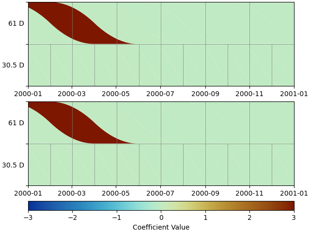
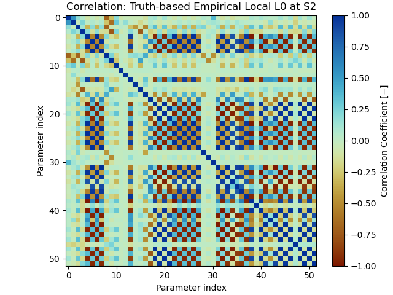

Tutorial 4: The use and estimation of covariance
================================================

.. sidebar:: Download full script

   :download:`tutorial_4_covariances.py <../../scripts/tutorial_4_covariances.py>`

As seen in Tutorial 3, DISSTANS can also make use of data variance and covariance if provided
in the timeseries. While this was not specifically addressed in the previous tutorial,
taking advantage of that information can improve the fit to the data, especially when
there is a large amount of correlation across components. This tutorial
will explore this with a small synthetic network that has large but strongly
correlated errors.

.. contents:: Table of contents
    :local:

Making a noisy network
----------------------

The setup should be familiar:

.. doctest::

    >>> # initialize RNG
    >>> import numpy as np
    >>> rng = np.random.default_rng(0)
    >>> # create network in shape of a circle
    >>> from disstans import Network, Station
    >>> net_name = "CircleVolcano"
    >>> num_stations = 8
    >>> station_names = [f"S{i:1d}" for i in range(1, num_stations + 1)]
    >>> angles = np.linspace(0, 2*np.pi, num=num_stations, endpoint=False)
    >>> lons, lats = np.cos(angles)/10, np.sin(angles)/10
    >>> net = Network(name=net_name)
    >>> for (istat, stat_name), lon, lat in zip(enumerate(station_names), lons, lats):
    ...     net[stat_name] = Station(name=stat_name, location=[lat, lon, 0])
    >>> # create timevector
    >>> import pandas as pd
    >>> t_start_str = "2000-01-01"
    >>> t_end_str = "2001-01-01"
    >>> timevector = pd.date_range(start=t_start_str, end=t_end_str, freq="1D")

This will create a network of 8 stations, arranged in a circle, and define the timespan
we're interested in.

In the next step, like i the previous tutorial, we will create a function that returns
model parameters for the generation of the synthetic data.
The function most crucially though will also create the correlated noise. It does that
by defining a (constant) noise covariance matrix, and then rotating that based on the
location of the station. The result will be a noise covariance ellipse that will also
have its long side pointed outwards of the center of the network. The function will
both return the noise realization for a station, as well as the data variance and
covariance vectors.

For the signal itself, we will have a constant secular motion across the network, and
in the first half of the timespan, a transient outwards of the center.

The function will look like this:

.. doctest::

    >>> def generate_model_and_noise(angle, rng):
    ...     # get dimensions
    ...     n1 = int(np.floor(timevector.size / 2))
    ...     n2 = int(np.ceil(timevector.size / 2))
    ...     # rotation matrix
    ...     R = np.array([[np.cos(angle), -np.sin(angle)], [np.sin(angle), np.cos(angle)]])
    ...     # secular motion
    ...     p_sec = np.array([[0, 0], [6, 0]])
    ...     # transient motion, only in first half
    ...     p_vol = np.array([[8, 0]])
    ...     p_vol_rot = p_vol @ R.T
    ...     # correlated error in direction of angle in first half
    ...     cov_cor = np.diag([10, 3])
    ...     cov_rot = R @ cov_cor @ R.T
    ...     noise_cor = np.empty((timevector.size, 2))
    ...     noise_cor[:n1, :] = rng.multivariate_normal(mean=(0, 0), cov=cov_rot, size=n1)
    ...     # not correlated in second half
    ...     cov_uncor = np.diag([3, 3])
    ...     noise_cor[-n2:, :] = rng.multivariate_normal(mean=(0, 0), cov=cov_uncor, size=n2)
    ...     # make uncertainty columns
    ...     var_en = np.empty((timevector.size, 2))
    ...     cov_en = np.empty((timevector.size, 1))
    ...     var_en[:n1, :] = np.diag(cov_rot).reshape(1, 2) * np.ones((n1, 2))
    ...     var_en[-n2:, :] = np.diag(cov_uncor).reshape(1, 2) * np.ones((n2, 2))
    ...     cov_en[:n1, :] = cov_rot[0, 1] * np.ones((n1, 1))
    ...     cov_en[-n2:, :] = cov_uncor[0, 1] * np.ones((n2, 1))
    ...     return p_sec, p_vol_rot, noise_cor, var_en, cov_en

Now we can create the "true" timeseries, as well as a "data" timeseries that contains
noise. As before, we first create the :class:`~disstans.models.Model` objects, then evaluate
them to get the two timeseries, then make :class:`~disstans.timeseries.Timeseries` objects
out of them, add them to the station as the two timeseries ``'Truth'`` and
``'Displacement'``, and finally add the model objects to the station as well.

.. doctest::

    >>> from copy import deepcopy
    >>> from disstans import Timeseries
    >>> from disstans.models import Arctangent, Polynomial, SplineSet
    >>> mdl_coll, mdl_coll_synth = {}, {}  # containers for the model objects
    >>> synth_coll = {}  # dictionary of synthetic data & noise for each stations
    >>> for station, angle in zip(net, angles):
    ...     # think of some model parameters
    ...     gen_data = {}
    ...     p_sec, p_vol, gen_data["noise"], var_en, cov_en = \
    ...         generate_model_and_noise(angle, rng)
    ...     # create model objects
    ...     mdl_sec = Polynomial(order=1, time_unit="Y", t_reference=t_start_str)
    ...     # Arctangent is for the truth, SplineSet are for how we will estimate them
    ...     mdl_vol = Arctangent(tau=20, t_reference="2000-03-01")
    ...     mdl_trans = SplineSet(degree=2,
    ...                           t_center_start=t_start_str,
    ...                           t_center_end=t_end_str,
    ...                           list_num_knots=[7, 13])
    ...     # collect the models in the dictionary
    ...     mdl_coll_synth[station.name] = {"Secular": mdl_sec}
    ...     mdl_coll[station.name] = deepcopy(mdl_coll_synth[station.name])
    ...     mdl_coll_synth[station.name].update({"Volcano": mdl_vol})
    ...     mdl_coll[station.name].update({"Transient": mdl_trans})
    ...     # only the model objects that will not be associated with the station
    ...     # get their model parameters input
    ...     mdl_sec.read_parameters(p_sec)
    ...     mdl_vol.read_parameters(p_vol)
    ...     # now, evaluate the models...
    ...     gen_data["truth"] = (mdl_sec.evaluate(timevector)["fit"] +
    ...                          mdl_vol.evaluate(timevector)["fit"])
    ...     gen_data["data"] = gen_data["truth"] + gen_data["noise"]
    ...     synth_coll[station.name] = gen_data
    ...     # ... and assign them to the station as timeseries objects
    ...     station["Truth"] = \
    ...         Timeseries.from_array(timevector=timevector,
    ...                               data=gen_data["truth"],
    ...                               src="synthetic",
    ...                               data_unit="mm",
    ...                               data_cols=["E", "N"])
    ...     station["Displacement"] = \
    ...         Timeseries.from_array(timevector=timevector,
    ...                               data=gen_data["data"],
    ...                               var=var_en,
    ...                               cov=cov_en,
    ...                               src="synthetic",
    ...                               data_unit="mm",
    ...                               data_cols=["E", "N"])
    ...     # finally, we give the station the models to fit
    ...     station.add_local_model_dict(ts_description="Displacement",
    ...                                  model_dict=mdl_coll[station.name])

Let's have a quick look at the network and its timeseries by using::

    >>> net.gui()

Which will yield the following map:

.. image:: ../img/tutorial_4a_map.png

And for station S1, we see the following two timeseries:

.. image:: ../img/tutorial_4b_ts_S1.png

Fitting the models with the spatial L0 solver
---------------------------------------------

The following steps are nothing new - we will solve for model parameters with the
:meth:`~disstans.network.Network.spatialfit` method. However, this time we're explicitly
specifying if we want the solver to use data (co)variance.

This first run doesn't use either the data variance or covariance, and we will save
the estimated linear velocity parameter for every station and component for later
comparison.

.. doctest::

    >>> # define a reweighting function
    >>> from disstans.solvers import LogarithmicReweighting
    >>> rw_func = LogarithmicReweighting(1e-8, scale=10)
    >>> # solve without using the data variance
    >>> stats = net.spatialfit("Displacement",
    ...                        penalty=5,
    ...                        spatial_reweight_models=["Transient"],
    ...                        spatial_reweight_iters=20,
    ...                        local_reweight_func=rw_func,
    ...                        use_data_variance=False,
    ...                        use_data_covariance=False,
    ...                        formal_covariance=True,
    ...                        verbose=True)
    Calculating scale lengths
    ...
    Done
    >>> net.evaluate("Displacement", output_description="Fit_onlydata")
    >>> # save estimated velocity components
    >>> vel_en_est = {}
    >>> vel_en_est["onlydata"] = \
    ...     np.stack([s.models["Displacement"]["Secular"].parameters[1, :] for s in net])

In the next two runs, we will first add the variance, and then the covariance. At the end,
for future comparison, we save the estimated parameters and covariance.

.. doctest::

    >>> # solve using the data variance
    >>> stats = net.spatialfit("Displacement",
    ...                        penalty=5,
    ...                        spatial_reweight_models=["Transient"],
    ...                        spatial_reweight_iters=20,
    ...                        local_reweight_func=rw_func,
    ...                        use_data_variance=True,
    ...                        use_data_covariance=False,
    ...                        formal_covariance=True,
    ...                        verbose=True)
    Calculating scale lengths
    ...
    Done
    >>> net.evaluate("Displacement", output_description="Fit_withvar")
    >>> # save estimated velocity components
    >>> vel_en_est["withvar"] = \
    ...     np.stack([s.models["Displacement"]["Secular"].parameters[1, :] for s in net])
    >>> # solve with the data variance and covariance
    >>> stats = net.spatialfit("Displacement",
    ...                        penalty=5,
    ...                        spatial_reweight_models=["Transient"],
    ...                        spatial_reweight_iters=20,
    ...                        local_reweight_func=rw_func,
    ...                        use_data_variance=True,
    ...                        use_data_covariance=True,
    ...                        formal_covariance=True,
    ...                        verbose=True)
    Calculating scale lengths
    ...
    Done
    >>> net.evaluate("Displacement", output_description="Fit_withvarcov")
    >>> # save estimated velocity components
    >>> vel_en_est["withvarcov"] = \
    ...     np.stack([s.models["Displacement"]["Secular"].parameters[1, :] for s in net])

Notice that right off the bat, including the variance and covariance data in the estimation
has reduced the number of unique splines from up to 3 per component to 1 per component.

Just to get an idea of the fit, we can again use the GUI function to show us the fits and
scalograms::

    >>> net.gui(station="S2", timeseries=["Displacement"],
    ...     scalogram_kw_args={"ts": "Displacement", "model": "Transient", "cmaprange": 3})

For station S2, we get the following model fit and scalogram:

|4c_ts_S2| |4c_scalo_S2|

.. |4c_ts_S2| image:: ../img/tutorial_4c_ts_S2.png
    :width: 49%

Quality of the fits
-------------------

We now want to see how close we got to the true secular velocity. For that, we first need
to collect the true velocity vectors at all stations:

.. doctest::

    >>> vel_en_true = np.stack([mdl_coll_synth[s]["Secular"].parameters[1, :]
    ...                         for s in station_names])
    >>> norm_true = np.sqrt(np.sum(vel_en_true**2, axis=1))

Now we can calculate the deviation of the estimate both in terms of magnitude and direction
from the true values:

.. doctest::

    >>> err_stats = {}
    >>> for title, case in \
    ...     zip(["Data", "Data + Variance", "Data + Variance + Covariance"],
    ...         ["onlydata", "withvar", "withvarcov"]):
    ...     # error statistics
    ...     print(f"\nStatistics for {title}:")
    ...     # get amplitude errors
    ...     norm_est = np.sqrt(np.sum(vel_en_est[case]**2, axis=1))
    ...     err_amp = norm_est - norm_true
    ...     # get absolute angle error by calculating the angle between the two vectors
    ...     dotprodnorm = (np.sum(vel_en_est[case] * vel_en_true, axis=1) /
    ...                    (norm_est * norm_true))
    ...     err_angle = np.rad2deg(np.arccos(dotprodnorm))
    ...     # make error dataframe and print
    ...     err_df = pd.DataFrame(index=station_names,
    ...                           data={"Amplitude": err_amp, "Angle": err_angle})
    ...     print(err_df)
    ...     # print rms of both
    ...     print(f"RMS Amplitude: {np.sqrt(np.mean(err_amp**2)):.11g}")
    ...     print(f"RMS Angle: {np.sqrt(np.mean(err_angle**2)):.11g}")
    <BLANKLINE>
    Statistics for Data:
        Amplitude      Angle
    S1   1.697651   4.359484
    S2   0.328071   0.261513
    S3  -0.677940   4.072121
    S4  -0.659412  13.525467
    S5  -0.898881   4.207969
    S6   0.819918  10.613691
    S7   0.157743  13.085969
    S8   0.894263  15.771350
    RMS Amplitude: 0.87955367999
    RMS Angle: 9.8038857489
    <BLANKLINE>
    Statistics for Data + Variance:
        Amplitude     Angle
    S1   1.511762  1.839559
    S2   1.496591  0.231865
    S3   1.594666  1.128778
    S4  -1.494915  6.149112
    S5  -0.972639  6.333535
    S6   0.683505  6.031706
    S7   0.000223  1.616320
    S8   0.708014  4.211801
    RMS Amplitude: 1.1841362945
    RMS Angle: 4.1738823044
    <BLANKLINE>
    Statistics for Data + Variance + Covariance:
        Amplitude     Angle
    S1   1.572796  1.954775
    S2   0.767869  3.342269
    S3  -0.656516  2.929676
    S4  -0.903166  9.659920
    S5  -1.009938  6.237068
    S6   0.562830  6.694827
    S7   0.015474  1.011020
    S8   0.728856  5.113027
    RMS Amplitude: 0.87879575059
    RMS Angle: 5.3359148666

Clearly, the fit using all the available information leads to the best set of parameters.
Furthermore, from the verbose output of the spatial solver, we also see that we find sparser,
and more spatially-consistent solution for the network, as evidenced by the smaller number
of unique parameters.

Correlation of parameters
-------------------------

Let's have a closer look at how we can estimate the error in our prediction (i.e. fitted
timeseries). By default, if the formal covariance is estimated by the solver, that formal
uncertainty is passed on to the :class:`~disstans.models.ModelCollection` object where
we can look at it in the :attr:`~disstans.models.ModelCollection.cov` property.
We can save it for later like this:

.. doctest::

    >>> spat_cov = {sta_name: net[sta_name].models["Displacement"].cov
    ...             for sta_name in station_names}

Whenever then the model gets evaluated, it will also map that model parameter uncertainty
into the data space (the blue shaded region in the figure above). For the case where the
dictionary of splines is overcomplete, there will undoubtedly be a large correlation
between splines - this is the entire reason we need L1/L0 regularization to deal with
the degeneracy.

Let's have a look at the correlation matrix, by first defining a simple plotting
function:

.. doctest::

    >>> import matplotlib.pyplot as plt
    >>> from cmcrameri import cm as scm
    >>> from disstans.tools import cov2corr
    >>> # define a plotting function for repeatability
    >>> def corr_plot(cov, title, fname_corr):
    ...     plt.imshow(cov2corr(cov), cmap=scm.roma, vmin=-1, vmax=1)
    ...     plt.colorbar(label="Correlation Coefficient $[-]$")
    ...     plt.title("Correlation: " + title)
    ...     plt.xlabel("Parameter index")
    ...     plt.ylabel("Parameter index")
    ...     plt.savefig(fname_corr)
    ...     plt.close()

(We don't want to use :meth:`~disstans.models.ModelCollection.plot_covariance` here since
later we will have an empirical covariance that we have to plot ourselves anyways.)

And now running it::

    >>> corr_plot(spat_cov["S2"], "Spatial L0 at S2", "tutorial_4d_corr_S2.png")

.. image:: ../img/tutorial_4d_corr_S2.png

As one can see, there is a strong tradeoff between the linear terms (indices 2-3)
and the splines in the rest of the dictionary. Note that all but one splines have
zero-valued parameters, so the uncertainty is not directly visible in the timeseries.

.. note::

    The empty columns and rows in the correlation matrix are a result of how the
    model parameter covariance matrix is estimated by
    :func:`~disstans.solvers.lasso_regression`. Because the computation requires a
    matrix inverse, but the problem is not full rank (because the splines are an
    overcomplete dictionary), some entries have to be set to zero before the inversion,
    yielding in empty correlation rows. This threshold can be set with the
    ``zero_threshold`` option.

In the following sections, let's explore other ways we can get a sense of our
parameter uncertainty.

Simple linear regression with restricted spline set
---------------------------------------------------

The goal of the L0 solver is to find the minimum set of splines necessary to model
the transient signal, based on an overcomplete dictionary of splines. Once
that subset is found (e.g., the one spline in shown above), it is mathematically
equivalent to just doing an unregularized, linear least squares fit.

In the correlation matrix above, we have an almost full matrix, where we see how
parameters trade off with each other, even when they have been estimated to be zero
because of our regularization. If we only wanted to see how the *non-zero*
parameters trade off with each other, we can "freeze" the models based on the absolute
value of their parameters. This is accomplished with the
:meth:`~disstans.models.Model.freeze` method:

.. doctest::

    >>> net.freeze("Displacement", model_list=["Transient"], zero_threshold=1e-6)
    >>> net.fitevalres("Displacement", solver="linear_regression",
    ...                use_data_variance=True, use_data_covariance=True,
    ...                formal_covariance=True)
    >>> net.unfreeze("Displacement")
    >>> sub_param = {sta_name: net[sta_name].models["Displacement"].par.ravel()
    ...              for sta_name in station_names}
    >>> sub_cov = {sta_name: net[sta_name].models["Displacement"].cov
    ...            for sta_name in station_names}

Looking at the covariance::

    >>> corr_plot(sub_cov["S2"], "Frozen local L0 at S2", "tutorial_4e_corr_S2.png")

.. image:: ../img/tutorial_4e_corr_S2.png

We now see how only the parameters that have been estimated have correlation entries,
and again, we see the tradeoff between the one spline and the linear polynomial.

Empirical covariance estimation
-------------------------------

Now that we have the formal covariance, we can also try to estimate the empirical (sample)
parameters covariance. With synthetic data, this is straightforward: we create a large number
of timeseries, all with the same truth signal underlying it, but with different noise
realizations. We then solve for the parameters in all these cases, and use those
to compute the sample covariance. If we don't have the true original timeseries,
we can still add different noise realizations at each step, but we will add the to
observed timeseries (accepting that the new timeseries will have double the noise).

What we want to learn from it will then determine which of the different solvers we use.
If we want to get a better understanding of the tradeoff between the actual non-zero
parameters, we would repeat either the spatial L0 solution, or the unregularized
solution using the restricted dictionary.

Just for demonstration purposes, however, we will do it using the local L0 solution,
which will give us the understanding how different splines trade off between each other
(similar to the first correlation matrix shown in this tutorial). This is because
with different noise realizations, and without the spatial part of the algorithm,
it is very likely that different splines will get chosen for each solution, giving
us therefore a good sample set to estimate the covariance.

Now, to the code: we will first create a variable to store the estimated parameters,
then start a loop, and at the end compute the sample covariance. Inside the loop,
first, a new timeseries is created, then a local L0 fit is performed, and then the
estimated parameters are saved.

We repeat this exercise twice, once taking advantage of our knowledge of the truth,
and once purely data-based. First, truth-based:

.. doctest::

    >>> num_repeat = 100
    >>> stacked_params_tru = \
    ...     {sta_name: np.empty((num_repeat,
    ...                          net[sta_name].models["Displacement"].num_parameters * 2))
    ...      for sta_name in station_names}
    >>> # loop
    >>> for i in range(num_repeat):
    ...     # change noise
    ...     for station, angle in zip(net, angles):
    ...         station["Displacement"].data = \
    ...             station["Truth"].data + generate_model_and_noise(angle, rng)[2]
    ...     # solve, same reweight_func, same penalty = easy
    ...     net.fit("Displacement", solver="lasso_regression", penalty=5,
    ...             reweight_max_iters=5, reweight_func=rw_func,
    ...             use_data_variance=True, use_data_covariance=True,
    ...             formal_covariance=True, progress_desc=f"Fit {i}")
    ...     # save
    ...     for sta_name in station_names:
    ...         stacked_params_tru[sta_name][i, :] = net[sta_name].models["Displacement"].par.ravel()
    >>> # calculate empirical covariance
    >>> emp_cov_tru = {sta_name: np.cov(stacked_params_tru[sta_name], rowvar=False)
    ...                for sta_name in station_names}

And second, data-based:

.. doctest::

    >>> num_repeat = 100
    >>> stacked_params_dat = \
    ...     {sta_name: np.empty((num_repeat,
    ...                          net[sta_name].models["Displacement"].num_parameters * 2))
    ...      for sta_name in station_names}
    >>> orig_data = {sta_name: net[sta_name]["Displacement"].data.values.copy()
    ...              for sta_name in station_names}
    >>> # loop
    >>> for i in range(num_repeat):
    ...     # change noise
    ...     for station, angle in zip(net, angles):
    ...         station["Displacement"].data = \
    ...             orig_data[station.name] + generate_model_and_noise(angle, rng)[2]
    ...     # solve, same reweight_func, same penalty = easy
    ...     net.fit("Displacement", solver="lasso_regression", penalty=5,
    ...             reweight_max_iters=5, reweight_func=rw_func,
    ...             use_data_variance=True, use_data_covariance=True,
    ...             formal_covariance=True, progress_desc=f"Fit {i}")
    ...     # save
    ...     for sta_name in station_names:
    ...         stacked_params_dat[sta_name][i, :] = net[sta_name].models["Displacement"].par.ravel()
    >>> # calculate empirical covariance
    >>> emp_cov_dat = {sta_name: np.cov(stacked_params_dat[sta_name], rowvar=False)
    ...                for sta_name in station_names}

Producing the two covariance plots::

    >>> corr_plot(emp_cov_tru["S2"], "Truth-based Empirical Local L0 at S2", "tutorial_4f_corr_S2.png")
    >>> corr_plot(emp_cov_dat["S2"], "Data-based Empirical Local L0 at S2", "tutorial_4g_corr_S2.png")

Let's have a look at the two figures side-by-side:

|4f_corr_S2| |4g_corr_S2|

.. |4g_corr_S2| image:: ../img/tutorial_4g_corr_S2.png
    :width: 49%

Again, we see the strong trade-off between the splines. We also see that the data-based
is relatively close to the truth-based one, which gives us at least a little bit of
confidence in this approach when using real data.
