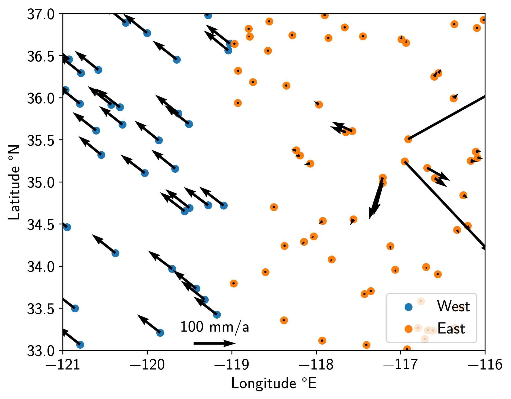
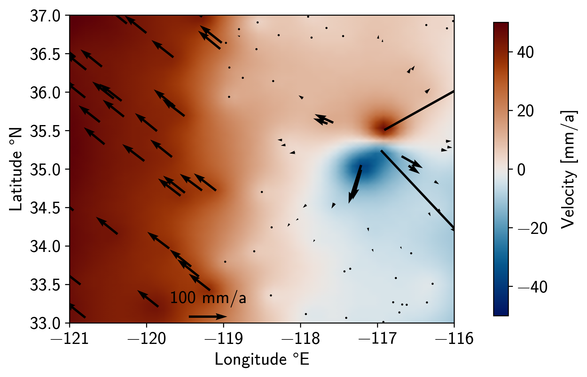
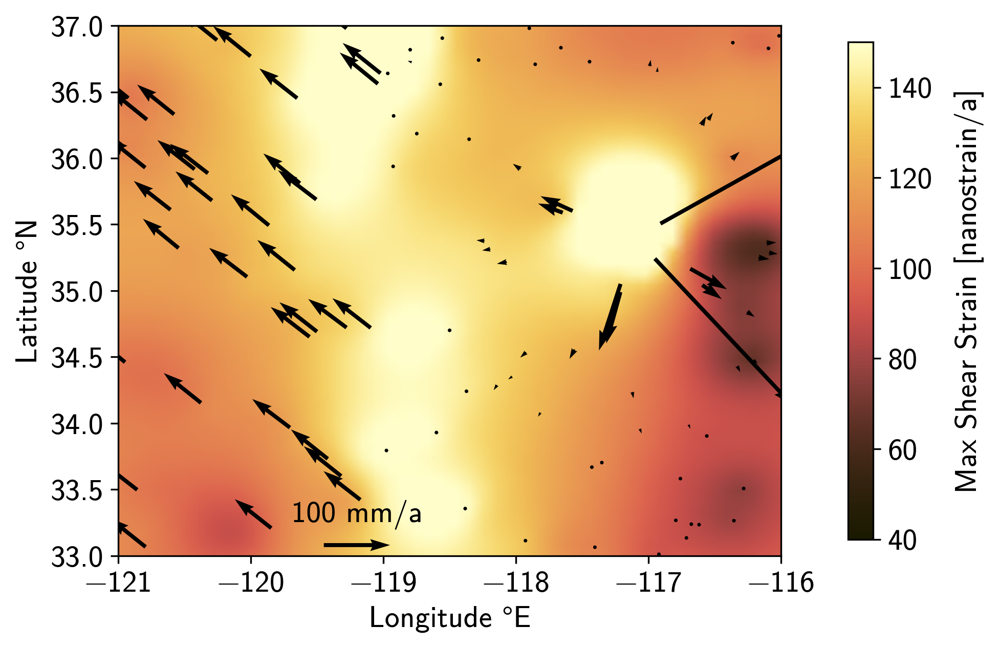

Tutorial 6: Spatially-variable Strain Field
===========================================

.. sidebar:: Download full script

   :download:`tutorial_6_strain.py <../../scripts/tutorial_6_strain.py>`

In this tutorial, we will create a synthetic secular velocity field of two plates
moving past each other, with one also containing an inflating volcano.
We will then recover the Euler Pole of a plate, as well as some strain
(field) quantities.

.. contents:: Table of contents
    :local:

Preparations
------------

We will start by some (hopefully) self-explanatory imports, including the strain tools
from the :mod:`~disstans.tools` module:

.. doctest::

    >>> # imports
    >>> import os
    >>> import numpy as np
    >>> import matplotlib.pyplot as plt
    >>> from pathlib import Path
    >>> from matplotlib import rcParams
    >>> from scipy.spatial.distance import cdist
    >>> from cmcrameri import cm
    >>> from disstans.tools import (get_hom_vel_strain_rot, get_field_vel_strain_rot,
    ...                             strain_rotation_invariants,
    ...                             estimate_euler_pole, rotvec2eulerpole)

Let's continue to set up some output formats:

.. doctest::

    >>> # decide output quality, looks & folder
    >>> outdir = Path("out/tutorial_6/")
    >>> rcParams['font.sans-serif'] = ["NewComputerModernSans10"]
    >>> rcParams['font.size'] = "14"
    >>> fmt = "png"
    >>> os.makedirs(outdir, exist_ok=True)

We now build up a synthetic network of stations with random locations
and velocities:

.. doctest::

    >>> # initialize RNG
    >>> rng = np.random.default_rng(0)
    >>> # make stations
    >>> locs = rng.uniform(low=[-121, 33],
    ...                    high=[-116, 37],
    ...                    size=(100, 2))
    >>> n_locs = locs.shape[0]
    >>> # get indices west and east of plate boundary
    >>> i_west = locs[:, 0] < -119
    >>> i_east = ~i_west
    >>> locs_west = locs[i_west, :]
    >>> locs_east = locs[i_east, :]
    >>> # make velocities
    >>> # create noisy zero background velocity field
    >>> vels = rng.normal(scale=1e-3, size=(n_locs, 2))
    >>> # add far away euler pole motion to the western plate
    >>> vels[i_west, :] += np.array([[-0.055, 0.045]])
    >>> # add inflation motion from volcano based on distance and direction
    >>> center_vol = np.array([-117.1, 35.4])
    >>> dist_vol = cdist(locs, center_vol[None, :]).ravel()
    >>> vecs_vol = locs - center_vol[None, :]
    >>> azims_vol = np.arctan2(vecs_vol[:, 1], vecs_vol[:, 0])
    >>> vels_volcano = (vecs_vol / np.linalg.norm(vecs_vol, axis=1, keepdims=True)
    ...                 / dist_vol[:, None]**2 / 70)
    >>> vels += vels_volcano
    >>> # make for uncertainties
    >>> vels_var = (rng.uniform(low=9e-3, high=11e-3, size=(n_locs, 2))) ** 2
    >>> vels_cov = rng.normal(scale=1e-6, size=(n_locs, 1))
    >>> vels_varcov = np.concatenate([vels_var, vels_cov], axis=1)

With these commands, we have effectively created a toy representation of California.
On the west side, we have a plate that moves northwest relative to the east side.
On the east side, there is a volcanic caldera inflating outwards.
Let's have a look (all plotting code can be found in the script):

.. note::

    For the plots, we have not converted latitude and longitude to a cartesian grid
    like UTM, or used a geodetic map projection. This is only to keep this tutorial
    simple; usually, we would either convert to UTM or use proper map plotting.

.. note::

    This tutorial is only to show the strain tools, which are independent of the
    Network/Station/Timeseries structure of DISSTANS, since they only require locations
    and velocities. Both of these can, of course, be derived from the standard DISSTANS
    classes, like :attr:`~disstans.network.Network.station_locations` or
    :attr:`~disstans.models.Model.parameters`.

Average strain and rotation
---------------------------

All of the next calculations assume that plates are rigid, and that rigid motion on a
sphere can be expressed as a rotation around a pole on the sphere. For more details
on the algorithms, please refer to, e.g., [tape09]_, [shen15]_, or [goudarzi14]_.
Let's start by getting the average velocity, strain, and rotation values of the entire
area using :func:`~disstans.tools.get_hom_vel_strain_rot` and
:func:`~disstans.tools.strain_rotation_invariants`:

.. doctest::

    >>> # get global strain somewhere in the west
    >>> v_hom, eps_hom, om_hom = get_hom_vel_strain_rot(locs,
    ...                                                 vels,
    ...                                                 covariances=vels_varcov,
    ...                                                 reference=[-120.5, 35])
    >>> # convert to scalars
    >>> dil_hom, strain_hom, shear_hom, rot_hom = strain_rotation_invariants(eps_hom, om_hom)
    >>> print(f"Average motion = [{v_hom[0] * 1000:.2f}, {v_hom[1] * 1000:.2f}] mm/a\n"
    ...       f"Average rotation = {rot_hom * 1e6:.4f} rad/Ma")
    Average motion = [-58.92, 41.94] mm/a
    Average rotation = 0.0851 rad/Ma

The average motion is dominated by the motion of the western plate, and the rotation
arises from the relative motion of the two plates.
Let's see if we can recover the Euler plate motion of the western plate using
:func:`~disstans.tools.estimate_euler_pole` and
:func:`~disstans.tools.rotvec2eulerpole`:

.. doctest::

    >>> # get euler pole for the western plate
    >>> rotvec_west, rotcov_west = estimate_euler_pole(locs[i_west, :],
    ...                                                vels[i_west, :],
    ...                                                covariances=vels_varcov[i_west, :])
    >>> # convert to more readable format
    >>> ep_west, ep_cov_west = rotvec2eulerpole(rotvec_west, rotcov_west)
    >>> ep_west_deg = np.rad2deg(ep_west)
    >>> print(f"Longitude = {ep_west_deg[0]:.1f} °E\n"
    ...       f"Latitude = {ep_west_deg[1]:.1f} °N\n"
    ...       f"Rotation = {ep_west_deg[2] * 1e6:.1f} °/Ma")
    Longitude = 6.7 °E
    Latitude = -39.3 °N
    Rotation = 0.6 °/Ma

These are indeed (very approximately) the Euler pole values of the Pacific plate.

Spatially-variable velocity, strain, and rotation 
-------------------------------------------------

Finally, we know by construction that there's more going on than those average values.
We want to be able to see the strain and velocity field as it transitions from the
west to the east is affected by the volcano we put there.
Let's create a field of where we want to evalute the interpolated values, and then
call the field-based :func:`~disstans.tools.get_field_vel_strain_rot`:

.. doctest::

    >>> # define field coordinates
    >>> x_range = np.linspace(-121, -116, num=50)
    >>> y_range = np.linspace(33, 37, num=50)[::-1]
    >>> x_mesh, y_mesh = np.meshgrid(x_range, y_range)
    >>> xy_mesh = np.stack([x_mesh.ravel(), y_mesh.ravel()], axis=1)
    >>> # get strain fields
    >>> v_field, eps_field, om_field = \
    ...     get_field_vel_strain_rot(locs,
    ...                             vels,
    ...                             xy_mesh,
    ...                             2,
    ...                             covariances=vels_varcov,
    ...                             estimate_within=1e6,
    ...                             distance_method="quadratic",
    ...                             coverage_method="voronoi")
    >>> # convert to scalar fields
    >>> dil_field, strain_field, shear_field, rot_field = \
    ...     strain_rotation_invariants(eps_field, om_field)

.. doctest::
    :hide:

    >>> # test checks
    >>> print(f"Velocity check: {v_field[1275, 0]:.4e}")
    Velocity check: -1.6802e-02
    >>> print(f"Dilatation check: {dil_field[1275]:.4e}")
    Dilatation check: 2.3860e-07
    >>> print(f"Strain check: {strain_field[1275]:.4e}")
    Strain check: 2.4474e-07
    >>> print(f"Shear check: {shear_field[1275]:.4e}")
    Shear check: 1.4304e-07
    >>> print(f"Rotation check: {rot_field[1275]:.4e}")
    Rotation check: 7.8567e-08

Yielding the following northwards velocity field:

The velocity field indeed shows a transition from one plate to the other.
The border is relatively smooth because there aren't a lot of stations close to the
dividing line. The smoothness can also be controlled by the parameters of
:func:`~disstans.tools.get_field_vel_strain_rot`.
The north-south velocity around the volcano is also recovered.
Finally, the strain map also shows the plate interface and the volcano:

